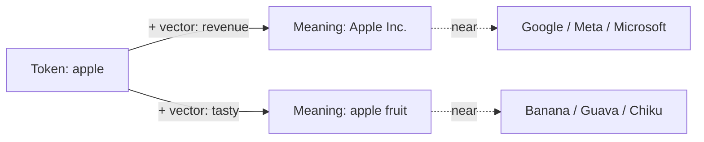
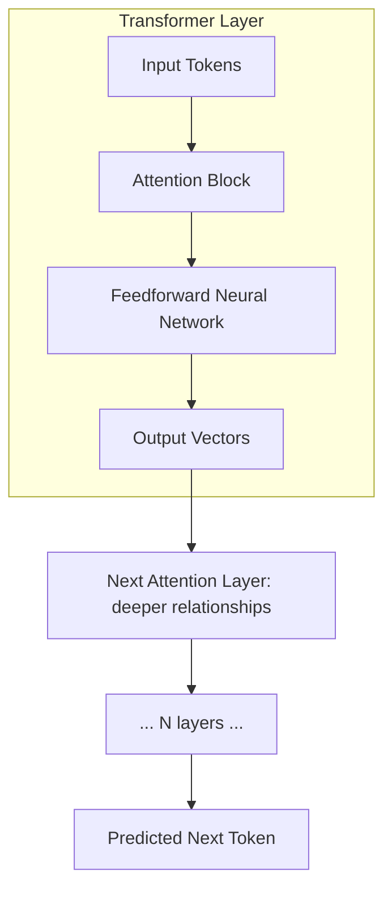
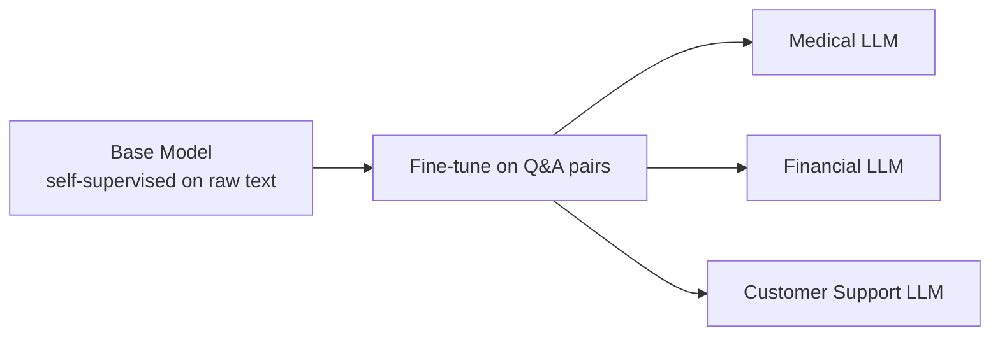
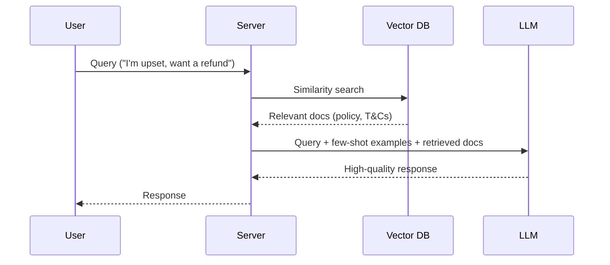
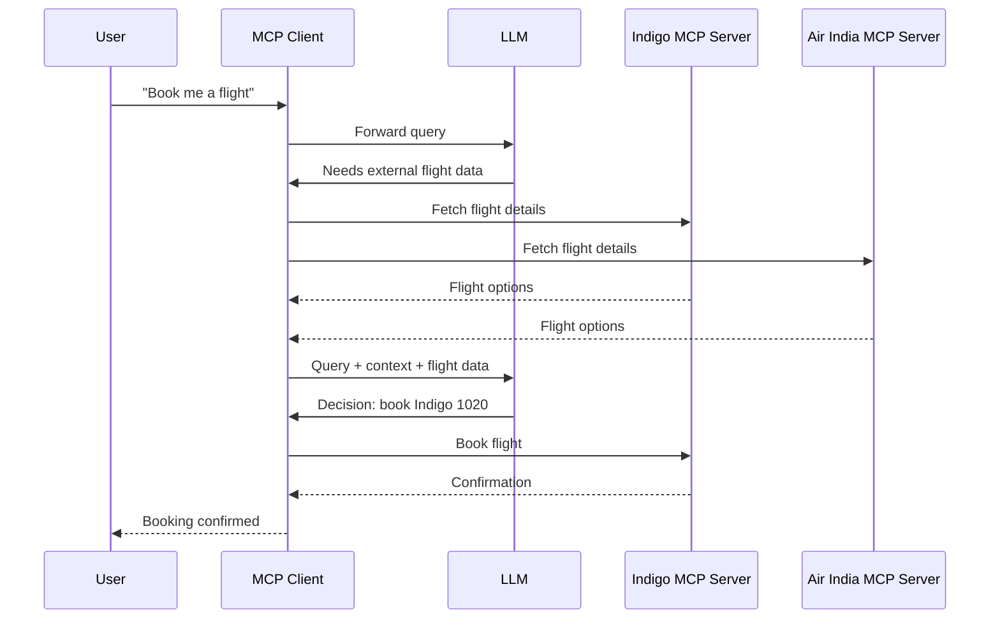
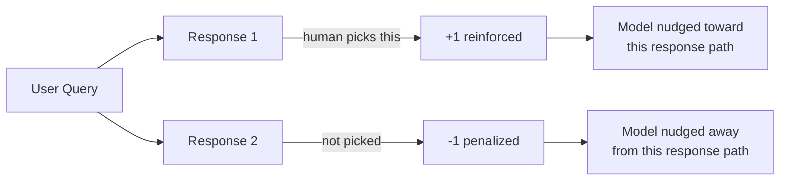
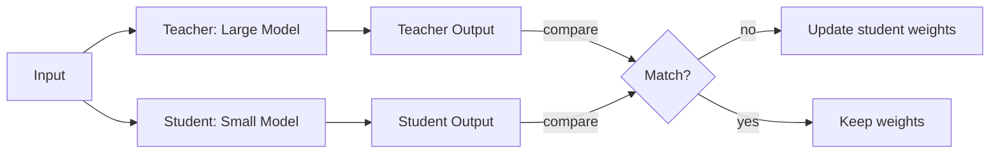
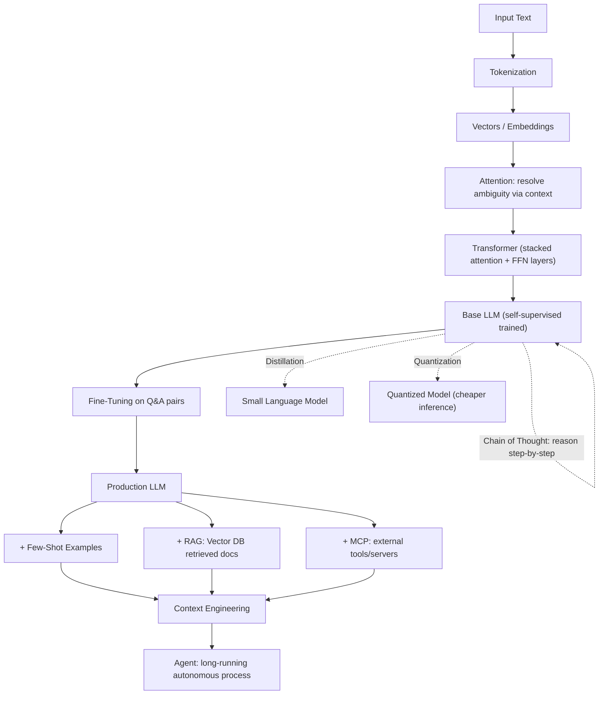

# 20 AI Concepts Explained in 40 Minutes

## Overview
- A glossary-style tour of the 20 terms an application engineer needs to talk fluently about AI systems
- Builds bottom-up: how an LLM reads text → how it's trained → how you feed it context in production → how it acts autonomously
- Useful as a map before going deep into any single subject (attention, RAG, agents, etc.)

## Key Concepts

### Language Fundamentals
- **Large Language Model (LLM)** — a neural network trained to predict the next token given an input sequence
  - e.g. "all that glitters" → predicts "is not gold" one token at a time
- **Tokenization** — breaking input text into discrete tokens before processing
  - Not just splitting on spaces — suffixes like `-ers`, `-ing` are meaningful sub-word tokens (e.g. "glitters" → "glitter" + "s", "dancing" → "danc" + "ing")
  - Lets the model recognize grammatical patterns (action-in-progress, agent-of-action) across many words
- **Vectors** — every token is mapped to a coordinate in an n-dimensional space (embedding) such that words with similar meaning sit close together and opposite meanings sit far apart
  - This mapping process is called vectorization
  - Gives the model an inherent sense of word meaning, not just spelling
- **Attention** — resolves ambiguous word meaning by blending in the vectors of nearby context words
  - "Apple" alone is ambiguous (fruit / company / affection); adding the vector for "revenue" pushes it toward the company cluster (Google, Meta, Microsoft); adding "tasty" pushes it toward the fruit cluster (banana, guava)
  - Breakthrough paper in 2017, became mainstream with GPT-2-era models around 2022

### Training Techniques
- **Self-Supervised Learning** — training data is generated from raw text itself, no human labeling needed
  - Take existing text ("et tu Brutus"), mask/hold out pieces, and make the model predict what's missing
  - Model gets penalized (loss increases, weights update) on wrong predictions, left alone on correct ones
  - Cheaper and far more scalable than supervised learning (which needs humans writing input→output pairs)
  - Also used for images (predict masked patches) and video (predict motion/gaze)
- **Transformer** — the specific architecture most LLMs use to predict the next token (LLM = the product/goal, Transformer = one possible engine)
  - Input tokens → attention block → feedforward neural network → output vectors
  - Stacked in many layers (12 in early models, hundreds in recent GPT-style architectures): each layer captures progressively more complex relationships (disambiguation → sarcasm → implication)
  - Could be swapped for a different architecture (e.g. diffusion models, state space models) — the LLM doesn't require a transformer specifically
- **Fine-Tuning** — taking a self-supervised base model and training it further on curated question→answer pairs so it responds in a desired style/domain
  - Base model alone may give unhelpful or evasive answers ("I'd like to know that too") — fine-tuning penalizes plausible-but-undesirable responses
  - Same base model can be fine-tuned multiple times for different domains (medical, financial, customer support)

### Prompting & Context Techniques
- **Few-Shot Prompting** — augmenting a query with example input/output pairs at inference time (no retraining), so the model has a pattern to follow
- **Retrieval-Augmented Generation (RAG)** — server fetches relevant documents (policies, docs, T&Cs) at query time and sends them along with the query + examples to the LLM
  - Improves response quality with company-specific context without fine-tuning
- **Vector Database** — stores documents as vectors so a query's meaning can be similarity-matched to relevant documents even if exact keywords don't overlap
  - e.g. a query mentioning "upset" can retrieve a policy document about "low rating" or "drop-off" because their vectors are close
  - Uses ANN algorithms internally (e.g. Hierarchical Navigable Small World / HNSW) — acts as a black box: store documents, retrieve fast
- **Model Context Protocol (MCP)** — a standard way for an LLM to pull in context/actions from external systems (databases, APIs) it doesn't own
  - MCP client sits between the user and the LLM, connects to external MCP servers (e.g. airline booking systems) on the LLM's request, and can execute actions (not just fetch data)
- **Context Engineering** — the umbrella term for combining few-shot prompting + RAG + MCP + conversation history to construct the best possible context for a query
  - Two new challenges it introduces: tracking user preferences over time, and context/prompt summarization (e.g. sliding window of last N chats + a running summary of everything older)
  - Differs from prompt engineering: prompt engineering is stateless (same system prompt every time); context engineering evolves with user history/preferences

### Agents & Alignment
- **Agents** — a long-running process that can query an LLM, external systems, and other agents to autonomously meet a user's goal (not just respond once)
  - e.g. a travel agent that books flights/hotels and manages email while you're away, acting on opportunities (cheap fares) without being asked each time
- **Reinforcement Learning with Human Feedback (RLHF)** — training technique where humans pick the better of two model responses; the chosen path gets a +1, the other a -1
  - Effectively shapes a "path" through vector space that the model learns to prefer (positive regions to move toward, negative regions to avoid) — similar to hill climbing
  - Limitation: RL only learns from observed outcomes, it can't build a true mental model (e.g. it may over-trust a streak of coin flips as a signal, where a human reasons "it's a fair coin, still 50/50")
- **Chain of Thought (CoT)** — training/prompting the model to reason step-by-step instead of jumping straight to an answer
  - Produces higher-quality responses than direct answers; the model can add more reasoning steps as problem difficulty increases (observed in DeepSeek: harder problems → more steps)
  - Models built around this are called **reasoning models** (e.g. DeepSeek, OpenAI o1/o3) — other reasoning strategies exist too (tree of thought, graph of thought, tool use)

### Multimodal & Efficiency
- **Multimodal Models** — models that accept/generate more than text: images, video, audio
  - Perform better even on text tasks because they build a deeper grounding of meaning (e.g. training on "cat"/"feline" text plus actual cat images improves understanding)
- **Small Language Models (SLMs) / Foundation Models** — companies increasingly want smaller, task/domain-specific models instead of one giant general LLM, for control and data privacy
  - SLM: ~3M–300M parameters vs LLM: ~3B–300B parameters
  - Good for narrow, well-defined tasks (customer support); a general-purpose foundation model is still better for broad domains (e.g. NASA's weather prediction)
- **Distillation** — the technique used to build SLMs: a large "teacher" model and small "student" model both process the same input
  - Student's weights are updated only when its output doesn't match the teacher's; goal is to condense the teacher's knowledge into far fewer parameters
  - Result: faster inference, cheaper hosting, slightly lower ceiling on capability
- **Quantization** — reducing the numeric precision of a trained model's weights (e.g. 32-bit → 8-bit), cutting memory usage (~75% savings) and inference cost
  - Applied only after training is complete — training cost is unaffected, this is purely an inference-time optimization

## Trade-offs / Comparisons

| Concept | vs. Alternative | When to prefer |
|---|---|---|
| Fine-tuning | Few-shot prompting | Fine-tuning for durable domain style; few-shot for one-off/lightweight adaptation without retraining |
| RAG | Fine-tuning | RAG when knowledge changes often (policies, live data); fine-tuning when the *behavior/style* itself must change |
| SLM (distilled) | LLM | SLM for narrow, cheap, private, task-specific deployment; LLM for broad general-purpose reasoning |
| RLHF | Chain of Thought | RLHF shapes *which* responses are preferred; CoT improves *how* the model reasons to get there — complementary, not competing |
| Quantization | Distillation | Quantization shrinks an existing model's weights (inference-only); distillation trains a genuinely smaller new model |

## Example / Walkthrough
- "All that glitters" → tokenized → each token vectorized → attention resolves any ambiguous words using nearby context → transformer layers stack this reasoning → model predicts "is not gold" one token at a time
- Refund complaint example: user says "I am upset with your payment system, I expect a refund" → vector DB finds policy docs about "low rating"/"drop-off" (semantically close to "upset") even without exact keyword match → docs + query sent to LLM → high-quality, policy-aware response
- Flight booking example: user asks to book a flight → MCP client asks LLM → LLM requests live data from Indigo & Air India MCP servers → LLM picks a flight → MCP client executes the actual booking API call → confirmation returned to user

## Diagram

## Interview Q&A

What's the difference between a Large Language Model and a Transformer?

An LLM is the product/goal — a model trained to predict the next token. A Transformer is one specific architecture (attention + feedforward layers, stacked) used to achieve that goal; it could theoretically be swapped for a different architecture like a diffusion model.

Why does attention matter for a word like "apple"?

The word's spelling alone is ambiguous (fruit, company, affection). Attention blends in the vectors of nearby context words (e.g. "revenue" or "tasty") to push the ambiguous vector toward the correct meaning cluster.

Why is self-supervised learning considered a major scalability breakthrough?

It generates training signal directly from raw, unlabeled text (mask a token, predict it) instead of requiring humans to write input→output pairs — massively cheaper and more scalable than supervised learning.

How is fine-tuning different from RAG, and when would you use each?

Fine-tuning permanently updates model weights on curated Q&A pairs to change behavior/style long-term. RAG retrieves relevant documents at query time to inject fresh/company-specific context without touching the model's weights. Use RAG for frequently-changing knowledge, fine-tuning for durable behavioral/domain shifts.

What role does a vector database play in a RAG pipeline?

It stores documents as vectors so an incoming query can be matched to relevant documents via similarity search (nearest-neighbor in embedding space), even when there's no exact keyword overlap between the query and the document.

How does Model Context Protocol (MCP) extend what an LLM can do beyond RAG?

RAG retrieves static documents for context. MCP lets the LLM connect to live external systems/APIs (e.g. an airline's booking system) through an MCP client, both to fetch real-time data and to execute actions like completing a booking — not just read.

Why can't reinforcement learning alone replicate human-level reasoning?

RL only reinforces behavior based on observed outcomes — it can't build an internal "mental model" of how something works. E.g. after many heads in a row on a fair coin, RL may lean toward predicting heads again, while a human reasons from first principles that it's still 50/50.

What's the practical difference between distillation and quantization?

Distillation trains a genuinely smaller new model (student) to mimic a larger teacher model's outputs, reducing parameter count. Quantization takes an already-trained model and reduces the numeric precision of its weights (e.g. 32-bit → 8-bit) purely to cut memory/inference cost — training cost is unaffected either way.

## Related Topics
- (fill in as more AI notes land)
