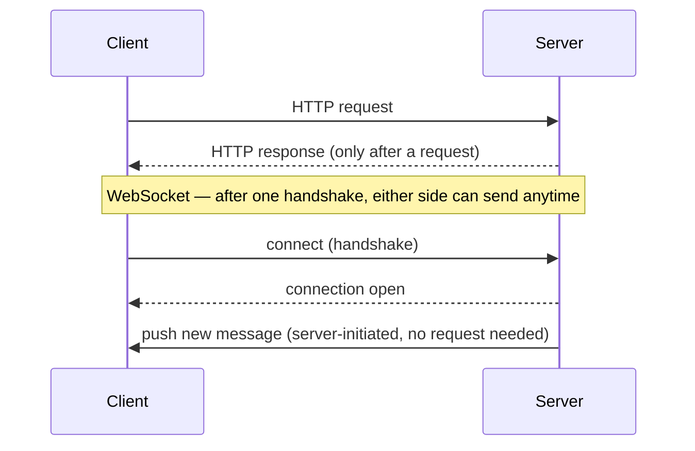
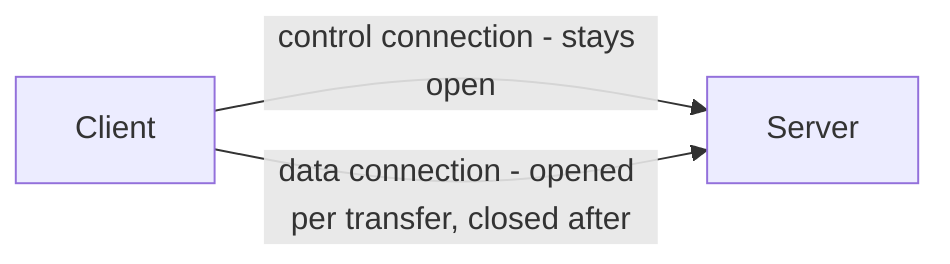
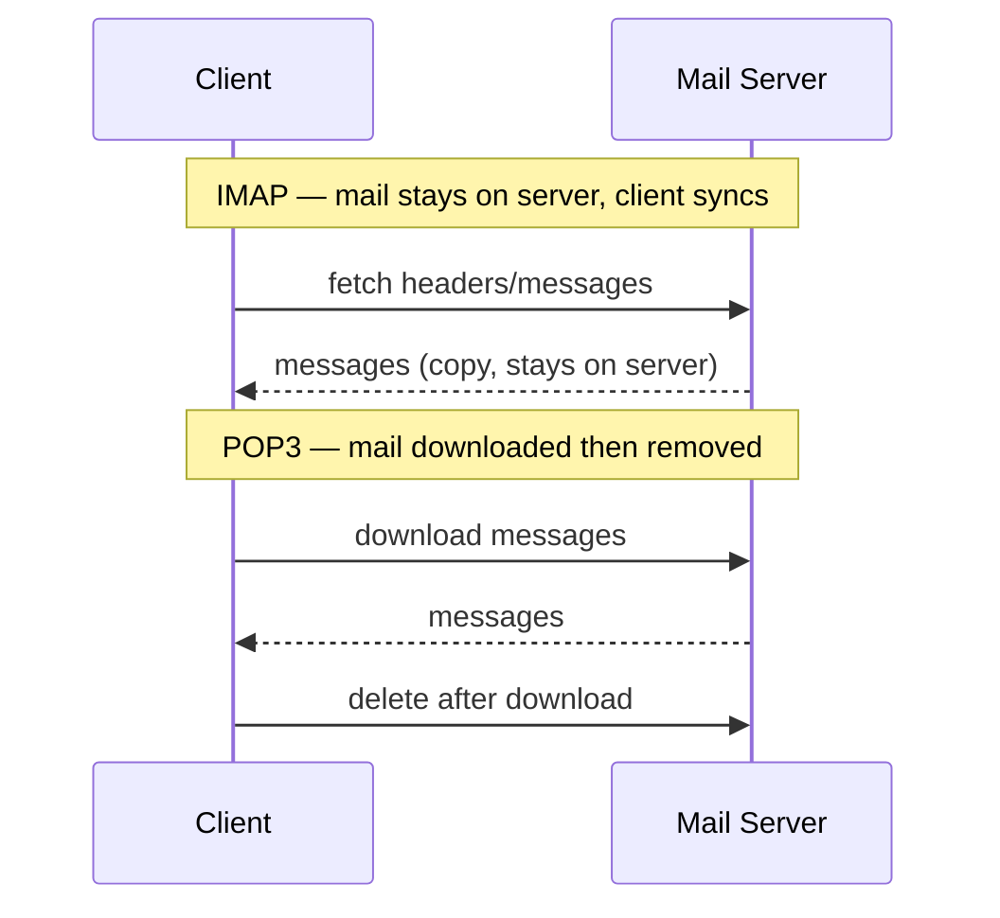
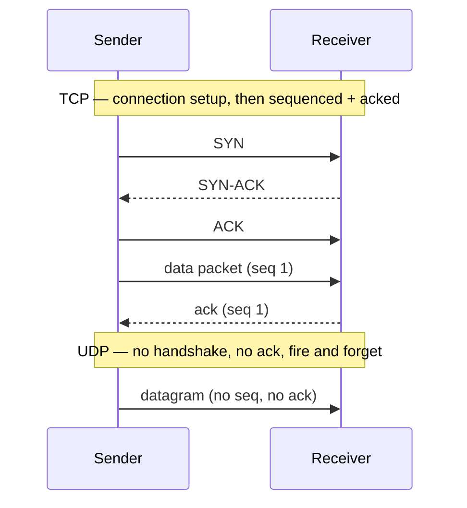
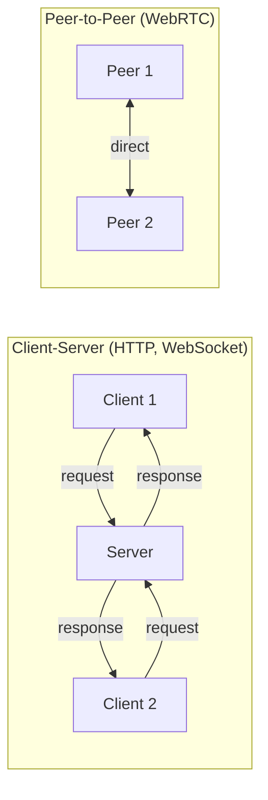

# Network Protocols

## Overview
- Two OSI layers matter for HLD: application layer and transport layer
- Protocol choice depends on the use case, not preference — chat needs push, video needs speed, pages need simple request/response

## Key Concepts

### What's a network protocol
- Rules two systems agree on so they can talk, even without understanding each other beyond the rules

### Client-server vs peer-to-peer
- **Client-server** — client always initiates, server responds (HTTP, FTP, SMTP)
- **WebSocket** — still client-server, but bidirectional once connected; server can push without being asked
- **Peer-to-peer** — any node can act as client or server, talks directly to other nodes, no central hop (WebRTC)

### Application layer protocols
- **HTTP** — connection-oriented, used for web pages; HTTPS = HTTP + encryption
- **FTP** — two connections: control (stays open) + data (per transfer); data connection is unencrypted → replaced by HTTPS
- **SMTP** — sends mail, via a Message Transfer Agent (MTA)
- **IMAP** — reads mail off the server, syncs across devices — modern default
- **POP3** — downloads mail then deletes from server — mostly deprecated

### Transport layer protocols
- **TCP** — connection-oriented, packets sequenced + acknowledged, guarantees ordering, reliable but slower
- **UDP** — no connection, no ordering, no acknowledgement, best-effort delivery, fast

## Diagram

- Client-Server: clients never talk to each other, only through the server
- Peer-to-Peer: nodes talk directly, no server hop

## Trade-offs / Comparisons
| Protocol | Layer | Style | Guarantees | Use case |
|---|---|---|---|---|
| HTTP(S) | App, client-server | Request/response | Reliable | Web pages, APIs |
| WebSocket | App, client-server | Persistent, bidirectional | Reliable | Messaging apps |
| WebRTC | App, peer-to-peer | Direct P2P | Best-effort (over UDP) | Video calls, live streaming |
| FTP | App, client-server | Control + data connections | Reliable, unencrypted | Legacy — avoid |
| TCP | Transport | Sequenced + acked | Ordered, reliable | Anything needing correctness |
| UDP | Transport | Parallel datagrams | Unordered, lossy, fast | Live video/audio |

## Example / Walkthrough
- **Messaging app (WhatsApp):** WebSocket — server must push new messages to the recipient and push delivery acks back to sender, both server-initiated
- **Video calling (Google Meet):** WebRTC over UDP — skip the server hop, drop frames instead of retransmitting

## Interview Q&A

Is WebSocket peer-to-peer?

No — still client-server, just bidirectional; clients never talk to each other directly.

Why UDP over TCP for video calls?

Skips ordering/ack/retransmit overhead — a dropped frame is fine, a stalled stream isn't.

Why WebSocket instead of HTTP for chat?

HTTP can't let the server push without the client polling; WebSocket keeps the channel open both ways.

Why is WebRTC faster than routing through a server?

Peer-to-peer — data goes directly between machines, no extra hop.

Why did HTTPS replace FTP for file transfer?

FTP's data connection is unencrypted; HTTPS gives the same transfer with encryption.

IMAP vs POP3?

POP3 downloads and deletes from server (single device); IMAP syncs and stays on server (multi-device) — IMAP is standard now.

How does TCP guarantee ordering over an unordered network?

Packets are sequenced and acknowledged individually; missing acks trigger resends, receiver reassembles by sequence number.

## Related Topics
- Feeds into WhatsApp design and rate limiter (WebSocket/HTTP) and autocomplete (HTTP) later in [[00-roadmap]]
