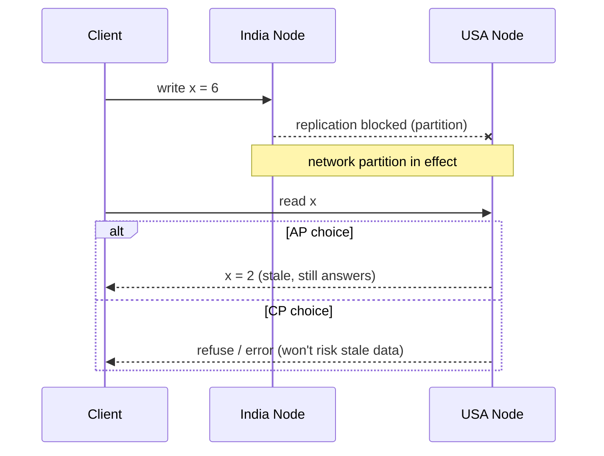
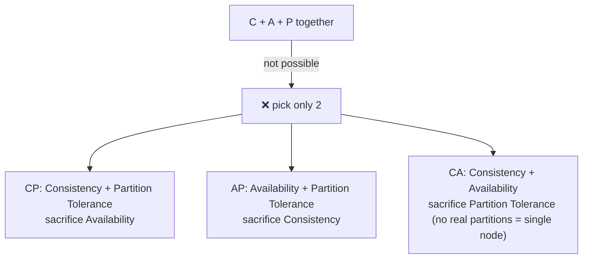

# CAP Theorem

## Overview
- Describes 3 desirable properties of a distributed system: Consistency, Availability, Partition Tolerance.
- A distributed system can only guarantee 2 of the 3 at any given time — CAP (all three together) is not possible.
- Standard interview question: "explain CAP theorem" or comes up naturally when discussing DB choice in system design.
- Real systems almost always keep Partition Tolerance (network partitions are inevitable) and then pick either Consistency or Availability — i.e. choose CP or AP.

## Key Concepts

### The three properties
- Consistency (C) — every node returns the same (most recent) data at any point in time, regardless of which node is read from.
- Availability (A) — every request (to a non-failing node) gets a response — success or failure — no request hangs forever.
- Partition Tolerance (P) — the system keeps functioning even when network communication breaks down between nodes (a "partition" / network split).

### Why all 3 together is impossible
- Setup: DB replicated across nodes in different regions (e.g. one in India, one in USA) for a distributed system with replicated data.
- If a partition happens (nodes can't talk to each other) and a write hits one node, that node can't sync the new value to the other node during the partition.
- To respond at all during the partition (Availability), the unreachable node must answer with stale data → breaks Consistency.
- To stay Consistent during the partition, the unreachable node must refuse to answer until it re-syncs → breaks Availability.
- So under a partition you're forced to sacrifice either C or A — you cannot have all three simultaneously.

### The three achievable combinations
- AP (Availability + Partition Tolerance) — give up Consistency. All nodes keep responding even during a partition, but may return stale/different data. System is "eventually consistent" — the out-of-sync node catches up once the partition heals.
- CP (Consistency + Partition Tolerance) — give up Availability. During a partition, the node that can't confirm it has the latest data refuses to respond (or fails the request) rather than risk returning stale data.
- CA (Consistency + Availability) — only possible if there's no partition, i.e. effectively a single-node system. Not realistic for real distributed systems, since network partitions are assumed to happen eventually.

## Trade-offs / Comparisons
| Choice | Sacrifices | Behavior during partition | Use when |
|---|---|---|---|
| AP | Consistency | All nodes respond, data may be stale, syncs later | Availability matters more than always-fresh data (e.g. social feeds, DNS) |
| CP | Availability | Unreachable/unsynced nodes refuse to respond | Correctness matters more than uptime (e.g. banking, inventory counts) |
| CA | Partition Tolerance | N/A — assumes no partition | Not realistic for real distributed systems |

## Example / Walkthrough
- DB replicated across an India node and a USA node, both storing e.g. a user's date-of-birth field.
- Normal case: write on one node replicates to the other, both nodes stay in sync, both respond consistently.
- Partition happens: the two nodes can't communicate with each other (network break) for some duration (e.g. 5 minutes).
- Write comes in during the partition (e.g. updating a value from 2 to 6) — only reaches one node.
- AP choice: both nodes still answer reads/writes; one node serves the old value (2) until the partition heals and it catches up to the new value.
- CP choice: the node that can't confirm sync with the other refuses the request during the partition, so no stale data is ever served, but that node is effectively down for those 5 minutes.
- Real-world guidance: since partitions are unavoidable in real distributed systems, P is basically always kept — the real design decision interviewers care about is CP vs AP.

## Diagram

## Interview Q&A

What is the CAP theorem?

A distributed system can guarantee at most 2 of Consistency, Availability, and Partition Tolerance at the same time — not all 3.

Why can't a distributed system have all 3 (C, A, and P) at once?

During a network partition, a node cut off from the rest must either respond with possibly-stale data (breaking Consistency) or refuse to respond until it resyncs (breaking Availability) — so a partition forces a choice between C and A.

What does it mean to choose AP over CP?

The system stays available — every node keeps responding to requests — even during a partition, at the cost of possibly returning stale/out-of-sync data until the partition heals and nodes catch up ("eventual consistency").

What does it mean to choose CP over AP?

The system guarantees correct, up-to-date data, but a node that can't confirm it's in sync with the rest of the cluster during a partition will refuse to respond (fail the request) rather than serve stale data.

Is CA (Consistency + Availability without Partition Tolerance) realistic for a distributed system?

Not really — CA assumes no network partitions ever happen, which effectively means a single-node system. Real distributed systems span multiple nodes/regions, so partitions are inevitable and P is almost always kept.

In a real system design interview, which CAP trade-off should you default to discussing?

Since Partition Tolerance is basically mandatory for any real distributed system, frame the decision as CP vs AP — pick based on whether the use case values correctness (CP, e.g. banking/inventory) or uptime (AP, e.g. social feeds/DNS).

Give an example of when you'd choose CP vs AP.

CP: banking/financial systems or inventory counts, where serving stale data could cause real harm (double-spend, overselling). AP: social media feeds, DNS, caching systems, where serving slightly stale data briefly is acceptable but downtime is not.

## Related Topics
- [01. Network Protocols](01-network-protocols.md) — underlying network behavior that causes partitions
