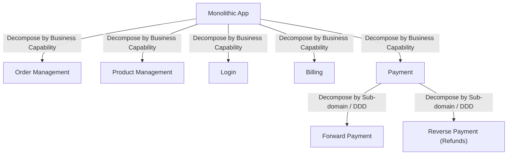

# Microservices Design Patterns

## Overview
- Covers why monolithic ("legacy") applications get migrated to microservices, and the 4 phases of microservices design each with its own set of patterns.
- Part 1 of a series — this note covers the intro (monolith vs microservices trade-offs) and the first phase: Decomposition Patterns.
- Very common interview area — "how would you break this system into microservices" comes up in almost every HLD round.

## Key Concepts

### Monolithic applications
- Monolithic = "legacy application" — everything (all business logic, all modules) lives in one single codebase/deployable unit.
- Disadvantage 1 — IDE/tooling overload: loading a huge legacy codebase in an IDE is slow and heavy.
- Disadvantage 2 — slow scaling: to scale, you need fast CI (continuous integration — regression run, push, monitor); a huge tightly-coupled codebase makes CI slow.
- Disadvantage 3 — tight coupling: a one-line change can impact many domains, since everything lives together, so every change needs full regression testing and a full redeploy of the entire app — takes a lot of time.
- Disadvantage 4 — can't scale selectively: if only one piece of business logic (e.g. "order") needs more scale, you're forced to scale the entire application (all its servers), which is far more costly and difficult than scaling just the hot piece.

### Why microservices (advantages)
- Every disadvantage of monolith becomes an advantage of microservices — break one large app into small independent services (e.g. Product, Order Management, Billing, Payment, Account).
- Selective scaling — if only Order traffic is high, scale only the Order service and its infra, not the whole app → cost-effective ("pocket friendly").
- Faster CI/deploys per service since each service's codebase is small and independently deployable.
- Loose coupling (when designed well) — changes in one service don't ripple across unrelated domains.

### Disadvantages of microservices
- Improper decomposition risk — if services aren't broken apart with proper understanding of the business, they end up not loosely coupled, causing excess inter-service communication/dependency and added latency (a call that took ~1ms within a monolith might take ~10ms over the network between services).
- Harder monitoring — with services S1, S2, S3 calling each other, a new deploy to one service can silently break its clients (e.g. a changed response schema); figuring out "who broke, where the error lies" gets complex.
- Transaction management is harder — a monolith with one DB can wrap multi-step logic in a single start/stop transaction; with microservices each service typically has its own DB, so a request spanning 2+ services (e.g. S1 + S2) can't share one DB transaction — if one step fails, you must manually roll back the other service's work instead of relying on a native transaction rollback.

### 4 phases of microservices design (each has its own patterns)
- Decomposition — how to split one large app into smaller services (this note's focus).
- Database — how each service's data/storage is structured.
- Communication — how services talk to each other (e.g. via API, via Events).
- Integration — how services are pulled into the ecosystem (mentioned; e.g. observability/gateway-related concerns).
- For a given system you pick one pattern per phase, then combine them — e.g. decomposition pattern X + database pattern Y + communication pattern Z + integration pattern W together define one microservice's design.

### Decomposition patterns
- Decompose by Business Capability — split services along business functions/capabilities (what the business does), e.g. Order Management, Product Management, Login, Billing, Payment each become their own service.
  - Challenge: requires strong knowledge of what your business's functions actually are — without that clarity, you can't draw good service boundaries.
  - "Micro" is relative/context-dependent — there's no fixed size definition; what counts as one microservice depends on the scale of the overall project. Order Management can itself be a large application, but in the context of the whole system it's still "one microservice" because it was divided by business capability.
- Decompose by Sub-domain (Domain-Driven Design / DDD) — split further based on domains and sub-domains within a capability, not just top-level business function.
  - Domain-driven design: first identify a domain (e.g. "Order Management" is one domain), then break that domain into sub-domains if it has genuinely distinct sub-functionalities.
  - Example: Payment can be split into sub-domains — Forward Payment (making a payment) and Reverse Payment (refunds) — two sub-domains within the same overall Payment domain, potentially becoming two separate microservices.
  - Whether a domain needs sub-domain splitting depends on the domain — some domains (e.g. straightforward Order Management) are fine as one service; others (e.g. Payment with forward + refund flows) naturally have distinct sub-capabilities worth separating.

## Trade-offs / Comparisons
| Aspect | Monolithic | Microservices |
|---|---|---|
| Scaling | Must scale entire app even for one hot piece | Scale only the specific service that needs it |
| CI/Deploy speed | Slow — full regression + full redeploy for any change | Fast per service — smaller independent codebases |
| Coupling | Naturally tightly coupled — one change can impact many domains | Can be loosely coupled if decomposed well; poorly decomposed = still tightly coupled with extra network overhead |
| Transactions | Single DB, simple start/stop transactions | Multi-service transactions need manual rollback logic — no native cross-DB transaction |
| Monitoring | Simple — one deployable unit | Complex — must trace which service/client broke after a deploy |
| Latency | Local in-process calls (fast) | Network calls between services (can add real latency, e.g. ~1ms → ~10ms) if not decomposed properly |

## Example / Walkthrough
- Online order application decomposed by business capability into: Order Management, Product Management, Login, Billing, Payment.
- Within Payment, further decomposed by sub-domain (DDD) into: Forward Payment (making the payment) and Reverse Payment (handling refunds) as two separate microservices/sub-domains.
- Contrast: Order Management wasn't further split into sub-domains in this example — illustrating that sub-domain decomposition is applied selectively, only where a domain has genuinely distinct sub-capabilities.

## Diagram

## Interview Q&A

Why do companies migrate from monolithic to microservices architecture?

Monoliths are slow to build/deploy (heavy IDE, slow CI), tightly coupled (small changes ripple widely and need full regression + redeploy), and can't be scaled selectively — you must scale the whole app even if only one feature needs it.

What are the main disadvantages of microservices?

Improper decomposition causes tight coupling and added network latency; monitoring/debugging is harder since a deploy to one service can silently break its clients; and cross-service transactions are hard since each service typically owns its own DB, requiring manual rollback instead of native transactions.

What are the 4 phases of microservices design?

Decomposition (how to split the app), Database (how data is structured per service), Communication (how services talk — API, events, etc.), and Integration (how services fit into the broader ecosystem). Each phase has its own set of patterns, and you pick one pattern per phase.

What is "Decompose by Business Capability"?

Split services along what the business actually does — e.g. Order Management, Payment, Billing, Login each become independent services. Requires solid knowledge of the business's real functions to draw good boundaries.

What is "Decompose by Sub-domain" (Domain-Driven Design)?

After identifying a domain (e.g. Payment), further split it into sub-domains where the domain has genuinely distinct sub-capabilities — e.g. Payment splits into Forward Payment and Reverse Payment (refunds) as separate services.

Is there a fixed definition of how small a "microservice" should be?

No — "micro" is relative to the scale of the overall system. A service like Order Management can internally be a large application, but is still considered one microservice in the context of the whole system because it was drawn along one business capability boundary.

Why is transaction management harder in microservices than monoliths?

A monolith with a single DB can wrap multi-step operations in one native transaction (start/stop). In microservices, a request spanning multiple services usually touches multiple separate DBs, so there's no single native transaction — if one service's step fails after another succeeded, you must manually trigger a compensating rollback.

## Related Topics
- [02. CAP Theorem](02-cap-theorem.md) — relevant when each microservice's database is distributed
