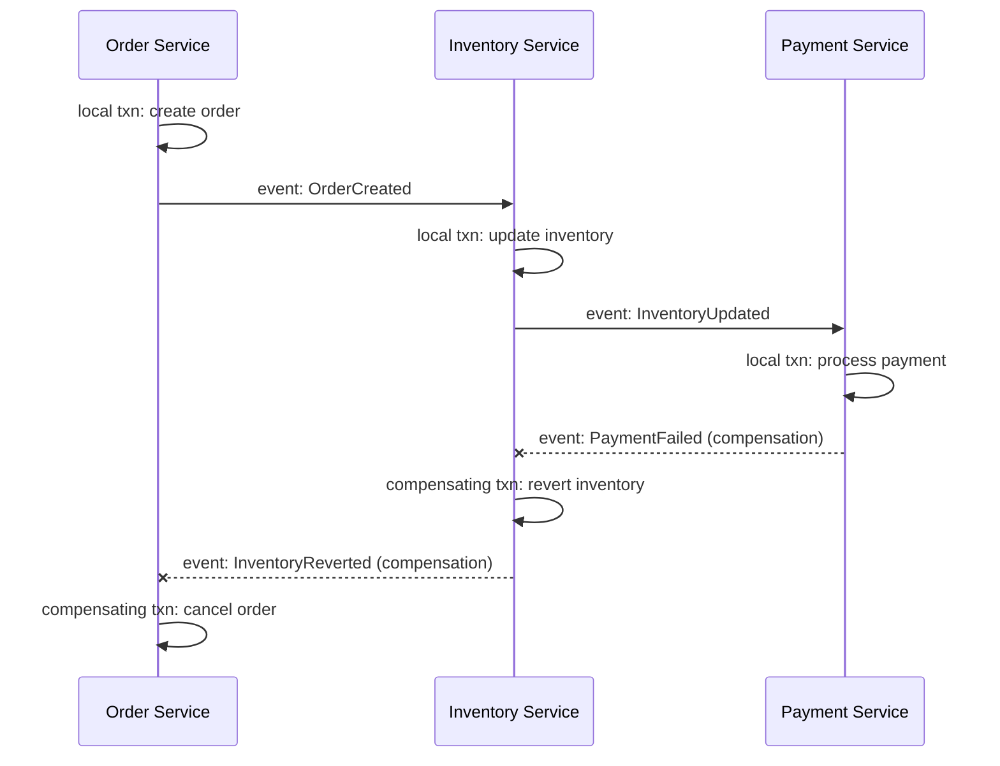
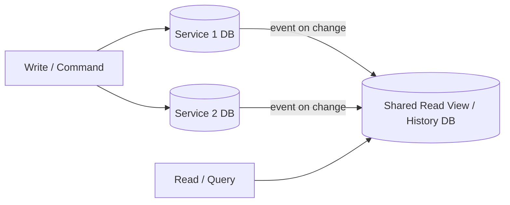

# Microservices Design Patterns

## Overview
- Covers why monolithic ("legacy") applications get migrated to microservices, and the 4 phases of microservices design each with its own set of patterns.
- Part 1 covers the intro (monolith vs microservices trade-offs) and the Decomposition phase. Part 2 covers the Database phase (shared vs per-service DB) plus 3 more patterns: Strangler (safe migration), Saga (distributed transactions), CQRS (cross-service queries).
- Very common interview area — "how would you break this system into microservices" and "how do you handle transactions across services" come up in almost every HLD round.

## Key Concepts

### Monolithic applications
- Monolithic = "legacy application" — everything (all business logic, all modules) lives in one single codebase/deployable unit.
- Disadvantage 1 — IDE/tooling overload: loading a huge legacy codebase in an IDE is slow and heavy.
- Disadvantage 2 — slow scaling: to scale, you need fast CI (continuous integration — regression run, push, monitor); a huge tightly-coupled codebase makes CI slow.
- Disadvantage 3 — tight coupling: a one-line change can impact many domains, since everything lives together, so every change needs full regression testing and a full redeploy of the entire app — takes a lot of time.
- Disadvantage 4 — can't scale selectively: if only one piece of business logic (e.g. "order") needs more scale, you're forced to scale the entire application (all its servers), which is far more costly and difficult than scaling just the hot piece.

### Why microservices (advantages)
- Every disadvantage of monolith becomes an advantage of microservices — break one large app into small independent services (e.g. Product, Order Management, Billing, Payment, Account).
- Selective scaling — if only Order traffic is high, scale only the Order service and its infra, not the whole app → cost-effective ("pocket friendly").
- Faster CI/deploys per service since each service's codebase is small and independently deployable.
- Loose coupling (when designed well) — changes in one service don't ripple across unrelated domains.

### Disadvantages of microservices
- Improper decomposition risk — if services aren't broken apart with proper understanding of the business, they end up not loosely coupled, causing excess inter-service communication/dependency and added latency (a call that took ~1ms within a monolith might take ~10ms over the network between services).
- Harder monitoring — with services S1, S2, S3 calling each other, a new deploy to one service can silently break its clients (e.g. a changed response schema); figuring out "who broke, where the error lies" gets complex.
- Transaction management is harder — a monolith with one DB can wrap multi-step logic in a single start/stop transaction; with microservices each service typically has its own DB, so a request spanning 2+ services (e.g. S1 + S2) can't share one DB transaction — if one step fails, you must manually roll back the other service's work instead of relying on a native transaction rollback.

### 4 phases of microservices design (each has its own patterns)
- Decomposition — how to split one large app into smaller services.
- Database — how each service's data/storage is structured (shared vs per-service — this note's Part 2 focus, sets up Saga and CQRS).
- Communication — how services talk to each other (e.g. via API, via Events).
- Integration — how services are pulled into the ecosystem (mentioned; e.g. observability/gateway-related concerns).
- For a given system you pick one pattern per phase, then combine them — e.g. decomposition pattern X + database pattern Y + communication pattern Z + integration pattern W together define one microservice's design.

### Decomposition patterns
- Decompose by Business Capability — split services along business functions/capabilities (what the business does), e.g. Order Management, Product Management, Login, Billing, Payment each become their own service.
  - Challenge: requires strong knowledge of what your business's functions actually are — without that clarity, you can't draw good service boundaries.
  - "Micro" is relative/context-dependent — there's no fixed size definition; what counts as one microservice depends on the scale of the overall project. Order Management can itself be a large application, but in the context of the whole system it's still "one microservice" because it was divided by business capability.
- Decompose by Sub-domain (Domain-Driven Design / DDD) — split further based on domains and sub-domains within a capability, not just top-level business function.
  - Domain-driven design: first identify a domain (e.g. "Order Management" is one domain), then break that domain into sub-domains if it has genuinely distinct sub-functionalities.
  - Example: Payment can be split into sub-domains — Forward Payment (making a payment) and Reverse Payment (refunds) — two sub-domains within the same overall Payment domain, potentially becoming two separate microservices.
  - Whether a domain needs sub-domain splitting depends on the domain — some domains (e.g. straightforward Order Management) are fine as one service; others (e.g. Payment with forward + refund flows) naturally have distinct sub-capabilities worth separating.

### Strangler Pattern (migrating monolith → microservices)
- Named after the strangler fig plant, which gradually grows around and eventually replaces its host tree — same idea for migrating a monolith.
- Answers: once decomposition tells you how to split the monolith, how do you actually cut over to microservices without breaking production?
- Don't route 100% of traffic to a new microservice on day one — migrate incrementally: extract one piece of functionality into a new service, but keep the monolith serving all traffic as the primary/fallback path.
- Route a small % of (low-risk) traffic to the new microservice first, monitor and fix bugs found; as confidence grows, slowly increase the % of traffic sent to the new service.
- Over time the monolith's share of that responsibility shrinks toward zero until it's fully "strangled"/replaced by the microservice — no risky big-bang cutover.

### Database Per Service (context for Saga & CQRS)
- Two DB approaches for microservices: Shared Database (all services read/write one common DB) vs Database Per Service (each service owns its own DB; no service directly touches another service's DB).
- Shared DB problems: can't scale one service's data independently — scaling means scaling the entire shared DB even if only one service's data volume is the bottleneck; a schema/table change can impact every service that uses that DB (data-level coupling).
- Database Per Service fixes both: each service scales its own DB independently, and each service's own team owns/maintains its schema without impacting others.
- But Database Per Service introduces 2 new challenges: (1) can't run a SQL JOIN across tables that now live in separate databases; (2) can't wrap a multi-service operation in one native ACID transaction — no built-in distributed transaction across separate DBs.
- Saga pattern solves challenge (2); CQRS (with a shared read view) addresses challenge (1) for reads.

### Saga Pattern (distributed transactions)
- Saga = a sequence of local transactions, one per service; each service performs its own local DB transaction, then publishes an event; the next service listens for that event and performs its own local transaction, and so on down the chain.
- If a later step fails, the earlier services run a compensating transaction — a new, semantic "undo" operation (e.g. cancel the order, restore the inventory) — since the earlier steps already committed and can't be rolled back at the DB level.
- Implemented via events (choreography-style): each service both listens for events that trigger its own local transaction, and emits an event when its local transaction completes (success, or failure → triggers compensation upstream) — keeps services decoupled from each other, no central coordinator in this setup.
- Drawback: coordinating purely through events (each service reacting to others' events) can create circular/cyclic dependencies between services as the chain of listeners grows more complex.

### CQRS — Command Query Responsibility Segregation
- Splits the write path (Command) from the read path (Query) for a system spanning multiple per-service databases.
- Command side — writes (create/update/delete) go through each service's own database as normal, same as Database Per Service — each service's table stays its own source of truth.
- Query side — a separate, denormalized "view"/history database is maintained that already combines the relevant data from multiple services' tables, so reads don't need a cross-database JOIN.
- The view database is kept in sync with each service's write-side DB via events (same mechanism as Saga) — whenever a service's underlying data changes (create/update/delete), an event updates the shared read view.
- Net effect: avoids the "can't JOIN across separate per-service DBs" problem, and lets read and write workloads scale/be optimized independently.

## Trade-offs / Comparisons
| Aspect | Monolithic | Microservices |
|---|---|---|
| Scaling | Must scale entire app even for one hot piece | Scale only the specific service that needs it |
| CI/Deploy speed | Slow — full regression + full redeploy for any change | Fast per service — smaller independent codebases |
| Coupling | Naturally tightly coupled — one change can impact many domains | Can be loosely coupled if decomposed well; poorly decomposed = still tightly coupled with extra network overhead |
| Transactions | Single DB, simple start/stop transactions | Multi-service transactions need manual rollback logic — no native cross-DB transaction |
| Monitoring | Simple — one deployable unit | Complex — must trace which service/client broke after a deploy |
| Latency | Local in-process calls (fast) | Network calls between services (can add real latency, e.g. ~1ms → ~10ms) if not decomposed properly |

| Aspect | Shared Database | Database Per Service |
|---|---|---|
| Scaling | Must scale the entire shared DB together | Each service scales its own DB independently |
| Schema changes | Can impact every service using the DB | Isolated — only the owning service/team affected |
| Joins across services | Easy — one DB, normal SQL JOIN | Not possible directly — data lives in separate DBs (need CQRS view) |
| Transactions across services | Native single-DB ACID transaction | No native cross-DB transaction — needs Saga pattern |

## Example / Walkthrough
- Decomposition: online order application split by business capability into Order Management, Product Management, Login, Billing, Payment; Payment further split by sub-domain (DDD) into Forward Payment and Reverse Payment (refunds).
- Saga — e-commerce order flow across 3 services, each with its own DB:
  - Order Service creates an order (local transaction) → emits an event.
  - Inventory Service listens, updates inventory (local transaction) → emits an event.
  - Payment Service listens, processes payment (e.g. debits the payer's balance, credits the payee, records the payment) → emits a success event.
  - Failure case: if Payment fails, it emits a compensating/failure event → Inventory Service listens and runs a compensating transaction (reverts its inventory update) → Order Service listens and cancels/rolls back the order. So a failure at the 3rd service (Payment) causes both the 2nd (Inventory) and 1st (Order) services to compensate/roll back their own local transactions.
- CQRS — two services each own a separate table (Service 1's table, Service 2's table) in separate DBs, so a direct JOIN between them isn't possible; instead a separate "common view"/history table is maintained that already holds the combined data needed for reads, kept updated via events whenever the underlying per-service tables change — queries just `SELECT` from this common view instead of attempting a cross-DB join.

## Diagram

## Interview Q&A

Why do companies migrate from monolithic to microservices architecture?

Monoliths are slow to build/deploy (heavy IDE, slow CI), tightly coupled (small changes ripple widely and need full regression + redeploy), and can't be scaled selectively — you must scale the whole app even if only one feature needs it.

What are the main disadvantages of microservices?

Improper decomposition causes tight coupling and added network latency; monitoring/debugging is harder since a deploy to one service can silently break its clients; and cross-service transactions are hard since each service typically owns its own DB, requiring manual rollback instead of native transactions.

What are the 4 phases of microservices design?

Decomposition (how to split the app), Database (how data is structured per service), Communication (how services talk — API, events, etc.), and Integration (how services fit into the broader ecosystem). Each phase has its own set of patterns, and you pick one pattern per phase.

What is "Decompose by Business Capability"?

Split services along what the business actually does — e.g. Order Management, Payment, Billing, Login each become independent services. Requires solid knowledge of the business's real functions to draw good boundaries.

What is "Decompose by Sub-domain" (Domain-Driven Design)?

After identifying a domain (e.g. Payment), further split it into sub-domains where the domain has genuinely distinct sub-capabilities — e.g. Payment splits into Forward Payment and Reverse Payment (refunds) as separate services.

Is there a fixed definition of how small a "microservice" should be?

No — "micro" is relative to the scale of the overall system. A service like Order Management can internally be a large application, but is still considered one microservice in the context of the whole system because it was drawn along one business capability boundary.

Why is transaction management harder in microservices than monoliths?

A monolith with a single DB can wrap multi-step operations in one native transaction (start/stop). In microservices, a request spanning multiple services usually touches multiple separate DBs, so there's no single native transaction — if one service's step fails after another succeeded, you must manually trigger a compensating rollback.

How do you safely migrate a monolith to microservices without a risky big-bang cutover?

Use the Strangler pattern — extract one piece of functionality into a new microservice, route a small % of traffic to it while the monolith keeps handling the rest, fix issues found, then gradually increase the traffic share to the new service until the monolith's responsibility is fully replaced.

What problem does the Saga pattern solve, and how does it work?

It solves the lack of a native distributed transaction across per-service databases. A Saga is a sequence of local transactions — each service commits its own local transaction and publishes an event that triggers the next service's local transaction; if a later step fails, earlier services run compensating transactions to semantically undo their committed work.

If Service 3 in a Saga chain fails, what happens to Services 1 and 2?

Service 3's failure triggers a compensating event that Service 2 listens for, causing Service 2 to run its own compensating transaction and emit its own failure/compensation event; Service 1 listens for that and runs its compensating transaction too — the failure cascades backward through the chain, undoing each already-committed local transaction.

What's a drawback of implementing Saga purely through events (no central coordinator)?

Since each service listens for and emits events independently, the web of event dependencies between services can grow into a circular/cyclic dependency as the system gets more complex, making the flow harder to reason about.

What problem does CQRS solve in a Database Per Service setup, and how?

It solves the inability to JOIN across separate per-service databases for reads. CQRS keeps writes (Commands) going through each service's own DB as normal, but maintains a separate denormalized read view (Query side) that already combines the needed data — kept in sync via events whenever the underlying service data changes — so reads just query the view instead of joining across DBs.

## Related Topics
- [02. CAP Theorem](02-cap-theorem.md) — relevant when each microservice's database is distributed
