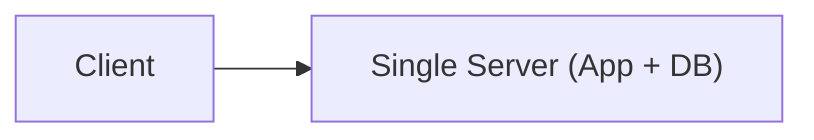
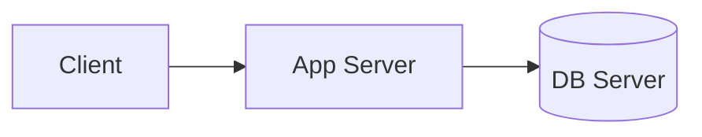
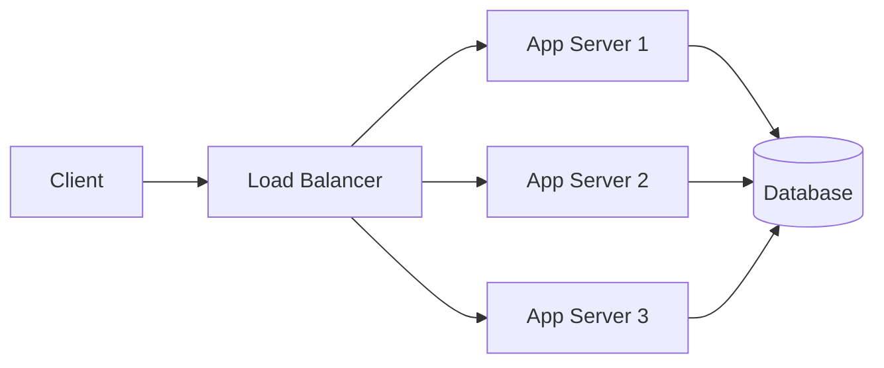
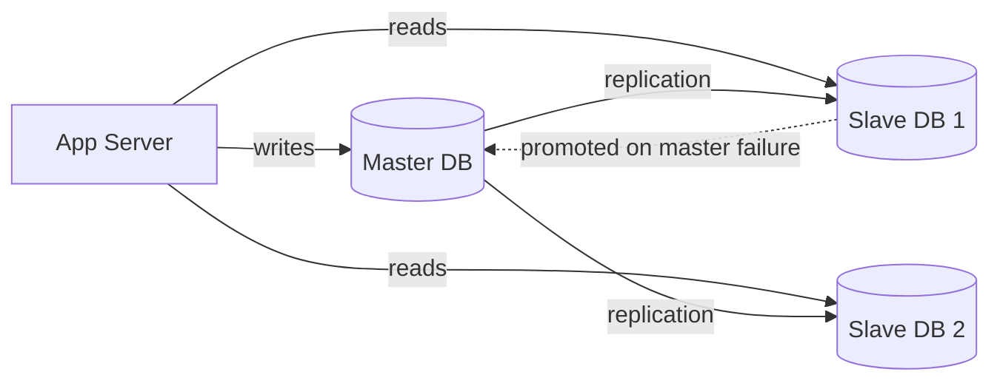
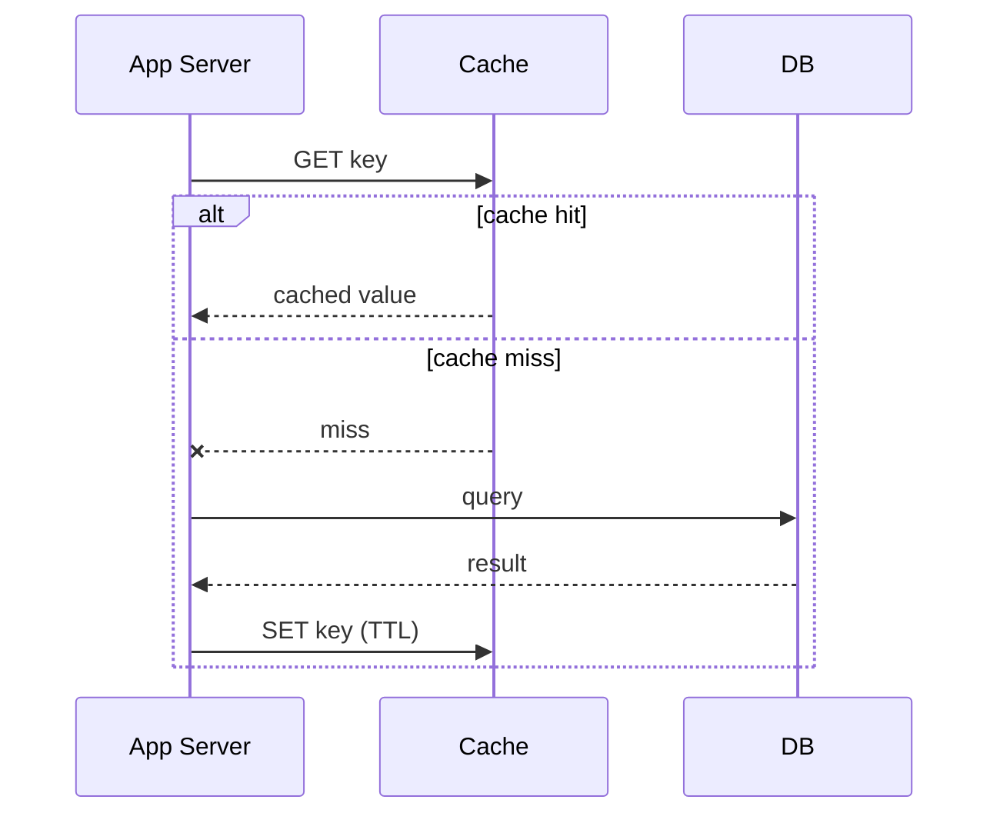
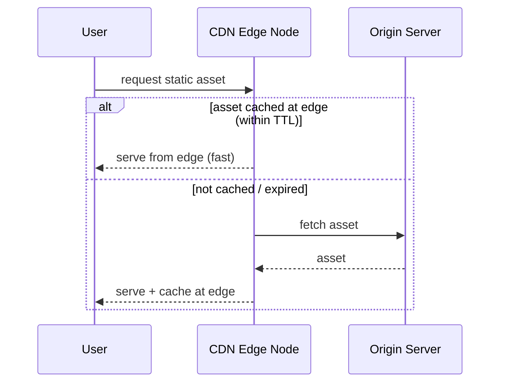
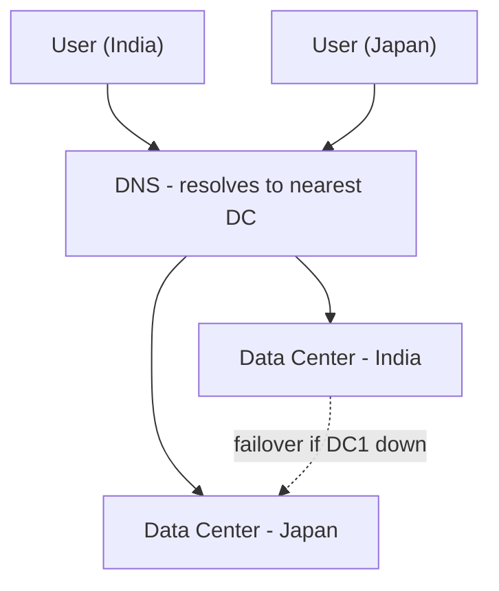
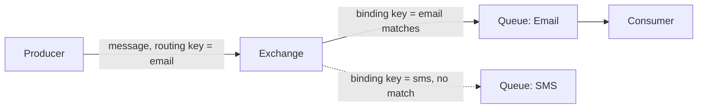
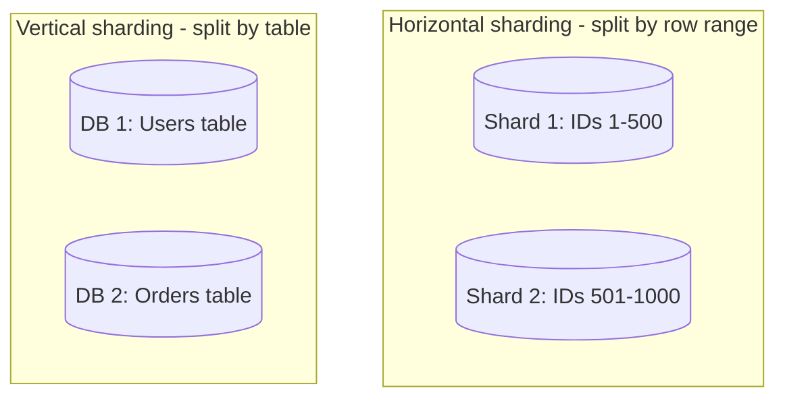
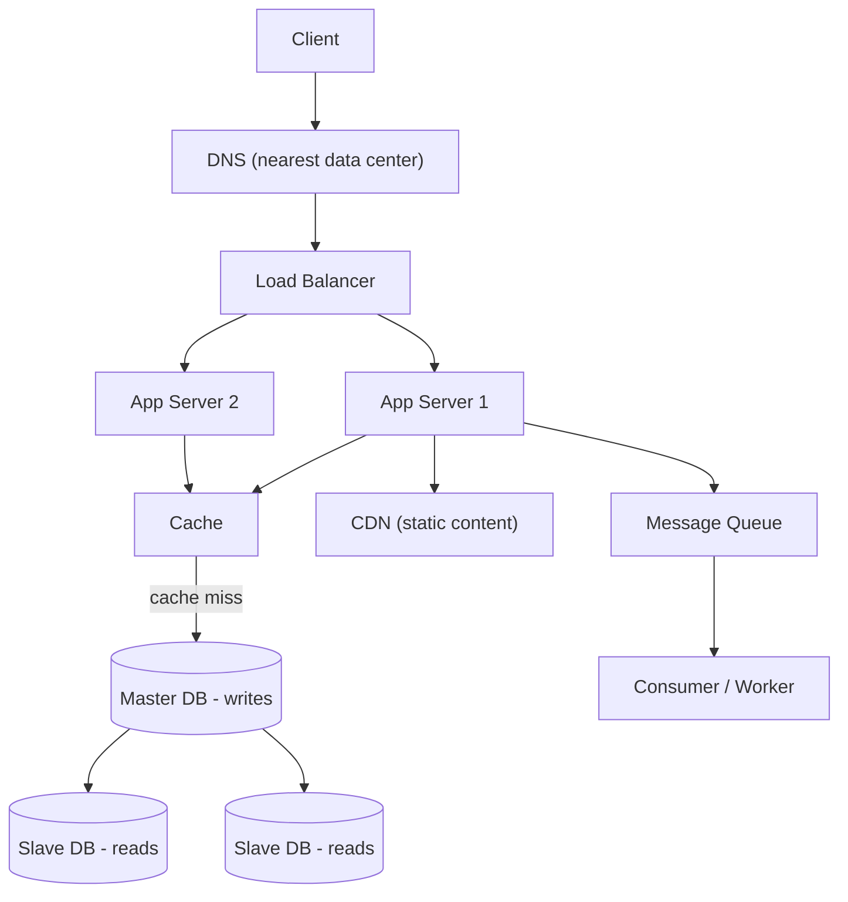

# Scale from Zero to a Million Users

## Overview
- Walks through how a system architecture evolves step-by-step from a single server to one that can handle a million users.
- Classic system design interview flow — "how would you scale this app as traffic grows" — build the architecture incrementally, don't jump straight to the end state.
- Each stage below solves the bottleneck introduced by the previous stage.

## Key Concepts

### Stage 1 — Single server
- Client talks directly to one server that hosts both the application (business logic) and the database on the same machine.
- Simplest possible setup — works fine for very low traffic, but has no separation of concerns and no redundancy.

### Stage 2 — Separate database server
- Split into an application tier (runs only business logic) and a data tier (a separate DB server) — the app server stays in contact with the DB server over the network instead of sharing a machine.
- Lets each tier be scaled/managed independently going forward.

### Stage 3 — Load balancer + multiple app servers
- A single app server can only handle a limited number of requests per unit time (e.g. a fixed requests/minute capacity) — beyond that it starts dropping requests.
- Add multiple app servers behind a Load Balancer; the client now talks to the load balancer, which decides which app server to forward each request to.
- Load balancer also adds a security/privacy layer — app servers are no longer directly exposed to the internet, only the load balancer is.

### Stage 4 — Database replication (Master-Slave)
- One Master DB handles all write operations (create/update/delete); one or more Slave DBs handle read operations, replicating data from the master.
- If the master fails, one of the slaves is promoted to become the new master (failover) — improves fault tolerance for the DB layer, not just the app layer.
- Splitting reads and writes this way also spreads load — most systems are read-heavy, so multiple read replicas help scale that.

### Stage 5 — Caching
- App server checks the cache before going to the DB for a read.
- Cache hit — data found in cache, returned immediately, DB not touched.
- Cache miss — data not in cache, app server has to fetch from the DB (and typically populate the cache for next time).
- TTL (Time To Live) — how long a cached entry is kept before it's considered stale and needs to be refreshed from the DB.

### Stage 6 — CDN (Content Delivery Network)
- Serves static content (e.g. images, assets) from a server node geographically close to the requesting user, instead of always hitting the origin server.
- Reduces latency significantly for users far from the main data center — a user near the origin gets fast responses either way, but a user on the other side of the world benefits most from CDN edge nodes.
- CDN content also has its own TTL/expiry, similar to caching.

### Stage 7 — Multiple data centers + DNS-based routing
- Deploy the whole stack (app servers, DB, etc.) in more than one geographic data center, not just one.
- DNS resolves a domain to the IP of the data center nearest to the requesting user, so requests get routed to the closest data center for lower latency — a request doesn't have to travel across the world to reach a single, distant data center.
- Failover — if one data center goes down, the load balancer/DNS-level routing sends all traffic to the remaining data center(s) instead of failing requests.

### Stage 8 — Message queues (async processing)
- For heavy or non-critical operations on the request path (e.g. sending a notification, sending an email), don't process them synchronously inline with the main request — push them to a message queue instead.
- Producer — publishes a message to the queue (e.g. "send this notification").
- Consumer/Subscriber — a separate worker/service that's subscribed to the queue, picks up messages, and processes them independently, decoupled from the original request's response time.
- Example tools: RabbitMQ, Kafka.
- RabbitMQ internals: a Producer sends a message tagged with a Routing Key to an Exchange; each Queue has a Binding Key registered with the exchange; the exchange compares the routing key against each queue's binding key and forwards the message only to queues where they match — this lets one exchange fan a message out to the right subset of queues/consumers.

### Stage 9 — Database scaling: vertical vs horizontal
- Vertical scaling — increase the capacity (CPU, RAM) of the existing DB server(s) to handle more load, without adding new nodes.
- Horizontal scaling (sharding) — once a single (even upgraded) DB node isn't enough, add more DB nodes and split data across them. Two ways to shard:
  - Horizontal sharding — split rows across nodes/tables by some key range (e.g. IDs 1–500 in shard 1, 501–1000 in shard 2, etc.).
  - Vertical sharding — split by columns/tables — different logical tables live in different DBs/nodes.

## Trade-offs / Comparisons
| Aspect | Vertical scaling | Horizontal scaling (sharding) |
|---|---|---|
| How | Upgrade existing server's CPU/RAM | Add more DB nodes and split data across them |
| Limits | Has a hardware ceiling | Scales further, but adds architectural complexity |

| Aspect | Horizontal sharding (by row range) | Vertical sharding (by column/table) |
|---|---|---|
| Split by | Row ranges (e.g. ID ranges) across shards | Columns/tables across separate DBs |
| Main drawback | Uneven distribution possible — a "hot" shard gets overloaded if its range is accessed far more than others | Cross-shard JOINs become hard/impossible, since related data now lives in separate DBs |
| Mitigation | Rebalance/redefine ranges to spread load more evenly | Denormalize data (duplicate/mix fields) to avoid needing a JOIN across DBs |

## Example / Walkthrough
- Data center + DNS routing example: one data center in India, another closer to a user in Japan; DNS resolves the Japan-based user to the nearer data center so requests/responses don't have to travel all the way to India, cutting latency.
- If the India data center goes down entirely, all traffic (including India's own users) is rerouted to the remaining (e.g. Japan) data center via the load balancer/DNS layer, keeping the system available.
- Message queue example: a heavy operation like "send notification" or "send email" is pushed to a queue instead of being handled inline; a producer publishes it with a routing key, the exchange matches it to a queue's binding key, and a subscribed consumer processes it (e.g. actually sends the email) independently of the original request.
- Horizontal sharding example: user records split by ID range across shards (e.g. 1–500 in one shard, 501–1000+ in another) instead of one giant table.

## Diagram

## Interview Q&A

How would you evolve a single-server system to handle a million users?

Step by step: separate the app and DB servers, add a load balancer with multiple app servers, add DB replication (master-slave with failover), add caching, add a CDN for static content, add multiple geo-distributed data centers with DNS-based routing, add message queues for async/heavy operations, and finally scale the database vertically then horizontally (sharding) as needed.

Why put a load balancer in front of app servers instead of exposing them directly?

A single app server has a limited request-handling capacity and becomes a single point of failure; a load balancer distributes traffic across multiple app servers and also hides them from direct internet exposure, adding a security/privacy layer.

What's the purpose of master-slave database replication?

The master handles all writes while one or more slaves handle reads, spreading read load across replicas; if the master fails, a slave is promoted to master, giving the database layer fault tolerance.

What's the difference between a cache hit and a cache miss, and what does TTL control?

A cache hit means the requested data is already in the cache and is returned immediately; a cache miss means the app has to fetch it from the DB instead. TTL (Time To Live) controls how long a cached entry stays valid before it's considered stale and needs refreshing.

Why use a CDN, and when does it help most?

A CDN serves static content from a node geographically close to the user instead of the origin server, cutting latency — it helps most for users who are geographically far from the main data center.

How does routing across multiple data centers work, and what happens if one goes down?

DNS resolves a request to the IP of the nearest data center to reduce latency; if that data center fails, routing shifts all traffic to the remaining data center(s) so the system stays available.

Why use a message queue for something like sending emails/notifications?

These are heavy or non-critical operations that don't need to block the main request/response cycle; pushing them to a queue lets a producer publish the task and a separate consumer process it asynchronously, decoupling it from the request's latency.

What's the difference between vertical and horizontal database scaling, and their sharding sub-types?

Vertical scaling increases the capacity (CPU/RAM) of existing DB servers; horizontal scaling (sharding) adds more DB nodes and splits data across them — either horizontally (splitting rows by key range, risking hot shards) or vertically (splitting by column/table, which then makes cross-shard joins hard and needs denormalization to work around).

## Related Topics
- [03. Microservices Design Patterns](03-microservices-design-patterns.md) — Database Per Service and CQRS relate to the sharding/denormalization trade-offs here
