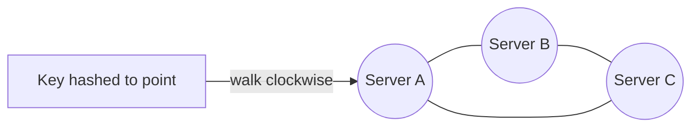

# Consistent Hashing

## Overview
- Technique to distribute keys (requests, data) across a set of servers/nodes evenly.
- Solves the "mass rebalancing" problem that plain `hash % N` hashing has when the number of nodes changes.
- Used in load balancers, distributed caches, and sharded/distributed databases.
- Builds on top of a normal hash function + modulo, so understand that first.

## Key Concepts

### Plain hashing (mod N)
- Hash function — takes any input (key), returns a fixed-length output value.
- To map a key to one of N servers: `hash(key) % N` picks a server index.
- Works fine as long as N (number of servers/DB shards) stays fixed.
- Problem: if N changes (server added/removed, DB re-sharded), `mod N` changes for almost every key.
- Example: DB with 3 partitions, `id % 3` decides the partition. Add a 4th partition → now `id % 4` — nearly every key maps to a different partition than before, forcing a full data reshuffle (rebalancing) even though only one node changed.
- This is expensive at scale (millions of DB entries, or live traffic on a load balancer) — not acceptable to move almost everything for one node change.

### Consistent hashing — the idea
- Arrange the hash output space as a ring (circle), e.g. values 0 to some max, wrapping back to 0.
- Hash each server onto a random point on the ring (using the same hash function).
- Hash each key onto a point on the ring the same way.
- A key is served by the first server found walking clockwise from the key's position.
- When a server is added: it only takes over the keys between itself and the previous server (counter-clockwise neighbor) — every other key stays put.
- When a server is removed: only the keys it was holding move to the next server clockwise — everyone else is unaffected.
- Net effect: adding/removing one node only remaps roughly `1/N` of the keys, not all of them.

### Virtual nodes
- Placing each physical server at just one random ring point can lead to uneven key distribution (some servers get a much bigger arc than others).
- Fix: replicate each physical server at multiple random points on the ring (virtual nodes/replicas).
- More virtual nodes per server → more even split of the ring → more even load distribution.
- Number of replicas is tunable based on how balanced you need the load to be.

## Trade-offs / Comparisons
- Plain `hash % N`: simple, perfectly even split — but any change to N reshuffles almost all keys.
- Consistent hashing: slightly more complex (ring + virtual nodes) — but only ~`1/N` of keys move on any add/remove.
- Rule of thumb mentioned: a well-tuned consistent hashing ring should reshuffle close to `1/N` of keys on a node change, not more.

## Example / Walkthrough
- Load balancer with 3 app servers, using `mod 3` to route requests — works until a 4th server is added, then routing rule becomes `mod 4` and most in-flight assumptions about "which server has what" break.
- DB sharding example: 3 DB partitions splitting rows by `id % 3`. Adding partition 4 changes the modulo for nearly every row → massive rebalancing of already-stored data.
- Consistent hashing ring example: servers S1–S4 hashed onto random points on a ring; a key hashes to a point and is handled by the next server clockwise.
- Adding a new server S5 to the ring: only the keys in the arc between S5 and its counter-clockwise neighbor move to S5; all other keys' server assignment is unchanged.
- Removing a server: its keys fall through to the next server clockwise; rest of the ring is unaffected.
- Virtual nodes example: instead of placing S1 once, place it at several random points on the ring (aliased as S1 at each) so its share of the ring isn't just one lucky/unlucky arc.

## Diagram

## Interview Q&A

Why doesn't plain `hash % N` work well for a dynamic set of servers?

Because changing N (adding/removing a server) changes the modulo result for almost every key, forcing a near-total rebalance/reshuffle of data or routing.

What problem does consistent hashing solve?

It minimizes the number of keys that need to move when a server is added or removed — only about `1/N` of keys are affected instead of nearly all of them.

How are servers and keys placed in consistent hashing?

Both are hashed onto the same circular hash space (ring); a key is assigned to the first server encountered walking clockwise from the key's position.

What happens to keys when a new server joins the ring?

Only the keys in the arc between the new server and its counter-clockwise neighbor move to it — the rest of the ring's key-to-server mapping is untouched.

Why use virtual nodes instead of one ring position per server?

A single random point per server can give an uneven split of the ring (unbalanced load). Multiple virtual nodes per server spread its coverage across the ring more evenly.

Where is consistent hashing used in real systems?

Load balancers distributing traffic across app servers, distributed caches, and sharded/distributed databases — anywhere the set of nodes can grow or shrink.

## Related Topics
- [05. Scale from Zero to a Million Users](05-scale-zero-to-million-users.md) — load balancing and sharding context this builds on
