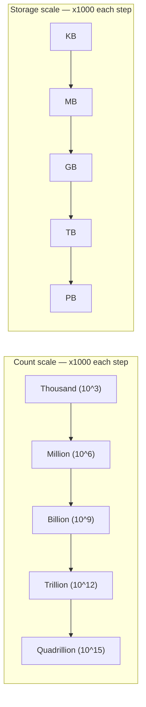
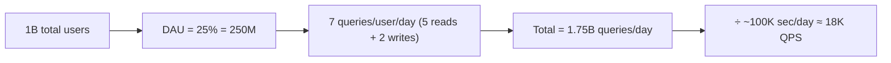
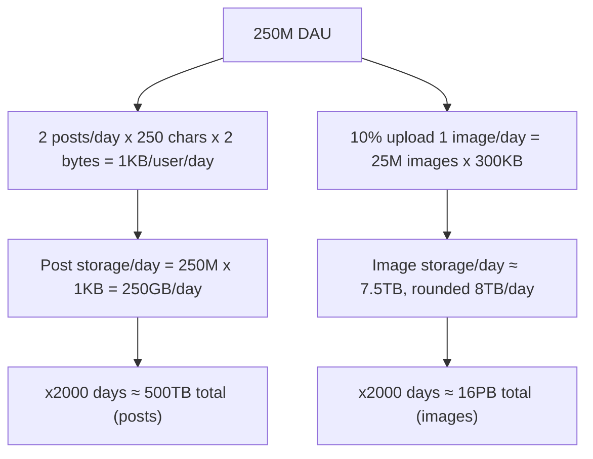
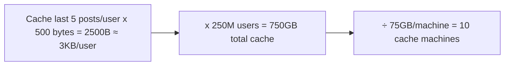
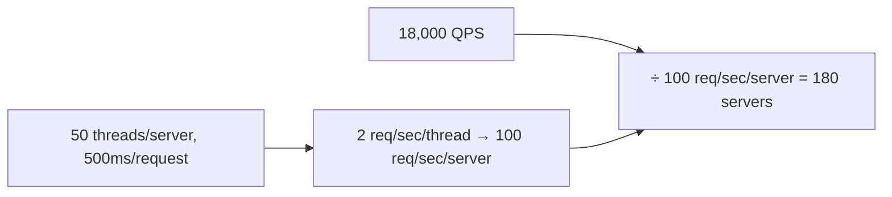
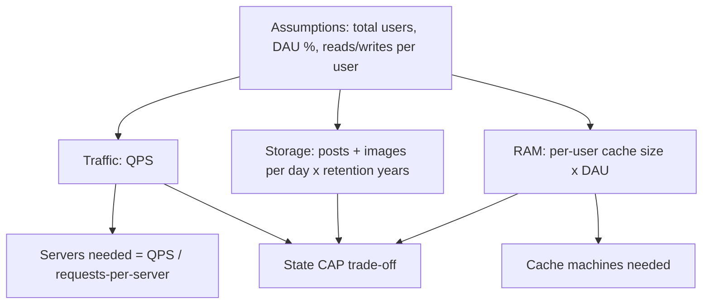

# Back-of-the-Envelope Estimation

## Overview
- Rough capacity planning done before/alongside a system design interview answer — estimates traffic, storage, RAM, and server count.
- Purpose: justify design choices (load balancer, CDN, cache, number of servers) with numbers instead of guessing, and show the interviewer you considered system constraints.
- Not meant to be precise — it's a "T-shirt size" estimate, and interviewers rarely let it change the final design (a scalable design needs the same building blocks regardless).
- Worked example in this note: estimating Facebook's traffic/storage/RAM/servers.

## Key Concepts

### Why do it
- Jumping straight to a design (load balancer, CDN, cache, DB...) invites "do you really need that? what capacity?" — without numbers you can't defend the design.
- It also prevents over-engineering: if traffic is actually tiny, a load balancer or extra servers would be wasted resources.
- One-line definition: back-of-envelope estimation drives (justifies) your system design decisions using rough numbers.

### Ground rules
- Rough/T-shirt-size numbers only — not meant to match real-world figures.
- Don't spend much time on it — cap around 10 minutes; ask the interviewer if they even want it, since it rarely changes the actual design.
- Keep assumption values simple and round (10, 100, 1000, 1 million) — never oddly specific numbers like 435 or 27.75 million; they're hard to compute and remember.

### Cheat sheet — unit scaling
- Every scale step is 3 zeros: thousand (10^3) → million (10^6) → billion (10^9) → trillion (10^12) → quadrillion (10^15).
- Same pattern for storage: KB → MB → GB → TB → PB, each step ×1000 (3 zeros).
- Formula: `X million users × Y MB = (X × Y) × 10^(6+6) = XY TB` — count total zeros from both factors to find the resulting unit.
- Data type sizing assumptions: character ≈ 2 bytes (Unicode; ASCII would be 1 byte), long/double ≈ 8 bytes, average image ≈ 300 KB.

### What to compute
- Three core numbers, computed in this order: number of servers, RAM (cache) needed, storage capacity needed.
- Finish with a CAP theorem trade-off statement (which two of Consistency/Availability/Partition-tolerance the design favors, and why) — see [02. CAP Theorem](02-cap-theorem.md).

## Example / Walkthrough — Facebook estimation

### Traffic estimation
- Total users assumed: 1 billion.
- Daily active users (DAU) assumed: 25% of total = 250 million.
- Assume each user does 5 reads + 2 writes = 7 queries/day.
- Total daily queries = 250 million × 7 = 1.75 billion queries/day.
- Seconds/day ≈ 86,400, rounded to 100,000 (1 lakh) for easy division.
- Queries per second ≈ 1.75 billion / 100,000 ≈ 18,000 (18K) QPS.

### Storage estimation
- Assume each DAU makes 2 posts/day, each post = 250 characters.
- Bytes per post = 250 chars × 2 bytes/char = 500 bytes; 2 posts = 1000 bytes = 1 KB/user/day.
- Post storage/day = 250 million users × 1 KB = 250 GB/day (250M × 1KB → 6+3=9 zeros → GB).
- Assume 10% of DAU uploads 1 image/day = 25 million images/day, each 300 KB.
- Image storage/day = 25 million × 300 KB = 7,500,000,000 KB ≈ 7.5 TB/day, rounded to ~8 TB/day.
- Over 5 years (~2000 days, using 365×5≈1825 rounded to 2000 for simplicity):
  - Posts: 2000 × 250 GB ≈ 500 TB total.
  - Images: 2000 × 8 TB ≈ 16 PB total.

### RAM (cache) estimation
- Assume caching the last 5 posts per DAU.
- Per user cache = 5 posts × 500 bytes/post = 2500 bytes ≈ 3 KB (rounded).
- Total cache RAM = 250 million users × 3 KB = 750 GB.
- If one machine holds 75 GB of cache RAM → need 750 GB / 75 GB = 10 cache machines.

### Server count estimation
- Assume a latency target: 95% of requests served within 500 ms.
- Assume one server has 50 threads, each request takes 500 ms → each thread serves 2 requests/second → one server serves 50 × 2 = 100 requests/second.
- Servers needed = total QPS / requests-per-server = 18,000 / 100 = 180 application servers.

### Final numbers rolled up
- Application servers: ~180.
- Cache RAM: 750 GB across 10 machines.
- Storage (5 years): ~500 TB for posts, ~16 PB for images.
- Trade-off: for Facebook, favor Availability + Partition tolerance, sacrifice strict Consistency (AP over CP/CA) — the system must stay up and serve traffic even during network partitions or node failures, and can tolerate eventual consistency.

## Diagram

## Interview Q&A

Why do back-of-the-envelope estimation before designing a system?

It justifies design decisions (load balancer, CDN, cache, server count) with numbers instead of assumptions, and prevents both under-provisioning and wasting resources on unneeded components.

How precise should the numbers be?

Rough/T-shirt-size only — use simple round numbers (10, 100, 1 million) for easy mental math, and don't expect them to match real-world figures.

How much time should you spend on this in an interview?

Under 10 minutes — it's expected to inform but rarely change the final design, since a scalable design needs the same components (CDN, cache, load balancer) regardless of the exact numbers. Ask the interviewer if they want it before diving in.

What three things are typically computed in back-of-envelope estimation?

Number of servers needed, RAM/cache capacity needed, and storage capacity needed — followed by a CAP theorem trade-off statement.

What's the shortcut for converting "X million users x Y MB/KB" into a storage unit?

Count total zeros in both factors — million contributes 6, KB contributes 3, so million x KB = 9 zeros = GB; multiply the leading digits (X x Y) to get the value in that unit.

How do you go from queries-per-second to number of application servers?

Estimate one server's throughput (threads x requests each thread can serve per second, based on assumed per-request latency), then divide total QPS by that per-server throughput.

What CAP trade-off would you pick for a system like Facebook, and why?

Availability + Partition tolerance over strict Consistency — the system must keep serving traffic even during node failures or network partitions, and can tolerate eventually-consistent data.

## Related Topics
- [02. CAP Theorem](02-cap-theorem.md) — the trade-off framework used to close out an estimation
- [05. Scale from Zero to a Million Users](05-scale-zero-to-million-users.md) — the components (load balancer, cache, CDN) these estimates justify
