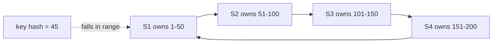
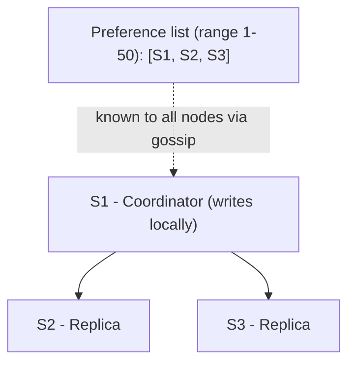
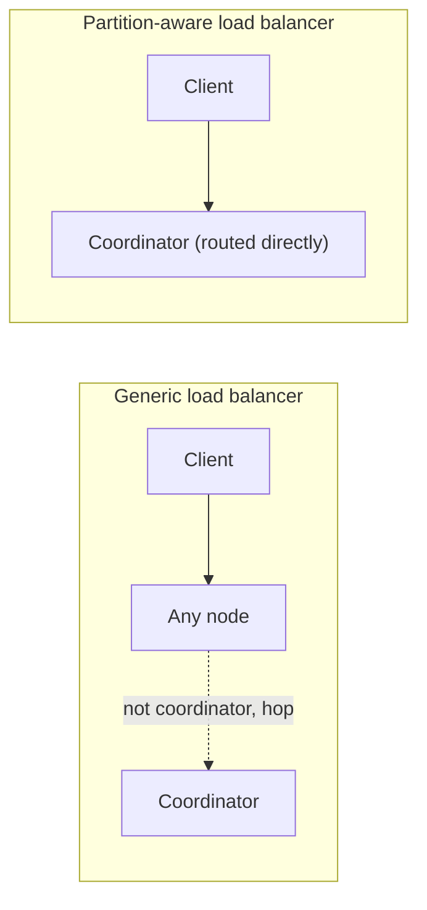
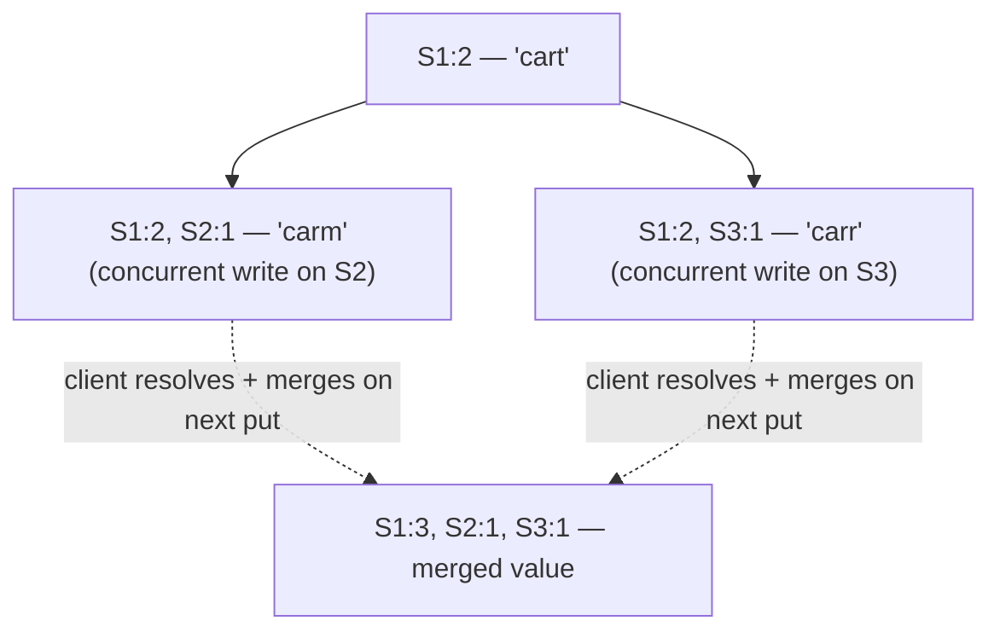
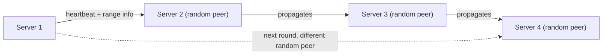
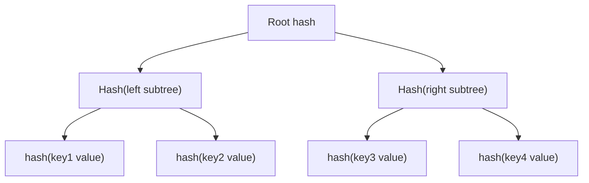
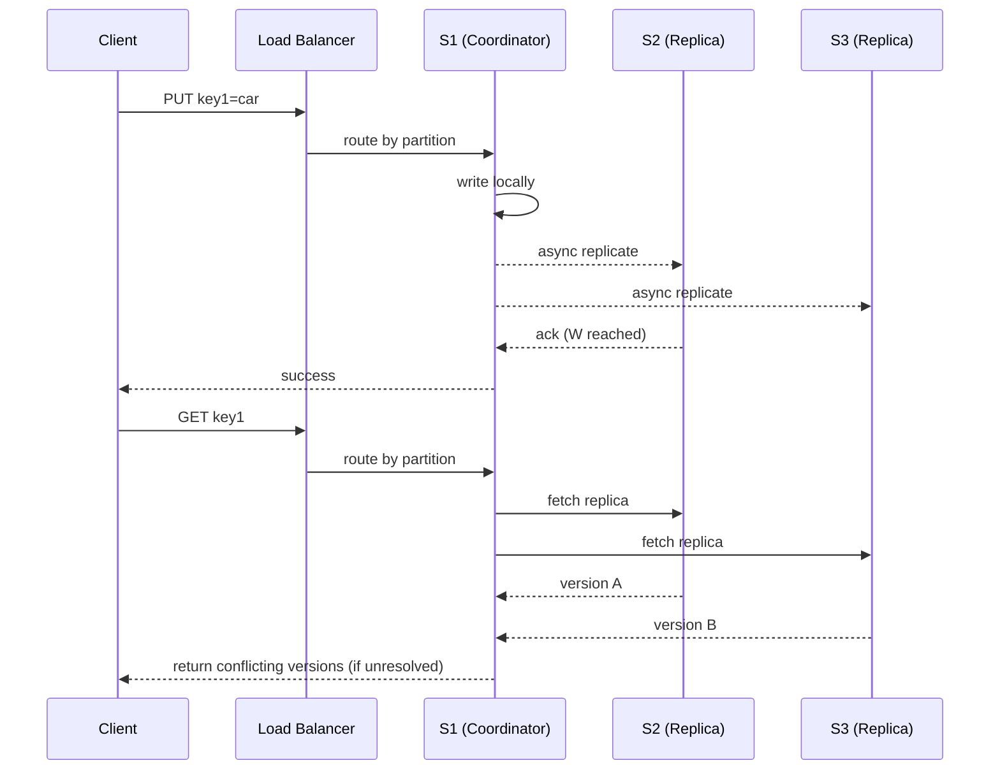

# Design a Key-Value Store (DynamoDB-style)

## Overview
- Classic HLD question: design a distributed key-value database, modeled on Amazon DynamoDB.
- Real use case: Amazon's "Add to Cart" feature is backed internally by DynamoDB.
- Three design goals drive every decision: scalability, decentralization, eventual consistency.
- Six building blocks used to achieve those goals: partitioning, replication, get/put operations, data versioning, gossip protocol, Merkle tree.

## Key Concepts

### Goals
- Scalability — handle millions/billions of users without a single hash table/machine bottleneck.
- Decentralization — no single point of failure; if one node dies, the system keeps serving.
- Eventual consistency — trade strict consistency for higher availability (CAP: choose AP over CP/CA).

### 1. Partitioning (scalability)
- Naive idea (in-memory hash table) doesn't scale to one machine — need to split data across many servers.
- Uses consistent hashing: a virtual ring with servers placed on it, each owning a key range (e.g. S1 = 1–50, S2 = 51–100, S3 = 101–150, S4 = 151–200).
- A key is hashed to a number; whichever server's range contains that number stores the key.
- Hot-key problem: if traffic skews toward one range, that server gets overloaded.
- Fix: virtual nodes — each physical server is placed at multiple random points on the ring, spreading its share of traffic instead of owning one contiguous hot arc.
- See [06. Consistent Hashing](06-consistent-hashing.md) for the full mechanism.

### 2. Replication (decentralization)
- Problem: if the single server owning a key's range goes down, that key becomes unavailable.
- Fix: replicate each key to N servers (N = replication factor, default 3, configurable).
- Coordinator — the server whose range the key falls into; it's the first entry in that range's preference list.
- Coordinator writes locally, then walks the ring clockwise to find N-1 more servers and copies the key to them.
- The clockwise walk isn't strictly sequential — it can skip virtual-node duplicates of the same physical server, and can prefer servers in different data centers (so a single data center failure doesn't lose all replicas).
- Preference list — per key-range list of servers: coordinator first, then the replica-holding servers. Every server in the ring learns every range's preference list (propagated via gossip protocol).

### 3. Get / Put operations
- Load balancer types:
  - Generic load balancer: request can land on any node; that node checks the preference list, and if it isn't the coordinator, hops the request to the actual coordinator (or to the next live server in the list if the coordinator is down). Simple to implement, but adds hop latency.
  - Partition-aware load balancer: already knows which server owns which range, routes directly to the coordinator. Lower latency, but the load balancer needs partition logic built in.
- Put request flow: coordinator writes locally, then asynchronously sends the write to N-1 replicas from the preference list. The client gets a success response once **W** (write quorum) replicas have acknowledged — W is configurable, doesn't require waiting for all N-1.
- Get request flow: coordinator asks all replicas in the preference list for their copy of the key, and returns success once **R** (read quorum) replicas have responded — R is configurable, doesn't require waiting for all replicas.
- Quorum consistency rule: **R + W > N** — tuning R and W trades off read vs. write latency/durability while keeping enough overlap to catch the latest write.

### 4. Data versioning (handles conflicting replicas)
- Network partitions/failures can cause different replicas to end up with different values for the same key, because writes routed to different coordinators (when the "real" coordinator is temporarily down) don't always propagate to every replica.
- Vector clocks resolve this: each key's value is tagged with a list of `(server, counter)` pairs.
- A server that owns the latest write increments its own counter and overrides older entries from itself; but concurrent writes handled by different servers (because the original coordinator was down) produce divergent vector clocks that can't be automatically reconciled.
- On a get, if the responding replicas' vector clocks are all mutually derivable (no conflict), return the latest single version. If they diverge (concurrent, un-reconciled updates), return **all conflicting versions** to the client.
- Conflict resolution happens client-side (e.g. "last write wins," or app-specific merge logic) — the client resolves and issues a new put, whose vector clock supersedes and merges the conflicting ones; that merged version then propagates back to all replicas.
- This is the mechanism behind "eventual consistency": a get right after a conflict may return stale/conflicting data, but repeated gets after reconciliation converge to the latest state.

### 5. Gossip protocol (cluster membership)
- Every server maintains a membership list of every other server's last-known status.
- Periodically (e.g. every second), each server sends a heartbeat to random peers, containing its liveness plus metadata like which key range it owns.
- Gossip propagates this info transitively so all servers eventually learn about each other, without a central registry.
- A server is marked down only when **more than one** peer independently notices its heartbeat/counter has gone stale — a single missed heartbeat isn't enough (avoids false positives from one flaky link).

### 6. Merkle tree (efficient replica sync / anti-entropy)
- Problem: checking whether a replica has the latest data for every key in a large range (potentially millions of keys) is expensive if done key-by-key.
- Fix: build a Merkle tree per key range — leaf nodes are hashes of individual keys' values, each parent node is the hash of its children, up to a single root hash.
- To check sync status: compare root hashes between coordinator and replica. Equal → entire range is in sync, no further check needed.
- If root hashes differ, recurse into the mismatched subtree (compare children, then their children, ...) until the specific out-of-sync key(s) are found — avoids scanning the whole range.
- This turns "verify millions of keys" into a small number of hash comparisons (logarithmic in key count).

## Trade-offs / Comparisons
| Concern | Choice made | Why |
|---|---|---|
| CAP trade-off | AP (Availability + Partition tolerance) over C | Add-to-cart must stay available during failures; can tolerate eventually-consistent reads |
| Load balancer | Partition-aware preferred for latency; generic simpler but adds a hop | Trade implementation complexity for latency |
| Read/write success criteria | Quorum (R, W) instead of waiting for all N replicas | R + W > N gives consistency guarantees without full-replica latency |
| Conflict handling | Vector clocks + client-side resolution instead of server-side locking | Keeps writes available during partitions; defers resolution to read time |

## Example / Walkthrough
- Ring with S1 (1–50), S2 (51–100), S3 (101–150), S4 (151–200).
- Key "car" hashes to 45 → falls in S1's range → S1 is coordinator, stores `key1 = car`.
- Preference list for range 1–50: `[S1 (coordinator), S2, S3]` (N=3).
- Put "card" (update): S1 writes locally, async-replicates to S2, S3; client gets success once W replicas ack.
- Failure scenario: S1 (holding "cart", vector clock `S1:2`) goes down. A concurrent put reaches S2 (updates to "carm", clock `S1:2, S2:1`) while another concurrent put reaches S3 (updates to "carr", clock `S1:2, S3:1`). A network partition prevents S2 and S3 from syncing with each other.
- S1 comes back up. A get request asks S1, S2, S3 for their versions: S1 has "cart" (`S1:2`), S2 has "carm" (`S1:2, S2:1`), S3 has "carr" (`S1:2, S3:1`) — all share the `S1:2` base but diverge afterward → unresolved conflict.
- Get returns both/all conflicting versions to the client (e.g. the Add-to-Cart service).
- Client applies a resolution algorithm (e.g. last-write-wins), issues a new put with an incremented/merged vector clock (e.g. `S1:3`, merging in `S2:1` and `S3:1`); this becomes the new canonical value and re-propagates to all replicas.
- Gossip protocol: every server pings random peers each second with heartbeat + range info; a server is only declared down once multiple peers agree its heartbeat is stale.
- Merkle tree: to check if S2's replica of S1's key range is current, compare root hashes; if they match, no sync needed even across millions of keys; if they differ, walk down the tree to find exactly which keys are stale.

## Diagram

## Interview Q&A

How does a key-value store like DynamoDB achieve scalability?

Via partitioning using consistent hashing — servers and keys are placed on a ring, each server owns a key range, and virtual nodes spread each server's traffic across multiple ring positions to avoid hot spots.

How is decentralization (no single point of failure) achieved?

Via replication — each key is copied to N servers (replication factor), determined by walking clockwise from the coordinator on the ring; if the coordinator is down, the next server in the preference list serves the request.

What is a "coordinator" and a "preference list"?

The coordinator is the server whose range a key falls into. The preference list is the ordered list of servers responsible for a key range — coordinator first, then the replica-holding servers — known to every node via gossip.

What do R and W mean, and what does R + W > N guarantee?

R = number of replica responses required before a read is considered successful; W = number required before a write is considered successful; N = replication factor. R + W > N ensures read and write quorums overlap, so a read is guaranteed to see at least one copy of the most recent write.

Why can different replicas end up holding different values for the same key?

Failures and network partitions can route concurrent writes to different servers (whichever is next in the preference list when the coordinator is down), and those servers may be unable to sync with each other during the partition — producing divergent versions.

How do vector clocks resolve conflicting replica versions?

Each value is tagged with a list of (server, counter) pairs. If one version's clock is a strict descendant of another's, the newer one wins automatically. If clocks diverge with no clear ancestor relationship, it's a real conflict — the get returns all divergent versions to the client, which resolves them (e.g. last-write-wins) and issues a new put that merges and supersedes them.

What does "eventual consistency" mean in this design, and what CAP trade-off does it represent?

A get right after a conflict may return stale or multiple conflicting versions, but repeated reads after reconciliation converge to the latest data. This is a deliberate choice of Availability + Partition tolerance over strict Consistency (AP over CP/CA).

What problem does the gossip protocol solve, and how does it avoid false-positive failure detection?

It lets every server learn every other server's status and range ownership without a central registry, via periodic heartbeats propagated to random peers. A server is marked down only when more than one peer independently reports its heartbeat as stale, avoiding false positives from a single bad link.

Why is a Merkle tree used for replica synchronization instead of comparing every key?

Comparing millions of keys individually is expensive. A Merkle tree lets two replicas compare a single root hash first — if equal, the entire range is in sync with no further checks; if different, only the mismatched subtree is walked down to find the specific out-of-date keys.

## Related Topics
- [06. Consistent Hashing](06-consistent-hashing.md) — the partitioning mechanism this design is built on
- [02. CAP Theorem](02-cap-theorem.md) — the AP trade-off underlying eventual consistency here
- [08. Back-of-the-Envelope Estimation](08-back-of-envelope-estimation.md) — capacity planning approach applicable to sizing this system
