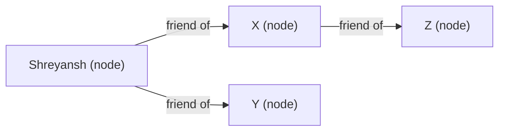

# SQL vs NoSQL

## Overview
- Answers the classic HLD-round question: "which DB will you use — SQL or NoSQL?"
- Saying "either works" or picking one without justifying *why* is a weak answer in an interview.
- Compares SQL vs NoSQL across four angles — structure, nature, scalability, property — then gives concrete criteria for choosing one.
- Scope is DB *selection* reasoning, not a full SQL/NoSQL tutorial.

## Key Concepts

### SQL
- SQL = Structured Query Language, used to query a Relational Database Management System (RDBMS).
- Structure — data lives in tables (rows + columns), with relations (foreign keys) between tables (parent/child).
- Structure requires a **predetermined schema** — column names, types, lengths must be defined before you insert any data or run queries.
- Nature — **concentrated/centralized**: for a given entity (e.g. one employee), all of that entity's data across all tables lives on one server. Not split across servers by table or by column.
- Scalability — scales **vertically** (bigger RAM, more storage on one machine) far more naturally than horizontally; horizontal sharding (by row or column) is possible but not well-supported by SQL.
- Property — follows **ACID**: Atomicity, Consistency, Isolation, Durability. Core purpose of ACID is guaranteeing data integrity/consistency after every transaction.

### NoSQL
- NoSQL = non-relational / "not only SQL". Four structural sub-types:
- **Key-value DB** — key maps to an opaque value (string, int, JSON). You can only query/search by key, never by value contents → very fast lookups. Example: DynamoDB.
- **Document DB** — also key → value (JSON/XML), but unlike key-value DBs you *can* query on fields inside the value, not just the key. Example: MongoDB.
- **Column-wise DB** — key maps to a dynamic list of (column, value) pairs. Different keys ("rows") can have different numbers/sets of columns — no fixed schema across rows.
- **Graph DB** — data stored as nodes and edges, where edges encode relationships directly (e.g. "Shreyansh — friend of — X"). Used for social networks and recommendation engines, since finding related entities is a direct edge traversal instead of a full-table scan/join like in SQL.
- Nature — **distributed**: data for one logical dataset (e.g. a users table) is spread across many nodes/servers by design, not concentrated on one.
- Scalability — scales **horizontally**: add more nodes and spread the growing dataset across them, instead of growing one machine.
- Property — follows **BASE**, not ACID:
  - **B**asically **A**vailable — data is replicated across distributed nodes, so the system stays available even if one node is down.
  - **S**afe state — a node's data can change state (sync to the latest value) even without a direct user interaction, e.g. nodes reconciling via vector clocks during replication.
  - **E**ventual consistency — a read might return stale data, but if nodes are allowed to sync, a later read eventually returns the latest value.

## Trade-offs / Comparisons
| Angle | SQL | NoSQL |
|---|---|---|
| Structure | Tables, rows, columns, relations; predetermined schema | Key-value / document / column-wise / graph; flexible or no fixed schema |
| Nature | Concentrated — one entity's full data lives on one server | Distributed — data spread across many nodes |
| Scalability | Vertical (bigger machine); horizontal sharding poorly supported | Horizontal (add more nodes) — natural fit |
| Property | ACID — strict consistency, no lost transactions | BASE — basically available, safe state, eventual consistency |
| Query capability | Flexible — complex multi-table joins, ad-hoc queries | Mostly basic key-based lookups (except document DBs, which allow field queries) |
| Relations | Native (foreign keys, joins) | Not well suited for relational/hierarchical data (graph DB is the exception) |

### When to use which
- Need **flexible, complex queries** (joins across tables, query needs may change over time) → SQL. NoSQL only supports basic/known-in-advance search patterns.
- Data is **relational** with real parent-child dependencies/hierarchy → SQL.
- **Data integrity is non-negotiable** (can't lose a transaction or serve stale data) — e.g. financial systems → SQL (ACID). NoSQL is built for huge, fast-changing datasets where losing/staling one record among billions is tolerable.
- Need **high availability + high read/search performance** and can tolerate **some inconsistency** (stale reads okay) → NoSQL.

## Diagram

- Graph DB: relationships are stored as direct edges, so finding "friends of Shreyansh" is a direct traversal — no full scan/join like SQL's primary-key/foreign-key lookup requires.

## Interview Q&A

An interviewer asks "SQL or NoSQL?" — what's a weak answer, and what makes a strong one?

Weak: "either works" or picking one with no justification. Strong: pick one and justify it using concrete criteria — query flexibility needed, whether data is relational, whether strict consistency (ACID) is required, and availability/performance needs.

What's the core structural difference between SQL and NoSQL?

SQL stores data in tables with rows/columns and a predetermined schema defined before any data is inserted. NoSQL has no single fixed structure — it can be key-value, document, column-wise, or graph, and schemas can be flexible or vary per record.

Why is SQL described as "concentrated" and NoSQL as "distributed" in nature?

In SQL, all of one entity's data (across all its tables) lives on a single server. In NoSQL, data for a dataset is deliberately spread across many nodes — e.g. half a users table's records might live on one node, the other half on another.

Why does SQL scale vertically while NoSQL scales horizontally?

SQL's centralized, relational structure doesn't support sharding rows/columns across servers well, so you grow one machine's RAM/storage instead. NoSQL's distributed nature is built to add more nodes and spread data across them as it grows.

What does ACID guarantee, and why doesn't NoSQL follow it?

ACID (Atomicity, Consistency, Isolation, Durability) guarantees full data integrity and consistency after every transaction — critical for systems like financial institutions. NoSQL follows BASE instead, because it's built for huge, fast-changing datasets where occasionally losing/staling one record among billions has negligible impact, in exchange for availability and performance.

What do the three letters of BASE mean?

Basically Available — replication across distributed nodes keeps the system serving requests even if a node is down. Safe state — a node's data can change (sync to latest) without any direct user interaction, via node-to-node reconciliation. Eventual consistency — a read may return stale data, but repeated reads eventually return the latest value once nodes sync.

What's the difference between a key-value DB and a document DB?

Both map a key to a value that can be JSON. But a key-value DB treats the value as opaque — you can only query by key, not by fields inside the value (e.g. DynamoDB). A document DB lets you query on fields inside the value itself, not just the key (e.g. MongoDB).

Why is a graph DB well suited to social networks or recommendation engines?

Relationships are stored directly as edges between nodes, so finding related entities (e.g. "friends of X") is a direct traversal to the connected node. SQL would need a primary-key/foreign-key join and effectively scan rows to find the same relationship, which is slower.

## Related Topics
- [09. Design a Key-Value Store](09-key-value-store-dynamodb.md) — DynamoDB as a key-value NoSQL DB; vector clocks and replication referenced here for BASE's "safe state"
- [02. CAP Theorem](02-cap-theorem.md) — ties into NoSQL's eventual consistency / availability trade-off
