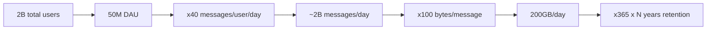
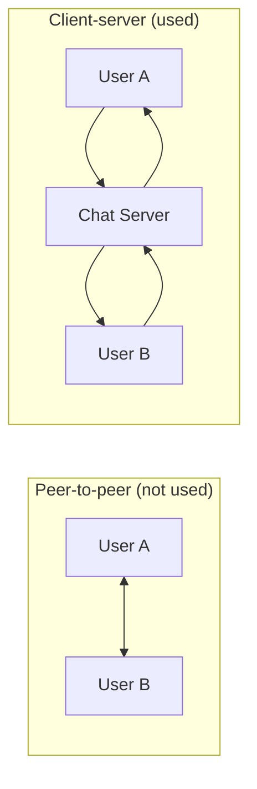
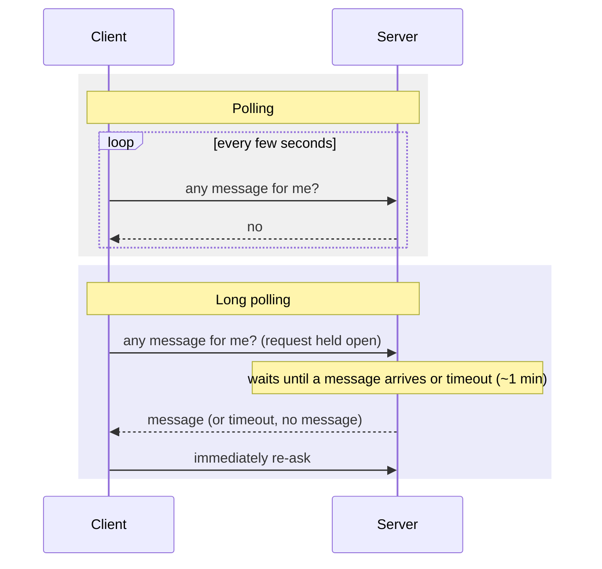
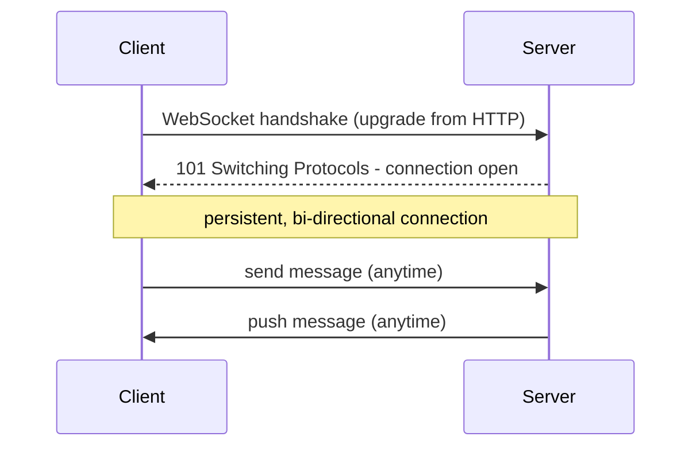
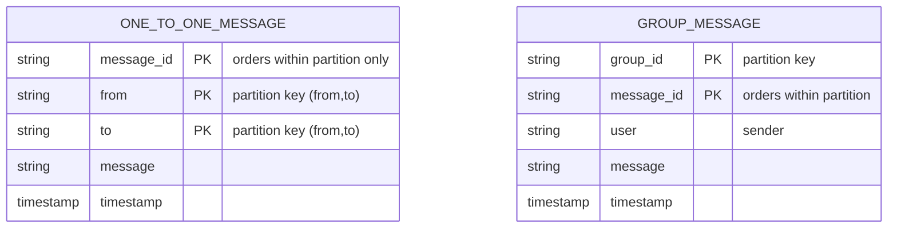
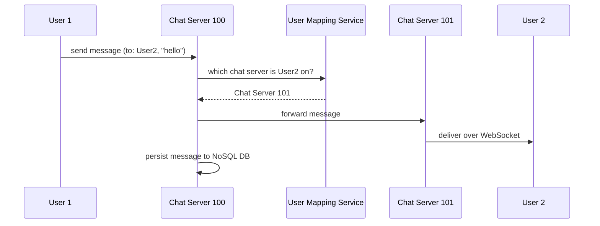
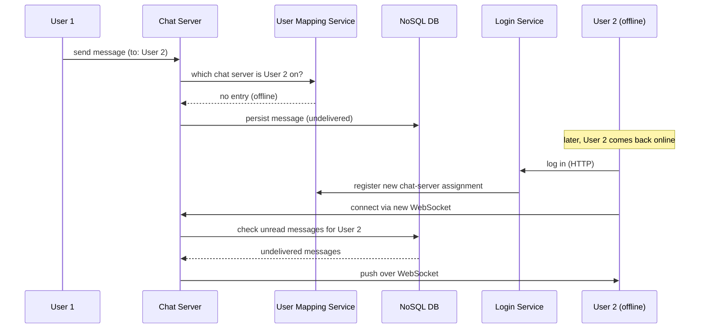
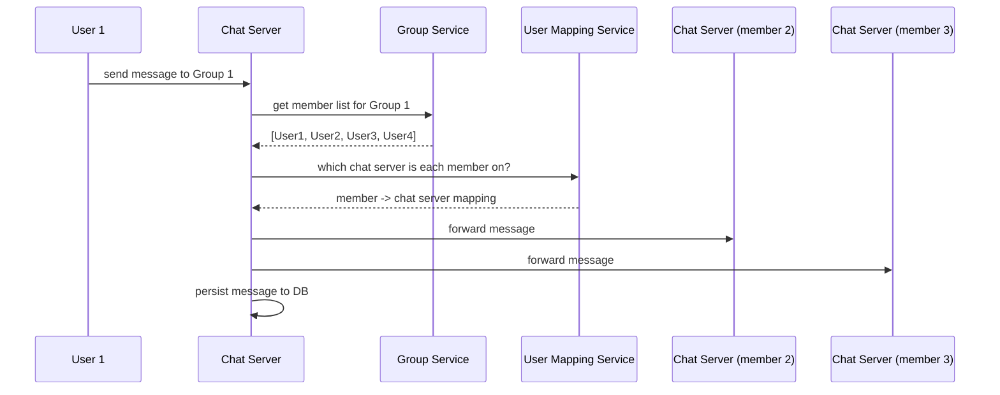
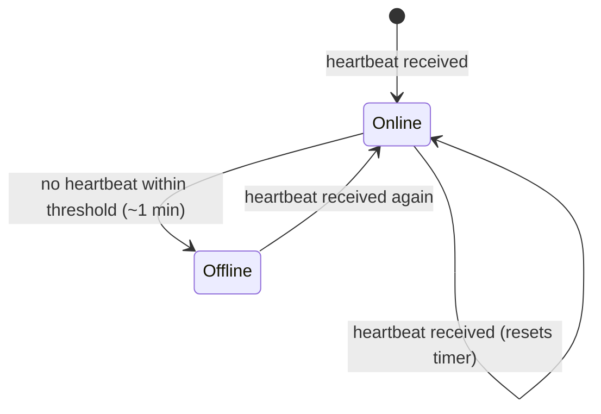
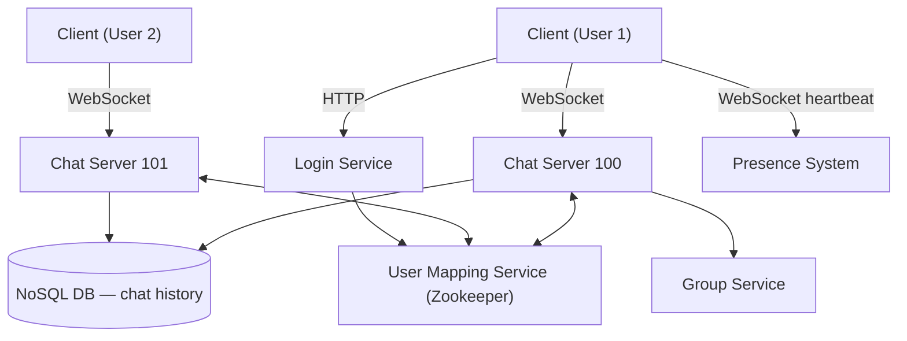

# WhatsApp / Chat Application System Design

## Overview
- Design a chat application (WhatsApp, Discord, Telegram, Slack, FB Messenger) — a very common HLD interview question.
- Walks the full flow: requirement gathering → back-of-the-envelope → protocol choice (why WebSocket) → core architecture (chat server, user mapping/Zookeeper, DB) → 1:1 flow, offline flow, group flow → presence (online/offline/last-seen).
- Builds directly on earlier notes: [08. Back-of-the-Envelope Estimation](08-back-of-envelope-estimation.md), [09. Design a Key-Value Store](09-key-value-store-dynamodb.md) (Zookeeper, partitioning), [10. SQL vs NoSQL](10-sql-vs-nosql.md) (DB choice reasoning).

## Key Concepts

### Requirement gathering
- Functional (the MVP — without these it isn't a chat app):
  - 1:1 send/receive message (scope to text first; images/files are a simple extension later).
  - Group message support — create group, add members, send/receive in group.
  - Last seen / online-offline status.
  - User login/authentication.
- Non-functional (second priority, "good to have" on top of the core product):
  - Scalability — must handle huge traffic (millions/billions of messages per day).
  - Low latency — near real-time send/receive.
  - Availability — service should stay up.

### Back-of-the-envelope estimation
- Assume 2B total users, 50M DAU (daily active users).
- Assume each user sends ~10 messages to ~4 people/day → 40 messages/user/day.
- Messages/day = 50M × 40 ≈ 2B messages/day.
- Assume 100 chars/message ≈ 100 bytes → storage/day = 2B × 100B = 200GB/day.
- For N years of chat history retention: 200GB × 365 × N (WhatsApp itself doesn't retain server-side history; Discord/Telegram/Slack/FB Messenger do).

### Why not peer-to-peer
- Two users could in theory talk directly if each knows the other's IP (peer-to-peer) — but this doesn't scale and can't support chat history, groups, or offline delivery.
- Real chat apps use a **client-server architecture**: users never talk directly, everything routes through a chat server, which is responsible for scalability, grouping, chat history, and availability.

### Why WebSocket, not plain HTTP
- HTTP is request-response: client always initiates, server only replies to that specific request. Fine for **sending** a message (client-initiated), but broken for **receiving** — the server would need to initiate a push to the client, which HTTP doesn't support.
- Three ways to handle server→client delivery:
  - **Polling** — client repeatedly asks "any message for me?"; server replies immediately (usually "no"), connection closes, client asks again shortly after. Wastes resources on constant connect/reply/disconnect cycles for a mostly-"no" answer — not scalable.
  - **Long polling ("pushing")** — client asks, but the server holds the request open (doesn't reply) until either a message arrives or a threshold (e.g. 1 minute) elapses, then replies and the client immediately re-asks. Fewer round trips than polling, but still blocks a server-side thread/connection per waiting client — not scalable at chat-app volume.
  - **WebSocket** — a bi-directional, persistent connection. One handshake establishes it; after that both client and server can send messages on the same open connection at any time, with no request/response pairing needed. Connection stays open until explicitly closed or the network drops.
- WebSocket solves both directions, so the chat server uses WebSocket (not HTTP) for the client connection — for both sending and receiving.

### Core components
- **Chat servers** — many instances (CS1, CS2, ...); each client maintains a persistent WebSocket connection to exactly one chat server.
- **User Mapping Service** (a Zookeeper-backed coordinator, same role as in [09. Key-Value Store](09-key-value-store-dynamodb.md)) — maintains a live table of `user → which chat server they're currently connected to`.
  - When a client comes online, the mapping service assigns it a chat server (e.g. nearest by geography) and records the mapping.
  - When a client's connection drops (or the chat server goes down), that entry is removed.
  - Other chat servers query this service to find where to route a message for a given recipient.
- **DB layer** — chosen as NoSQL (reasoning below), stores chat history for reads (open a chat, scroll history, search) and persists messages so they survive server restarts / offline recipients.

### Choosing the database: SQL vs NoSQL
- Apply the same lens as [10. SQL vs NoSQL](10-sql-vs-nosql.md): look at the actual read/write operations first.
- Reads: a user's 1:1 chat history, a group's chat history, group member details, user profile — no complex multi-table joins needed.
- Writes: send message, update profile picture — simple writes.
- Two hints point to NoSQL: (1) no complex joins in the query patterns, and (2) need low-latency search across a huge, ever-growing dataset (billions of messages/day, searching years of history) plus high availability and horizontal scalability — NoSQL's core strengths.
- Real-world precedent: Discord and Facebook-scale chat systems use Cassandra (a **column-wise** NoSQL DB, one of the [4 NoSQL structural types](10-sql-vs-nosql.md)).

### Data modeling for 1:1 and group messages (NoSQL)
- 1:1 message table: `message_id, from, to, message, timestamp`.
  - Partition key = `(from, to)` pair — routes a given conversation consistently to one partition/node (horizontal sharding across nodes, per [06. Consistent Hashing](06-consistent-hashing.md)).
  - `message_id` is used only for **ordering within a partition** (a conversation), not as a global ID — NoSQL has no built-in auto-increment. Generate it from a timestamp or a local (per-partition) ID generator; no need for a global ID generator (e.g. Snowflake) since IDs only need to be unique/ordered *within* their own partition, and the same ID value can legitimately repeat across different partitions.
- Group message table: `group_id, user (sender), message, timestamp, message_id`.
  - Partition key = `group_id` — all of a group's messages land in the same partition for ordering; `message_id` again provides in-partition sequencing.

### 1:1 send flow (happy path — both users online)
- User 1 (connected to Chat Server 100 via WebSocket) sends "send message to User 2: hello".
- Chat Server 100 asks the User Mapping Service which chat server User 2 is connected to (e.g. Chat Server 101).
- Chat Server 100 forwards the message to Chat Server 101, which delivers it to User 2 over User 2's WebSocket connection.
- The message is also written to the DB (chat history) in parallel.

### Offline delivery flow
- If User 2's chat server is down or their connection drops, the User Mapping Service has no entry for User 2 (offline).
- Sender's message still gets persisted to the DB, but cannot be pushed live.
- When User 2 comes back online, they go through a **login system** (plain HTTP), which registers a new chat-server assignment with the User Mapping Service.
- Once connected to its newly assigned chat server, that server checks the NoSQL DB for any unread/undelivered messages for User 2 and pushes them over the fresh WebSocket connection.

### Group message flow
- A **Group Service** (separate from chat servers) owns group management — create/delete/update group, add/remove members — and can use its own DB (SQL or NoSQL, no hard requirement either way).
- When User 1 sends a message to a group, the receiving chat server asks the Group Service for the group's member list, then asks the User Mapping Service which chat server each member is connected to, and forwards the message to each of those chat servers for delivery.

### Presence system (online/offline, last seen)
- A separate **Presence System**, also connected to clients via WebSocket.
- Each client sends a periodic **heartbeat** (e.g. every few seconds); the presence system records the last-heartbeat time per user.
- If no heartbeat is received within a threshold (e.g. 1 minute), the user is marked offline (with a last-heartbeat/last-seen timestamp).
- Why not just reuse the User Mapping/Zookeeper table for this? A momentary connection blip (e.g. a train going through a tunnel) would otherwise cause the status to flicker online/offline/online repeatedly every couple of seconds — poor UX. The heartbeat threshold smooths that out so brief drops don't surface as an offline blip.

## Trade-offs / Comparisons
| Approach | Mechanism | Scalability |
|---|---|---|
| Polling | Client repeatedly asks, connection opens/closes each time, mostly answered "no" | Not scalable — wasted connections/round trips |
| Long polling | Server holds the request open until data or a timeout, then client re-asks | Better than polling, but still blocks a server thread/connection per waiting client — not scalable at chat-app volume |
| WebSocket | One persistent, bi-directional connection; either side can send anytime | Scalable — used for the actual chat server connection |

| DB choice signal | Points to |
|---|---|
| No complex joins in query patterns | NoSQL |
| Need low-latency search across huge, growing datasets | NoSQL |
| Need high availability + horizontal scale | NoSQL |
| (Contrast) strict cross-entity consistency / relational joins needed | Would point to SQL — not the case here |

## Example / Walkthrough
- 2B total users, 50M DAU, 40 messages/user/day → ~2B messages/day, ~200GB/day raw text storage, scaled by retention years for total storage.
- 1:1 happy path: User 1 (CS100) → User Mapping Service resolves User 2 → CS101 → delivered over WebSocket + persisted to NoSQL DB.
- Offline case: User 1 → CS100 → User Mapping Service has no entry for User 2 → message persisted only → User 2 logs back in → login system registers with User Mapping Service → new chat server (CS3) checks NoSQL DB for unread messages → pushes them.
- Group case: User 1 sends to Group 1 (members: User 1–4) → chat server queries Group Service for member list → queries User Mapping Service for each member's chat server → forwards message to each for delivery.
- NoSQL partitioning: 1:1 messages partitioned by `(from, to)`; group messages partitioned by `group_id`; `message_id` (timestamp- or local-ID-based) orders messages within a partition only.

## Diagram

## Interview Q&A

Why can't two chat users just talk peer-to-peer?

It doesn't scale to millions of users and can't support chat history, group messaging, or offline delivery, so a client-server architecture is used instead — a chat server sits between all users.

Why is plain HTTP insufficient for receiving messages in a chat app?

HTTP is request-response and only the client can initiate a request — the server can't push to the client on its own. Sending a message fits this (client-initiated), but receiving requires the server to push, which plain HTTP can't do.

Compare polling, long polling, and WebSocket for message delivery.

Polling repeatedly opens a connection, asks, gets mostly "no", and closes — wasteful and not scalable. Long polling holds the request open until there's data or a timeout, reducing round trips but still tying up a server-side connection per waiting client. WebSocket opens one persistent, bi-directional connection so either side can send at any time with no repeated handshakes — this is what real chat servers use.

What is the User Mapping Service and why is it needed?

A Zookeeper-backed service that tracks which chat server each currently-connected user is attached to. When Chat Server A needs to deliver a message to a user connected elsewhere, it queries this service to find the right chat server to forward to. Entries are added on connect/login and removed when a connection drops.

Why choose NoSQL over SQL for the chat message store?

The actual read/write patterns (chat history reads, member list reads, send-message writes) don't need complex multi-table joins, and the system needs low-latency search over a huge, constantly growing dataset plus high availability and horizontal scalability — all NoSQL strengths. Real systems like Discord/Facebook-scale chat use Cassandra (column-wise NoSQL) for this reason.

How is message ordering maintained in a NoSQL, horizontally-partitioned message store, without a global auto-increment ID?

Partition key (e.g. the `(from,to)` pair for 1:1, or `group_id` for groups) routes each conversation's messages to the same partition/node. Ordering only needs to hold within that partition, so a timestamp-based or local (per-partition) ID generator is enough — no need for a globally unique ID generator like Snowflake, since the same message_id value can validly repeat across different partitions.

How does message delivery work when the recipient is offline?

The User Mapping Service has no chat-server entry for an offline user, so the sender's message is only persisted to the DB — not pushed live. When the recipient logs back in, the login system re-registers them with the User Mapping Service and assigns a chat server, which then checks the DB for undelivered messages and pushes them over the newly opened WebSocket connection.

Why maintain a separate Presence System instead of reusing the User Mapping Service's connection table for online/offline status?

The mapping table reflects raw connection state, which can flicker rapidly during brief network interruptions (e.g. a tunnel), causing an unpleasant online/offline/online flapping UX. The Presence System uses periodic client heartbeats and only marks a user offline after a threshold with no heartbeat, smoothing out brief drops.

## Related Topics
- [08. Back-of-the-Envelope Estimation](08-back-of-envelope-estimation.md) — traffic/storage math method used here
- [09. Design a Key-Value Store](09-key-value-store-dynamodb.md) — Zookeeper's coordinator role, partitioning
- [10. SQL vs NoSQL](10-sql-vs-nosql.md) — DB-choice reasoning applied to the chat message store
- [06. Consistent Hashing](06-consistent-hashing.md) — horizontal sharding of message data across nodes
