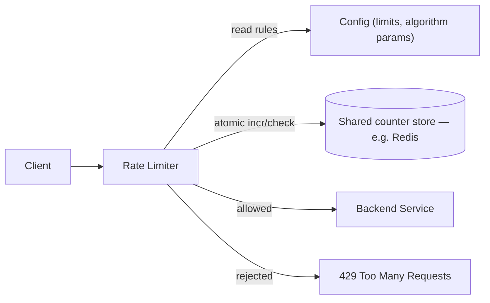

# Design a Rate Limiter

## Overview
- A very common HLD interview question — "design an API rate limiter."
- Problem it solves: a malicious/bot client can flood an API with requests (DoS-style abuse); without a limiter, genuine users' requests get starved/declined because the backend is overwhelmed by the abusive traffic.
- A rate limiter caps how many requests a client (per user/IP/API key) can make in a given time window, rejecting the excess so backend capacity stays available for legitimate traffic.
- Covers 5 rate-limiting algorithms (Token Bucket, Leaking Bucket, Fixed Window Counter, Sliding Window Log, Sliding Window Counter) plus the surrounding system design (config, shared counter store, atomicity under concurrency).

## Key Concepts

### Token Bucket
- A bucket has a fixed **capacity** — the max number of tokens it can hold (e.g. capacity = 4).
- A **refill worker** adds tokens back at a fixed interval (e.g. +2 tokens every 1 minute), driven by a config file so limits/refill rate can be tuned without redeploying the service.
- Each incoming request consumes one token from the bucket; if a token is available, the request is allowed and the counter decrements; if the bucket is empty, the request is rejected.
- If a refill would push the token count above capacity, the extra tokens simply **overflow** (are discarded) — the bucket never exceeds capacity.
- Naturally supports short bursts (up to the full bucket capacity can be spent instantly) while still enforcing a long-run average rate via refills.

### Leaking Bucket
- Simple: incoming requests fill a fixed-capacity bucket (a queue); the bucket "leaks" (processes) requests out at a **constant, fixed rate**, regardless of how fast they came in.
- If the bucket is already full when a new request arrives, that request is dropped.
- Advantage: smooths bursty input into a strictly constant output rate — useful when downstream processing needs a steady load (e.g. Amazon Prime doing constant-cost background processing where daytime traffic is lower than evening/night, so a steady drain rate is an acceptable trade).
- Disadvantage: a burst of legitimate traffic can't be served faster even if the system has spare capacity, since the outflow rate is fixed no matter what.

### Fixed Window Counter
- Divide time into fixed-size windows (e.g. 5-minute windows); each window has its own request counter, reset to 0 at the start of each new window.
- Each request increments the counter for the current window; once the counter hits the configured limit, further requests in that window are rejected.
- Simple to implement, but has a **boundary problem**: since the counter resets sharply at each window edge, a client can send the full limit right at the end of one window and again right at the start of the next — allowing up to 2× the intended limit within a short real time-span that straddles the boundary.

### Sliding Window Log
- Fixes the fixed-window boundary problem by tracking an actual rolling window instead of discrete resets.
- Maintains a **log of timestamps** — one entry per request — for each client, over the trailing window (e.g. last 1 minute).
- On a new request: drop any logged timestamps older than the window, then check if the remaining count is under the limit; if yes, allow and log the new timestamp, else reject.
- Accurate (no boundary problem) but expensive — storing a timestamp per request (including many that get rejected) consumes significant memory at scale.

### Sliding Window Counter
- A hybrid of Fixed Window Counter and Sliding Window Log — approximates a true sliding window without storing every request's timestamp.
- Keeps a simple counter per fixed window (like Fixed Window Counter), but when checking a new request, blends the current window's count with a **weighted portion of the previous window's count**, based on how much the rolling window overlaps into the previous fixed window.
- Formula: `estimated_count = current_window_count + previous_window_count × (overlap % of the rolling window into the previous window)`.
- Much cheaper than Sliding Window Log (just two counters, not a full timestamp log) while avoiding the sharp-boundary burst problem of Fixed Window Counter.

### System architecture
- **Client → Rate Limiter** — the rate limiter sits in front of (or as middleware/gateway before) the actual backend service; it decides allow/reject before the request reaches business logic.
- **Config** — the limiter reads its rules (limit per window, algorithm parameters) from a config file/service, so operators can change limits dynamically without redeploying.
- **Centralized data store (cache)** — request counters/tokens/timestamps are kept in a shared cache (e.g. Redis), not in each rate-limiter instance's local memory, because the rate limiter itself typically runs as multiple instances (horizontally scaled) — a local-only counter would let each instance independently allow up to the full limit, multiplying the effective limit by the instance count.
- **Atomicity under concurrency** — with multiple clients hitting the same counter in parallel (and multiple rate-limiter instances hitting the same shared store), the increment-and-check operation must be atomic (e.g. Redis `INCR` / a Lua script) — otherwise a race condition (two parallel requests both read the same "not yet at limit" count before either writes back) can let more requests through than the configured limit.
- Config values changing very infrequently means it's acceptable for each rate-limiter instance to cache the config locally and only refresh periodically — unlike the request counters, which must always hit the shared, consistent store.

## Trade-offs / Comparisons
| Algorithm | Handles bursts | Boundary-accurate | Memory cost | Notes |
|---|---|---|---|---|
| Token Bucket | Yes (up to bucket capacity) | Yes | Low (one counter) | Good general-purpose default; refill rate + capacity both tunable |
| Leaking Bucket | No — strictly constant output rate | Yes | Low (queue length) | Best when downstream needs a steady, predictable load |
| Fixed Window Counter | Can burst 2× at window edges | No — boundary problem | Very low (one counter/window) | Simplest, but least accurate |
| Sliding Window Log | Yes, precisely | Yes | High — one timestamp per request | Most accurate, most memory-expensive |
| Sliding Window Counter | Approximately | Approximately (weighted estimate) | Low (two counters) | Good accuracy/cost trade-off — practical middle ground |

## Example / Walkthrough
- **Token Bucket**: capacity 4, refill +2 tokens every 1 minute. A request arrives and consumes a token (4→3). After 1 minute the refill worker adds 2 tokens; if the bucket already has 3, only 1 more fits (3→4) and the other refill token overflows/is discarded since capacity is 4.
- **Fixed Window Counter boundary problem**: limit = 3 requests per 1-minute window. If a client sends 3 requests in the last few seconds of minute N and another 3 in the first few seconds of minute N+1, all 6 are allowed (3 per window, each window's counter independently under the limit) even though only ~seconds of real time separated them — well above the intended "3 per minute" rate.
- **Sliding Window Counter**: 1-minute windows, limit 5/minute. Previous window had 10 requests total, spread across its 60 seconds; current window's rolling boundary overlaps ~1/6 (10 seconds) into the previous window, so the estimated count contributes `10 × (10/60) ≈ 1.7` from the previous window, added to however many requests have landed in the current window so far, to decide allow/reject against the limit of 5.

## Diagram

## Interview Q&A

What problem does a rate limiter solve?

It prevents a client (malicious or misbehaving) from flooding an API with excessive requests, which would otherwise exhaust backend capacity and cause genuine users' requests to get declined — a DoS-like effect.

How does the Token Bucket algorithm work?

A bucket holds up to a fixed capacity of tokens; each request consumes one token (rejected if none available), and a refill worker adds tokens back at a fixed interval, discarding any refill that would exceed capacity.

What's the difference between Token Bucket and Leaking Bucket?

Token Bucket allows bursts up to the bucket's capacity since tokens can be spent all at once. Leaking Bucket enforces a strictly constant outflow rate regardless of burst size — incoming requests queue up and drain at a fixed rate, with excess dropped once the queue is full.

What's the boundary problem with Fixed Window Counter, and which algorithms fix it?

Because the counter resets sharply at each window edge, a client can send the full limit at the very end of one window and again at the start of the next, allowing up to 2× the intended rate within a short real time span. Sliding Window Log and Sliding Window Counter both fix this by tracking a true rolling window instead of hard resets.

Why is Sliding Window Log accurate but expensive, and how does Sliding Window Counter improve on it?

Sliding Window Log stores a timestamp per request within the rolling window, which is precise but memory-heavy at scale. Sliding Window Counter approximates the same rolling-window behavior using just two counters (current + previous fixed window) combined with a weighted overlap formula, trading a bit of precision for much lower memory cost.

Why can't each rate-limiter instance keep its own local counter in a horizontally scaled deployment?

If each instance tracked counts locally, a client's traffic split across N instances could get up to N× the intended limit, since no single instance would see the full request count. A centralized shared store (e.g. Redis) is needed so all instances enforce the same global counter.

Why does the shared counter store need atomic operations?

Under concurrent requests (including from multiple rate-limiter instances), a non-atomic read-then-write on the counter creates a race condition — two requests can both read the count as "under limit" before either writes back the increment, letting more requests through than allowed. Atomic operations (e.g. Redis `INCR`, or a Lua script for check+increment) close this race.

## Related Topics
- [10. SQL vs NoSQL](10-sql-vs-nosql.md) — the shared counter store here is typically a fast key-value cache (Redis), same category as key-value NoSQL stores
- [11. WhatsApp / Chat Application Design](11-whatsapp-system-design.md) — another system relying on a centralized, low-latency shared store (User Mapping Service) that all instances must consult
