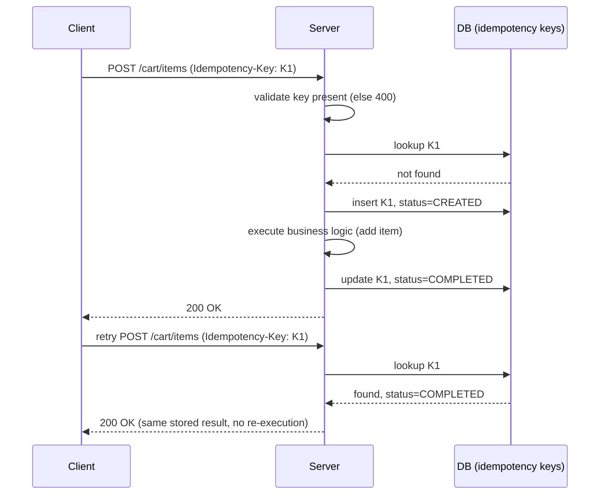

# Design Idempotent POST API

## Overview
- A very common HLD interview question — how to make a `POST` API idempotent so retries (network timeout, client re-click, double network send) don't create duplicate side effects.
- Idempotency ≠ concurrency — idempotency is about the *same logical request* being retried; concurrency is about *multiple different users* racing on the *same resource*. Don't conflate the two.
- `GET` is naturally idempotent (read-only, retry freely). `PUT` is naturally idempotent if it's a pure overwrite (setting a field to a fixed value twice has the same end state). `POST` is the problem — it creates a *new* resource each time by default, so a retried `POST` (e.g. "add item to cart", "charge payment", "create booking") must not create a second resource.
- Payments are the canonical example: retrying a debit/credit `POST` must never double-charge — the DB should end up with exactly one record per logical operation, no matter how many times the client retries.

## Key Concepts

### The idempotency key
- Client generates a unique key (e.g. UUID, optionally with the operation name and/or a timestamp appended for extra uniqueness) before making the request.
- Client sends this key in the request header on every attempt — including retries of the *same* logical request, so the key stays identical across retries.
- Server and client agree on this contract upfront: client always sets the idempotency key header; server always validates and enforces it.
- Server treats the key as the source of truth for "have I seen this exact request before?" — not the request body/timestamp, since two legitimately different requests can otherwise look similar (e.g. same user hitting "checkout" twice within a second from different browser tabs).

### Server-side request lifecycle
- **Validation** — first check the idempotency key header is present at all; if missing, reject with `HTTP 400` (validation error).
- **Lookup** — check whether the key already exists in the DB (an idempotency-key table storing key → status, e.g. `CREATED` / `COMPLETED`).
  - **Key not found** → this is a fresh/original request. Insert a new row for the key with status `CREATED`, then proceed to execute the actual business operation (e.g. add item to cart). On success, update the row's status to `COMPLETED` and return the result.
  - **Key found, status `COMPLETED`** → this is a duplicate of a request that already finished successfully. Don't redo the operation — just return the same success response (e.g. `HTTP 200`) with the already-stored result.
  - **Key found, status `CREATED` (still in progress)** → the original request for this key hasn't finished yet (still processing, or timed out on the client side but the server is still working). Reject the duplicate with `HTTP 409 Conflict` — "same request already in flight, don't retry yet."

### Handling parallel duplicate requests (race on the same key)
- Two identical requests (same idempotency key) can arrive at the server at almost the exact same time — e.g. a slow network causes the client to fire a duplicate before the first response comes back.
- Naive lookup-then-insert has a race: both requests check the DB, both see "key not present," both proceed to insert and execute — defeating the whole idempotency check.
- Fix: wrap the check-and-create step in a **critical section** using mutual exclusion (a mutex/lock scoped to the idempotency key) so only one request at a time can pass through the check-then-insert logic for a given key; the second one waits, then sees the key already exists and returns the appropriate response (`200` if completed, `409` if still processing).

### Scaling the lock across multiple servers
- With multiple rate-limiter/API server instances (horizontally scaled, possibly across clusters with separate local DBs), an in-process mutex only protects against races *within one server instance* — it doesn't stop two different server instances from racing on the same key.
- Fix: use a **centralized shared cache** (e.g. Redis) to hold the distributed lock, so all server instances synchronize against the same lock state regardless of which instance handles which request.

## Trade-offs / Comparisons
| Scenario | Server behavior | HTTP status |
|---|---|---|
| No idempotency key in header | Reject immediately | 400 (validation error) |
| Key not in DB (fresh request) | Create row (`CREATED`), execute, mark `COMPLETED` | 200 on success |
| Key in DB, status `COMPLETED` | Skip re-execution, return stored result | 200 |
| Key in DB, status `CREATED` (in progress) | Reject — original still running | 409 (conflict) |
| Two parallel requests, same key, race on check-then-insert | Serialize via mutex/distributed lock so only one executes | 200 for the one that proceeds, 200/409 for the other depending on timing |

## Example / Walkthrough
- **Cart add-item (POST)**: client clicks "add to cart," request times out on the client but the server is still processing. Client's UI shows failure and retries automatically. Both the original and retry carry the same idempotency key. Server's DB ends up with exactly one "item added" record — the retry either waits (409) or, if the original already finished, gets the same success response (200) without adding a second item.
- **Payment/balance update (POST)**: crediting/debiting a fixed amount (e.g. balance −10, +10) must not double-apply on retry — same idempotency-key mechanism ensures the DB has exactly one entry for that logical operation.
- **PUT contrast**: updating a user's display picture from "DJ" to "Shreyas" is naturally idempotent — retrying the same `PUT` just re-sets the same field to the same value, no duplicate side effect, so no special idempotency-key handling is needed for pure-overwrite `PUT`s.

## Diagram

## Interview Q&A

Why is POST the operation that needs an idempotency mechanism, but GET and PUT usually don't?

GET is read-only so retries have no side effects. PUT is typically a pure overwrite, so applying the same update twice leaves the same end state. POST creates a new resource by default, so a retried POST would create a second resource unless explicitly guarded.

What's the difference between idempotency and concurrency handling?

Idempotency handles retries of the *same* logical request (from the same client) so it isn't applied twice. Concurrency handles *different* requests/users racing to access or modify the *same* resource at the same time. They're separate problems solved with different mechanisms, though both can involve locking.

How does the server know a request is a duplicate?

The client generates a unique idempotency key (e.g. UUID, optionally plus operation name/timestamp) and sends it in the request header on every attempt, including retries. The server looks this key up in a store to decide whether it's seen this exact request before.

What does the server do if the idempotency key already exists but the original request is still processing?

It returns HTTP 409 Conflict — signaling that an identical request is already in flight and hasn't completed, so the caller shouldn't assume failure and shouldn't be served a duplicate execution.

What race condition can occur with two truly parallel duplicate requests, and how is it fixed?

Both requests can check the DB, both see the key as absent (since neither has inserted yet), and both proceed to execute — defeating the idempotency check. This is fixed by wrapping the check-then-insert step in a critical section (mutex) so only one request at a time can pass through it for a given key.

Why doesn't a simple in-process mutex work once the API is horizontally scaled across multiple servers?

A local mutex only serializes requests handled by the same server instance. Two duplicate requests could land on two different instances and still race. A centralized shared lock (e.g. via Redis) is needed so all instances synchronize against the same lock state.

What HTTP status codes come out of the idempotency handler, and what does each mean?

400 if the idempotency key header is missing (validation error); 200 if the request is new and succeeds, or if it's a duplicate of an already-completed request (returns the stored result); 409 if it's a duplicate of a request that's still in progress.

## Related Topics
- [12. Design a Rate Limiter](12-rate-limiter.md) — same pattern of a centralized shared store (Redis) with atomic check-and-update needed once the service is horizontally scaled
