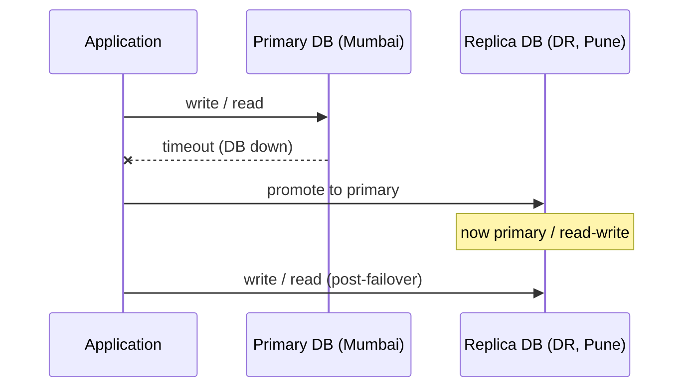
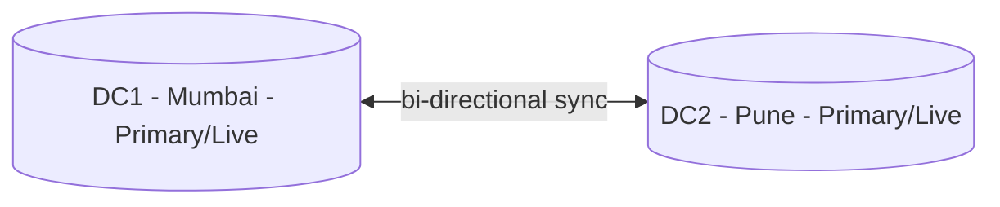
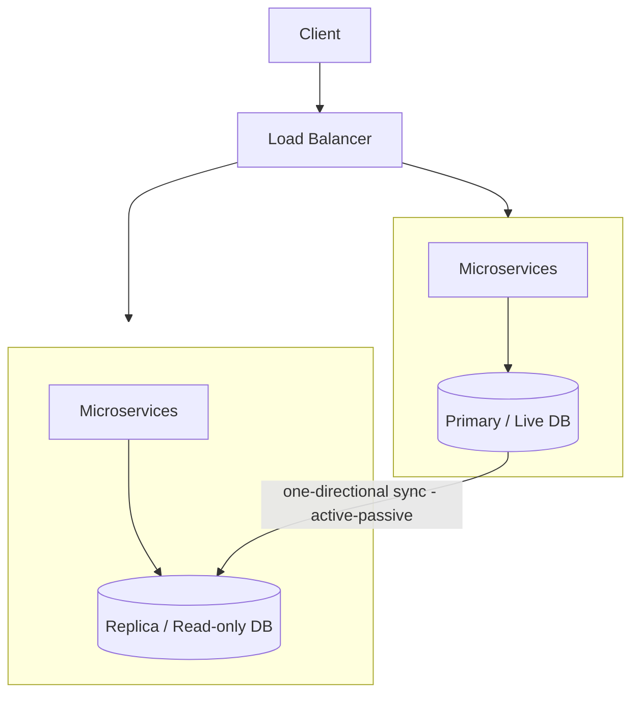

# Design High Availability & Resilience System

## Overview
- Another very common HLD interview question, asked under many phrasings: "design a high-availability architecture," "design a data-resilience architecture," "design for 99.999% (five nines) availability," "avoid single point of failure," or "active-passive vs active-active — what's the difference." All the same underlying question.
- Goal: design an architecture that stays available (five nines), survives failures, and has no single point of failure (SPOF).
- Two main multi-node strategies to get there: **active-passive** and **active-active** — differ in how many data centers can accept writes at once.

## Key Concepts

### Single-node architecture and its problem
- Flow: Client → Load Balancer → microservices layer (multiple apps, multiple instances each) → one primary DB.
- If that single DB goes down, both reads and writes fail — the whole application goes down.
- This is a textbook single point of failure: no five-nines availability, no resilience (no way to "come out of" the failure without manual/lengthy recovery, possibly hours or days).

### Active-Passive architecture
- Requires at least two data centers (e.g. one in Mumbai, one in Pune), each running the same microservices layer and its own DB.
- Only one DB is designated **primary** (aka live DB, read-write DB); the other is a **replica**, and its data center is called the **DR (Disaster Recovery) data center**.
- Reason only one can be primary: traditional relational DBs (Oracle, MySQL, Postgres) are **not multi-master** — they can only accept writes on one designated live/primary instance.
- Requests landing on the primary's data center are read and written directly there.
- Requests landing on the DR data center: writes get routed across to the primary DB (since only the primary accepts writes); reads can be served locally from the DR's replica DB (hence replica DBs are also called **read-only DBs**) — a small optimization so the DR DB isn't sitting completely idle.
- Sync is **one-directional**: primary → replicas.
- **Failover**: if the primary DB goes down, the application layer switches traffic to the DR data center's DB and promotes it to primary (read-write); once the original DB recovers, it's demoted back to replica/read-only. This is how active-passive avoids SPOF and achieves resilience.

### Active-Active architecture
- Requires DBs that **support multi-master** replication (e.g. Cassandra and most NoSQL stores) — more than one live/primary DB can exist and accept writes simultaneously. Traditional Oracle/MySQL/Postgres do not support this.
- Every data center's DB is primary/live; all of them can serve both reads and writes for requests routed to them.
- Sync is **bi-directional** between all data centers' DBs (vs. one-directional in active-passive).
- Whichever data center a request lands on (via the load balancer), that data center's own DB handles it fully — no cross-datacenter hop needed for writes, unlike active-passive.

## Trade-offs / Comparisons
| Aspect | Active-Passive | Active-Active |
|---|---|---|
| Writes accepted at | Only the primary DB | Every data center's DB (multi-master) |
| DB requirement | Works with traditional RDBMS (Oracle/MySQL/Postgres) | Requires multi-master-capable DB (Cassandra, most NoSQL) |
| Sync direction | One-directional (primary → replicas) | Bi-directional (all ↔ all) |
| Resource utilization | Poor — DR data center's DB mostly idle except for reads | Full — every data center actively serves reads and writes |
| Write scalability | Bottlenecked — all writes funnel to one primary | Scales — writes distributed across data centers |
| Cross-datacenter latency | Added latency when a request lands on DR but writes must reach the primary elsewhere | None for the write path — writes commit locally, though sync between DCs still happens async |
| Failover gap | Yes — a delay (e.g. ~10-15 min) exists between primary failure and DR promotion, during which writes fail | N/A for failover in the same sense, but... |
| Main complexity | Simple sync (one direction), but SPOF-adjacent failover delay | Sync/conflict resolution is genuinely hard — concurrent writes to the same row on different DCs conflict, and reads can race ahead of not-yet-propagated writes |

## Example / Walkthrough
- **Active-Passive latency example**: primary in Mumbai processes a request in ~1 second. A write request landing on the Pune DR data center must forward to Mumbai's primary, adding cross-region latency — total goes from ~1s to ~2s.
- **Active-Passive failover gap**: when the primary DB fails, promoting the DR replica to primary isn't instant — there's a real-world delay (illustratively ~10-15 minutes) during which writes (and possibly reads) to that data center fail until the switch completes.
- **Active-Active sync conflict**: the same row is updated in both Data Center 1's DB and Data Center 2's DB at nearly the same time; both try to replicate their change to the other, creating a write-write conflict that needs resolution.
- **Active-Active stale-read case**: a write commits in Data Center 1, but a read hits Data Center 2 before the bi-directional sync has propagated that write — the reader sees stale data.

## Diagram

## Interview Q&A

Why does a single-node architecture fail to provide high availability?

It has a single point of failure — the one DB. If it goes down, both reads and writes fail application-wide, and there's no automatic path to recover without manual intervention that could take hours or days.

What's the core difference between active-passive and active-active architectures?

Active-passive has exactly one primary/live DB that accepts writes, with other data centers holding read-only replicas synced one-directionally. Active-active has multiple primary/live DBs (multi-master) that all accept writes simultaneously, synced bi-directionally.

Why can't Oracle, MySQL, or Postgres run active-active out of the box?

They are not multi-master databases — they only support writes to a single designated primary/live instance. Multi-master writes require a DB engineered for it, like Cassandra or most NoSQL databases.

In active-passive, how are writes handled when a request lands on the DR data center?

The application layer in the DR data center forwards the write to the primary/live DB (in the other data center), since only the primary can accept writes. Reads, however, can be served locally from the DR's own replica (read-only) DB.

How does active-passive recover from a primary DB failure?

The application switches traffic to the DR data center and promotes its replica DB to primary (read-write). Once the original DB is restored, it's typically demoted back to replica. There's a real gap during the switch where writes to the failed side fail.

What are the disadvantages of active-passive architecture?

Latency add-on for any request routed to the DR data center (since writes must cross to the primary elsewhere), a failover gap where writes fail until the DR DB is promoted, and poor write scalability since all writes funnel through a single primary DB.

What's the biggest challenge in active-active architecture?

Bi-directional synchronization between multiple live DBs — concurrent writes to the same row on different data centers can conflict, and reads can race ahead of writes that haven't finished propagating yet. Conflict resolution and consistency here are genuinely complex.

What's the main advantage of active-active over active-passive?

Full resource utilization — every data center's DB actively serves both reads and writes instead of one DB sitting mostly idle. This also means active-active scales much better under heavy write load, since writes aren't bottlenecked on one primary.

## Related Topics
- [09. Design a Key-Value Store](09-key-value-store-dynamodb.md) — replication, quorum writes, and conflict resolution (vector clocks) are the same class of problem as active-active sync conflicts here
- [10. SQL vs NoSQL](10-sql-vs-nosql.md) — multi-master support (NoSQL/Cassandra) vs single-master RDBMS (Oracle/MySQL/Postgres) is a direct driver of active-passive vs active-active choice
