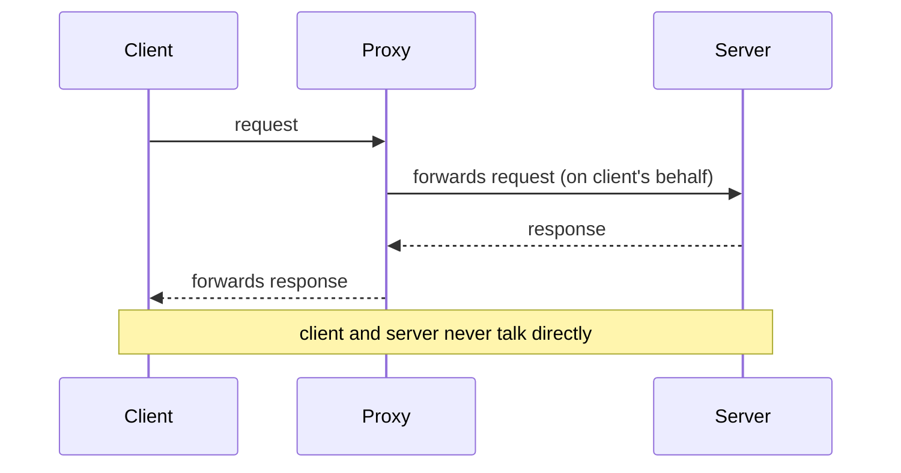
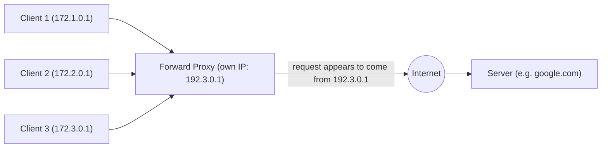
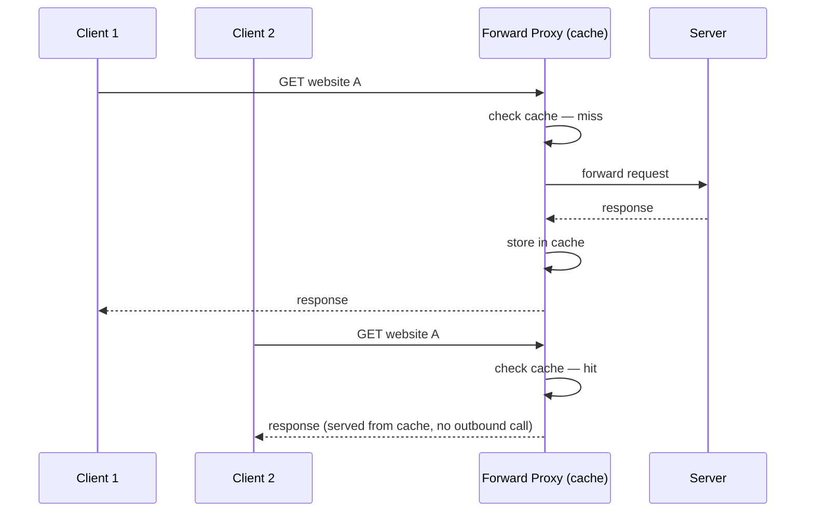
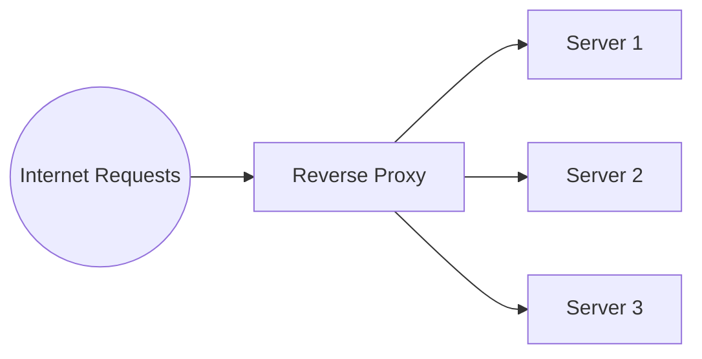
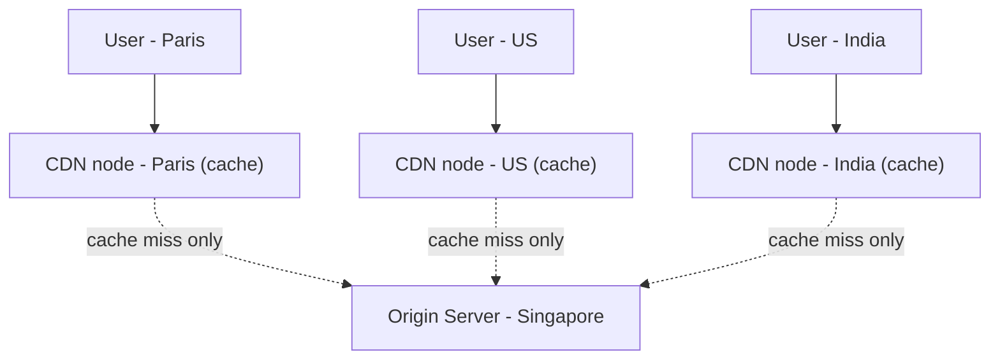
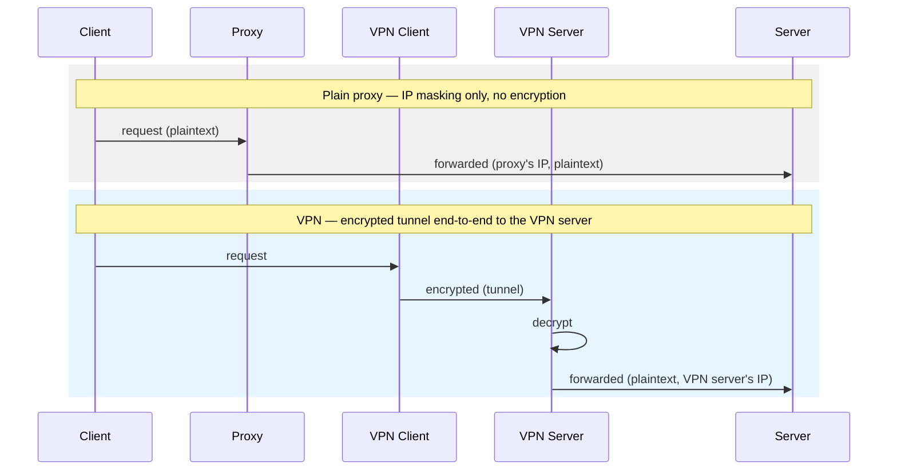
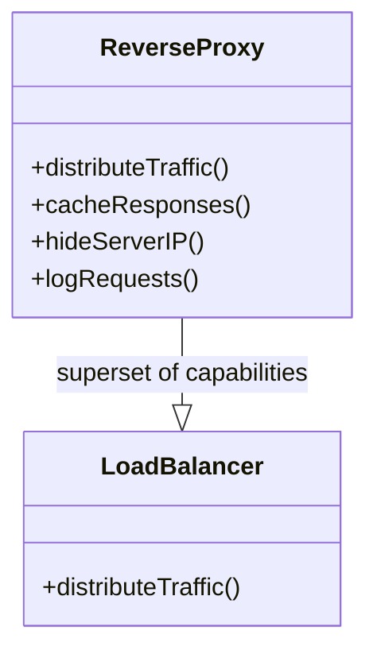
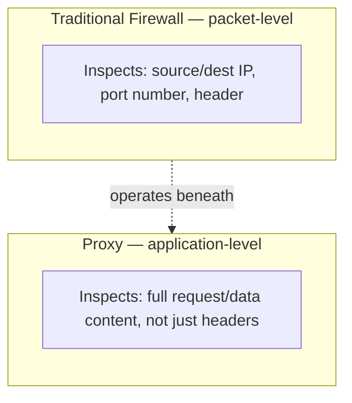
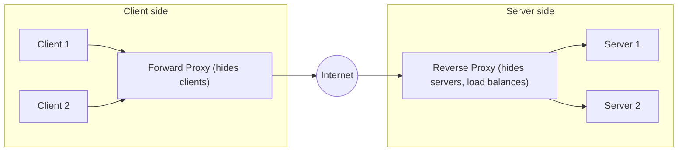

# Proxy vs Reverse Proxy

## Overview
- Proxy servers are a foundational HLD building block — CDNs, API gateways, and load balancers are all specific applications of the same core idea.
- A proxy sits between a client and a server and mediates the request — neither side talks to the other directly.
- Two directions: **forward proxy** (protects/represents the client) and **reverse proxy** (protects/represents the server) — the name tells you the direction.
- Learning this properly resolves three interview-favorite points of confusion: proxy vs VPN, proxy vs load balancer, proxy vs firewall.

## Key Concepts

### What is a proxy server
- Analogy: a child wants chocolate from a shop but doesn't go directly — it asks its mom, who goes to the shop and brings it back. Mom is acting as a proxy.
- Maps to client/server terms: child = client, shop = server, mom = proxy server sitting between them.
- A proxy can serve requests on behalf of more than one client (mom can have multiple kids, all going through her).
- Core property: all requests pass through the proxy — client and server never talk to each other directly.

### Forward proxy
- The "default" meaning when people just say "proxy" — sits in front of a client or group of clients (e.g. an intranet/personal network).
- Client → Forward Proxy → Internet → Server. The proxy makes the outbound request using its **own** IP address, not the client's.
- **Hides the client network** — the server only ever sees the proxy's IP, never the real client's IP or location.
- Five advantages this unlocks:
  - **Anonymity** — client IP/location is hidden from the server.
  - **Grouping requests** — near-identical requests from multiple clients can be batched into fewer outbound calls.
  - **Access to restricted content** — routing through a proxy in a different region can bypass geo/content restrictions.
  - **Security/access control** — rules can be enforced centrally (e.g. block `facebook.com` for all clients behind the proxy).
  - **Caching** — the proxy checks its own cache before going out to the server; repeat requests for the same content are served locally.
- Disadvantage: works at the **application layer**, not the packet level — a proxy has to be set up per-application (vs. a packet-level tool that works underneath all of them).

### Reverse proxy
- The mirror image of forward proxy — sits in front of a server or group of servers, not the client.
- Internet → Reverse Proxy → Server 1 / Server 2 / ... . No external request is allowed to reach a backend server directly.
- Advantages:
  - **Security** — the outside world only knows the reverse proxy's IP, never any backend server's IP; a DDoS attacker can only hit the reverse proxy, not the origin servers directly.
  - **Caching** — same mechanism as forward proxy, but caching server responses for many clients instead of caching for one client group.
  - **Latency reduction** — reverse proxies can be placed geographically close to users, so cached content is served from nearby instead of round-tripping to a distant origin server.
  - **Load balancing** — a reverse proxy in front of multiple servers can distribute incoming requests across them (this is the one capability a plain load balancer also has).

### CDN as a reverse proxy example
- A CDN (Content Delivery Network) is a well-known real-world application of a reverse proxy.
- Deploy CDN nodes geographically close to users (e.g. one in Paris, one in the US, one in India) in front of a single origin server (e.g. in Singapore).
- A local user's request hits their nearby CDN node first; if the content is cached there, it's served immediately — the origin server is only hit on a cache miss.
- Benefit: an attacker can only target a CDN edge node, never the origin server directly — plus lower latency for users near an edge node.

### Proxy vs VPN
- Both sit between a client and the outside world, but a plain proxy only masks IP address — it does **not** encrypt traffic.
- A VPN does more: a VPN client and VPN server together create an encrypted **tunnel** — the VPN client encrypts outgoing data, the VPN server decrypts it before forwarding to the destination server.
- Proxy capabilities: IP anonymity, caching, logging. VPN adds: encryption/decryption of the actual data in transit, protecting it from anyone snooping between client and VPN server.

### Reverse proxy vs Load Balancer
- A reverse proxy **can** act as a load balancer (that's one of its capabilities), but a load balancer **cannot** act as a full reverse proxy — it's missing anonymity, caching, and logging.
- A load balancer is only needed once there's more than one server. A reverse proxy can be useful even with a single server, purely for caching, anonymity, or logging.

### Proxy vs Firewall
- A traditional firewall works at the **packet level** (network/transport layer) — it inspects headers like source/destination IP and port number against defined rules to allow or block traffic.
- A proxy works at the **application layer** — it has access to the actual request/data content, not just packet headers, so its rules can be content-aware.
- Consequence of the layer difference: a firewall's rules apply broadly beneath all applications; a proxy has to be set up per-application.
- Modern "proxy firewalls" blur the line — they can block traffic like a traditional firewall does, but still operate at the application layer rather than the packet layer.

## Trade-offs / Comparisons
| Comparison | Key difference |
|---|---|
| Forward proxy vs Reverse proxy | Forward protects/represents the client (hides client from server); reverse protects/represents the server (hides server from client) |
| Proxy vs VPN | Proxy only masks IP (no encryption); VPN encrypts traffic end-to-end through a tunnel between VPN client and VPN server |
| Reverse proxy vs Load balancer | Reverse proxy is a superset — it can load balance, plus cache/anonymize/log; a plain load balancer only distributes traffic |
| Proxy vs Firewall | Firewall works on packets (IP/port, network/transport layer); proxy works on full requests (application layer), so it's set up per-application |

## Example / Walkthrough
- Forward proxy IP masking: client `172.1.0.1` requests `google.com` through a forward proxy whose own IP is `192.3.0.1` — the server only ever sees `192.3.0.1` as the requester, never the real client IP.
- Forward proxy caching: two different clients both request "website A" — the first request is a cache miss (proxy fetches from the server and stores it), the second is a cache hit (served directly from the proxy, no outbound call).
- CDN example: users in Paris, the US, and India each hit a local CDN node in front of an origin server in Singapore; each node serves from its own cache, only reaching the origin server on a miss — this both cuts latency and shields the origin from direct traffic (including attacks).
- VPN tunnel: a home computer connects to a VPN client app, which encrypts all outgoing traffic through a VPN tunnel to a VPN server, which decrypts it before forwarding to the destination — unlike a plain proxy, an attacker snooping the connection can't read the data in transit.

## Diagram

## Interview Q&A

What is a proxy server, in one sentence?

A server that sits between a client and a server, mediating every request so the two never communicate directly — acting on the client's behalf (or, for a reverse proxy, on the server's behalf).

What's the core difference between a forward proxy and a reverse proxy?

Direction of protection: a forward proxy sits in front of clients and hides them from the server; a reverse proxy sits in front of servers and hides them from the client/internet.

Name the advantages a forward proxy provides.

Anonymity (hides client IP), request grouping/batching, access to geo-restricted content, centralized security/access-control rules, and caching of responses for repeat requests.

Why is CDN considered a type of reverse proxy?

A CDN places edge nodes close to users, in front of an origin server — requests hit the nearby edge node first (served from cache if possible), and only reach the origin server on a cache miss, exactly matching the reverse-proxy pattern of shielding the real server from direct client access.

What's the difference between a proxy and a VPN?

A proxy only masks the client's IP address — it does not encrypt traffic. A VPN creates an encrypted tunnel between a VPN client and VPN server, so the actual data in transit is protected from eavesdropping, not just the IP address.

Can a load balancer replace a reverse proxy, or vice versa?

A reverse proxy can act as a load balancer (it's one of its capabilities), but a plain load balancer can't replace a full reverse proxy — it lacks caching, anonymity, and logging. A reverse proxy can also be useful with just one server, where a load balancer would serve no purpose.

How does a proxy differ from a traditional firewall?

A firewall inspects traffic at the packet level (source/destination IP, port number) and applies rules per packet, working beneath the application. A proxy operates at the application layer with access to the actual request content, but has to be configured per application rather than protecting everything underneath at once.

Why can attackers only target a reverse proxy/CDN edge node instead of the origin server directly?

Because the reverse proxy is the only IP address exposed to the internet — backend/origin servers are never directly reachable, so a DDoS attack lands on the reverse proxy layer (which typically has more resources/tooling to absorb it) rather than the origin server itself.

## Related Topics
- [05. Scale from Zero to a Million Users](05-scale-zero-to-million-users.md) — load balancer and CDN usage in a scaling architecture, both special cases of reverse proxy here
- [06. Consistent Hashing](06-consistent-hashing.md) — load balancing (one reverse-proxy capability) often relies on this for routing
