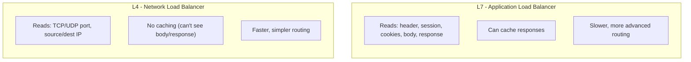
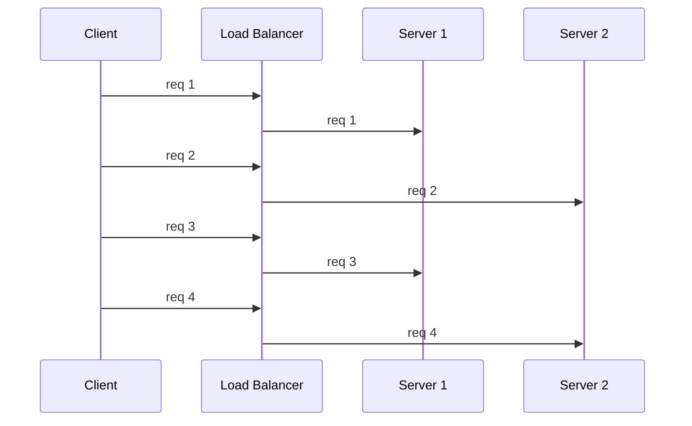
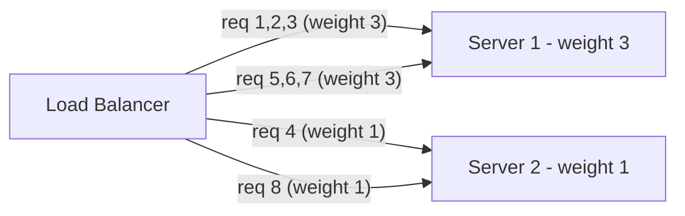
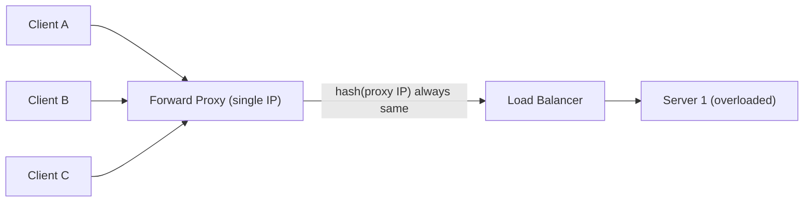
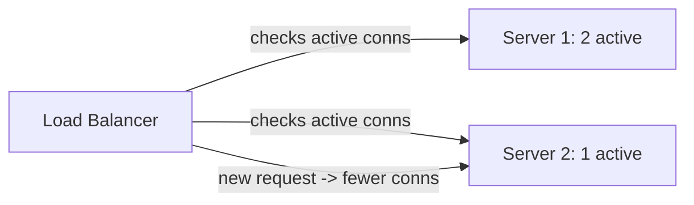
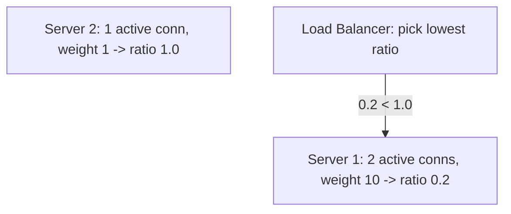
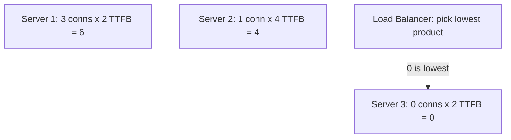
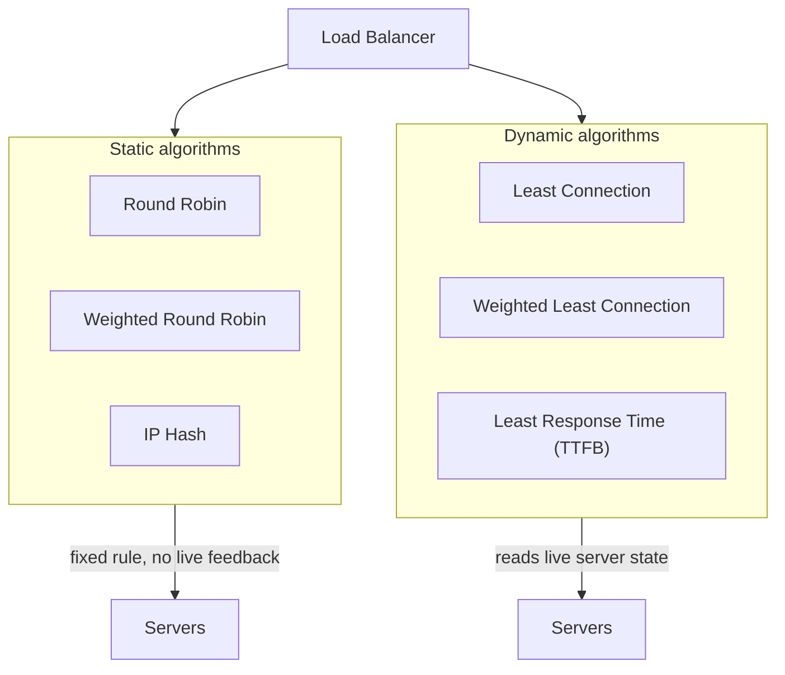

# Load Balancer & Load Balancing Algorithms

## Overview
- A load balancer sits between clients and multiple servers and distributes incoming traffic so no single server gets overloaded.
- Modern load balancers also do logging, caching, SSL termination etc., but traffic distribution is the original/core purpose.
- Two categories: **L4 (network)** and **L7 (application)** load balancers, named after the OSI layer they operate at.
- Distribution algorithms split into **static** (fixed rule, no runtime feedback) and **dynamic** (adapts to current server load).

## Key Concepts

### L4 vs L7 load balancer
- **L7 / Application load balancer** — works at the application layer (OSI layer 7).
  - Can read request **header, session, cookies, and body data** — and even the server's **response**.
  - Because it can read the response, it can also do **caching**.
  - More advanced (routing decisions based on rich request content) but slower than L4.
- **L4 / Network load balancer** — works at the transport layer (OSI layer 4).
  - Only sees **TCP/UDP port** and **source/destination IP address** — no visibility into headers or body.
  - Routes purely on that connection-level info — less advanced, but faster.
  - Most of the classic algorithms below (round robin, IP hash, least connection, etc.) are network-layer (L4) style algorithms.

### Static algorithm: Round Robin
- Requests are handed to servers in strict rotating order — server 1, server 2, server 1, server 2, ...
- **Pros:** trivial to implement, guarantees equal request count across servers.
- **Cons:** treats all servers as equal capacity — a 10x-more-powerful server gets the same request count as a weak one, so the weak server can get overloaded.

### Static algorithm: Weighted Round Robin
- Fixes round robin's capacity blindness by assigning each server a **weight = its relative capacity**.
- Still round robin underneath, but a server with weight 3 gets 3 consecutive requests for every 1 the weight-1 server gets.
- **Pros:** protects low-capacity servers from getting the same load as high-capacity ones; weights are static so no runtime computation needed.
- **Cons:** doesn't account for **per-request processing time** — if the low-weight server happens to receive a heavy/slow request while the high-weight server gets light/fast ones, the low-weight server can still get overwhelmed.

### Static algorithm: IP Hash
- Load balancer hashes the client's **source IP address**; the hash value determines which server the request goes to.
- Same client IP → same hash → always routed to the same server.
- **Pros:** good when a client must stick to the same server (session affinity), e.g. stateful connections.
- **Cons:**
  - If requests arrive via a **forward proxy**, the load balancer only ever sees the proxy's IP — all clients behind that proxy hash to the same value and pile onto one server.
  - Hashing gives no guarantee of even distribution across servers.

### Dynamic algorithm: Least Connection
- Load balancer tracks each server's **current active connection count** and routes new requests to the server with the fewest.
- **Pros:** adapts at runtime instead of a fixed rule — keeps load roughly even across equal-capacity servers.
- **Cons:** a TCP connection can be "active" with little or no actual traffic on it — active-connection count doesn't reflect real request volume, so a server can look "free" while quietly handling a lot of traffic on few connections.

### Dynamic algorithm: Weighted Least Connection
- Combines weighted round robin's capacity awareness with least connection's runtime awareness.
- For each server, compute **ratio = active connections / weight**; route the new request to the server with the **lowest ratio**.

### Dynamic algorithm: Least Response Time
- Uses **TTFB (time to first byte)** — the time between sending a request and receiving the first byte of the response — as a live signal of server health.
- Load balancer tracks, per server: **active connections × least TTFB**, and routes to whichever server has the lowest product.
- If two or more servers tie on that value, it falls back to **round robin** between them.
- Most reactive of the algorithms since it directly measures how fast a server is actually responding right now, not just connection count.

## Trade-offs / Comparisons
| Algorithm | Type | Pros | Cons |
|---|---|---|---|
| Round Robin | Static | Simple, equal request count | Ignores server capacity differences |
| Weighted Round Robin | Static | Accounts for capacity, no runtime cost | Ignores per-request processing time |
| IP Hash | Static | Session affinity (same client -> same server) | Breaks behind proxies (shared IP); uneven distribution |
| Least Connection | Dynamic | Adapts to real-time load | Active connection count != actual traffic volume |
| Weighted Least Connection | Dynamic | Adds capacity awareness to least connection | More bookkeeping (weights + live connection counts) |
| Least Response Time | Dynamic | Most reactive — measures actual responsiveness (TTFB) | Most expensive to compute; needs continuous response-time tracking |

## Diagram

## Interview Q&A

What is the core purpose of a load balancer?

To distribute incoming client traffic across multiple servers so that no single server becomes overloaded.

What's the difference between L4 and L7 load balancers?

L4 (network) balancers route using only transport-layer info — TCP/UDP port and source/destination IP. L7 (application) balancers can read headers, sessions, cookies, body, and even the response, so they can make richer routing decisions and cache — at the cost of being slower.

Why is plain Round Robin not enough for servers with different capacities?

It sends an equal number of requests to every server regardless of capacity, so a low-capacity server gets the same load as a high-capacity one and can get overloaded.

What problem does Weighted Round Robin still not solve?

It assigns requests proportional to a static capacity weight, but it can't account for individual requests having very different processing times — a low-weight server can still get overwhelmed if it happens to receive a disproportionately heavy request.

Why does IP Hash break down behind a forward proxy?

The load balancer only sees the proxy's IP address, not the real client IPs behind it, so every client behind that proxy hashes to the same value and gets routed to the same single server.

What's the weakness of the Least Connection algorithm?

Active connection count doesn't necessarily reflect actual traffic — a connection can stay open with little or no traffic, so a server can appear under-loaded by connection count while actually handling more real work than another server.

How does Weighted Least Connection improve on Least Connection?

It divides each server's active connection count by its capacity weight and routes to the server with the lowest resulting ratio, so high-capacity servers can absorb proportionally more concurrent connections before being deprioritized.

What is TTFB and how does Least Response Time use it?

TTFB (time to first byte) is the time between sending a request and receiving the first byte of the server's response. Least Response Time multiplies each server's active connections by its least TTFB and routes to the server with the lowest product, falling back to round robin on ties.

## Related Topics
- [17. Proxy vs Reverse Proxy](17-proxy-vs-reverse-proxy.md) — load balancing is one capability a reverse proxy can provide; IP hash's proxy weakness ties directly to forward-proxy behavior
- [05. Scale from Zero to a Million Users](05-scale-zero-to-million-users.md) — load balancer as a building block in a scaling architecture
