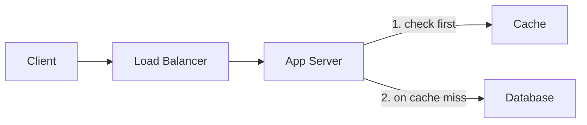
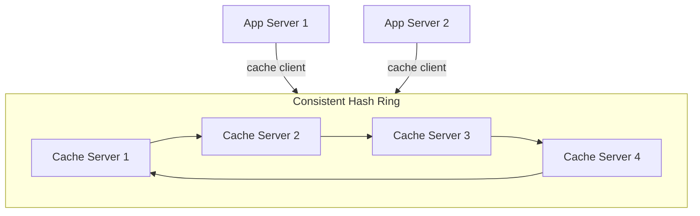
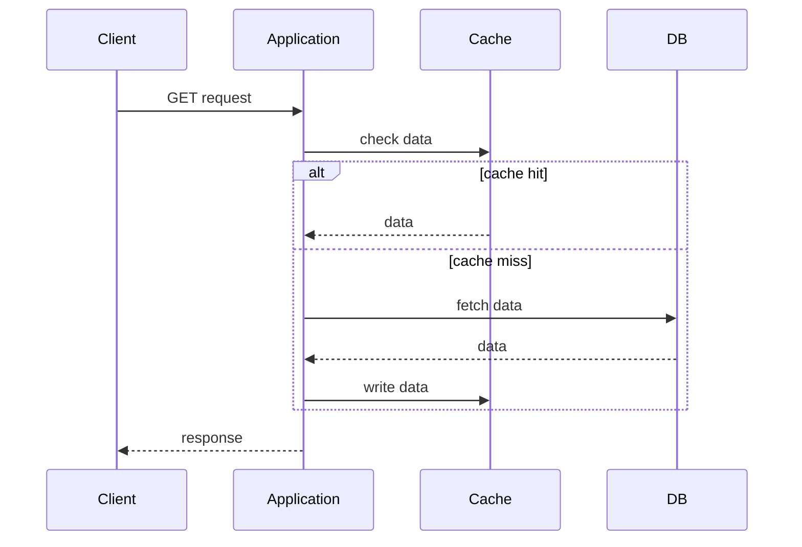
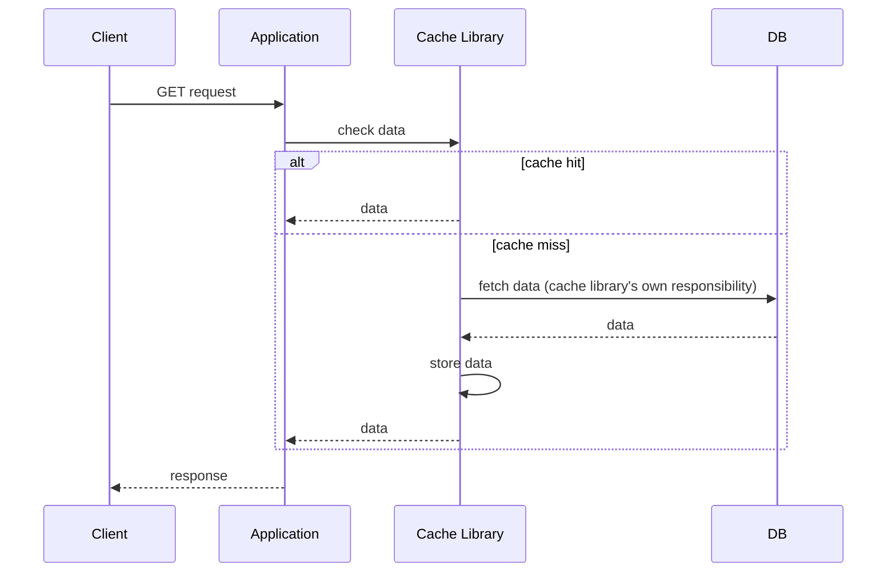
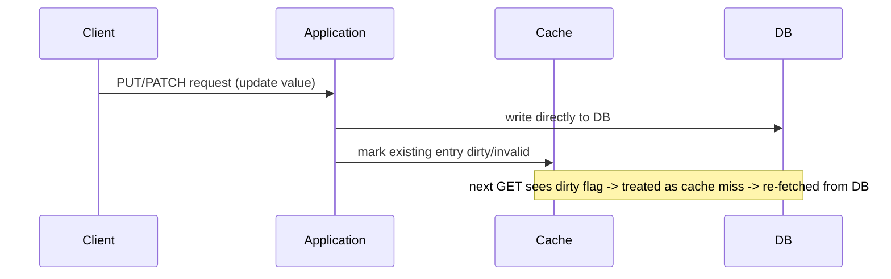
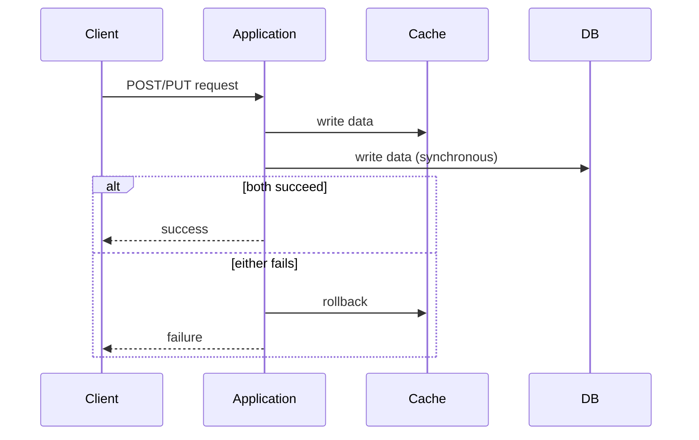
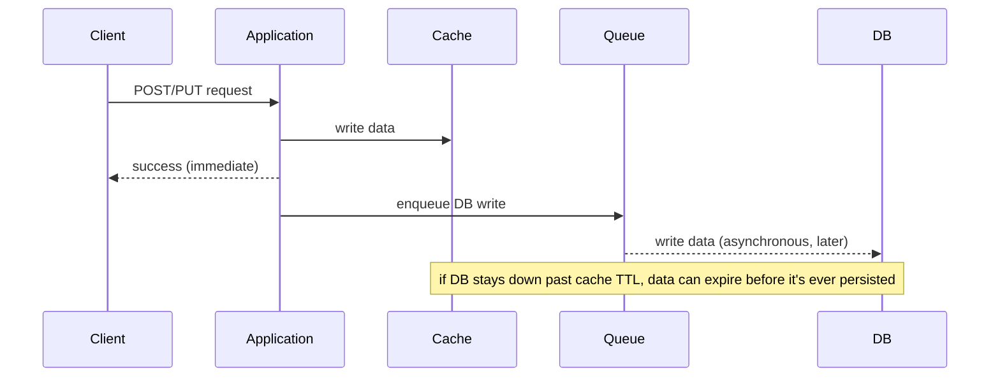
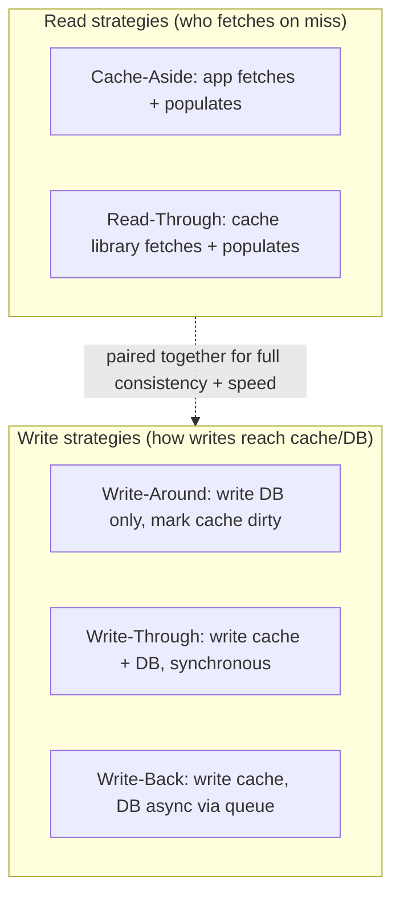

# Distributed Cache & Caching Strategies

## Overview
- Caching = storing frequently-used data in fast-access memory (e.g. RAM) instead of always hitting slow-access storage (e.g. disk, DB).
- Reduces latency (faster reads) and, with the right write strategy, can improve fault tolerance (system stays up even if the DB is briefly down).
- Caching exists at every layer: browser cache (client), CDN, load balancer, and **server-side application cache** — this note focuses on the last one, sitting between app servers and the DB.
- Two things covered here: how a single cache scales into a **distributed cache**, and the **5 caching strategies** (cache-aside, read-through, write-around, write-through, write-back) — cache eviction policies are a separate follow-up topic.

## Key Concepts

### Server-side application caching
- Sits between the app server and the DB — app checks the cache before querying the DB.
- Client → Load Balancer → App Server → (Cache first, DB on miss).

### Distributed caching
- A single shared cache server has two limits: **scalability** (fixed capacity, can't grow past a point) and **single point of failure** (cache dies → caching capability gone for everyone).
- Fix: a **pool of cache servers**, with each app server using a **cache client** to pick which cache server to talk to.
- The cache client picks a server using **consistent hashing** — cache servers are nodes placed on a hash ring; a request's key is hashed onto the ring and assigned to the first node found going clockwise (see [06. Consistent Hashing](06-consistent-hashing.md)).
- This is the same consistent-hashing mechanism used for any distributed node pool — cache servers are just another kind of "node."

### Cache-Aside
- **App** owns all cache logic: check cache first → hit → return; miss → fetch from DB → write into cache → return.
- **Pros:** great for read-heavy workloads; if the cache goes down, reads degrade gracefully to cache-miss-every-time (served from DB, request doesn't fail); cache document structure is fully independent of the DB schema — app decides what shape to store.
- **Cons:** new data always causes a first-time cache miss; write operations go straight to the DB and never touch the cache, so cache can go **stale** — a later write updates the DB but the old cached value keeps being returned as a hit.

### Read-Through
- Nearly identical to cache-aside, but the **cache library itself** (not the app) takes responsibility for fetching from the DB on a miss and populating itself.
- **Pros:** good for read-heavy apps; DB-fetch-and-populate logic is centralized in the cache library instead of duplicated in application code.
- **Cons:** same staleness risk as cache-aside without a paired write strategy; new data is still a first-read miss; cache document structure must mirror the DB table 1:1 (the library reads directly off the DB), unlike cache-aside's freedom to reshape data.

### Write-Around
- Writes go **directly to the DB**, bypassing the cache — but the write also marks the corresponding cache entry **dirty/invalid** instead of leaving it untouched.
- A later read sees the dirty flag, treats it as a cache miss, and re-fetches the fresh value from the DB.
- Solves the staleness problem that plain cache-aside/read-through have on their own — but only useful when **paired with** cache-aside or read-through (it does nothing for reads by itself).
- **Cons:** new data is still always a first-read cache miss; write availability is now **fully dependent on the DB** — if the DB is down, writes fail outright (not fault-tolerant for writes).

### Write-Through
- Write goes to the **cache first**, then **synchronously** to the DB — both must succeed or the whole write fails (needs a two-phase-commit-style rollback if one side fails).
- **Pros:** cache and DB always stay consistent; since writes populate the cache too, new data no longer causes a first-read miss — cache-hit rate goes up a lot.
- **Cons:** useless alone — only pays off when paired with cache-aside or read-through so something actually reads from the cache; otherwise it's pure added write latency; requires two-phase-commit logic to keep cache/DB in sync; still not fully fault-tolerant — if either cache or DB is down, the write fails.

### Write-Back (Write-Behind)
- Write goes to the **cache first**, then the DB write happens **asynchronously** — e.g. push the write onto a queue that drains into the DB later, instead of writing to the DB inline.
- **Pros:** lowest write latency (writing to cache is faster than writing to DB, and the app doesn't wait for the DB at all); genuinely improves **fault tolerance** — writes keep succeeding even if the DB is down, as long as the cache is up; cache-hit rate stays high since the cache always has the latest data; best performance when paired with read-through or cache-aside for reads.
- **Cons:** if the DB stays down longer than the cache entry's **TTL (time to live)**, the entry can expire and be evicted from the cache before it's ever persisted to the DB — the data is then lost from both cache and DB until the queued write is retried/succeeds.

## Trade-offs / Comparisons
| Strategy | Who fetches on miss | Consistency | Fault tolerance | Best paired with |
|---|---|---|---|---|
| Cache-Aside | Application | Can go stale on writes | Cache down -> falls back to DB, reads still work | Needs a write strategy (write-around/through/back) |
| Read-Through | Cache library | Can go stale on writes | Same as cache-aside | Needs a write strategy |
| Write-Around | N/A (write-only) | Fixes staleness via dirty flag | Write fails if DB down | Cache-aside or read-through |
| Write-Through | N/A (write-only) | Always consistent (2-phase) | Write fails if cache or DB down | Cache-aside or read-through |
| Write-Back | N/A (write-only) | Cache has latest; DB lags | Best — write succeeds even if DB down | Cache-aside or read-through; watch TTL vs DB downtime |

## Example / Walkthrough
- Staleness example (cache-aside/read-through without a write strategy): cache and DB both hold `10`; a write updates DB to `11` but never touches the cache; a subsequent read still hits the cache and returns the stale `10`.
- Write-around example: value `10` in both cache and DB; a PATCH updates DB to `11` and marks the cache entry dirty; the next GET sees the dirty flag, treats it as a miss, re-fetches `11` from DB, and repopulates the cache.
- Write-back risk example: write inserts `10` into cache and queues a DB write with cache TTL = 3 hours; DB is down for 5 hours; after 3 hours the cache entry expires and is evicted before the queued write ever lands — the value `10` is now unavailable in both cache and DB until the DB recovers and the queue retries.

## Diagram

## Interview Q&A

What is caching and why does it help fault tolerance?

Storing frequently-used data in fast-access memory instead of slow storage, cutting read latency. It aids fault tolerance specifically via write-back: writes land in the cache first and reach the DB asynchronously later, so the system keeps accepting writes even if the DB is temporarily down.

What are the limitations of a single shared cache server, and how does distributed caching fix them?

A single cache has limited scalability (fixed capacity) and is a single point of failure. Distributed caching uses a pool of cache servers, with each app server's cache client picking a server via consistent hashing (a hash ring), so load spreads across nodes and no single node's failure kills all caching.

What's the difference between Cache-Aside and Read-Through?

In Cache-Aside, the application is responsible for fetching from the DB on a miss and writing the result into the cache. In Read-Through, that logic is moved into the cache library itself, so the app just asks the cache and doesn't handle the miss case. A side effect: cache-aside can shape its own cache document structure, while read-through's cache mirrors the DB schema.

Why can't Cache-Aside or Read-Through be used safely on their own?

Neither touches the cache during writes, so a write can update the DB while the cache keeps serving the old value — the cache goes stale with no mechanism to invalidate it. They need to be paired with a write strategy (write-around, write-through, or write-back).

How does Write-Around solve the staleness problem?

Writes still go directly to the DB, but instead of leaving the cache entry untouched, the write marks it dirty/invalid. A subsequent read sees the dirty flag, treats it as a cache miss, and re-fetches the fresh value from the DB — but write-around only helps when paired with cache-aside or read-through, since it does nothing for reads by itself.

What's the tradeoff Write-Through makes, and why does it need two-phase commit?

Write-Through writes to the cache and DB synchronously, keeping them always consistent and boosting cache-hit rate — at the cost of higher write latency and needing all-or-nothing (two-phase-commit-style) semantics: if either the cache write or the DB write fails, the other must be rolled back so they never diverge.

Why is Write-Back the most fault-tolerant write strategy, and what's its main risk?

It writes to the cache first and returns success immediately, queuing the DB write to happen asynchronously — so writes keep succeeding even if the DB is fully down. The risk is TTL expiry: if the DB stays down longer than the cache entry's time-to-live, the entry can be evicted before it's ever persisted, losing the data from both cache and DB.

Which caching strategies can be used completely standalone, and which must be paired?

Cache-Aside and Read-Through can technically run alone (for reads), but without a write strategy they're vulnerable to staleness. Write-Around, Write-Through, and Write-Back are all write-only strategies and provide no benefit by themselves — they must be paired with Cache-Aside or Read-Through so something actually reads from the cache.

## Related Topics
- [06. Consistent Hashing](06-consistent-hashing.md) — the ring-hashing mechanism distributed caching uses to assign a request to a cache server node
- [18. Load Balancer & Algorithms](18-load-balancer-algorithms.md) — load balancers can also cache (L7); this note covers the dedicated server-side application cache layer instead
