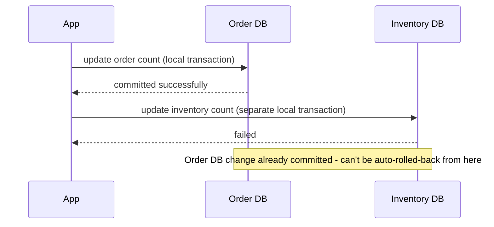
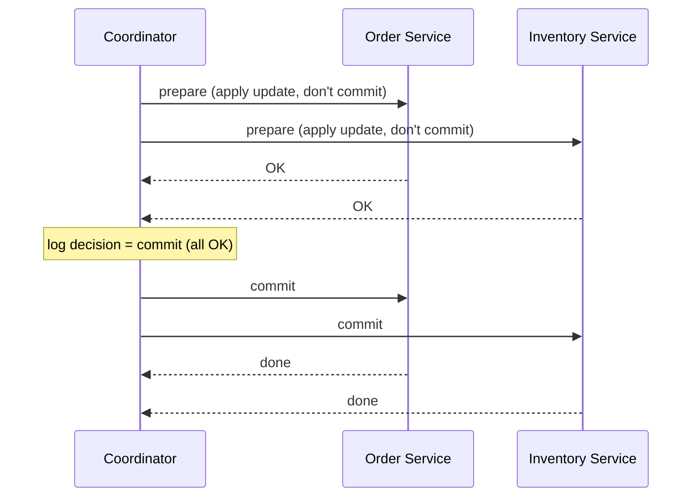
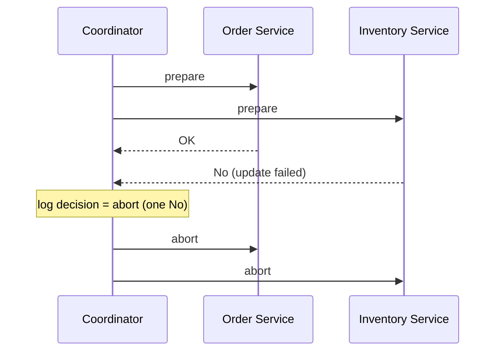
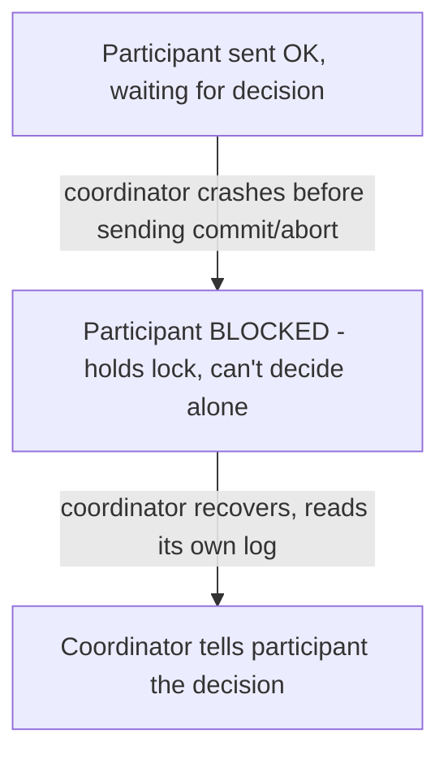
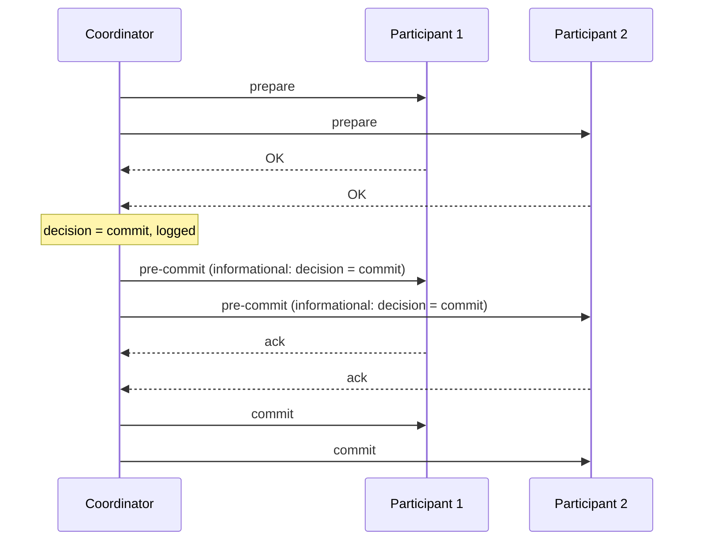
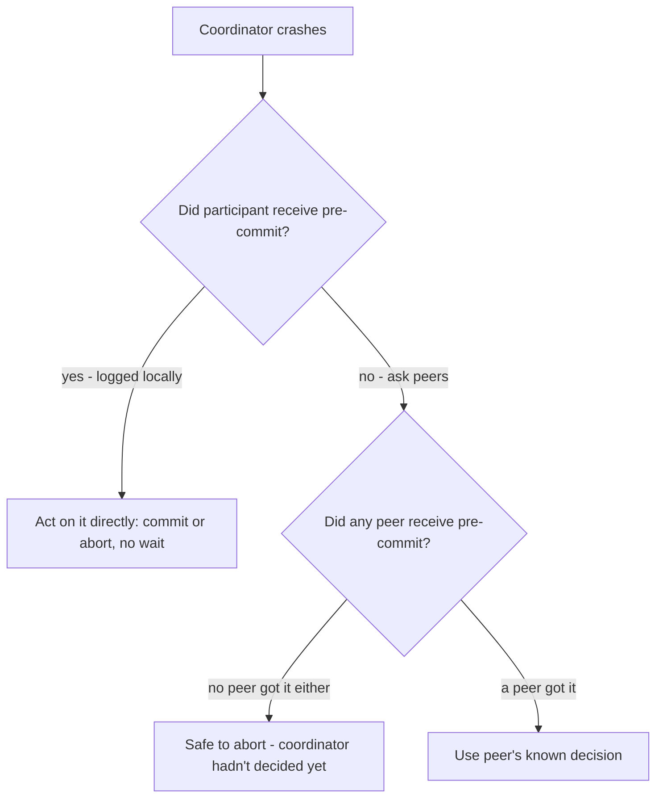
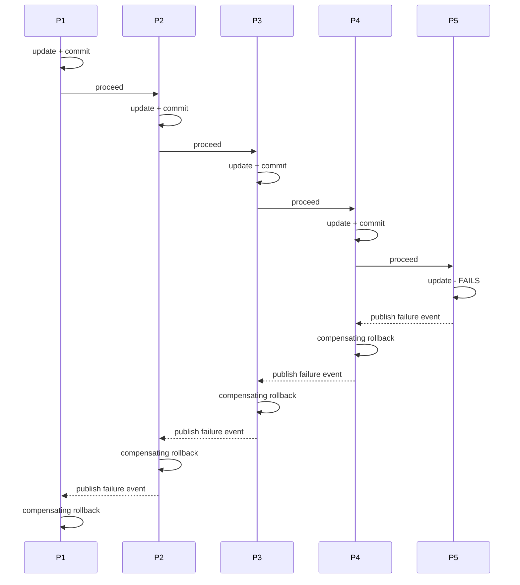
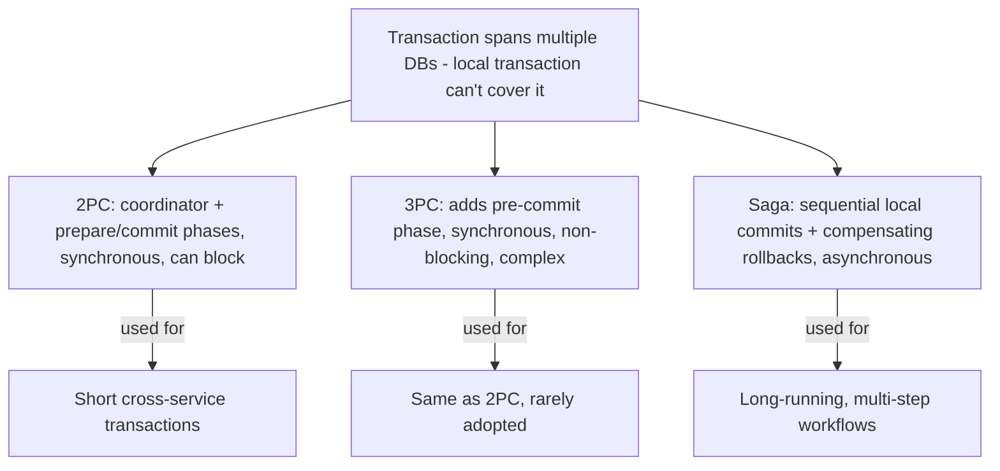

# Distributed Transactions: 2PC, 3PC, Saga Pattern

## Overview
- A transaction is a set of operations performed against a DB that must succeed or fail together — governed by **ACID** properties.
- A transaction is **local to a single database** — its transaction manager can only guarantee ACID within that one DB.
- Problem: an operation spanning **multiple databases/microservices** (e.g. order DB + inventory DB) has no single transaction manager to keep them consistent.
- Three ways to handle this: **Two-Phase Commit (2PC)** — popular; **Three-Phase Commit (3PC)** — fixes 2PC's blocking issue but rarely used (too complex); **Saga pattern** — asynchronous, used for long-running multi-step transactions.

## Key Concepts

### ACID properties (recap)
- **Atomicity** — all operations in a transaction succeed, or all are rolled back; no partial commits.
- **Consistency** — DB moves from one valid state to another valid state; never left in a partially-applied state.
- **Isolation** — concurrent transactions appear to run serially (one fully before another), even though they may interleave under the hood via row locks.
- **Durability** — once committed, data survives even a subsequent DB crash.

### Why a single transaction can't span multiple DBs
- A local transaction (e.g. debit A, credit B in one DB) works because both operations share one transaction manager, one lock space, one commit/rollback.
- Across two DBs (order DB, inventory DB), each has its **own** transaction manager — if the order DB commits successfully but the inventory DB update fails, there's no mechanism to roll the order DB back too.

### Two-Phase Commit (2PC)
- Introduces a **transaction coordinator** that talks to all **participants** (the microservices/DBs involved) and drives two phases: **prepare (voting)** and **commit (decision)**.
- **Phase 1 (prepare/voting):** coordinator sends the operation to every participant; each applies its change, locks the row, but does **not** commit yet — then replies "OK" (prepared) or "No".
- **Phase 2 (commit/decision):** if **all** participants said OK, coordinator sends **commit** to everyone; if **any** said No, coordinator sends **abort** to everyone. Both coordinator and each participant write every step to a durable **log file** before acting, so a recovering node can check what it last did.

#### 2PC failure scenarios
- **Prepare message lost** (coordinator fails before sending it) — participant times out waiting and **safely aborts** on its own; if the prepare message arrives later, coordinator gets a "No" and aborts everyone. Safe.
- **OK message lost** (participant fails before replying) — coordinator times out and **aborts the transaction**; when the participant recovers it asks the coordinator what happened, sees "abort" in the coordinator's log, and aborts too. Safe.
- **Commit/abort decision message lost** (coordinator fails after deciding) — this is the **blocking** case: a participant that already said OK is stuck holding its lock, unable to decide commit or abort on its own, and must simply **wait** for the coordinator to recover and tell it. This blocking window is 2PC's core weakness.

### Three-Phase Commit (3PC)
- Fixes 2PC's blocking problem by splitting phase 2 (commit/decision) into two sub-phases: **pre-commit** and **commit**.
- **Phase 1 (prepare)** — identical to 2PC: coordinator asks "are you prepared?", participants apply changes and reply OK/No.
- **Phase 2 (pre-commit)** — coordinator makes its decision (commit or abort) and **shares that decision** with every participant ahead of time — not an instruction to act yet, just information, logged durably by both sides.
- **Phase 3 (commit)** — coordinator tells participants to actually commit (or abort); participants that already know the pre-commit decision can act independently if the coordinator disappears here.

#### How 3PC unblocks participants
- If the coordinator dies **after** sending pre-commit but before phase 3: participants already know the decision from their own logged pre-commit message, so after a timeout they can **safely act on it themselves** (commit if pre-commit said commit, abort if it said abort) — no need to wait for the coordinator.
- If the coordinator dies **before** any pre-commit was sent/logged: participants can **query each other** ("did you get a pre-commit message?"); if nobody got one, it's safe to conclude the coordinator never even reached a decision, so everyone independently **aborts**.
- Tradeoff: this non-blocking guarantee adds real complexity (extra phase, extra round trips, peer-to-peer querying), which is why 3PC is rarely used in practice despite solving 2PC's blocking flaw.

### Saga Pattern
- 2PC and 3PC are **synchronous** — every participant holds a lock and the whole chain waits until the transaction fully resolves; fine for short transactions, bad for long-running multi-step ones.
- Saga is **asynchronous**: used when a transaction spans many participants in a long, sequential chain (P1 → P2 → P3 → P4 → P5), where holding locks across all of them until the end isn't feasible.
- Each participant **commits its own local step immediately**, then triggers the next participant to proceed (directly or via an event/queue).
- If a step fails, it **publishes a failure event**; each prior participant, on reading it, rolls back its own already-committed step and propagates the rollback backward — a chain of **compensating transactions**, not a single atomic rollback.

## Trade-offs / Comparisons
| Approach | Nature | Blocking on coordinator failure? | Complexity | Best for |
|---|---|---|---|---|
| Two-Phase Commit (2PC) | Synchronous | Yes — participants can get stuck holding locks | Moderate | Short cross-DB transactions, strong consistency needed |
| Three-Phase Commit (3PC) | Synchronous | No — participants can self-resolve via pre-commit info | High | Same use case as 2PC, but rarely used due to complexity |
| Saga Pattern | Asynchronous | N/A — no cross-service locks held | Moderate (needs compensating transactions) | Long-running, multi-step, sequential distributed transactions |

## Example / Walkthrough
- Local transaction: debit ₹100 from A, credit ₹100 to B, both in one DB — atomic, consistent, isolated via row locks, durable after commit.
- Cross-DB failure without 2PC: order DB update (100→101) commits successfully; inventory DB update (500→400) fails — order count now wrong with no automatic way to undo it.
- 2PC success: coordinator sends prepare to Order and Inventory services; both reply OK; coordinator logs "commit" and sends commit to both; both persist and acknowledge.
- 2PC blocking case: participant sends OK, then coordinator crashes before sending commit/abort — participant is stuck holding its lock until the coordinator recovers and reads its log to tell it what to do.
- 3PC non-blocking case: coordinator sends pre-commit (decision = commit) to all participants, then crashes — participants already have the decision logged locally, so they commit on their own after a timeout instead of waiting.
- Saga rollback chain: P1 through P4 each commit their step and pass control forward; P5 fails, publishes a failure event; P4 reads it, rolls back its own commit via a compensating transaction, and publishes its own failure event for P3 to read — and so on back to P1.

## Diagram

## Interview Q&A

Why can't a normal DB transaction handle an update that spans two microservices' databases?

A transaction is local to a single database's transaction manager — it can only guarantee atomicity/rollback within that one DB. Two separate databases have two separate transaction managers with no shared mechanism to roll each other back if one fails after the other has already committed.

What are the two phases in Two-Phase Commit, and what happens in each?

Phase 1 (prepare/voting): the coordinator asks every participant to apply its change and reply OK or No, without committing yet. Phase 2 (commit/decision): if all participants said OK, the coordinator tells everyone to commit; if any said No, it tells everyone to abort.

What is the main weakness of Two-Phase Commit?

It's a blocking protocol: if the coordinator crashes after participants have replied OK but before sending the commit/abort decision, those participants are stuck holding their locks with no way to decide on their own — they must wait for the coordinator to recover.

How does Three-Phase Commit fix 2PC's blocking problem?

It splits 2PC's decision phase into two: a pre-commit phase where the coordinator shares its decision (commit or abort) with all participants as information (not yet an instruction), followed by the actual commit phase. If the coordinator crashes after pre-commit, participants already know the decision and can act on it themselves instead of blocking.

If the coordinator crashes before any pre-commit message was ever sent in 3PC, how do participants know it's safe to abort?

Participants can query each other directly — if no participant received a pre-commit message, they can conclude the coordinator crashed before making any decision at all, so it's safe for everyone to independently abort.

Why isn't Three-Phase Commit widely used despite solving 2PC's blocking issue?

It adds significant complexity — an extra phase, extra round trips between coordinator and participants, and peer-to-peer querying logic for failure recovery — which outweighs its benefit for most real-world systems, so 2PC or Saga are chosen instead.

How is the Saga pattern fundamentally different from 2PC/3PC?

2PC and 3PC are synchronous — every participant holds a lock and waits until the whole transaction resolves. Saga is asynchronous — each participant commits its own step immediately and independently, then triggers the next step; there's no held cross-service lock spanning the whole transaction.

How does Saga handle a failure partway through a long transaction chain?

The failing participant publishes a failure event (e.g. onto a queue); the previous participant in the chain reads it and runs a compensating transaction to undo its own already-committed change, then publishes its own failure event for the participant before it — propagating rollback backward one step at a time instead of a single atomic rollback.

When would you choose Saga over 2PC for a distributed transaction?

When the transaction is long-running and involves many sequential participants (e.g. P1 must finish before P2 can start, and so on) — holding locks across all of them for the entire duration, as 2PC/3PC require, isn't feasible, so Saga's per-step commit + compensating-rollback approach is used instead.

## Related Topics
- [03. Microservices Design Patterns](03-microservices-design-patterns.md) — Saga pattern is introduced there as a distributed-transaction pattern for microservices; this note goes deeper on 2PC/3PC as alternatives
- [15. High Availability & Resilience](15-high-availability-active-passive-active-active.md) — coordinator/participant failure handling here parallels failover concepts there
