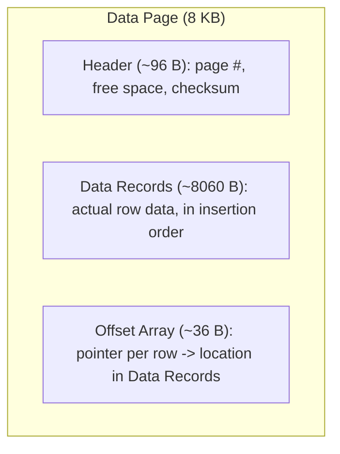
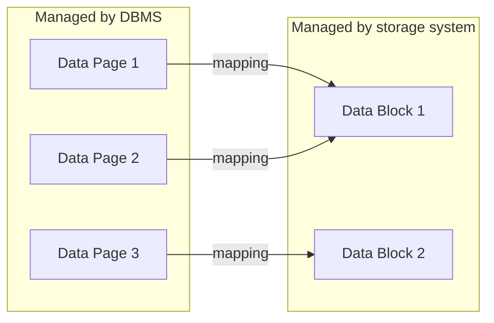
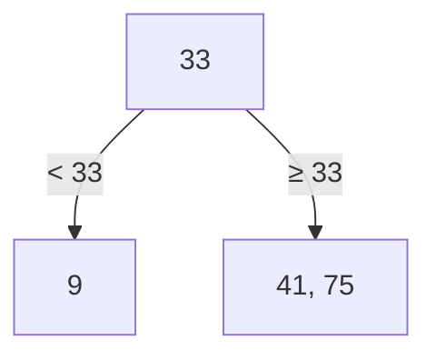
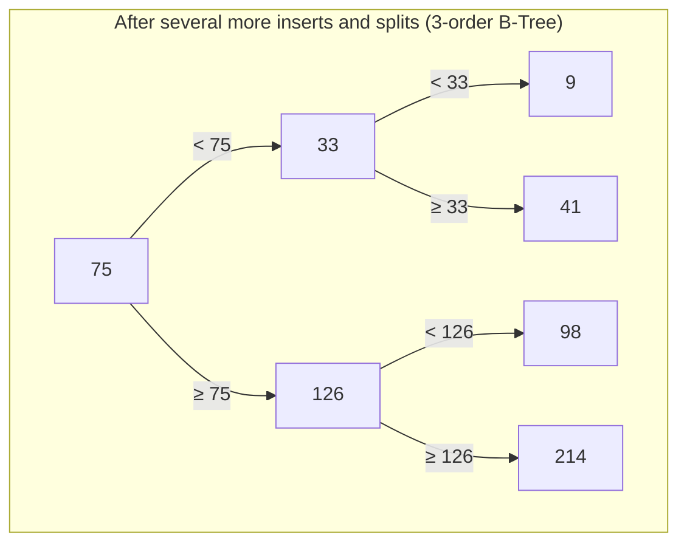
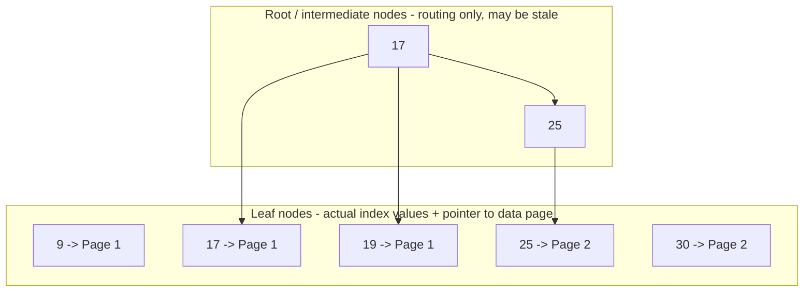
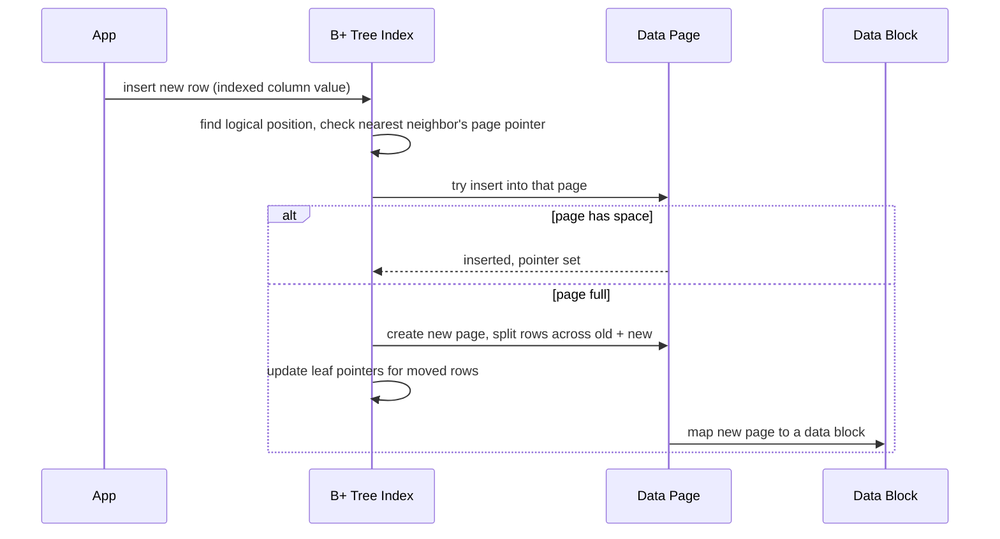
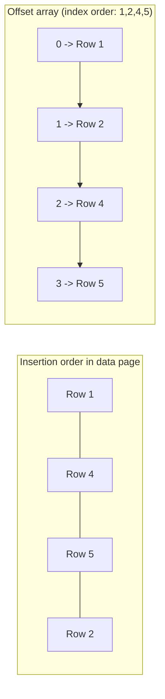
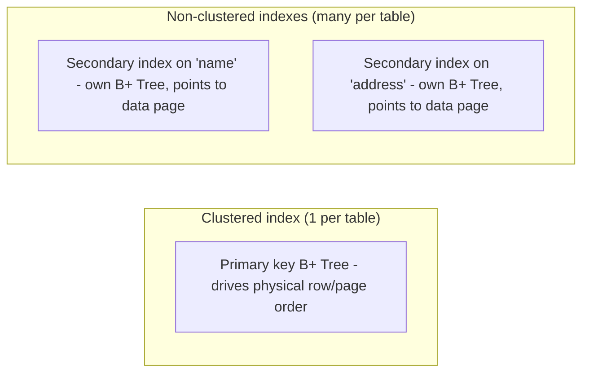
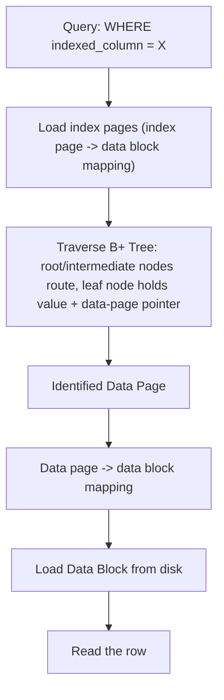

# Database Indexing (RDBMS)

## Overview
- Indexing exists to speed up query performance — fetching the right rows without scanning the entire table.
- Understanding it properly requires three layers: how table rows are physically stored (data pages/blocks), what data structure indexing uses (B/B+ Tree), and how a DBMS ties the two together.
- Two categories of index from a DBMS perspective: **clustered** and **non-clustered** — everything else (primary index, secondary index, composite index) is a variant of these two.
- A frequent, deep interview topic — the "logical table" you see is not how data is actually stored on disk.

## Key Concepts

### How table data is physically stored — data pages
- A table (rows/columns) is only a **logical representation** — physically, a DBMS stores rows inside **data pages**.
- A data page is commonly **8 KB** (varies by DB engine) and holds three regions:
  - **Header** (~96 bytes) — page number, free space available, checksum, etc.
  - **Data records** (~8060 bytes) — the actual row data, stored in insertion order.
  - **Offset array** (~36 bytes) — an array of pointers, each entry pointing to one row's location inside the data-records region.
- One data page holds as many rows as fit: e.g. a 64-byte row in an 8060-byte data region fits ~125 rows per page.
- A table that outgrows one page simply gets more pages (page 1, page 2, ... page N) — all managed by the DBMS.

### Data pages vs data blocks — logical vs physical storage
- **Data page** = a logical storage unit **managed by the DBMS** — the DBMS decides which rows go into which page.
- **Data block** = the minimum unit of data one I/O operation can read/write, **managed by the underlying storage system** (disk/SSD), not the DBMS. Size ranges 4 KB–32 KB, most commonly 8 KB.
- The DBMS has **no control** over where a data page physically lands among data blocks — it can be scattered anywhere on disk.
- Because of that, the **DBMS maintains a mapping table**: data page → data block. If a data block is the same size as (or larger than) a data page, one block can hold one or several pages.

### Why indexing is needed
- Without an index, the DBMS has no idea which data page a given row lives in — worst case it must load **every** data page and scan **every** row: **O(n)** time complexity.
- Indexing's job is to make lookups much faster than a full scan.
- The data structure used is the **B+ Tree** (B = balanced) — gives **O(log n)** for insertion, search, and deletion.
- A plain **B-Tree** works almost identically to a B+ Tree; the difference is that in a B+ Tree, all leaf nodes are additionally **linked to each other**.

### B-Tree structure and how it grows
- Maintains data in **sorted order**; all leaf nodes sit at the **same depth**.
- **M-order** B-Tree: each node holds at most **M children**, meaning at most **M − 1 keys** per node, and each key has a left pointer (values < key) and right pointer (values ≥ key).
- Insertion keeps a node's keys sorted; when a node would exceed M − 1 keys, the **middle key is pushed up to the parent**, splitting the node in two — this can cascade up multiple levels if the parent also overflows.

### How DBMS uses B+ Tree for indexing
- **Root and intermediate nodes** only hold values used to **navigate** (go left/right) — a value here might even have been deleted from the table already; it's just there for routing.
- **Leaf nodes** hold the actual **current index column values** — and, critically, each leaf key also stores a **pointer to the data page** that contains that row.
- Since B+ Tree leaves are linked to each other, walking the leaf level left-to-right gives every indexed value in fully sorted order.

### Insert walkthrough: page selection and page splitting
- Inserting a new row: DBMS finds the row's correct **logical position** in the B+ Tree, looks at its **nearest neighbor's data-page pointer**, and tries to insert the new row into that **same data page** (keeping related rows physically close).
- If that data page is full, the DBMS performs a **page split**: creates a new data page, divides the existing rows between old and new pages, and **updates every affected leaf pointer** to point at the correct page — plus updates the page→block mapping for the new page.
- Both the B+ Tree structure and the data-page assignment can cascade-update on a single insert: tree node splits (indexing) and data-page splits (storage) are separate but related events.

### Clustered Index
- Definition: the **physical order of rows inside data pages matches the order of the index** — i.e. the table data itself is sorted by the indexed column.
- Achieved not by physically reordering row bytes, but via the **offset array**: the offset array's pointer sequence is arranged to match the sorted index order, so traversing offsets 0, 1, 2, ... yields rows in index order even if they were inserted out of order.
- **Only one clustered index per table** — a table's physical row order can only be sorted one way at a time.
- Priority: DBMS uses the **primary key** as the clustered key by default. If no primary key is defined, the DBMS silently creates a **hidden auto-incrementing column** and uses that as the clustered key instead (guaranteed unique, not null).
- Adding a primary key later forces the DBMS to **rebuild the B+ Tree and re-sort/reshuffle rows across pages** — an expensive operation on a large table.

### Non-Clustered (Secondary) Index
- A separate B+ Tree built on a **different column** (e.g. `name`), whose leaf nodes point to the data page containing that row — same B+ Tree mechanics as clustered indexing.
- Does **not** affect the physical row/page ordering — that's still driven solely by the clustered index.
- A table can have **many** non-clustered indexes (secondary index, composite index, etc.), unlike clustered index's limit of one.

### Overhead of indexing
- Every extra index is a **separate B+ Tree** that itself needs memory and disk space — stored in its own **index pages**, which map to data blocks just like data pages do.
- On a table with millions of rows, each secondary index means millions of extra B+ Tree nodes to store and maintain.
- Every insert/update/delete must now update **all** indexes on the table (clustered + every non-clustered), including potential **page splits** in each affected B+ Tree — more indexes = more write overhead.
- Conclusion: don't index every column "just in case" — each index trades faster reads for slower writes and more storage.

## Trade-offs / Comparisons
| Aspect | Clustered Index | Non-Clustered (Secondary) Index |
|---|---|---|
| Count per table | Exactly one | Many |
| Affects physical row order | Yes (via offset array) | No |
| Default source | Primary key (or hidden auto-increment column if none) | Any column explicitly indexed |
| Leaf node points to | The row's location directly (row order = index order) | The data page containing the row (row order unrelated) |
| Cost of adding later | Expensive — full B+ Tree rebuild + row reshuffle | Cheaper — builds a new, independent B+ Tree |

## Example / Walkthrough
- **Search query, step by step** (e.g. `WHERE employee_id = 35`):
  1. Load the relevant **index pages** into memory (via the index-page → data-block mapping).
  2. Traverse the **B+ Tree** in those index pages to find which **data page** holds `employee_id = 35`.
  3. Use the **data page → data block mapping** to find the correct data block.
  4. Load that **data block** into memory.
  5. Read the row directly from it — no full table scan needed.
- **Row count math example:** a 64-byte row in an 8060-byte data-records region → ~125 rows fit per 8 KB data page.
- **Page split example:** a 3-order B-Tree data page holding rows for index values 19, 25, 30 is full; inserting 17 forces a split — new page created, rows divided (e.g. 17, 19 stay in page 1; 25, 30 move to page 2), and every affected leaf pointer is updated to reflect the new page assignment.

## Diagram

## Interview Q&A

What's the difference between a data page and a data block?

A data page is a logical storage unit managed by the DBMS — it decides which rows go where. A data block is the minimum unit of I/O managed by the underlying storage system (disk/SSD); the DBMS has no control over where its pages land among blocks, so it maintains a page-to-block mapping.

What's stored in a data page's offset array, and why does it matter for indexing?

The offset array holds a pointer per row into the page's data-records region. Its ordering can be arranged to match the sorted index order — this is exactly how a clustered index gives sorted access without physically rewriting row bytes on every insert.

Why does indexing use a B+ Tree instead of a plain sorted array or hash table?

A B+ Tree gives O(log n) insertion, search, and deletion while keeping data sorted (needed for range queries) — and its linked leaf nodes allow efficient in-order traversal, unlike a hash table which doesn't preserve order at all.

What's the difference between what root/intermediate nodes and leaf nodes store in a B+ Tree index?

Root and intermediate nodes only hold routing values used to decide left/right traversal — these can even be stale (a value already deleted from the table). Leaf nodes hold the actual current index column values, each with a pointer to the data page containing that row.

Why can a table have only one clustered index but many non-clustered indexes?

A clustered index determines the physical order of rows within data pages (via the offset array) — a table's rows can only be sorted one way at a time. A non-clustered index is a separate B+ Tree whose leaves just point to a data page without changing physical row order, so any number of them can coexist.

What happens if a table has no primary key — how does the DBMS build its clustered index?

The DBMS silently creates a hidden auto-incrementing column (guaranteed unique and not null) and uses it as the clustered key. If a primary key is added later, the DBMS must rebuild the B+ Tree and reshuffle rows across data pages to reorder everything by the new key — an expensive operation.

What is a page split, and when does it happen?

When inserting a row into the data page its B+ Tree neighbor points to, and that page is already full, the DBMS creates a new data page, divides the existing rows between old and new pages, and updates every affected leaf pointer (and the page-to-block mapping) to reflect the new assignment.

Why shouldn't you index every column in a table?

Each index is its own B+ Tree requiring its own memory/disk space (index pages, mapped to data blocks) and must be updated — including possible page splits — on every insert, update, or delete to the table. More indexes speed up specific reads but add real write overhead and storage cost.

## Related Topics
- [19. Distributed Cache & Caching Strategies](19-caching-strategies.md) — indexing and caching are both techniques to avoid full data scans, at different layers
- [10. SQL vs NoSQL](10-sql-vs-nosql.md) — indexing internals here are specific to relational (SQL) databases
