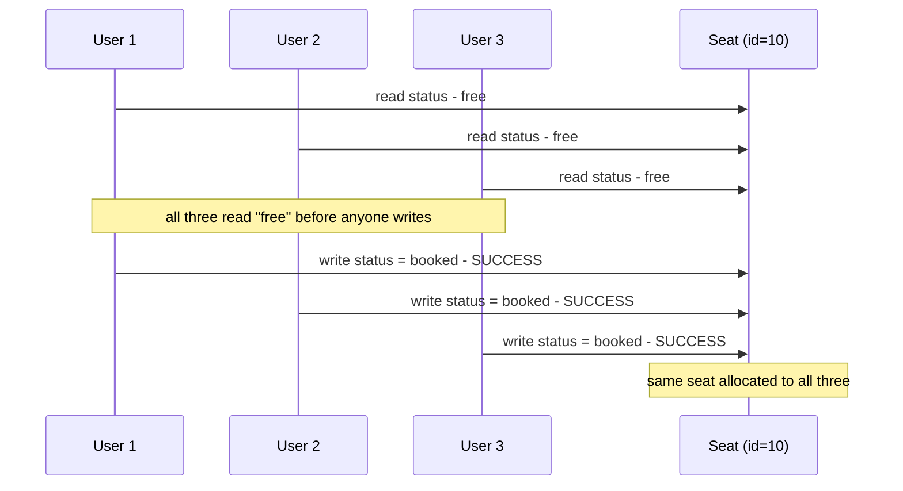
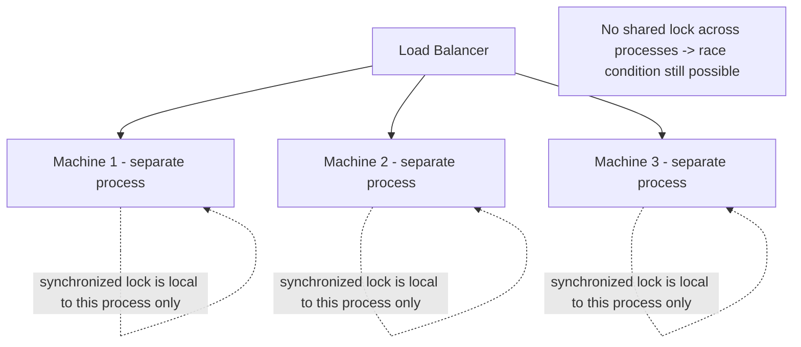
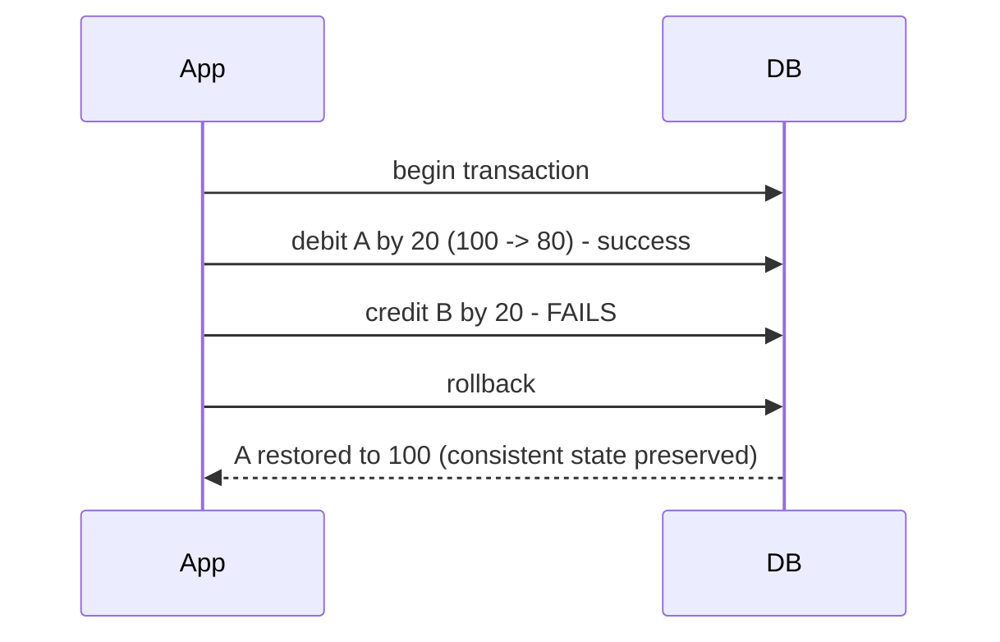
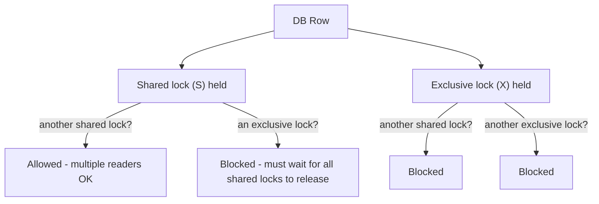
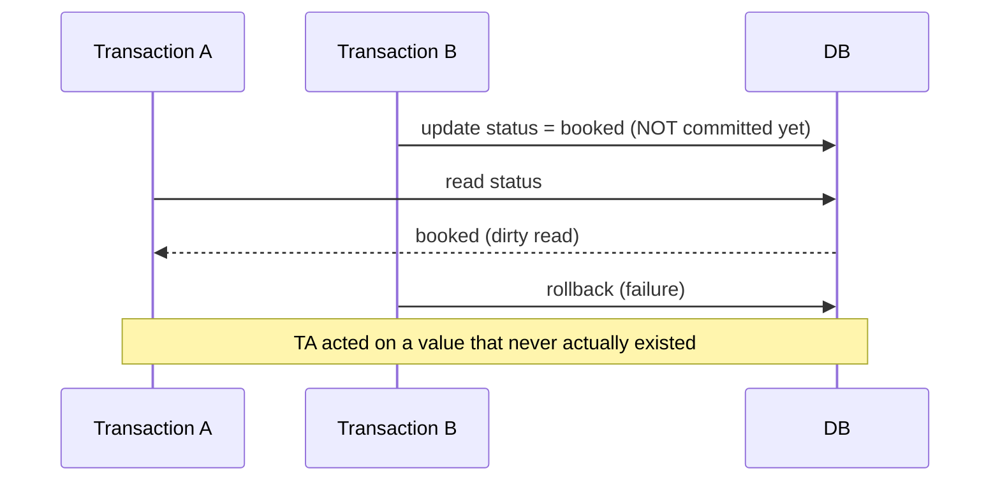
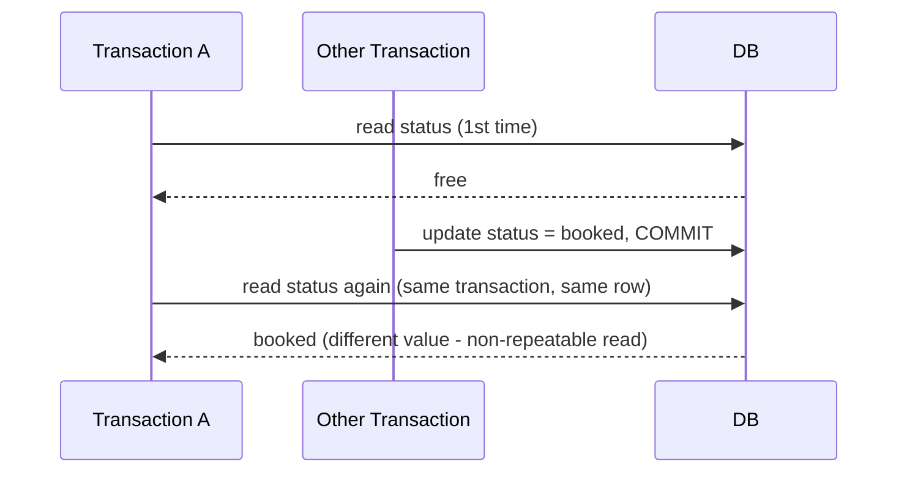
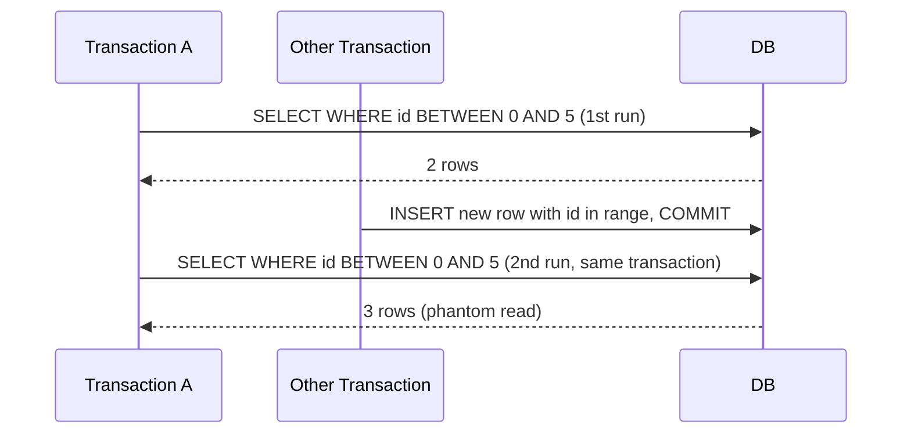
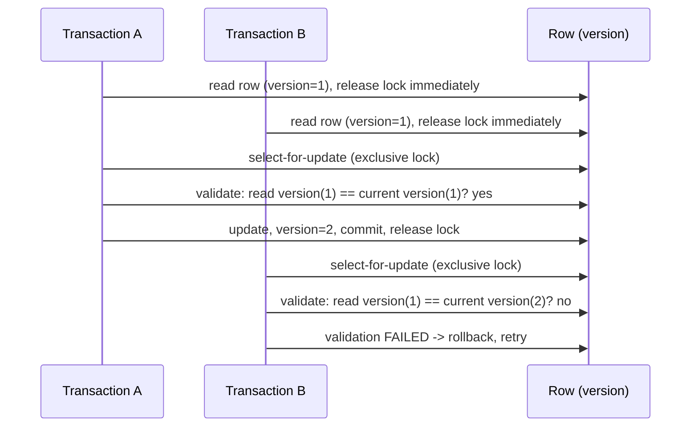
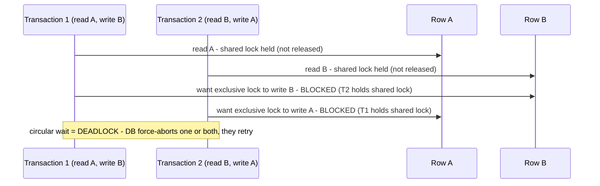
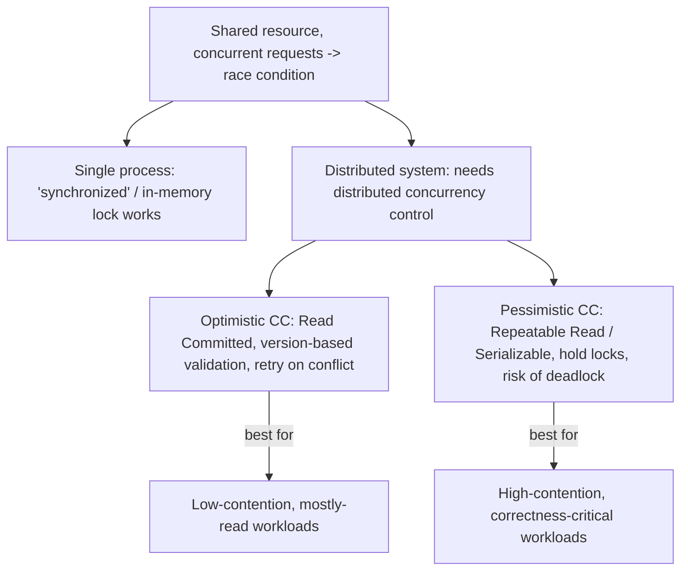

# Concurrency Control in Distributed Systems

## Overview
- Asked in both HLD interviews (as "explain distributed concurrency control") and LLD interviews (as a follow-up to BookMyShow/parking-lot style design questions).
- Concurrency control prevents multiple simultaneous requests from corrupting a **shared resource** (e.g. two users booking the same seat).
- `synchronized`-style in-process locking cannot solve this once the system is **distributed** across multiple machines/processes.
- Two families of distributed concurrency control: **optimistic** and **pessimistic** — the correct terms are *optimistic/pessimistic concurrency control*, though "optimistic/pessimistic locking" is commonly used loosely.
- Understanding this requires three prerequisites first: the purpose of **transactions**, **DB locking** (shared vs exclusive), and **isolation levels** (and the three read anomalies they solve).

## Key Concepts

### The concurrency problem
- **Critical section** = the piece of code that accesses a shared resource — where race conditions can occur.
- Example: 3 users concurrently try to book the same seat. All 3 read `status = free` at the same time, all 3 then write `status = booked` and succeed — the seat gets double/triple-booked.

### Why `synchronized` doesn't solve it in distributed systems
- A `synchronized` block relies on a JVM-level lock shared by **threads within one process** — multiple threads in one process correctly serialize through it.
- In a distributed system, each service instance runs as a **separate process** (often on separate machines behind a load balancer) — there is no shared in-memory lock between them, so `synchronized` provides zero protection across instances.

### Prerequisite: Transactions and integrity
- A transaction's purpose is to preserve **integrity/consistency**: if any statement in it fails, every successful statement in the same transaction is **rolled back** too.
- Without a transaction wrapping multiple related writes, a partial failure (e.g. debit succeeds, credit fails) leaves the DB in an inconsistent state with no automatic recovery.

### Prerequisite: DB Locking (shared vs exclusive)
- **Shared lock (S)** — a "read lock." Multiple transactions can hold a shared lock on the same row simultaneously and all read it; but no transaction can take an **exclusive** lock while any shared lock exists.
- **Exclusive lock (X)** — a "write lock." Only one transaction can hold it; while held, no other transaction can acquire either a shared or exclusive lock on that row — nobody else can read or write it.

### Prerequisite: Isolation levels and the three read anomalies
- Isolation (the "I" in ACID) determines how much concurrency is allowed — each transaction should feel like it's running alone even when others run in parallel.
- Three problems isolation levels address:
  - **Dirty read** — a transaction reads data written by another transaction that hasn't committed yet; if that write is later rolled back, the reader acted on data that never really existed.
  - **Non-repeatable read** — the same transaction reads the same row twice and gets **different values**, because another transaction committed a change to it in between.
  - **Phantom read** — the same transaction runs the same range query twice and gets a **different set of rows**, because another transaction inserted/deleted a row matching that range in between.

#### The four isolation levels
| Level | Read lock strategy | Write lock strategy | Dirty read | Non-repeatable read | Phantom read | Concurrency |
|---|---|---|---|---|---|---|
| Read Uncommitted | No lock at all | No lock at all | Possible | Possible | Possible | Highest (read-only use cases) |
| Read Committed | Shared lock, released immediately after read | Exclusive lock, held until end of transaction | Solved | Possible | Possible | High |
| Repeatable Read | Shared lock, held until end of transaction | Exclusive lock, held until end of transaction | Solved | Solved | Possible | Medium |
| Serializable | Same as Repeatable Read + **range lock** on queried range | Same as Repeatable Read | Solved | Solved | Solved | Lowest |
- **Range lock** (Serializable only): locks not just the matching rows but the entire queried range, so no new row can be inserted into that range until the transaction ends — this is what closes the phantom-read gap.

### Optimistic Concurrency Control
- Uses the **Read Committed** isolation level — reads take a shared lock and release it immediately, so multiple transactions can read freely with minimal blocking.
- Concurrency is resolved through **row versioning**, not holding locks: each row carries a version number (built into some DBs like MySQL, or added manually as a column in others like Oracle) that increments on every update.
- Flow: read the row (note its version, no lock retained) → compute changes → on write, take an exclusive lock and **validate** that the row's current version still matches the version read earlier → if it matches, update + increment version + commit; if it doesn't match (someone else updated it in between), **roll back and retry**.
- No deadlock risk, since no long-held locks exist during the read/compute phase — makes it the higher-concurrency option, at the cost of retries on conflict.

### Pessimistic Concurrency Control
- Uses **Repeatable Read** or **Serializable** isolation — locks are acquired early and held until the transaction ends (commit or abort), forcing other transactions to wait.
- This effectively serializes access to contested rows — safer, but at the cost of concurrency: transactions queue up behind each other's locks.
- Main risk: **deadlock** — two transactions each hold a lock the other needs, and both wait forever unless the DB detects the cycle and force-aborts one (or both), which then must retry.
- Long-held locks on long-running transactions can also cause lock-wait timeouts, forcing unwanted rollbacks.

## Trade-offs / Comparisons
| Aspect | Optimistic Concurrency Control | Pessimistic Concurrency Control |
|---|---|---|
| Isolation level used | Read Committed (or below Repeatable Read) | Repeatable Read or Serializable |
| Locking strategy | Locks released quickly; conflict caught via version check at write time | Locks held until transaction ends |
| Concurrency | High | Lower — transactions queue behind held locks |
| Deadlock risk | None | Yes — requires detection + forced abort/retry |
| Failure mode | Version mismatch -> rollback and retry | Blocked wait, or deadlock -> forced abort |
| Best for | Low-contention resources, mostly-read workloads with occasional conflicting writes | High-contention resources where correctness under contention matters more than throughput |

## Example / Walkthrough
- Seat-booking race: 3 concurrent bookings on the same seat all read `free` before any writes back `booked` — without concurrency control, all 3 succeed and overbook the seat.
- Optimistic version conflict: Transaction A and B both read a row at version 1; A updates it to version 2 and commits; when B later tries to update using its stale version-1 read, validation fails and B rolls back and retries.
- Pessimistic deadlock: Transaction 1 needs to read A then write B; Transaction 2 needs to read B then write A. Each holds a shared lock on the row it read first and then blocks waiting for the other's row — a circular wait the DB must detect and break by aborting one side.

## Diagram

## Interview Q&A

Why doesn't a `synchronized` block solve concurrency issues in a distributed system?

`synchronized` only coordinates threads within a single process's memory space. In a distributed system, each service instance runs as a separate process (often on separate machines), so there's no shared lock between them — the same race condition still occurs across processes.

What's the difference between a shared lock and an exclusive lock?

A shared lock is a read lock — multiple transactions can hold it simultaneously and all read the row, but no exclusive lock can be granted while any shared lock exists. An exclusive lock is a write lock — only one transaction can hold it, and while held, no other transaction can read (shared) or write (exclusive) that row.

What is a dirty read, and which isolation level first prevents it?

A dirty read is reading data written by another transaction that hasn't committed yet — if that transaction later rolls back, the reader acted on data that never really existed. Read Committed prevents it by holding an exclusive lock on writes until the transaction ends, so nothing uncommitted can be read.

What's the difference between a non-repeatable read and a phantom read?

A non-repeatable read is when the same transaction reads the same single row twice and gets different values because another transaction committed a change in between. A phantom read is when the same transaction runs the same range query twice and gets a different set of rows because another transaction inserted or deleted a matching row in between.

How does Serializable isolation prevent phantom reads when Repeatable Read can't?

Serializable adds a range lock on top of Repeatable Read's row locks — it locks the entire queried range, not just the matching rows, so no new row can be inserted into that range until the transaction ends, closing the gap that causes phantom reads.

How does optimistic concurrency control actually detect a conflict?

Every row carries a version number. A transaction reads a row and notes its version without holding a lock. Before writing, it takes an exclusive lock and validates that the row's current version still matches the version it read — if another transaction updated the row (bumping the version) in between, validation fails and the transaction rolls back and retries.

Why is pessimistic concurrency control prone to deadlock but optimistic isn't?

Pessimistic control holds locks for the full duration of a transaction, so two transactions needing each other's already-locked rows can end up in a circular wait forever. Optimistic control releases read locks immediately and only briefly holds an exclusive lock during the final write-with-validation step, so there's no long-held lock for a circular wait to form around.

When would you choose pessimistic over optimistic concurrency control?

When contention on the resource is high enough that optimistic's retry-on-conflict approach would cause excessive rollbacks and wasted work — pessimistic locking guarantees correctness by serializing access up front, trading concurrency for fewer wasted retries under heavy contention.

## Related Topics
- [20. Distributed Transactions](20-distributed-transactions.md) — transactions and rollback semantics referenced here as a prerequisite
- [21. Database Indexing](21-database-indexing.md) — locks discussed here operate on the same rows managed via the B+ Tree index structures covered there
