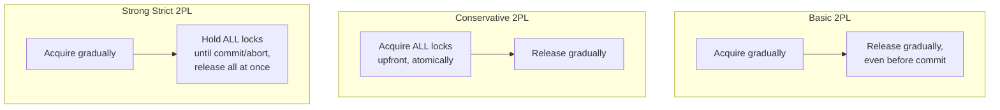
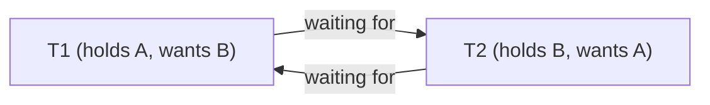
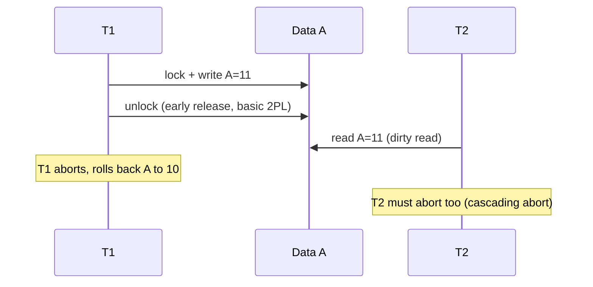
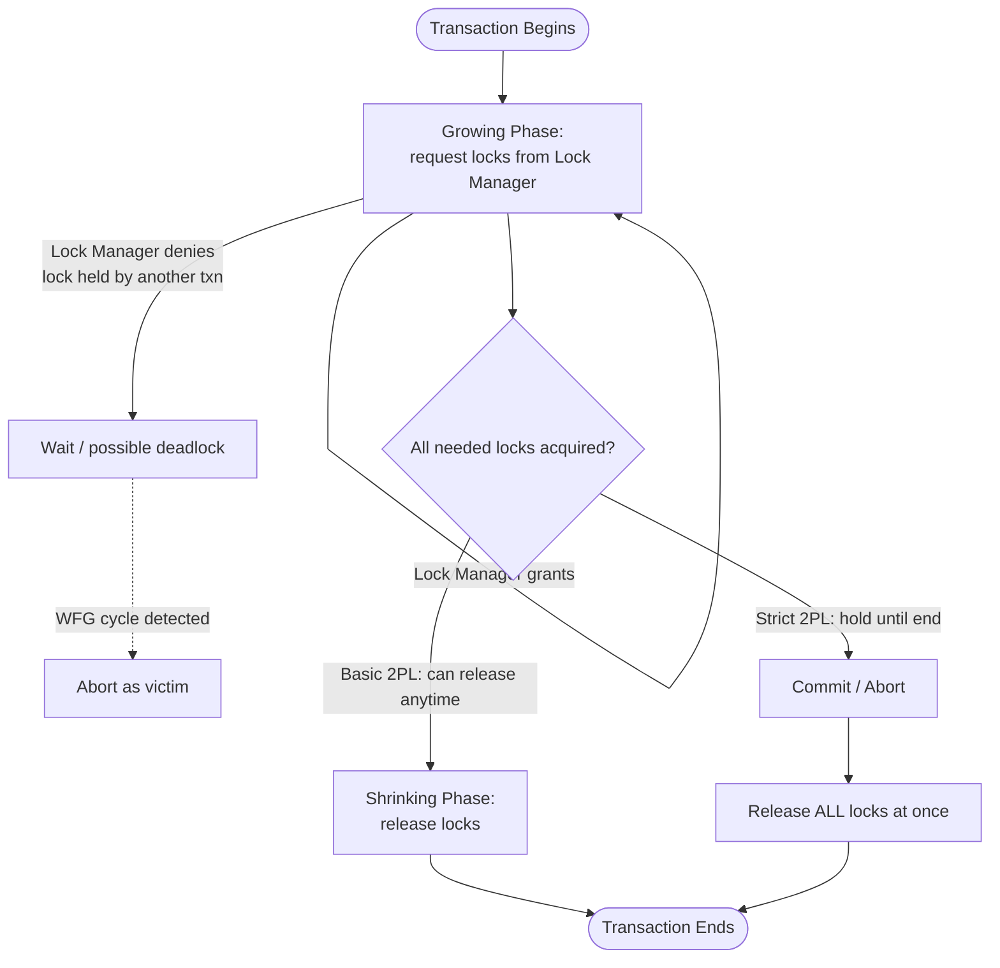

# Two Phase Locking (2PL)

## Overview
- A locking protocol that governs when a transaction can acquire and release locks — a specific discipline within pessimistic concurrency control (see [[22-concurrency-control]]).
- Splits every transaction's lifetime into exactly two phases: a growing phase (only acquire locks) and a shrinking phase (only release locks) — never interleaved.
- Widely asked in interviews because of its two core failure modes — deadlock and cascading aborts — and the different variants that trade off concurrency to fix them.
- Industry mostly uses **Strong Strict 2PL (Rigorous 2PL)** — it eliminates cascading aborts, at the cost of still being deadlock-prone (handled separately via deadlock detection).

## Key Concepts

### The two phases
- **Growing phase** — transaction requests locks from the lock manager, which grants or denies them; number of locks held only increases.
- **Shrinking phase** — transaction only releases previously-held locks; no new lock requests allowed once the first release happens.
- Once a transaction releases even one lock, it has entered the shrinking phase and can never acquire a new lock again.
- If a transaction just holds locks until commit/abort and releases them all at once, that's still valid 2PL — growing phase, then instant shrink at the end.

### Three variants of 2PL
- **Basic 2PL** — locks can be acquired incrementally during growing phase, released incrementally during shrinking phase (even before the transaction ends). Simplest, most concurrency, but suffers both deadlock and cascading aborts.
- **Conservative (Static) 2PL** — transaction must acquire *all* locks it will ever need upfront, atomically, before doing any work. If even one lock is unavailable, none are granted — transaction waits. Avoids deadlock entirely (a transaction never holds some locks while waiting for others), but requires knowing the full read/write set in advance and gives much less concurrency.
- **Strong Strict 2PL (Rigorous 2PL)** — locks can be acquired gradually (like basic), but *all* locks (shared and exclusive) are held until the transaction ends (commit or abort) — no early release. Eliminates cascading aborts since nobody can read a value written by an uncommitted transaction. Deadlock is still possible (needs separate handling, e.g. wait-for graph).

### Problem 1 — Deadlock
- Two transactions each hold a lock the other needs, and each waits forever for the other to release.
- Happens even with a single data item — e.g. both transactions hold a shared lock and both try to upgrade to exclusive at the same time; neither releases first.
- **Prevention/detection strategies:**
  - **Timeout** — scheduler aborts a transaction if it waits too long, assuming it's deadlocked. Simple but can wrongly abort a valid transaction that's just slow (false positive).
  - **Wait-for graph (WFG)** — scheduler maintains a directed graph: edge T1 → T2 means T1 is waiting on a lock held by T2. Periodically checks for cycles; a cycle = deadlock. Edge removed when the lock is released. On cycle detection, picks a **victim** transaction to abort based on: effort already invested, time remaining to finish, cost of rollback, and how many other cycles it participates in.
  - **Conservative 2PL** — sidesteps deadlock structurally by acquiring all locks upfront (see variants above), at the cost of concurrency.
  - **Timestamp-based schemes** — assign each transaction a timestamp at start; older timestamp = higher priority. Two policies:
    - **Wait-Die** — if an *older* transaction requests a lock held by a *newer* one, the older transaction waits. If a *newer* transaction requests a lock held by an *older* one, the newer transaction dies (aborts) instead of waiting.
    - **Wound-Wait** — if an *older* transaction requests a lock held by a *newer* one, it "wounds" (forcibly aborts) the newer transaction. If a *newer* transaction requests a lock held by an *older* one, it waits.

### Problem 2 — Cascading aborts
- Only possible under **Basic 2PL**, because it allows releasing a lock before the transaction commits.
- Sequence: T1 writes A, releases lock on A early (before commit) → T2 reads that uncommitted value of A (a **dirty read**) and does work on it → T1 gets aborted and rolled back → the value T2 read is now invalid, so T2 must be aborted too, even though T2 did nothing wrong.
- Cost compounds — any transaction that read from the aborted chain must also abort.
- **Fix:** Strong Strict 2PL — since locks aren't released until commit, nobody can ever read an uncommitted (dirty) value in the first place.

## Trade-offs / Comparisons
| Variant | Deadlock? | Cascading aborts? | Concurrency | Notes |
|---|---|---|---|---|
| Basic 2PL | Possible | Possible | Highest | Simplest, least safe |
| Conservative 2PL | Avoided | Possible | Lowest | Needs full lock set upfront; scheduler overhead |
| Strong Strict 2PL | Possible (needs WFG etc.) | Avoided | Medium | **Most used in industry** |

## Example / Walkthrough
- **Money transfer bug under Basic 2PL:** T1 transfers ₹10 from A→B. T1 locks A, updates A=90, releases lock on A (before finishing). T2 then locks A (shared), reads A=90, releases; locks B (shared), reads B=100, computes 90+100=190, commits. Meanwhile T1 continues, locks B, updates B=110, commits. Result: T2 computed a stale sum (190) instead of the correct 200 (90+110) — a consistency bug caused purely by early lock release, with no deadlock and no explicit cascading abort involved.
- **Same example under Conservative 2PL:** T1 acquires locks on both A and B upfront, updates both (A=90, B=110), then releases gradually in shrinking phase. T2 only gets locks (and reads) once both are free, so it correctly computes 90+110=200. No inconsistency, but T2 sits idle waiting for both locks the whole time (lower concurrency).
- **Same example under Strong Strict 2PL:** T1 locks A, updates A=90, keeps the lock; locks B, updates B=110, keeps that lock too; only releases both at commit. T2 waits until commit, then reads consistent values. No cascading abort possible since nothing was read early.

## Diagram

## Interview Q&A

Why is it called "two-phase" locking?

Because every transaction has exactly two non-overlapping phases: growing (only acquire locks) and shrinking (only release locks) — never interleaved.

Which 2PL variant is most used in production systems, and why?

Strong Strict 2PL (Rigorous 2PL) — because it eliminates cascading aborts by holding all locks until commit/abort, which is a bigger practical win than the reduced concurrency cost. Deadlocks are handled separately via wait-for graphs.

Can Conservative 2PL ever deadlock?

No. It acquires all needed locks atomically at the start — a transaction either gets everything it needs or waits holding nothing, so it can never be stuck holding some locks while blocking on others.

What causes a cascading abort, and which 2PL variant prevents it?

A transaction reads a value written by another transaction that released its lock before committing (a dirty read); if the writer later aborts, every reader of that dirty value must abort too. Strong Strict 2PL prevents it by never releasing locks before commit, so dirty reads can't happen.

What's the difference between Wait-Die and Wound-Wait?

Both use transaction timestamps (older = higher priority) to prevent deadlock. In Wait-Die, an older transaction waits for a younger one, but a younger transaction requesting a lock held by an older one aborts (dies) instead of waiting. In Wound-Wait, an older transaction forcibly aborts (wounds) a younger one holding a needed lock, but a younger transaction waits for an older one.

How does a scheduler pick a victim to abort when a deadlock cycle is found in the wait-for graph?

Based on: how much work the transaction has already done, how much more time/work it needs to finish, the cost of rolling it back, and how many other deadlock cycles it participates in.

Why doesn't Basic 2PL guarantee correctness even without deadlock or cascading abort?

Early lock release lets another transaction read a value before the full logical operation (e.g. one leg of a transfer) completes, so it can compute results from an inconsistent intermediate state — as in the money-transfer example where T2 sums a stale A with a not-yet-updated B.

What's the main downside of Conservative 2PL despite avoiding deadlock?

Much lower concurrency — a transaction must wait for every lock it will ever need before doing any work, plus the scheduler needs advance knowledge of the full read/write set, adding overhead.

## Related Topics
- [[22-concurrency-control]] — optimistic vs pessimistic locking, prerequisite for this topic
- [[20-distributed-transactions]] — 2PC/3PC/Saga, related coordination problems at the distributed-transaction level
