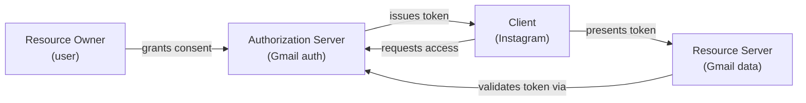
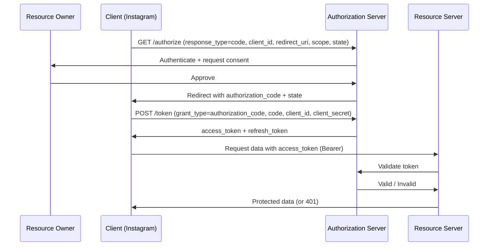
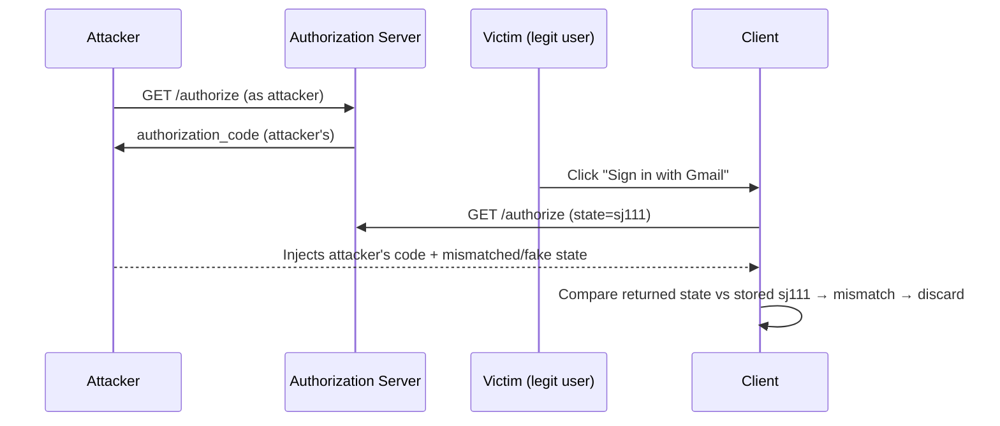
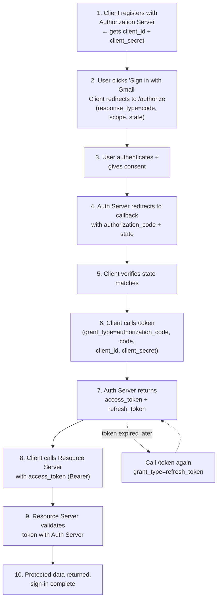

# OAuth 2.0

## Overview
- Authorization framework (OAuth = "Open Authorization") that lets a user grant a third-party app limited access to their protected data on another service, without sharing credentials with that third party.
- Classic example: "Sign in with Google" on a random website — the website (third party) gets your profile info without ever seeing your Google password.
- Interview-relevant because of the 4-actor model, the authorization code grant flow, and the token-based access model (access token + refresh token).
- Defines 5 grant types (mechanisms to obtain a token); Authorization Code Grant is the industry-standard one, the rest solve narrower cases.

## Key Concepts

### The four actors
- **Resource Owner** — the end user who owns the protected data (e.g. you, logged into Gmail).
- **Client** — the third-party application requesting access to the user's data (e.g. Instagram, wanting to use your Gmail profile to sign you in).
- **Authorization Server** — validates the resource owner's identity, collects consent, and issues tokens (e.g. Gmail's auth server). Often the same physical service as the resource server, but logically a separate role.
- **Resource Server** — hosts the actual protected data and serves it once a valid access token is presented (e.g. Gmail's data store holding your profile).

### Client registration (prerequisite)
- Before any flow can run, the client must register with the authorization server.
- Client sends: app name, up to 3 redirect URIs (callback URLs where the auth server can redirect the user).
- Authorization server returns: **client ID** (public identifier) and **client secret** (confidential, known only to client + auth server, used to authenticate the client itself).

### Authorization Code Grant flow
- The standard, most widely used grant type — two-step process: get an authorization code, then exchange it for tokens.
- **Step 1 — Authorize:** Client redirects the user to the authorization server's `/authorize` endpoint with `response_type=code`, `client_id`, optional `redirect_uri` (must match one registered, or the registered one is used by default), `scope` (space-separated list of data the client wants, e.g. email, profile, address), and `state` (random anti-CSRF value).
- User authenticates with the authorization server (if not already logged in) and gives consent to the requested scopes.
- **Step 2 — Redirect back:** Authorization server redirects to the client's callback URI with an `authorization_code` and the same `state` value echoed back.
- **Step 3 — Token exchange:** Client calls `/token` with `grant_type=authorization_code`, the received `code`, `redirect_uri`, `client_id`, and `client_secret` (proves client identity — this step is server-to-server, so the secret is safe to send).
- Authorization server responds with an **access_token** (short-lived, e.g. expires in 3600s), a **refresh_token** (long-lived), and `token_type=bearer` (tells the client to send it as `Authorization: Bearer <token>`).
- **Step 4 — Access protected resource:** Client calls the resource server with the access token; resource server validates the token with the authorization server, then returns the requested profile data (or a 401 if invalid).
- **Refreshing:** when the access token expires, client calls `/token` again with `grant_type=refresh_token` and the refresh token (no need to re-authenticate the user) to get a new access token + refresh token pair.

### CSRF protection via `state`
- Attack: attacker calls `/authorize` themselves, gets their own valid (unused) authorization code, and tricks the victim's browser into delivering that code to the client's callback endpoint (e.g. via a crafted redirect).
- Without a check, the client exchanges the attacker's code for a token, fetches the attacker's profile data, and logs the victim in as the attacker — victim's subsequent actions (uploads, posts) go to the attacker's account.
- Fix: client generates a unique, hard-to-guess `state` value per authorization request and stores it locally. When the callback arrives, client compares the returned `state` against what it sent — mismatch or missing state means the response is discarded as a potential CSRF attempt.
- `state` is recommended, not mandated by the spec, but is essential in practice.

### Other grant types
- **Implicit Grant** — deprecated/discouraged. Single-step: `/authorize` with `response_type=token` returns the access token directly in the redirect URI, no code exchange step. No refresh token issued (nothing to protect it, since there's no server-side exchange step).
- **Resource Owner Password Credentials Grant** — client collects the user's username/password directly and sends them to `/token` with `grant_type=password`, plus client ID/secret and scope. Skips the `/authorize` redirect entirely. Issues access + refresh tokens. Only appropriate for highly trusted first-party clients (spec discourages it generally since it exposes credentials to the client).
- **Client Credentials Grant** — used when the client *is* the resource owner (machine-to-machine access, no separate end user). Calls `/token` with `grant_type=client_credentials`, client ID/secret, and scope. Returns only an access token — no refresh token, since a new one can be minted anytime with the same client credentials.

## Trade-offs / Comparisons
| Grant Type | Steps | Refresh token? | Use case |
|---|---|---|---|
| Authorization Code | 2 (authorize → token) | Yes | Standard web/mobile apps — most secure, recommended |
| Implicit | 1 (authorize returns token) | No | Legacy SPA pattern, now discouraged |
| Resource Owner Password Credentials | 1 (token, with username/password) | Yes | Highly trusted first-party clients only |
| Client Credentials | 1 (token, with client creds) | No | Machine-to-machine, client is also the resource owner |

## Example / Walkthrough
- User "Shan" is logged into Gmail and wants to sign into Instagram using "Sign in with Gmail."
- Instagram (client) first registers with Gmail's authorization server, receiving a client ID and client secret, plus up to 3 registered redirect URIs.
- Shan clicks "Sign in with Gmail" → Instagram redirects to Gmail's `/authorize` with `response_type=code`, its client ID, a redirect URI, scope (email, profile, address), and a random `state=sj111`.
- Shan authenticates with Gmail (if needed) and approves the consent screen listing what Instagram wants to access.
- Gmail redirects back to Instagram's callback with an `authorization_code` and `state=sj111`; Instagram verifies the state matches what it sent.
- Instagram calls Gmail's `/token` endpoint with `grant_type=authorization_code`, the code, redirect URI, client ID, and client secret.
- Gmail responds with `access_token` (expires in 3600s), `refresh_token`, `token_type=bearer`.
- Instagram calls Gmail's resource endpoint with the access token to fetch Shan's profile (email, name, etc.) and completes sign-in.
- When the access token expires, Instagram calls `/token` again with `grant_type=refresh_token` and the refresh token to get a fresh access + refresh token pair, without Shan re-entering credentials.

## Diagram

## Interview Q&A

What are the four actors in OAuth 2.0 and their roles?

Resource Owner (the user), Client (third-party app requesting access), Authorization Server (authenticates the user and issues tokens), Resource Server (hosts and serves the protected data after validating the token).

Why does OAuth use a two-step authorization code flow instead of returning the token directly?

The code is exchanged for a token in a server-to-server call where the client can safely present its client_secret, keeping the token exchange off the user's browser/redirect URL (which can be logged, cached, or leaked via referrer headers).

What's the difference between an access token and a refresh token?

Access token is short-lived (e.g. 1 hour) and used to actually call protected resource endpoints; refresh token is long-lived and used only to obtain a new access token without re-authenticating the user.

What does the `state` parameter protect against, and how?

CSRF attacks, where an attacker tricks a victim's client into accepting the attacker's authorization code. The client generates a unique state value, sends it with the authorize request, and rejects any callback whose returned state doesn't match.

Why is the Implicit Grant discouraged?

It skips the code-exchange step and returns the access token directly in a redirect URL, exposing it to browser history, logs, and referrer leaks, with no refresh token support since there's no secure server-side exchange.

When would you use the Client Credentials grant over Authorization Code?

When the client itself is the resource owner — i.e. machine-to-machine access with no separate end user involved, such as a backend service accessing its own data.

What is the client secret used for, and when is it sent?

It authenticates the client itself to the authorization server (proving "I am the registered Instagram app," not an impersonator). It's sent during the token exchange step, not during the initial browser redirect to /authorize.

What does `token_type=bearer` mean in the token response?

It tells the client how to use the access token — attach it in the `Authorization: Bearer <token>` header on requests to the resource server.

## Related Topics
- Links to other notes, if relevant (fill in later as more topics land)
