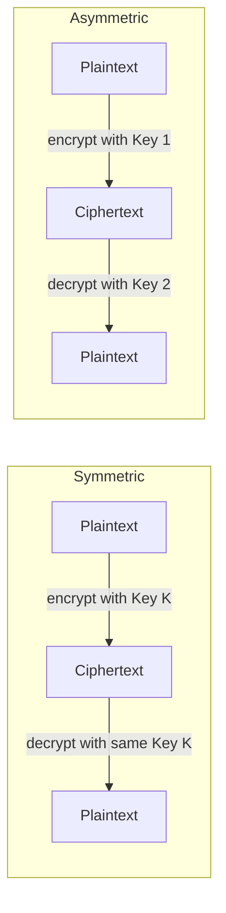
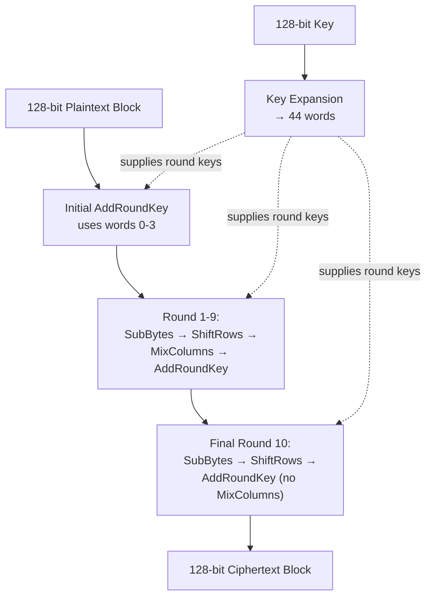
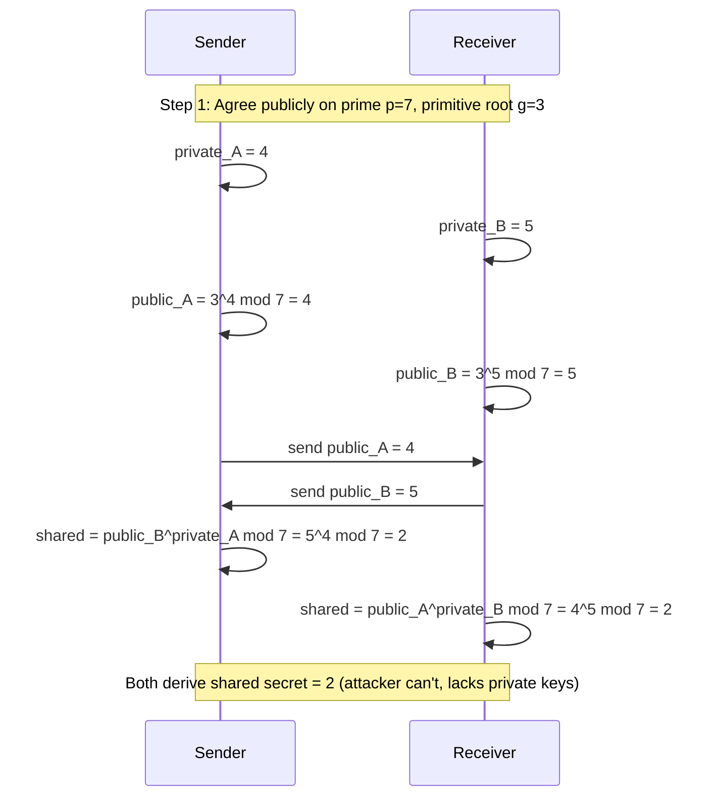
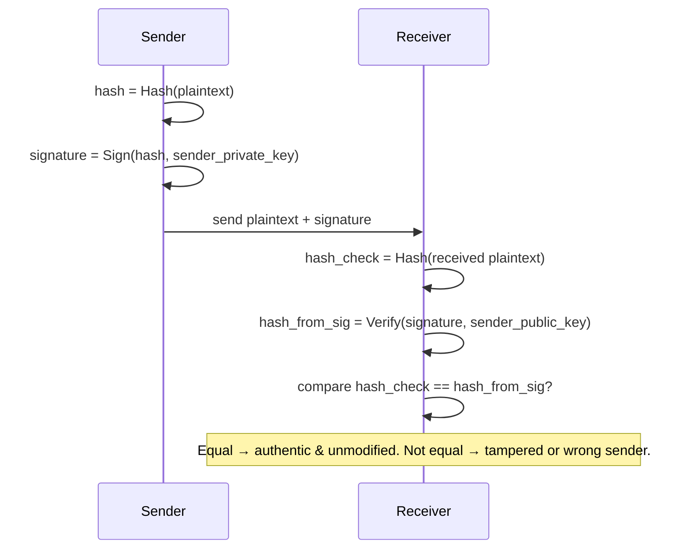
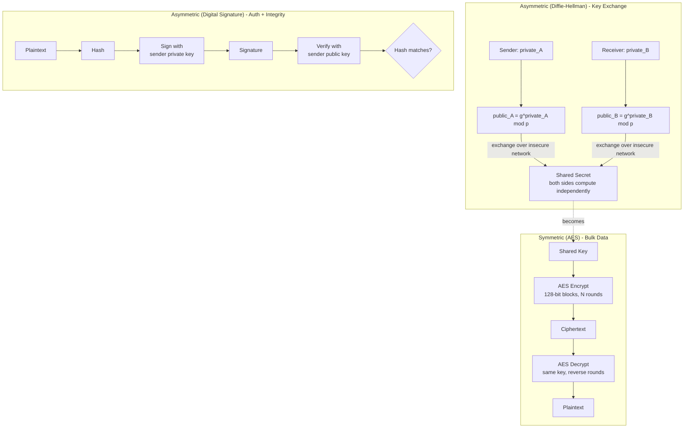

# Symmetric & Asymmetric Encryption (AES, Diffie-Hellman, Digital Signature)

## Overview
- Cryptography underlies HTTPS, end-to-end encrypted chat, and JWT — foundational to system design security.
- Encryption converts readable plaintext into unreadable ciphertext using a cryptographic key; decryption reverses it.
- Two families — symmetric (one shared key) and asymmetric (public/private key pair) — are complementary, not competitors: real systems (e.g. chat apps) use both together.
- Sets up JWT (next topic), which relies on digital signatures covered here.

## Key Concepts

### Symmetric vs Asymmetric encryption
- **Symmetric encryption** — the same key encrypts and decrypts. Sender and receiver must both know this one shared key.
- **Asymmetric encryption** — uses a key pair: public key and private key. Which key encrypts vs decrypts depends on the use case — normal encryption uses public key to encrypt / private key to decrypt, but digital signatures flip it (private key signs, public key verifies).
- Symmetric algorithms: **DES** (56-bit key, cracked via brute force by 2005, deprecated) and **AES** (Advanced Encryption Standard — 128/192/256-bit keys, current standard).
- Asymmetric algorithms: **RSA** (2048-bit typical key length), **DSA**, **Diffie-Hellman**, **ECC**.

### Trade-offs: symmetric vs asymmetric
- **Symmetric — advantage:** fast, low computation (key length caps at 256 bits) — good for bulk data like ongoing chat message encryption.
- **Symmetric — disadvantage 1:** key distribution problem — sender and receiver must agree on the same key over the network; if a hacker intercepts that exchange, they get the key and can decrypt everything.
- **Symmetric — disadvantage 2:** as client count grows, the server must generate, track, and distribute a unique key per client (key management overhead scales with client count).
- **Asymmetric — advantage 1:** no key-distribution security issue — the private key is never transmitted over the network, so even if a hacker captures ciphertext and the public key, they can't decrypt without the private key.
- **Asymmetric — advantage 2:** enables key-exchange protocols like Diffie-Hellman, which securely hand off a symmetric key over an insecure network.
- **Asymmetric — advantage 3:** enables digital signatures (authentication + integrity).
- **Asymmetric — disadvantage:** computation-intensive (large key lengths, e.g. RSA's 2048 bits, involve expensive modular exponentiation) — too slow for encrypting bulk data.
- **Practical pattern:** use Diffie-Hellman (asymmetric) to securely exchange a symmetric key, then use that symmetric key (e.g. AES) for the actual bulk data encryption — combines security of asymmetric key exchange with speed of symmetric bulk encryption.

| | Symmetric | Asymmetric |
|---|---|---|
| Keys | 1 shared key | Public + private key pair |
| Speed | Fast, low computation | Slow, computation-heavy |
| Key length | Up to 256 bits (AES) | ~2048 bits (RSA) |
| Best for | Bulk data encryption | Key exchange, signatures, authentication |
| Main risk | Key distribution over insecure network | N/A (private key never transmitted) |

### AES (Advanced Encryption Standard)
- Symmetric block cipher — processes data in fixed 128-bit blocks regardless of total data size.
- Key sizes: 128 / 192 / 256 bits — larger key = more security but more computation (slower).
- Core terminology:
  - **State array** — a 128-bit block (data or key) organized as a 4×4 matrix of bytes (16 bytes × 8 bits = 128 bits).
  - **Word** — a set of 4 bytes (one column of the state array).
  - **Round key** — a set of 4 words (i.e. a full 128-bit state array's worth of key material) used in one round.
- **Key expansion:** the original 128-bit key (4 words) is expanded into 44 words total, via repeated XOR of prior words (with a transform function applied periodically) — enough words to supply every round.
- **Round count depends on key size:** 128-bit key → 10 rounds, 192-bit → 12 rounds, 256-bit → 14 rounds.
- Each round performs 4 steps: **SubBytes** (substitute each byte via a lookup transform), **ShiftRows** (circular shift each row), **MixColumns** (mix column values via XOR-based transform), **AddRoundKey** (XOR the state with that round's key, consumed 4 words at a time).
- An initial AddRoundKey happens before the round loop starts (consumes the first 4 words); the final round's word usage brings total consumption to 44 words (4 initial + 4×10 across rounds for the 128-bit case).
- Decryption runs the same round structure in reverse, using inverse transforms, to recover the original 128-bit plaintext block.

### Diffie-Hellman key exchange
- Asymmetric protocol that lets two parties agree on a shared secret key over an insecure network, without ever transmitting the secret itself.
- **Step 1 — Public agreement:** both sides openly share (over the insecure network) a prime number `p` and a primitive root `g` of that prime — visible to any eavesdropper.
- **Step 2 — Private key generation:** each side independently and randomly generates its own private key, never shared.
- **Step 3 — Public key calculation:** each side computes `public = g^private mod p`, then exchanges these public values over the network (still visible to an eavesdropper).
- **Step 4 — Shared secret:** each side computes `shared_secret = other_party_public^own_private mod p` — both sides arrive at the identical value due to modular exponentiation's commutativity.
- **Why it's secure:** an eavesdropper sees `p`, `g`, and both public keys, but computing the private key from a public key (`g^private mod p`) is a discrete logarithm problem — computationally infeasible when the private key is chosen large enough; brute force would take years.

### Digital signature
- Provides two guarantees: **authentication** (data really came from the claimed sender) and **integrity** (data wasn't modified in transit).
- Built on asymmetric encryption — signs with the sender's private key, verifies with the sender's public key (opposite direction from normal public-key encryption).
- **Signing (sender side):** plaintext → hash function → fixed-size hash value → sign algorithm (using sender's private key) → signature. Sender transmits plaintext + signature together.
- **Verifying (receiver side):** receiver independently hashes the received plaintext, and separately runs the signature through a verify algorithm using the sender's public key to recover the original hash. If the two hash values match, data is authentic and unmodified; mismatch means the data was altered or wasn't signed by the claimed sender.
- Hash function property exploited: identical input always produces identical hash; even a tiny change in input produces a completely different hash.

## Trade-offs / Comparisons
- See the symmetric vs asymmetric table above under Key Concepts.
- **DES vs AES:** DES uses a 56-bit key and was cracked by brute force by 2005; AES uses 128/192/256-bit keys and remains the current standard — larger key length trades speed for security.
- **Diffie-Hellman vs plain symmetric key sharing:** plain symmetric requires transmitting the actual key (vulnerable to interception); Diffie-Hellman lets both sides derive the same secret without ever transmitting it.

## Example / Walkthrough
- **Basic encryption illustration:** plaintext "concept coding" passed through a toy Caesar-like cipher with key=2 shifts each letter forward (C→E, etc.) to produce ciphertext — illustrates that encryption = data + key run through an algorithm.
- **Symmetric example:** sender encrypts plaintext with key=5, produces ciphertext; receiver decrypts the same ciphertext using the same key=5 to recover plaintext.
- **Asymmetric example:** sender encrypts with Key1 (e.g. receiver's public key), receiver decrypts with Key2 (receiver's private key) — different keys used at each end.
- **Diffie-Hellman worked example:** prime `p=7`, primitive root `g=3` (shared publicly). Sender's private key=4, computes public key = 3^4 mod 7 = 4. Receiver's private key=5, computes public key = 3^5 mod 7 = 5. Public keys exchanged. Sender computes shared secret = 5^4 mod 7 = 2; receiver computes 4^5 mod 7 = 2 — both arrive at the same shared secret key=2, while an eavesdropper who saw p, g, and both public keys still cannot derive it without either private key.
- **AES key expansion example:** starting from a 128-bit key (words 0-3 taken directly from the key bytes), word 4 = XOR(transform(word 3), word 0); word 5 = XOR(word 4, word 1); word 6 = XOR(word 5, word 2); word 7 = XOR(word 6, word 3); this pattern (with periodic transform applied) continues until all 44 words are generated.

## Diagram

## Interview Q&A

Why do real systems use both symmetric and asymmetric encryption instead of just one?

Asymmetric solves the key-distribution problem securely but is too slow for bulk data; symmetric is fast but needs a securely shared key. So asymmetric (e.g. Diffie-Hellman) is used to exchange a symmetric key safely, then that symmetric key (e.g. AES) handles the actual bulk data encryption.

What's the core security weakness of symmetric encryption, and how is it solved?

The two parties must share the same secret key, and transmitting that key over an insecure network risks interception. Diffie-Hellman (asymmetric) solves this by letting both sides derive an identical shared secret without ever transmitting the secret itself.

Why is AES faster than RSA?

AES uses much shorter keys (max 256 bits) versus RSA's ~2048 bits; the computational cost (especially RSA's modular exponentiation) scales with key length, so AES's smaller keys mean far less computation per operation.

Why is Diffie-Hellman considered secure even though the prime, primitive root, and both public keys are transmitted in the clear?

Deriving a private key from its public key requires solving `g^private mod p = public` for `private` — a discrete logarithm problem that's computationally infeasible to brute-force when the private key is chosen large enough, even with full knowledge of the public values.

How does a digital signature provide both authentication and integrity?

The sender hashes the plaintext and signs the hash with their private key. The receiver re-hashes the received plaintext and separately recovers the original hash by verifying the signature with the sender's public key; only the real sender's private key produces a signature verifiable that way (authentication), and any change to the plaintext changes its hash, causing a mismatch (integrity).

In a digital signature, which key signs and which key verifies — and how does this differ from normal asymmetric encryption?

Signing uses the sender's private key; verifying uses the sender's public key — the reverse of typical asymmetric encryption, where data is usually encrypted with the recipient's public key and decrypted with their private key.

What are the two properties of a hash function that make digital signatures work?

Same input always produces the same hash output (deterministic), and even a tiny change in input produces a completely different, fixed-size hash output — so any tampering with the data is detectable.

Why was DES deprecated in favor of AES?

DES uses only a 56-bit key, which was cracked via brute force by around 2005; AES supports 128/192/256-bit keys, making brute-force attacks computationally infeasible.

## Related Topics
- Links to other notes, if relevant (fill in later as more topics land)
