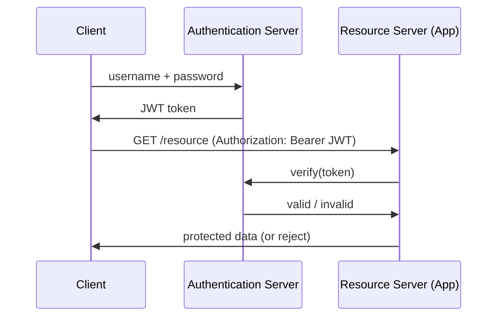
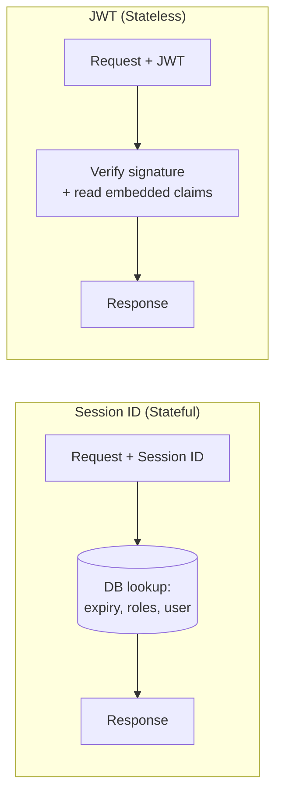
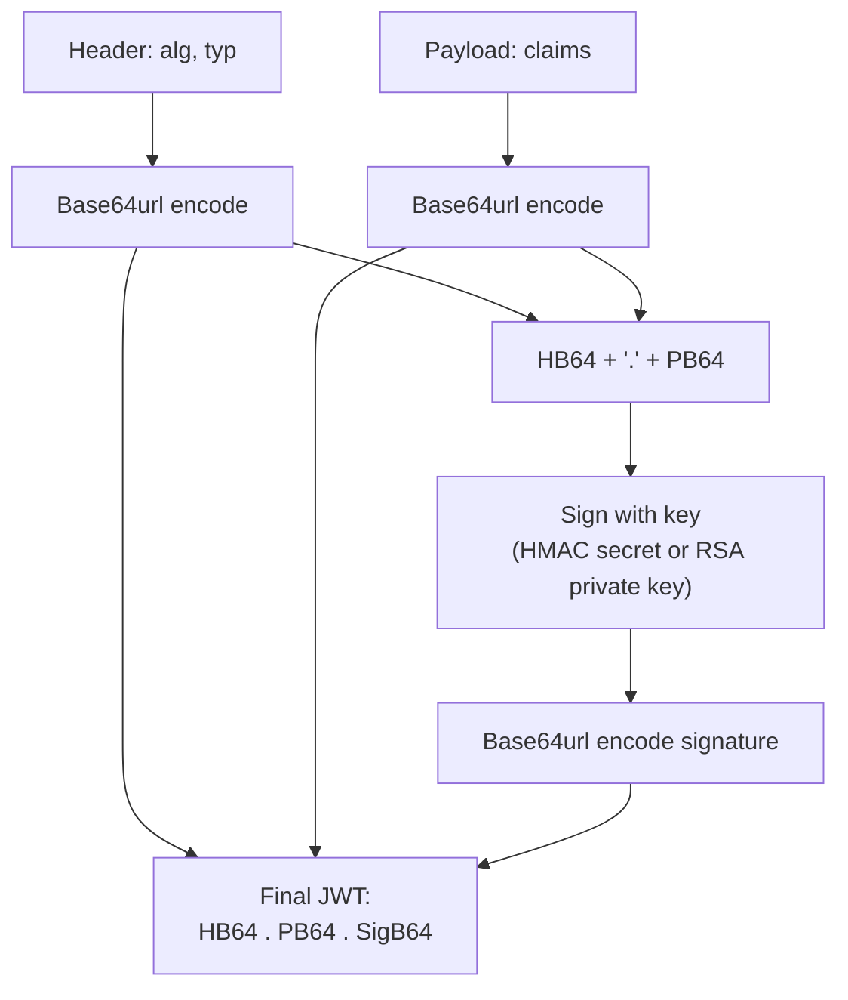
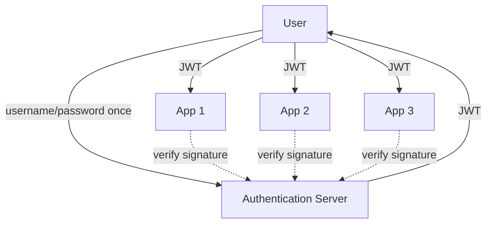
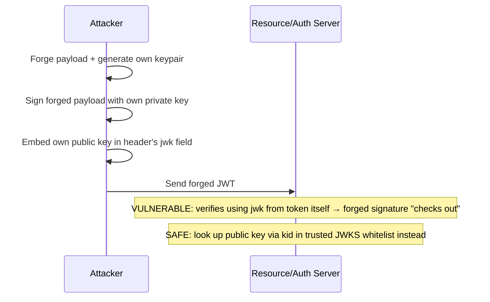
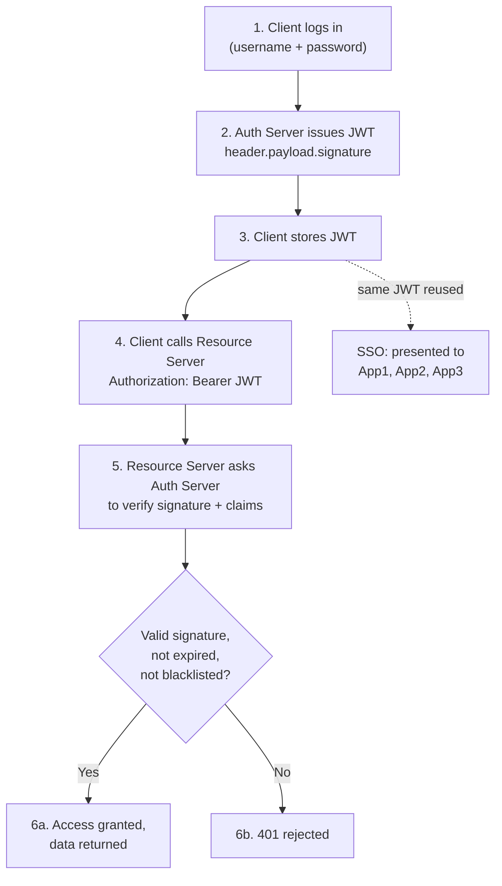

# JWT (JSON Web Token)

## Overview
- A secure way to transmit information between parties as a JSON object, digitally signed so tampering can be detected — built on top of the cryptography concepts (RSA, HMAC, digital signatures) from [[25-symmetric-asymmetric-encryption]].
- Originally just a transmission format, but now heavily used for **authentication** (confirming identity), **authorization** (checking permissions), and **SSO** (single sign-on across multiple apps).
- Directly linked to OAuth ([[24-oauth-2]]) — OAuth flows commonly issue JWTs as the access token.
- Its key property is **statelessness** — the token itself carries all the information a server needs, unlike the older session-ID model which required a DB lookup per request.

## Key Concepts

### JWT authentication flow
- Client sends username/password to an authentication server (often a third-party library/service that handles token generation and validation).
- Authentication server generates a JWT and returns it to the client.
- Client calls the resource server (application) for protected data, passing the JWT in the request header.
- Resource server internally calls the authentication server's verify API with the token.
- Authentication server validates the token (signature, expiry, etc.) and confirms validity.
- If valid, resource server grants access and returns the requested data.

### JWT vs Session ID (JSESSIONID)
- **Session ID model (stateful):** client logs in → server generates a session ID, stores it in DB along with expiry, user info, and roles → returns ID to client. Every subsequent request sends the session ID (via cookie); server must query the DB every time to validate and fetch user info/roles.
- **Problems with session ID:** every request triggers a DB (or cache) lookup, adding latency; in a distributed system, the DB/cluster storing sessions must stay synced across nodes, adding operational complexity.
- **JWT model (stateless):** all necessary info (expiry, user ID, roles, claims) is embedded directly in the signed token itself — no DB touch needed to validate a request, only signature verification.

### JWT structure
- Three base64url-encoded parts joined by dots: `header.payload.signature`.
- **Header** — metadata: `typ` (always "JWT"), `alg` (signing algorithm — RSA or HMAC).
- **Payload** — the claims (the actual data), split into three categories:
  - **Registered claims** — reserved, standardized names with specific meaning: `iss` (issuer), `sub` (subject/user ID), `aud` (audience/intended recipient), `exp` (expiry time), `nbf` (not-before time), `iat` (issued-at time), `jti` (unique token ID).
  - **Public claims** — custom fields with names understood by multiple parties (e.g. `email`, `country`) — safe to add, but never put confidential data (e.g. passwords) here.
  - **Private claims** — custom fields meant only for internal use by the issuer (e.g. one auth server adding an internal flag); other resource servers won't understand or rely on them.
- **Signature** — computed by base64url-encoding the header and payload, concatenating them with a dot, then signing that string with a key (HMAC secret or RSA private key) via the chosen algorithm; the result is base64url-encoded and appended as the third segment.
- JWT and JWS (JSON Web Signature) are used almost interchangeably in practice — a JWT without a signature (`alg: none`) is called an **unsecured JWT** and must always be rejected.
- JWE (JSON Web Encryption) is the variant where the payload is encrypted (not just encoded) — used when payload confidentiality matters, since a signed-but-unencrypted JWT payload is just base64, trivially decodable by anyone.

### Sending JWT — Authorization header
- JWT is passed from client to server in the `Authorization` header, prefixed with `Bearer` (e.g. `Authorization: Bearer <token>`).
- `Basic` prefix is reserved for base64-encoded `username:password` credentials — different logic path on the server.
- `Bearer` tells the server "this is a token, validate it," distinct from `Basic` credential handling — an industry-standard convention for passing any kind of credential in requests.

### Single Sign-On (SSO) via JWT
- User authenticates once with the authentication server and receives a JWT.
- The same JWT is then presented to multiple different apps (App1, App2, App3) belonging to the same ecosystem/company.
- Each app independently verifies the JWT's signature (and can read embedded user info like name/email directly from the payload) without requiring the user to log in again.

### Challenge 1 — Token invalidation before expiry
- Because JWT is stateless, the server has no built-in way to revoke a specific token before its `exp` time — a big problem if, say, a fraud/malicious user needs to be blocked immediately.
- **Solution A — Blacklist:** authentication server maintains a blacklist of revoked token IDs (`jti`) in a DB/cache; every validation checks against this list. Re-introduces the DB/cache lookup that stateless JWT was meant to avoid.
- **Solution B — Rotate signing key:** change the signing key (e.g. new RSA key pair) so old tokens fail signature verification. Blunt instrument — invalidates *all* tokens signed with the old key, including genuine users', forcing them to re-authenticate.
- **Solution C — Short-lived tokens:** issue tokens valid for only a few minutes instead of days/weeks, shrinking the exposure window; often combined with refresh tokens.
- **Solution D — One-time-use tokens:** track `jti` usage so a token can only be redeemed once, then a new one must be issued — also requires some lookup/cache to track "seen" tokens.
- In practice, short-lived tokens (5–10 minutes) are the most popular mitigation, sometimes combined with a blacklist for immediate revocation needs.

### Challenge 2 — Encoded, not encrypted (less secure)
- The payload is only base64url-**encoded**, not encrypted — anyone intercepting the token can trivially decode and read the claims (though they can't forge a valid signature without the signing key).
- **Fix:** use **JWE** (JSON Web Encryption) instead — encrypts the payload itself (e.g. via RSA: encrypt with public key, decrypt with private key), so intercepted tokens can't be read without the decryption key.
- Rule of thumb: never place confidential/sensitive data (passwords, secrets) in a plain JWT payload, since it's readable by anyone with the token.

### Challenge 3 — Unsecured JWT (alg: none)
- A JWT with `alg: none` in the header has no signature at all — this is called an **unsecured JWT**.
- Since there's no way to verify authenticity or integrity, such tokens must always be rejected by a properly implemented verifier.
- In practice JWT and JWS are treated as synonymous because no legitimate system issues unsigned (`alg: none`) tokens.

### Challenge 4 — JWK exploit (embedded public key attack)
- The header can optionally carry a `jwk` (JSON Web Key) field containing the public key material (modulus `n` + exponent `e` for RSA) directly in the token.
- **Attack:** an attacker forges a token — modifies the payload, generates their own key pair, signs with their private key, and embeds their own public key in the `jwk` header field. If the resource/auth server naively verifies the signature using the public key found inside the token's own header, the forged signature checks out (since it matches the attacker's own key), and the tampered payload is accepted as valid.
- **Fix:** never trust or use a public key supplied inside the token's own `jwk` header for verification — instead use `kid` (Key ID) to look up the corresponding public key from a **trusted, pre-registered whitelist** (the auth server's own well-known JWKS endpoint, e.g. `.well-known/jwks.json`), never from the token itself.
- Underlines why choosing a reputable, security-conscious third-party auth provider matters — a compromised or poorly implemented provider's whitelist could itself be manipulated.

## Trade-offs / Comparisons
| | Session ID (JSESSIONID) | JWT |
|---|---|---|
| State | Stateful — server stores session in DB | Stateless — token self-contains claims |
| Per-request cost | DB/cache lookup required every request | Just signature verification, no DB touch (unless blacklisting) |
| Distributed systems | Needs session store sync across nodes | No shared state needed to validate |
| Revocation before expiry | Easy — delete session record | Hard — needs blacklist, key rotation, or short expiry |
| Payload visibility | Opaque ID, data stays server-side | Base64-encoded, readable by anyone with the token (unless JWE) |

## Example / Walkthrough
- **JWT authentication example:** client authenticates with username/password, receives a JWT, then calls a resource server's GET API passing `Authorization: Bearer <JWT>` in the header; resource server calls the auth server's verify endpoint before granting access.
- **SSO example:** user logs into a company's App1 with username/password and gets a JWT; when opening App2 or App3 in the same ecosystem, the same JWT is presented, each app verifies it independently, and the user is signed in without re-entering credentials.
- **Token invalidation scenario:** a user flagged as fraudulent still holds a JWT valid until, say, April 21st — since JWT is stateless, the server can't simply "delete" it; mitigations are blacklisting the `jti`, rotating the signing key, or having issued only a short-lived token in the first place.
- **JWK exploit scenario:** attacker modifies a token's payload, signs it with their own key, and embeds their own public key in the `jwk` header field — a naive verifier that trusts the embedded key accepts the forged token as valid; the fix is verifying via `kid` against a pre-registered, trusted whitelist of public keys instead.

## Diagram

## Interview Q&A

Why is JWT called "stateless" compared to session-ID based auth?

All the information a server needs (expiry, user identity, roles) is embedded directly in the signed token itself, so validating a request only requires checking the signature — no DB or cache lookup is needed, unlike session IDs which require querying stored session state every request.

What are the three parts of a JWT, and what does each contain?

Header (metadata: token type, signing algorithm), Payload (claims — registered like exp/iss/sub, public like email/country, or private/internal-only), and Signature (cryptographic proof computed over the base64url-encoded header+payload, used to detect tampering).

How do you invalidate a JWT before its expiry time, given that JWT is stateless?

No single clean solution: maintain a blacklist of revoked token IDs (jti) checked on every validation (reintroduces a lookup), rotate the signing key (invalidates all tokens including genuine ones), or minimize the problem by issuing very short-lived tokens (e.g. 5-10 minutes) possibly combined with one-time-use enforcement.

Why is a JWT considered "encoded, not encrypted," and why does that matter?

The payload is only base64url-encoded, which anyone can trivially decode to read the claims — it's not confidential. Sensitive data should never go in a plain JWT payload; if payload confidentiality is required, use JWE (JSON Web Encryption) which actually encrypts the payload.

What is an "unsecured JWT" and how should a server handle one?

A JWT with `alg: none` in its header, meaning there's no signature to verify authenticity or integrity. Such tokens must always be rejected — no legitimate system should accept them.

Explain the JWK exploit and how to defend against it.

An attacker can embed their own public key directly in a forged token's `jwk` header field and sign the token with the matching private key; if the verifier naively uses that embedded key to check the signature, the forgery passes. Defense: never trust a public key from the token's own header — instead resolve the key via the token's `kid` against a separately maintained, trusted whitelist (e.g. the auth server's well-known JWKS endpoint).

What does the "Bearer" prefix in the Authorization header signify, and how does it differ from "Basic"?

`Bearer <token>` tells the server it's receiving a token (like a JWT) to validate; `Basic <base64>` signals base64-encoded username:password credentials instead — servers branch their handling logic based on which prefix is present.

How does JWT enable Single Sign-On (SSO) across multiple applications?

A user authenticates once and receives a JWT; that same signed token, containing user info in its payload, is then presented to and independently verified by multiple separate apps in the ecosystem, letting the user access all of them without re-entering credentials.

## Related Topics
- [[24-oauth-2]] — OAuth flows commonly issue JWTs as the access token
- [[25-symmetric-asymmetric-encryption]] — RSA/HMAC signing and digital signature mechanics that JWT's signature step relies on
