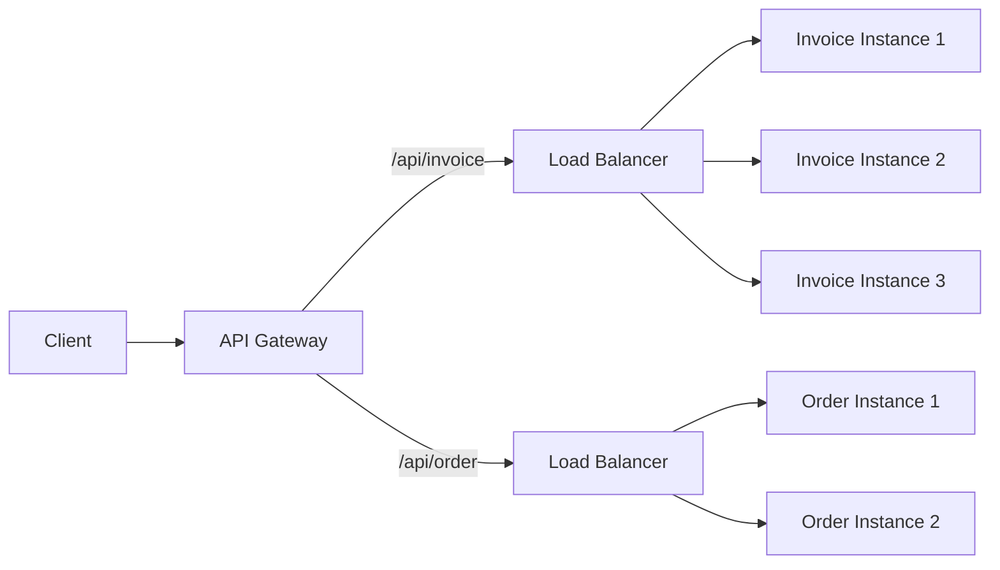
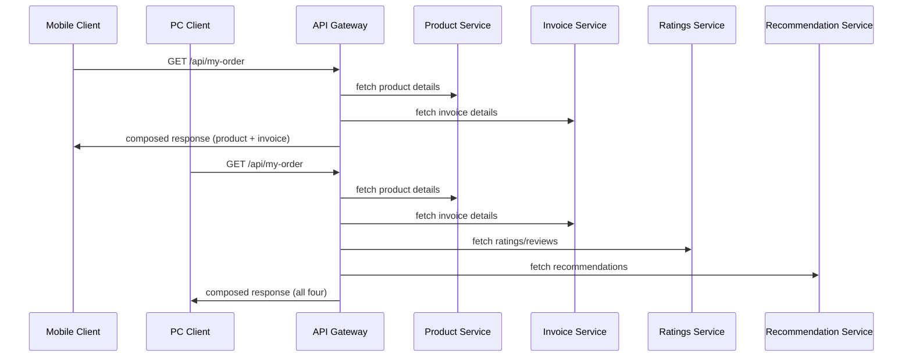
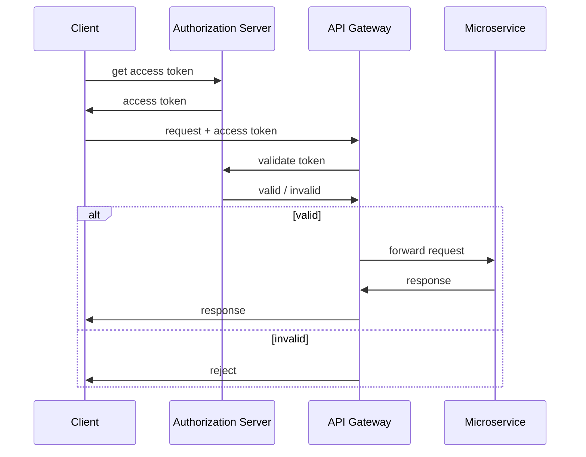
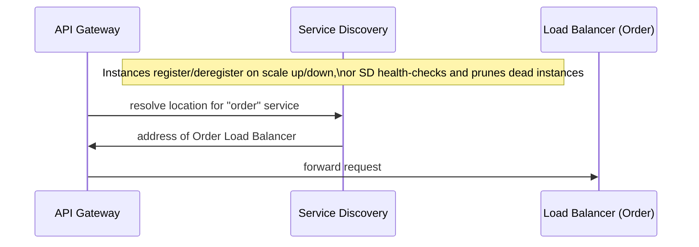
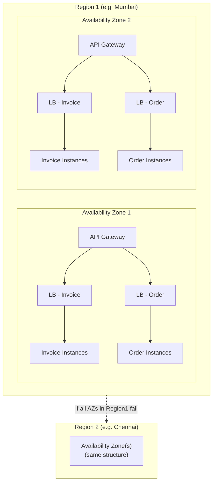
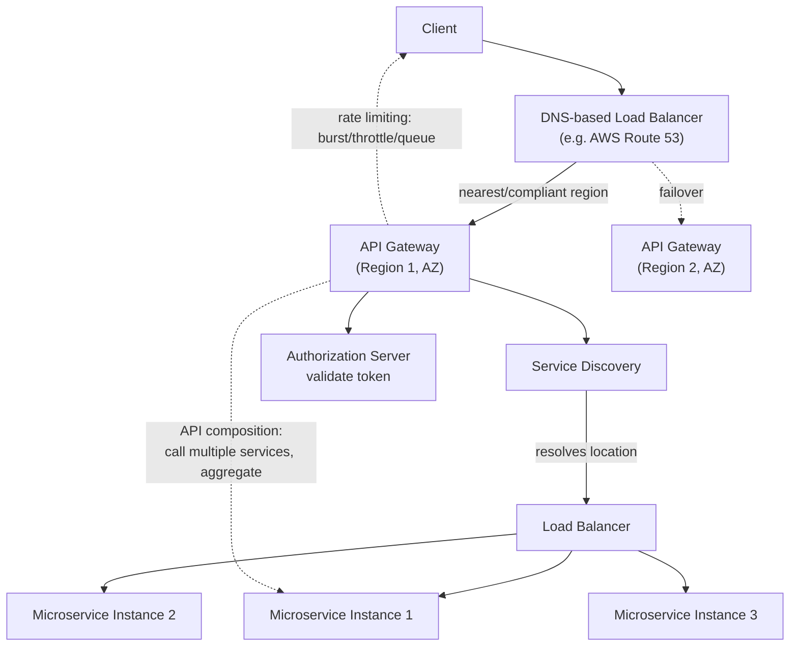

# API Gateway

## Overview
- Single entry point that accepts client API requests and routes them to the correct backend microservice based on the API endpoint.
- Frequently asked interview topic: "how does a single entry point handle millions of requests per second?" and "how is API Gateway different from a load balancer?"
- Much more intelligent than a load balancer — it understands the API structure/endpoint, not just raw traffic distribution.
- In production it's never truly a single point of failure — achieved via multi-instance, multi-availability-zone, multi-region deployment behind a DNS-based load balancer.

## Key Concepts

### API Gateway vs Load Balancer
- **API Gateway** — inspects the API endpoint (e.g. `/api/invoice` vs `/api/order`) and decides *which microservice* to route the request to.
- **Load Balancer** — has no understanding of API structure; it simply distributes traffic evenly across multiple *instances of the same* microservice (e.g. Invoice Microservice instance 1, 2, 3).
- Key distinction: Gateway decides *where* (which service) based on content; load balancer decides *which instance* of an already-chosen service, with no content awareness.

### API composition
- Problem: different client devices (mobile vs PC) need different amounts of data from potentially different microservices for the same logical page (e.g. "My Orders").
- Mobile (low bandwidth) might need just product + invoice details; PC (more bandwidth) might also need ratings, reviews, recommendations — pulled from additional microservices.
- Without API composition, the client itself has to call multiple APIs and stitch results together — added client-side complexity.
- **API composition** moves this orchestration into the Gateway: client calls one endpoint (e.g. `/api/my-order`), and the Gateway intelligently calls the right set of backend microservices depending on context (device type, etc.), aggregates results, and returns a single response.
- Heavily used by Netflix's API Gateway implementation.

### Authentication at the Gateway
- Client first obtains an access token from the authorization server (e.g. via OAuth 2.0 — see [[24-oauth-2]]).
- On subsequent requests, client passes this token to the API Gateway.
- Gateway integrates with the authorization server to validate the token before forwarding the request to any microservice.
- Centralizes authentication logic at the front door instead of duplicating auth checks inside every individual microservice.

### Rate limiting
- **Burst limit** — caps the maximum number of concurrent requests the Gateway can handle at peak before returning `429 Too Many Requests` (e.g. AWS/Azure API Gateway lets you configure this, e.g. 500).
- **API throttling** — more granular per-API or per-user/application limits, e.g. "`/api/invoice` cannot be invoked more than 10 times per minute" (globally, or per specific user) — the 11th call in that window is blocked.
- **IP-based blocking** — rules to block requests from specific IP addresses.
- **API queuing** — holds requests that can't be processed immediately (e.g. traffic beyond the burst limit) in a waiting area until bandwidth frees up, helping absorb thundering-herd spikes rather than outright rejecting all excess traffic.

### Service Discovery
- Problem: microservice instances scale up/down dynamically, so their IP addresses and ports constantly change — something needs to track current live locations.
- **Two approaches:**
  - **Self-registration** — each microservice instance registers/deregisters itself with the service discovery component on scale up/down.
  - **Active health checks** — service discovery periodically health-checks all registered instances and removes any that stop responding (no heartbeat), keeping only active locations.
- Example tools: **Eureka**, **Zookeeper** (mentioned as software providing service discovery).
- API Gateway queries service discovery to resolve "give me a location for the order microservice" before routing a request; sometimes service discovery is a separate component, sometimes built directly into the Gateway.

### Other Gateway capabilities
- **Request/response transformation** — modify incoming requests or outgoing responses to match company-specific formats/needs.
- **Response caching** — cache responses at the Gateway so repeated identical requests are served directly without re-invoking the backend API.
- **Logging** — centralized request/response logging at the entry point.

### Scaling beyond a single Gateway — regions & availability zones
- **Region** — a broad geographic area (e.g. Mumbai).
- **Availability Zone (AZ)** — a distinct sub-area within a region (e.g. Bandra), each with its own dedicated data center that shares no resources with other AZs.
- If one AZ goes down, traffic shifts to another AZ in the same region — not a single point of failure. Only if *all* AZs in a region fail is the entire region considered down, at which point traffic can fail over to another region entirely.
- Within each AZ: multiple microservice instances behind a load balancer per microservice, feeding into a regional API Gateway that itself has multiple instances.
- The API Gateway checks with Service Discovery to determine the nearest/appropriate AZ and correct load balancer for a given request (based on criteria like user location).

### DNS-based load balancing across Gateways/regions
- Since API Gateway itself has multiple instances across multiple regions, something must route client traffic to the *right* Gateway/region — this is done by a **DNS-based load balancer**.
- Examples: **AWS Route 53**, **Azure Traffic Manager**.
- Applies intelligent routing rules similar to service discovery — based on latency, geographic proximity, and compliance requirements (e.g. certain countries' traffic must legally stay within a specific region, even if a closer region exists).
- DNS itself is not a single point of failure — it's a hierarchical, distributed system (local DNS → root DNS → top-level DNS → authoritative DNS), not a single instance (deeper DNS mechanics flagged as a separate future topic).

## Trade-offs / Comparisons
| | API Gateway | Load Balancer |
|---|---|---|
| Awareness | Understands API endpoints/content | No content awareness |
| Routing decision | Which microservice to call | Which instance of a chosen service |
| Position in flow | Front door, before/around load balancers | Behind the Gateway, per-microservice |
| Extra capabilities | Auth, rate limiting, composition, caching, transformation | Traffic distribution only |

## Example / Walkthrough
- **API composition example:** an e-commerce "My Orders" page — mobile client gets product + invoice details (2 microservice calls composed by the Gateway); PC client additionally gets ratings/reviews and recommendations (4 microservice calls composed by the Gateway) — all behind the same single client-facing endpoint.
- **Rate limiting example:** burst limit set to 500 concurrent requests on AWS/Azure API Gateway; requests beyond that get `429`, or are queued if API queuing is enabled. Throttling example: `/api/invoice` capped at 10 calls/minute per user — the 11th call in that window is blocked.
- **Region/AZ example:** Mumbai region has AZ1 (Bandra) and AZ2 (another area), each with a full independent stack (Gateway, load balancers, microservice instances); Chennai serves as a second region for full regional failover. Traffic is routed to the nearest AZ/region via a DNS-based load balancer (e.g. Route 53), factoring in latency and compliance (e.g. a country whose traffic must legally stay in a specific region).

## Diagram

## Interview Q&A

How is an API Gateway different from a load balancer?

A load balancer just distributes traffic across multiple instances of the same microservice with no understanding of the request content. An API Gateway inspects the API endpoint itself and decides which distinct microservice the request should be routed to, plus offers extra capabilities like auth, rate limiting, and composition.

If API Gateway is described as a "single entry point," how does it handle millions of requests per second without being a bottleneck?

It isn't a single physical instance — there are multiple Gateway instances deployed across multiple Availability Zones and Regions, each fronting its own load balancers and microservice instances. A DNS-based load balancer (e.g. Route 53) routes each client to the nearest/appropriate regional Gateway, so load is distributed and there's no single point of failure.

What is API composition and what problem does it solve?

It lets the Gateway aggregate results from multiple backend microservice calls into a single response for one client-facing endpoint, based on context (e.g. device type) — avoiding the need for the client itself to call multiple APIs and stitch the results together. Netflix's Gateway makes heavy use of this.

How does an API Gateway handle authentication, and why centralize it there?

The client obtains an access token from an authorization server (e.g. via OAuth 2.0), then presents it to the Gateway on every request; the Gateway validates the token with the authorization server before forwarding to any microservice. Centralizing this avoids duplicating authentication logic inside every individual microservice.

What's the difference between a burst limit and API throttling?

Burst limit caps the maximum concurrent requests the Gateway handles at peak before returning 429; API throttling is more granular — limiting a specific API endpoint or specific user/application to a defined rate (e.g. 10 calls per minute), blocking further calls once that rate is exceeded.

How does service discovery work, and why is it needed?

Because microservice instances scale up and down dynamically, their IP addresses/ports keep changing — service discovery tracks current live locations, either via self-registration/deregistration by each instance, or via active health checks that prune unresponsive instances. The Gateway queries service discovery to resolve where to route a request.

Why isn't a single Availability Zone or Region failure catastrophic for the whole system?

Each AZ has an independent, non-shared data center stack (Gateway, load balancers, instances); if one AZ fails, traffic shifts to another AZ in the same region. If an entire region fails (all its AZs down), traffic can fail over to a completely separate region, avoiding a single point of failure at any level.

Isn't DNS itself a single point of failure for routing traffic to the right region's API Gateway?

No — DNS is a hierarchical, distributed system (local DNS, root DNS, top-level DNS, authoritative DNS), not one instance, so it doesn't present a single point of failure the way a lone server would.

## Related Topics
- [[18-load-balancer-algorithms]] — load balancer algorithms this note contrasts against
- [[24-oauth-2]] — access token flow the Gateway's authentication step relies on
