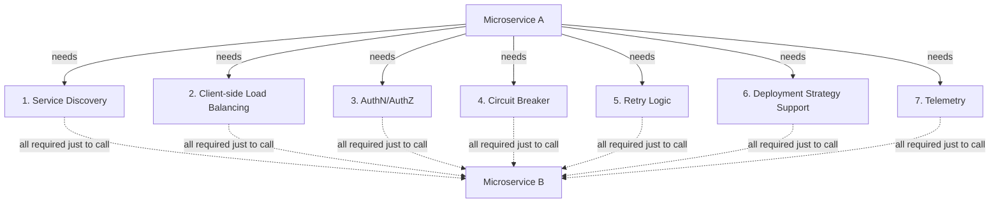
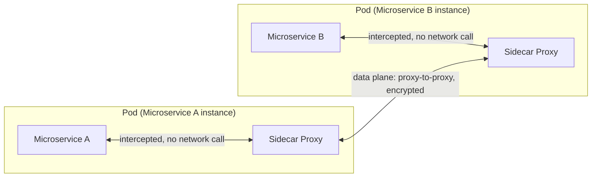
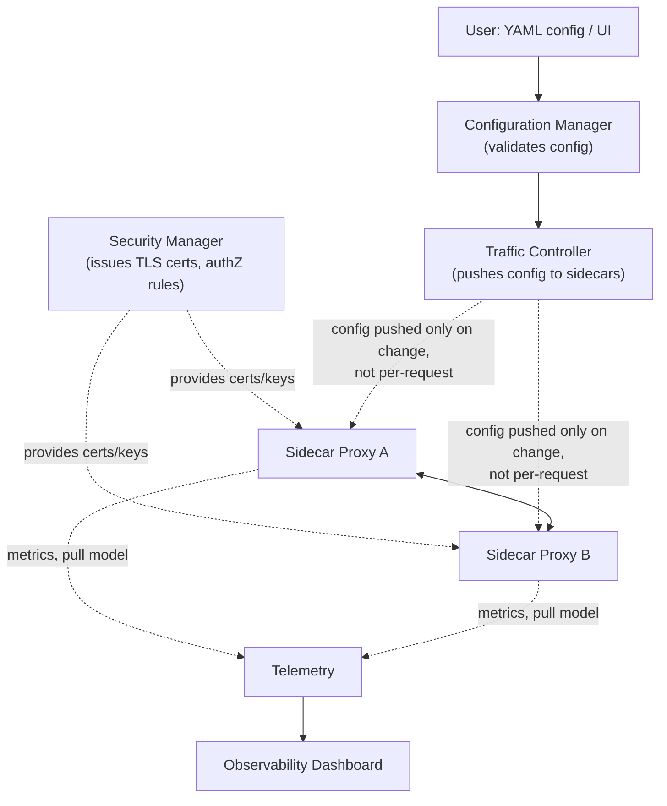
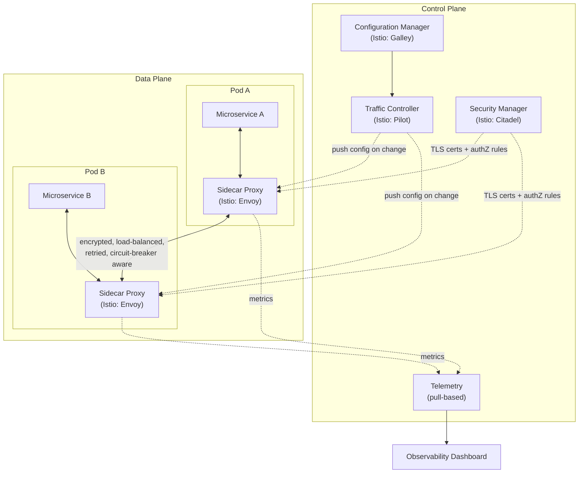

# Service Mesh

## Overview
- Answers the classic follow-up to [[28-api-gateway]]: once a request reaches a microservice instance, how do microservices talk to *each other*?
- Without a service mesh, every microservice would need to build/embed 7+ cross-cutting capabilities itself (service discovery, load balancing, auth, circuit breaking, retries, deployment strategy support, telemetry) — massive duplicated effort.
- A service mesh externalizes all of this into a **sidecar proxy** deployed alongside every service instance, plus a **control plane** that configures those proxies centrally.
- Popular implementation: **Istio** (sidecar = Envoy, config validator = Galley, traffic controller = Pilot, security manager = Citadel).

## Key Concepts

### The "brute force" list — what raw microservice-to-microservice calls need
- If Microservice A wants to call Microservice B directly, each service needs to build/support:
  1. **Service Discovery** — resolve B's instance addresses (IP + port), or the address of B's load balancer.
  2. **Client-side load balancing** — pick a specific instance among the addresses returned by service discovery.
  3. **Authentication & Authorization** — verify the caller's identity and whether it's permitted to call this API, even for purely internal calls.
  4. **Circuit breaker** — after repeated failures (e.g. 10 failed calls), stop invoking the failing service for a cooldown period (e.g. 1 minute) instead of continuing to hammer it; matches Spring Boot's Hystrix.
  5. **Retry logic** — retry failed calls when the failure is likely transient (5xx server errors are generally retryable; 4xx validation errors are not, since they'll fail identically every time).
  6. **Deployment strategy support** — e.g. canary deployment, where the load balancer routes a controlled percentage of traffic (e.g. 10%) to a new manifest/version while the rest stays on the old one, gradually shifting the split as confidence grows.
  7. **Telemetry** — record traffic volume, latency, error rate, and logs per API for monitoring/observability.
- Building and maintaining all seven inside every microservice is expensive and repetitive — this is the problem service mesh solves.

### Sidecar proxy pattern (data plane)
- In a Kubernetes-style deployment, each microservice instance runs inside a **pod**.
- A **sidecar proxy** container is deployed alongside the microservice container, inside the same pod — one sidecar per instance.
- The sidecar transparently **intercepts** all outbound traffic leaving the microservice and all inbound traffic arriving at it — no code changes or explicit integration needed in the microservice itself.
- Sidecar proxies talk **directly to each other** across pods — this mesh of proxy-to-proxy communication is the **data plane**.
- Each sidecar embeds all 7 capabilities (service discovery, load balancing, auth, circuit breaker, retry, deployment strategy routing, telemetry) so the application code doesn't have to.
- Calling another service no longer needs a URL/port — the caller just specifies the target service by *name*; the sidecar resolves the actual instance via its own service discovery config and forwards the request.

### Control plane
- The component that configures and governs all sidecar proxies centrally — separate from the data plane's proxy-to-proxy traffic.
- **Configuration Manager** — accepts user-provided configuration (e.g. YAML, or a UI) such as "enable circuit breaker: true, break duration: 1 minute" or "enable retry: true, retry count: 3"; validates the config is well-formed. (Istio: **Galley**.)
- **Traffic Controller** — takes validated configuration and pushes it down to the relevant sidecar proxies, so they know how to apply their built-in capabilities (load balancing rules, circuit breaker thresholds, etc.). (Istio: **Pilot**.)
- **Security Manager** — issues and manages TLS certificates/keys for sidecar proxies, enabling encrypted proxy-to-proxy communication and identity-based authentication (a certificate proves "this traffic really is from Microservice B") plus authorization rules (whether Microservice A is permitted to call a given API on B). (Istio: **Citadel**.)
- **Telemetry component** — collects metrics from sidecar proxies, generally via a **pull** model (periodically fetching data from each sidecar rather than sidecars pushing it); feeds observability dashboards for latency, traffic, and error-rate monitoring.
- Control-plane-to-data-plane communication is **not** real-time per-request — configuration is pushed to sidecars only when it changes, not on every call, so there's no added network hop or latency per request.

### TLS / mutual authentication between sidecars
- Each sidecar's security manager helps generate a private key and obtain a signed TLS certificate embedding the corresponding public key — this certificate acts as the service's cryptographic identity.
- When Microservice A's traffic reaches Microservice B's sidecar, the certificate lets B's sidecar know the traffic genuinely originates from A, decrypt it using the associated key material, and check whether A is authorized to call the requested API — all handled transparently by the mesh, not by application code.
- Builds directly on the public/private key and digital signature concepts from [[25-symmetric-asymmetric-encryption]].

## Trade-offs / Comparisons
| | Without Service Mesh | With Service Mesh |
|---|---|---|
| Cross-cutting logic (discovery, LB, retry, circuit breaker, auth, telemetry) | Built/duplicated inside every microservice | Centralized in sidecar proxies, managed via control plane |
| Calling another service | Needs explicit URL + port config | Just reference the service by name; sidecar resolves it |
| Config changes (e.g. retry count) | Requires redeploying/reconfiguring each service | Pushed centrally to sidecars via control plane |
| Per-request overhead | N/A (direct call) | Sidecar interception, but no extra network hop to control plane per request |
| Deployment strategy (e.g. canary) | Needs custom logic in client-side load balancer | Configured centrally, applied by sidecar's load balancing |

## Example / Walkthrough
- **Building blocks example:** to let Microservice A call Microservice B, you'd otherwise need service discovery (resolve B's address), client-side load balancing (pick an instance), authorization (can A call this B API?), circuit breaker (stop calling B after repeated failures, retry after 1 minute), retry (retry transient 5xx failures, not 4xx), deployment strategy support (e.g. canary — 90% traffic to old manifest, 10% to new), and telemetry (record traffic/latency/errors) — seven distinct capabilities.
- **Kubernetes/service-mesh example:** request flows from API Gateway → service discovery → application load balancer → a specific pod. Each pod bundles the microservice instance plus its own sidecar proxy. Microservice A's sidecar intercepts its outbound call, resolves Microservice B by name via its service-discovery config, load-balances across B's available instances, and forwards — all without A needing a URL/port.
- **Istio naming example:** sidecar proxy = Envoy; config validator = Galley; traffic controller (pushes config to sidecars) = Pilot; security manager (TLS/authZ) = Citadel.

## Diagram

## Interview Q&A

What problem does a service mesh solve for microservice-to-microservice communication?

Without it, every microservice would need to independently implement service discovery, client-side load balancing, authentication/authorization, circuit breaking, retries, deployment-strategy support, and telemetry. A service mesh centralizes all of these into a sidecar proxy plus a control plane, so application code stays free of this cross-cutting logic.

What is a sidecar proxy and how does it intercept traffic without code changes?

It's a proxy container deployed in the same pod as a microservice instance, which transparently intercepts all outbound and inbound traffic for that instance at the network level — the microservice doesn't need to explicitly integrate with or call the proxy.

What's the difference between the data plane and the control plane in a service mesh?

The data plane is the mesh of sidecar proxies talking directly to each other to carry actual request traffic. The control plane (configuration manager, traffic controller, security manager, telemetry) configures and governs those sidecars centrally but is not in the real-time path of every request.

Does the control plane add network latency to every microservice-to-microservice call?

No — configuration is pushed from the control plane to sidecar proxies only when it changes, not on every request; each sidecar already holds the capabilities and config it needs locally, so proxy-to-proxy calls happen without an extra hop to the control plane.

How does authentication/encryption work between two sidecar proxies?

The security manager (e.g. Istio's Citadel) issues each sidecar a private key and a signed TLS certificate embedding its public key, giving it a verifiable identity; sidecars use these certificates to encrypt traffic between each other and to authorize whether the calling service is permitted to invoke a given API.

How does a microservice call another service inside a mesh without knowing its URL or port?

It just references the target service by name; the local sidecar proxy holds service-discovery configuration (pushed by the control plane) that resolves the name to actual instance addresses, load-balances across them, and forwards the request transparently.

Name Istio's core components and what each one maps to conceptually.

Envoy = sidecar proxy (data plane); Galley = configuration manager (validates user config); Pilot = traffic controller (pushes config to sidecars); Citadel = security manager (TLS certs, authN/authZ).

Why is a circuit breaker necessary between microservices, and how does it typically behave?

To stop a caller from repeatedly hammering a failing dependency — after a threshold of consecutive failures (e.g. 10), the circuit "opens" and further calls immediately fail locally without hitting the network, for a cooldown period (e.g. 1 minute), after which it allows calls through again to test recovery.

## Related Topics
- [[28-api-gateway]] — the entry-point layer this note picks up from (Gateway → load balancer → microservice instance, then service-to-service communication)
- [[25-symmetric-asymmetric-encryption]] — TLS/certificate mechanics underlying sidecar-to-sidecar encryption
- [[18-load-balancer-algorithms]] — client-side load balancing capability embedded in the sidecar
