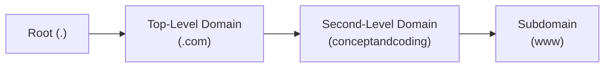
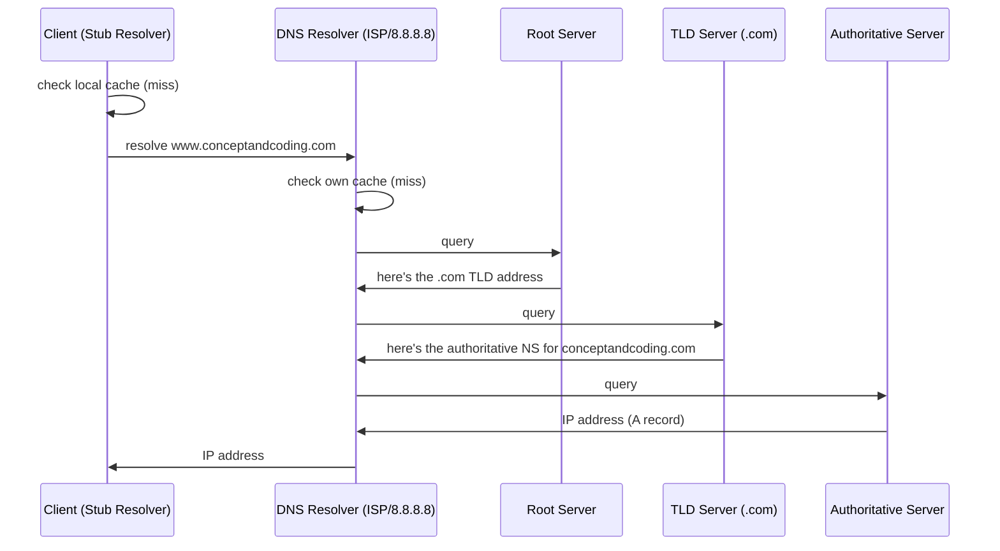
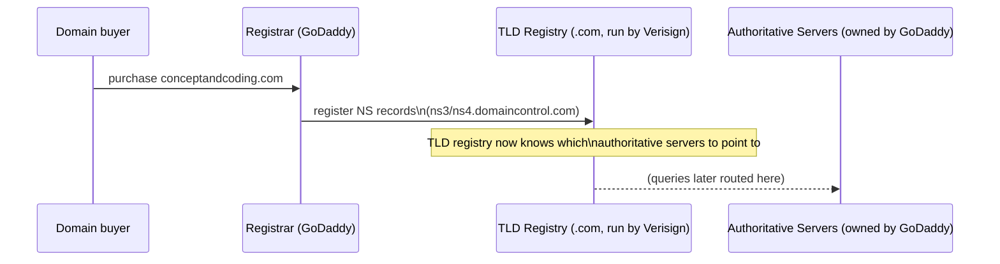
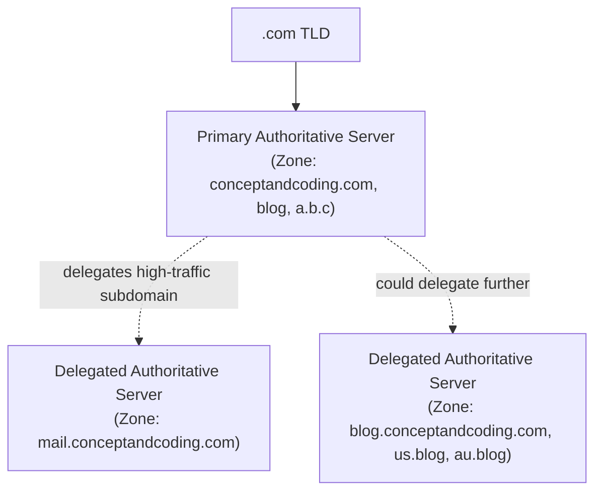
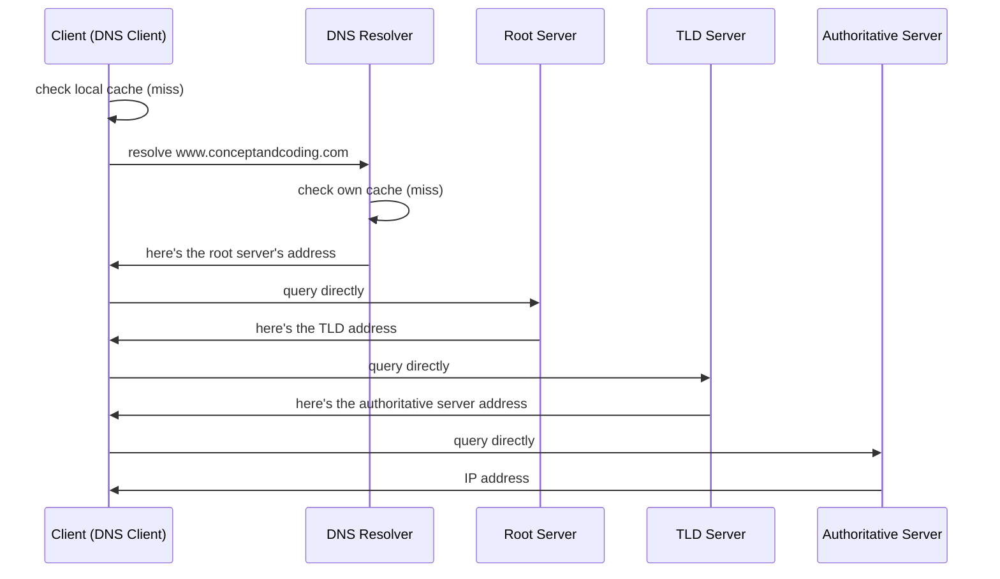
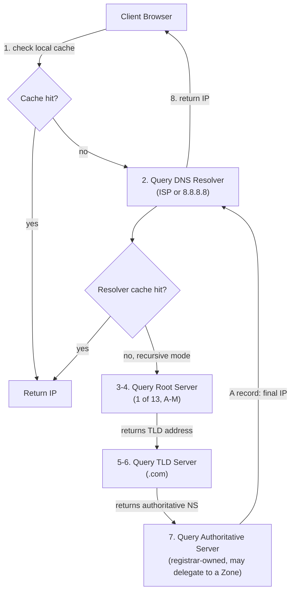

# DNS (Domain Name System)

## Overview
- DNS translates human-readable domain names (e.g. `google.com`) into machine-usable IP addresses, since devices on the internet only understand IP addresses.
- IP address — a unique numerical label assigned to each internet-connected device (IPv4 or IPv6); domain name — a friendly, memorable alias for that address.
- Referenced in [[28-api-gateway]] as not being a single point of failure — this note explains why: DNS is a hierarchical, distributed system, not one server.
- Two resolution strategies exist — **recursive** (resolver does all the work) and **iterative** (client does all the work) — and a **DNS zone** mechanism to distribute load across authoritative servers.

## Key Concepts

### Domain name hierarchy
- Read right-to-left / bottom-to-top: `www.conceptandcoding.com.` (trailing dot implicit, usually omitted).
- **Root** — the implicit trailing dot; top of the hierarchy.
- **Top-Level Domain (TLD)** — `.com` (also `.edu`, `.io`, `.in`, etc.) — thousands exist, count keeps growing.
- **Second-Level Domain (SLD)** — `conceptandcoding` — this is what people usually mean by "domain name" (combined with TLD: `conceptandcoding.com`).
- **Subdomain** — `www` (also `blog`, `mail`, `admin`, `cdn.image.media`, etc.) — theoretically unlimited depth/count under a domain.
- **FQDN (Fully Qualified Domain Name)** — the complete address from subdomain down to root, e.g. `www.conceptandcoding.com.`

### DNS record structure
- Each DNS record has (among other fields) three key pieces: **record name** (domain/subdomain being queried), **type**, and the **value/host** it resolves to.
- **A record (type 1, "Address record")** — maps a record name directly to an IP address; the actual endpoint of resolution.
- **CNAME record (type 5, "Canonical Name")** — creates an alias, mapping one domain/subdomain to another domain name (not an IP directly); mostly used at the subdomain level (e.g. `www.conceptandcoding.com` → `conceptandcoding.com`), not typically used to alias one whole domain to an unrelated one.
- CNAME chains can nest — one CNAME can point to another CNAME, which eventually resolves to an A record.
- Practical check: `ipconfig /displaydns` (Windows) shows the local stub resolver's cached DNS records.

### Recursive resolution
- **Step 1 — Local cache check:** the OS-level **stub resolver** (DNS client) checks its own local cache first; cache hit returns immediately.
- **Step 2 — DNS resolver query:** on cache miss, the client queries a configured **DNS resolver** — typically provided by the ISP, or a custom public resolver (e.g. Google's `8.8.8.8`), found in network/Wi-Fi settings.
- **Step 3 — Root query:** if the resolver's own cache also misses, it queries a **root server** (13 root servers worldwide, labeled A–M, each run by a different organization — e.g. Verisign runs the A root, NASA runs E, US Dept. runs G); resolver picks the nearest one.
- **Step 4 — Root responds with TLD address:** root doesn't know the final IP, but knows which TLD (e.g. `.com`) server to direct to, and returns that TLD's address.
- **Step 5 — TLD query:** resolver queries the TLD server, which maintains records of **authoritative name servers** for each second-level domain under it.
- **Step 6 — TLD responds with authoritative server addresses:** TLD returns the authoritative (NS) server addresses registered for that domain (e.g. GoDaddy's `ns3.domaincontrol.com` / `ns4.domaincontrol.com`) — often with a primary/secondary hint.
- **Step 7 — Authoritative server query:** resolver queries the authoritative server, which holds the actual DNS records (A, CNAME, etc.) and returns the resolved IP.
- **Step 8 — Return to client:** resolver returns the final IP to the client's stub resolver.
- Called "recursive" because the *resolver* performs all these chained lookups on the client's behalf — the client makes just one request and gets one final answer.

### Registrar → TLD registry → authoritative server chain
- When a domain (e.g. `conceptandcoding.com`) is purchased from a provider like GoDaddy, GoDaddy acts as the **registrar**.
- The registrar communicates with the relevant **TLD registry** (e.g. `.com` registry, maintained by Verisign) to register which authoritative name servers should handle that domain.
- The TLD registry then stores this mapping — any resolver asking about `conceptandcoding.com` gets directed to those specific authoritative (NS) servers, which are owned/operated by the registrar (GoDaddy in this example).
- This is *why* a TLD knows to route a query for a specific domain to a specific provider's authoritative servers — it's a registration relationship, not automatic discovery.

### DNS zones
- Problem without zones: a single authoritative server would have to hold and answer for records of every subdomain under a domain (`mail.`, `blog.`, `admin.`, `a.b.c.`, etc.) — unlimited subdomain depth means unbounded record growth on one server, and a single high-traffic subdomain (e.g. `mail.conceptandcoding.com`) can overload that one server even if other subdomains see little traffic.
- **Solution:** the primary authoritative server can delegate (offload) responsibility for a specific subdomain to a *different* authoritative server, creating a separate **zone**.
- Each zone is authoritative for its own subset of records; the TLD still points to the original authoritative server, which in turn forwards specific subdomain queries (e.g. anything under `mail.`) to the delegated zone's server instead of answering them itself.
- Conceptually mirrors how a TLD distributes load across different domains' authoritative servers — zones do the same thing one level down, at the subdomain level.

### Iterative resolution
- Same overall hierarchy (root → TLD → authoritative), but responsibility for "walking" the chain shifts to the **client**, not the resolver.
- Client checks its local cache first; on miss, queries the DNS resolver.
- If the resolver also misses its cache, instead of continuing the lookup itself, it returns the **root server's address** to the client.
- Client then queries the root itself, gets back TLD addresses, queries a TLD itself, gets back authoritative server addresses, queries an authoritative server itself, and finally gets the IP.
- The resolver's role here is minimal — just cache lookups and pointing the client to the next hop; the client performs each step itself, hence "iterative."

## Trade-offs / Comparisons
| | Recursive resolution | Iterative resolution |
|---|---|---|
| Who walks the chain | DNS resolver (root → TLD → authoritative) | Client itself, resolver just points to next hop |
| Client workload | One request, one final answer | Multiple manual queries, one per hierarchy level |
| Resolver workload | Heavy — performs and caches all chained lookups | Light — mostly cache check + redirect |
| Typical usage | Standard for end-user devices/browsers | Used between resolvers/servers in the DNS infrastructure itself |

| | A record | CNAME record |
|---|---|---|
| Points to | An IP address directly | Another domain/subdomain name (alias) |
| Typical use | Final resolution target | Subdomain-level aliasing (e.g. `www` → root domain) |

## Example / Walkthrough
- **Hierarchy example:** `www.conceptandcoding.com.` breaks down as root (`.`) → TLD (`.com`) → SLD (`conceptandcoding`) → subdomain (`www`); the SLD+TLD combo (`conceptandcoding.com`) is the "domain name," the full string is the FQDN.
- **CNAME example:** both `www.google.com` and `blog.google.com` can be aliased via CNAME to `google.com`, so all traffic ultimately routes to the same destination regardless of which subdomain was typed.
- **Root servers example:** 13 root servers labeled A–M worldwide, each run by a different organization (e.g. A by Verisign, E by NASA, G by a US Department) — the resolver picks whichever is nearest to the user.
- **Registrar chain example:** `conceptandcoding.com` purchased via GoDaddy → GoDaddy (registrar) registers with the `.com` TLD registry (run by Verisign) that its authoritative servers (`ns3.domaincontrol.com`, `ns4.domaincontrol.com`) should handle this domain — `ns3` marked primary, `ns4` as fallback.
- **Zone delegation example:** a single authoritative server initially handles all of `conceptandcoding.com`'s subdomains (`mail.`, `blog.`, `admin.`, `a.b.c.`); once `mail.conceptandcoding.com` traffic grows too large, its resolution is delegated to a separate authoritative server (a new zone), while the original server continues handling `blog.`, `a.b.c.`, and the root domain itself.
- **Iterative example:** DNS resolver's own cache misses, so instead of querying root/TLD/authoritative itself, it hands the client the root server's address; the client then personally queries root, gets a TLD address, queries the TLD itself, gets an authoritative server address, and queries that directly to get the final IP.

## Diagram

## Interview Q&A

What is the difference between an IP address and a domain name?

An IP address is the unique numerical label a device uses to be located on the internet; a domain name is a human-readable alias for that address, since remembering numerical IPs isn't practical. DNS is the system that translates between the two.

What are the four parts of a domain hierarchy, using www.conceptandcoding.com as an example?

Root (the implicit trailing dot), Top-Level Domain (`.com`), Second-Level Domain (`conceptandcoding`), and Subdomain (`www`) — read right-to-left the full string is the FQDN.

What's the difference between an A record and a CNAME record?

An A record maps a name directly to an IP address (the actual resolution endpoint); a CNAME record maps a name to another domain name as an alias, typically used at the subdomain level, and can chain through multiple CNAMEs before reaching an A record.

Walk through recursive DNS resolution end to end.

Client checks local cache → on miss, queries the configured DNS resolver → resolver checks its own cache → on miss, queries a root server, which returns the relevant TLD's address → resolver queries the TLD, which returns the domain's authoritative name server addresses → resolver queries the authoritative server, which returns the actual IP → resolver returns that IP to the client. The client only sees one request and one answer; the resolver does all the chained work.

How is iterative resolution different from recursive resolution?

In iterative resolution, the client itself performs each step of the chain — the resolver, on a cache miss, just hands back the next hop's address (e.g. the root server's address) rather than querying it on the client's behalf; the client then queries root, TLD, and authoritative servers directly, one at a time.

Why isn't DNS a single point of failure, given that a browser needs it to resolve every domain?

DNS is a distributed hierarchy, not one server: there are 13 globally distributed root servers run by different organizations, thousands of TLD servers, and many authoritative servers per domain (further split into zones) — no single node's failure takes down domain resolution globally.

How does a TLD server know which authoritative servers to point to for a given domain?

When a domain is purchased through a registrar (e.g. GoDaddy), the registrar registers the domain's designated authoritative name servers with the relevant TLD registry (e.g. Verisign for `.com`) — that registration is what lets the TLD later route queries for that domain to the correct authoritative servers.

What is a DNS zone and why does it exist?

A zone is a delegated subset of a domain's records handled by a separate authoritative server — created to offload high-traffic or numerous subdomains from a single primary authoritative server, similar in spirit to how a TLD distributes different domains across different authoritative servers, but applied one level lower.

## Related Topics
- [[28-api-gateway]] — referenced DNS-based load balancing (Route 53, Traffic Manager) and DNS's non-single-point-of-failure property
- [[18-load-balancer-algorithms]] — DNS-based load balancing is a form of traffic distribution complementary to Layer 4/7 load balancing
