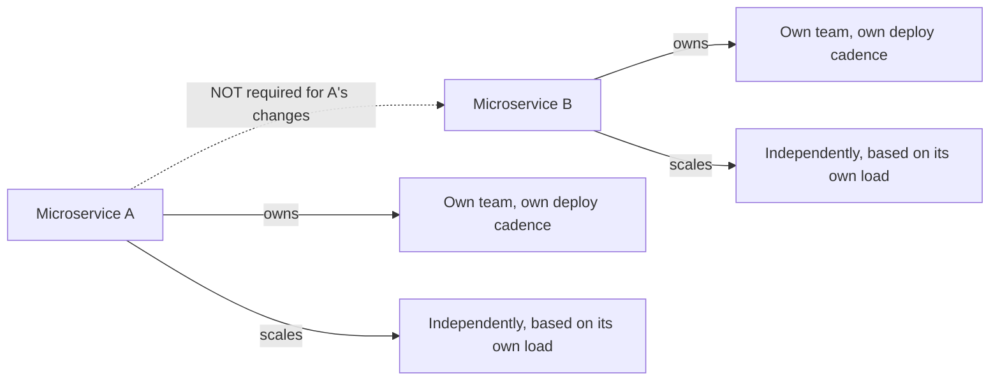
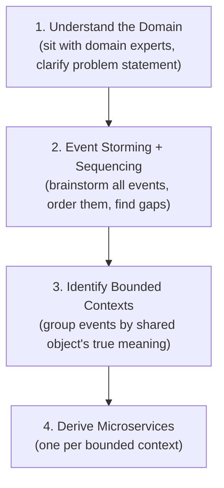
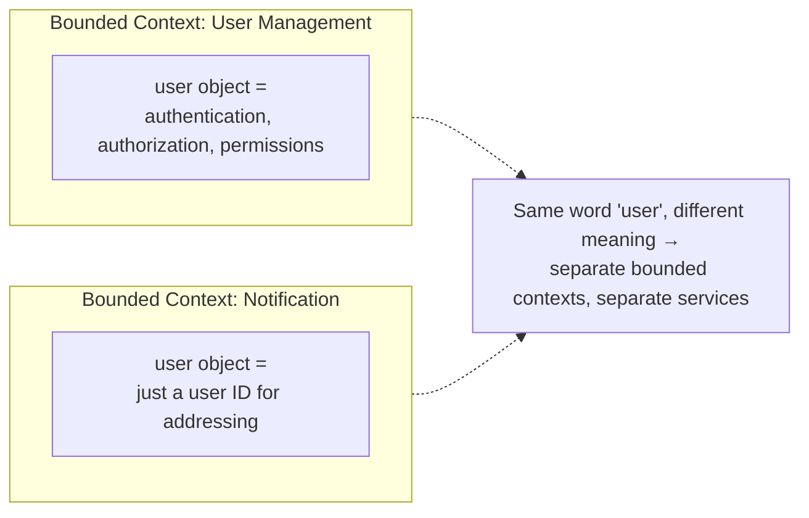
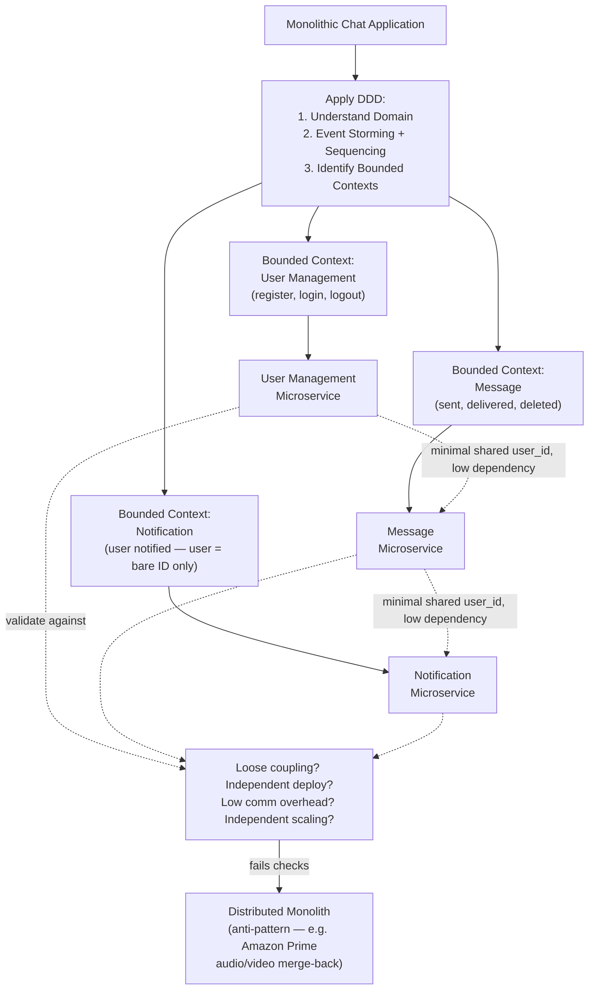

# Dividing a Monolith into Microservices (Domain-Driven Design)

## Overview
- Answers the classic interview trap: "How many microservices should you split a monolith into?" — there is no fixed number (not "5", not "10"); the answer is a *process*, not a count.
- Before deciding *how many*, first establish *why* you want microservices at all — a split only counts as a valid microservice boundary if it delivers on specific expectations.
- Domain-Driven Design (DDD), specifically its **event storming** technique, is one principled approach to derive service boundaries — not the only one, but a strong default answer in an interview.
- Cautionary real-world case: Amazon Prime Video merged its audio and video microservices back into one, after over-splitting created excessive coupling overhead — a reminder that more microservices isn't automatically better.

## Key Concepts

### What we actually want from a microservice
- **Loosely coupled** — updating one microservice should not require updating another.
- **Independently coded, tested, deployed** — each service has its own team, its own release cadence, evolves without blocking or being blocked by others.
- **Less communication overhead** — not zero, but minimal; frequent cross-service calls for small operations reintroduce tight coupling and add latency/complexity.
- **Independent scaling** — a service under heavy load should be scalable on its own, without forcing a dependent service to scale in lockstep (if it does, that's a sign of hidden tight coupling).
- These four properties are the *test* applied to any proposed split — a boundary only counts as a good microservice if it satisfies them.

### Alternative slicing approaches (non-DDD)
- **Database-per-service vs shared DB** — split boundaries around data ownership.
- **CQRS-based split** — separate services for command (write) responsibility vs query (read) responsibility.
- **Technology-based split** — e.g. separate services for frontend, backend, and data-access-layer, since each uses different tech stacks.
- These are valid alternative lenses; DDD is presented as the strongest general-purpose interview answer, not the only correct one.

### DDD event storming — 4-step process
- **Step 1 — Understand the domain.** Sit with domain experts and users, clarify the actual problem statement before doing anything else (e.g. domain = "chat application").
- **Step 2 — Identify events (event storming), then sequence them to find gaps.** All stakeholders (domain experts, developers, testers, decision-makers — not just engineers) independently brainstorm every event that can occur in the domain (e.g. `user registered`, `user login`, `message sent`, `message delivered`, `message deleted`), then arrange them in sequence to spot missing events (e.g. realizing `user logout` and `message received` were missed).
- **Step 3 — Identify bounded contexts.** Group logically related events by the *meaning* their shared object carries in that context, not just by surface-level similarity — the same-named object can mean something entirely different in two different contexts, and those must NOT be merged into one boundary.
- **Step 4 — Derive microservices from bounded contexts.** Each bounded context becomes one candidate microservice; if a bounded context turns out to span multiple events over the same meaningfully-shared object, that's still just one microservice, not several.

### Bounded context — the key idea
- A "bounded context" is a boundary within which a given object carries one specific, consistent meaning — the *same* object name in a *different* boundary can carry a completely different meaning, and the two must be treated as unrelated.
- Analogy: a sandwich inside a restaurant context has meaning (something people pay for and eat); the same sandwich in a garbage-can context has entirely different meaning (worthless, nobody would eat or pay for it) — despite being "the same object," they belong to separate boundaries with no dependency between them.
- Practical litmus test: does the object here carry the *same* full set of properties/meaning as the object over there? If a `user` object in one event set means "an authenticated, permissioned identity" but in another event set means only "a bare user ID for addressing a notification," those are different bounded contexts — don't merge the underlying services just because both mention "user."
- Minimal duplication across services (e.g. both a Message service and a Notification service holding a plain `user_id`) is acceptable — it does not violate DDD, as long as dependency stays minimal.

### Distributed monolith — the failure mode to avoid
- Splitting a monolith without honoring the four core expectations (loose coupling, independent deploy, low communication overhead, independent scaling) produces a **distributed monolith** — multiple services that are still tightly coupled in practice, now with the added cost of network calls between them.
- This applies regardless of which slicing method (DDD or otherwise) was used — the failure is in not validating the split against those four properties, not in picking the "wrong" methodology.
- **Real-world case — Amazon Prime Video:** audio and video were split into two separate microservices; the coupling and communication overhead between them became so costly that the team merged them back into a single service, reporting ~90% efficiency gains. This did *not* mean abandoning microservices altogether — only that this particular split was an unnecessary, over-fine-grained division.

## Trade-offs / Comparisons
| Slicing approach | Basis for boundaries | Note |
|---|---|---|
| DDD (event storming + bounded context) | Business domain semantics | Strong general default, requires domain expert involvement |
| Database-per-service | Data ownership | Simple heuristic, may not map cleanly to business logic |
| CQRS-based | Read vs write responsibility | Good when read/write scaling needs diverge sharply |
| Technology-based | Tech stack differences (frontend/backend/data layer) | Splits along implementation, not business capability |

| | Well-formed microservices | Distributed monolith |
|---|---|---|
| Coupling | Loose | Tight, despite being separate deployables |
| Deploy independence | Yes | No — changes ripple across services |
| Communication overhead | Low | High — frequent cross-service calls |
| Scaling | Independent | Forced to scale together |

## Example / Walkthrough
- **Domain chosen:** chat application.
- **Step 2 events brainstormed:** `user registered`, `user login`, `message sent`, `message delivered`, `message deleted` — then sequenced, revealing missing events like `user logout` (parallel to sending a message after login) and `message received` (distinct from `message delivered`).
- **Step 3 bounded contexts formed:**
  - **User Management** — `user registered`, `user login`, `user logout` — the `user` object here carries authentication/authorization/permission meaning.
  - **Message** — `message sent`, `message delivered`, `message deleted` — the `message` object carries sender, content, and status (pending/delivered/deleted).
  - **Notification** — `user notified` — even though it references "user," here the object is just a bare `user_id` plus a notification status (not sent/sent/seen); since it lacks the full authentication/authorization meaning of the User Management context's `user`, it's a *separate* bounded context, not folded into User Management.
- **Step 4 result:** three microservices — User Management Microservice, Message Microservice, Notification Microservice — each satisfying loose coupling, independent deploy/scale, and only minimal necessary duplication (e.g. `user_id` appearing in both Message and Notification services).
- **Distributed monolith counter-example:** Amazon Prime Video's audio and video microservices had to be merged back into one service after their split created excessive coupling overhead, yielding ~90% efficiency gains post-merge — illustrating that a technically "microservices" architecture can still be a distributed monolith if boundaries are drawn wrong.

## Diagram

## Interview Q&A

How many microservices should a monolith be split into?

There's no fixed number — the right count emerges from applying a principled decomposition process (e.g. DDD's event storming and bounded contexts) and validating each resulting service against loose coupling, independent deployability, low communication overhead, and independent scalability.

What four properties should every resulting microservice satisfy?

Loose coupling (changes to one don't force changes to another), independent coding/testing/deployment (own team, own release cadence), low communication overhead (not chatty for small operations), and independent scaling (load on one doesn't force scaling of another).

What is "event storming" and what problem does it solve?

A collaborative technique where domain experts, developers, testers, and decision-makers jointly brainstorm all events that occur in a domain, then sequence them to surface missing events — it's step 2 of the DDD process for identifying service boundaries.

What is a "bounded context" and why does it matter for microservice boundaries?

A boundary within which an object carries one consistent meaning; the same-named object in a different context can mean something entirely different (like a sandwich in a restaurant vs. in the garbage) and should not be merged into the same service just because the name matches — doing so risks recreating tight coupling.

What is a "distributed monolith" and how does it happen?

A system split into multiple deployable services that are still tightly coupled in practice — deploys ripple across services, communication overhead is high, and scaling isn't independent — meaning the split failed to deliver the actual benefits of microservices while adding network-call overhead.

What happened with Amazon Prime Video's microservices, and what does it teach?

Amazon Prime Video split audio and video into separate microservices, but the resulting coupling and communication overhead became so costly that they merged the two back into one service and reported roughly 90% efficiency gains — illustrating that over-fine-grained splitting can be worse than a coarser boundary, even while the team remained on a microservices architecture overall.

Is some duplication of data across microservices acceptable under DDD?

Yes — minimal duplication (e.g. a `user_id` appearing in both a Message service and a Notification service) is acceptable as long as dependency between the services stays minimal; DDD asks for low, not zero, communication/data overlap.

Besides DDD, what other approaches can guide splitting a monolith into microservices?

Database-per-service (or shared DB) boundaries, CQRS-based splitting (separate command/write vs query/read services), or technology-based splitting (e.g. separate frontend, backend, and data-access-layer services) — DDD is presented as a strong general default, not the only valid method.

## Related Topics
- [[03-microservices-design-patterns]] — broader microservices patterns and monolith decomposition context
- [[29-service-mesh]] — the communication-layer concerns (discovery, retries, circuit breaking) that come into play once services are split
