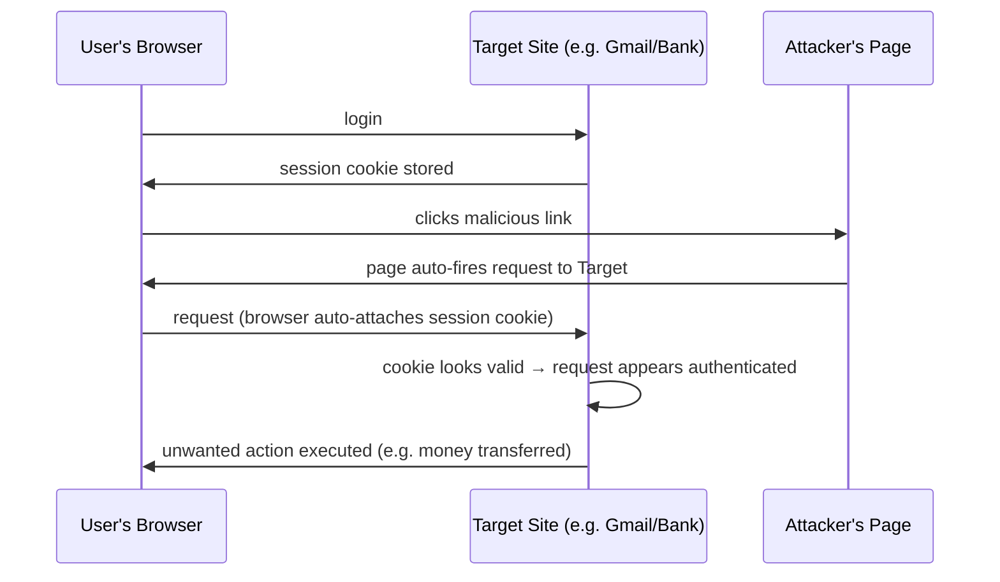
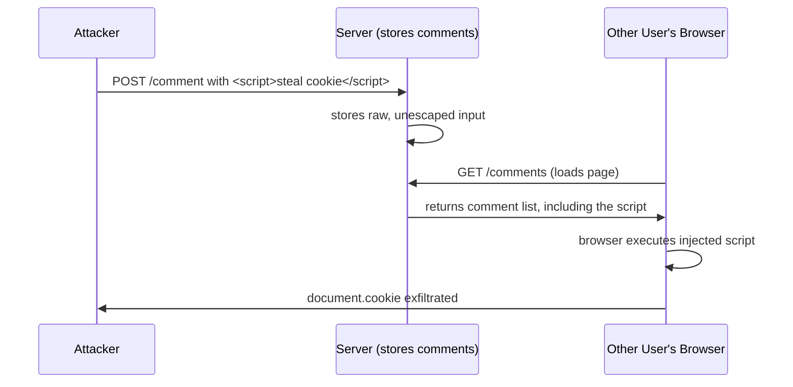
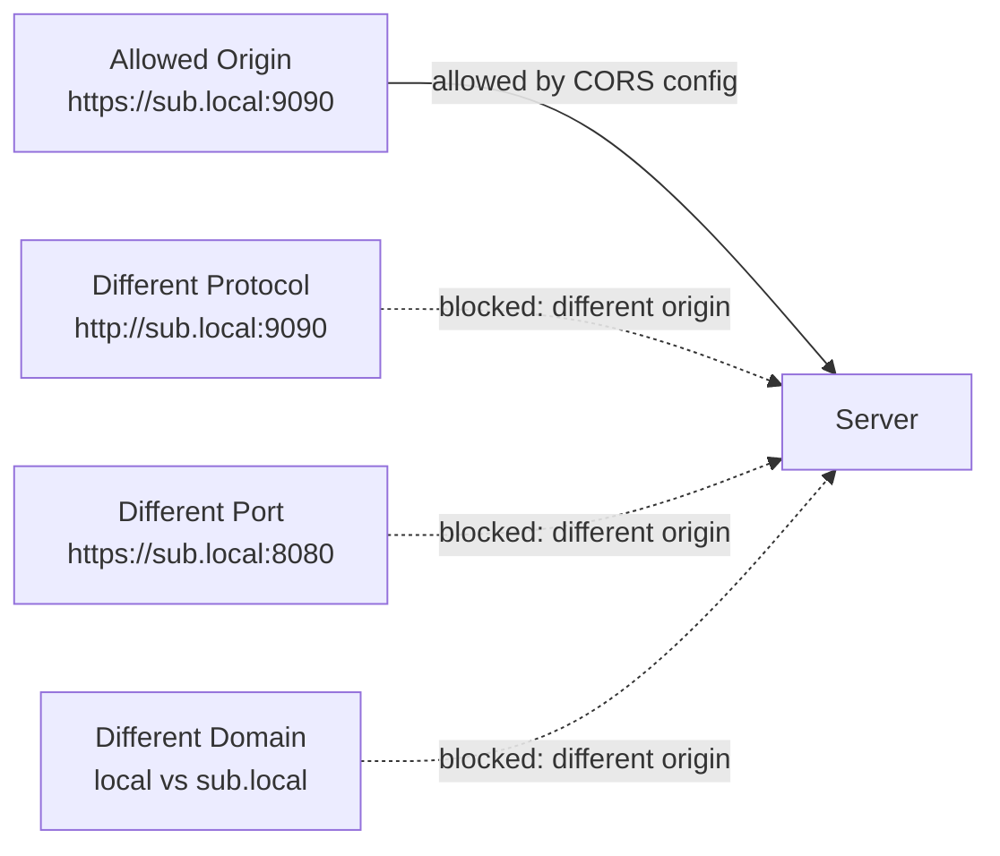
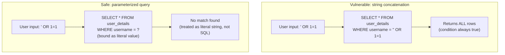

# Common Web Attacks: CSRF, XSS, CORS, SQL Injection

## Overview
- Four foundational web security concepts, essential background before diving into a framework's security layer (e.g. Spring Security) or discussing security in a system design interview.
- Three are attacks (CSRF, XSS, SQL Injection); CORS itself is not an attack — it's a browser-enforced security feature that helps defend against cross-origin abuse.
- Common thread: user input or browser-automatic behavior (cookies, session handling) gets trusted or used unsafely by a server/browser, and an attacker exploits that trust.
- Demonstrated with live Spring Boot examples in the source video — this note captures the concepts and mitigations, not the demo mechanics.

## Key Concepts

### CSRF (Cross-Site Request Forgery)
- Tricks a user's browser into making an unwanted request to a site where the user is **already authenticated** — most applicable to session/cookie-based (stateful) authentication.
- Mechanism: browser stores a session ID in a cookie after login; browsers **automatically attach** cookies to any request sent to that domain, regardless of what triggered the request.
- Attacker crafts a malicious link/page that silently fires a request to the target site (e.g. a money-transfer endpoint); since the victim's browser auto-attaches the valid session cookie, the server sees what looks like a legitimate, authenticated request.
- Victim is unaware — they only clicked a link expecting something else, but a hidden request fired in the background using their active session.
- **Mitigation — CSRF token:** server returns a token (in addition to the cookie) that only a legitimate, authenticated page/form knows and can append to its requests; an attacker's external page has no way to know or include this token, so the server can reject requests missing it.

### XSS (Cross-Site Scripting)
- Allows an attacker to inject a malicious script into a web page that will be viewed by **other users** — the victim's own browser ends up executing the attacker's script as if it were the page's own code.
- Classic scenario: a comment/post feature stores raw user input and re-renders it unescaped for every viewer; if the "comment" is actually ``, every viewer's browser executes it.
- Impact ranges from a harmless popup (proof of concept) up to **session/cookie theft** — a script reading `document.cookie` and sending it to an attacker-controlled endpoint lets the attacker hijack the victim's authenticated session entirely, or the page can be defaced.
- **Mitigation:**
  - **Escape special characters** in user input before rendering (e.g. `` as a comment causes the alert popup to fire for every subsequent viewer of the comments page — demonstrating that the script executes in the victim's browser. Swapping the payload for one that reads `document.cookie` and sends it to an attacker endpoint would exfiltrate session cookies instead of just popping an alert.
- **CORS demo:** server configuration whitelists a specific allowed origin (e.g. `https://sub.local:9090`) for GET/POST/PUT/DELETE plus specific headers; requests from any other protocol, port, or domain combination are rejected by the browser before reaching application logic.
- **SQL Injection demo:** a `/find` endpoint builds a query like `SELECT * FROM user_details WHERE username = '<input>'` by direct string substitution. Normally submitting a username returns just that user's row. Submitting `' OR 1=1` (crafted so the resulting query becomes `WHERE username = '' OR 1=1`) returns **every row in the table**, since `1=1` is always true — demonstrating unauthorized data exposure from unsanitized query construction. Using a parameterized query (binding the input as a literal parameter rather than concatenating it) makes the same payload match nothing, since it's treated as a literal string value, not query syntax.

## Diagram

```mermaid
flowchart TB
    subgraph CSRF["CSRF"]
        C1["Browser auto-attaches session cookie"] --> C2["Attacker page triggers unwanted request"] --> C3["Mitigate: CSRF token"]
    end
    subgraph XSS["XSS"]
        X1["Unescaped user input stored/rendered"] --> X2["Victim's browser executes injected script"] --> X3["Mitigate: escape output + validate input"]
    end
    subgraph CORS["CORS (defense, not attack)"]
        O1["Browser checks request origin\n(protocol+domain+port)"] --> O2["Server allow-list decides"] --> O3["Blocks cross-origin unless whitelisted"]
    end
    subgraph SQLi["SQL Injection"]
        S1["User input concatenated into query string"] --> S2["Malicious input alters query logic\n(e.g. OR 1=1)"] --> S3["Mitigate: parameterized queries"]
    end
```

## Interview Q&A

What is CSRF and why does it primarily affect session/cookie-based authentication?

CSRF tricks a user's browser into sending an unwanted request to a site where they're already authenticated. It's tied to session-based auth because browsers automatically attach stored cookies (including the session ID) to any request sent to that domain, regardless of what triggered the request — the server has no way to distinguish a legitimate user action from an attacker-triggered one just by seeing a valid cookie.

How does a CSRF token protect against CSRF attacks?

The server issues a token known only to legitimate, authenticated forms/pages; since an attacker's external page has no way to obtain or include this token, requests missing it can be rejected, even if the browser auto-attaches a valid session cookie.

What is XSS, and what's the worst-case impact beyond a simple alert popup?

Cross-Site Scripting lets an attacker inject a malicious script into content later rendered for other users, whose browsers then execute it. Beyond a harmless popup, a script can read `document.cookie` and exfiltrate it to an attacker-controlled server, allowing full session hijacking wherever that session/cookie is valid.

What are the two main mitigations for XSS?

Escaping special characters in user input before rendering it (so the browser treats it as inert text, not executable code), and validating what input is allowed in the first place.

Is CORS an attack? What does it actually do?

No — CORS is a browser-enforced security feature (not an attack) that restricts a web page from making requests to a different origin (protocol + domain + port) unless the target server explicitly allows it via response headers like Access-Control-Allow-Origin.

What counts as a "different origin" under CORS?

Any difference in protocol, domain, or port between the requesting page and the target server — e.g. http vs https, a different subdomain, or a different port number, even if the rest of the URL matches.

How does SQL injection work, and what does a payload like ' OR 1=1 accomplish?

It exploits queries built by directly concatenating unsanitized user input into SQL text. A payload like `' OR 1=1` turns a WHERE clause intended to match one specific value into a condition that's always true, causing the query to return every row in the table instead of the intended filtered result.

How do parameterized queries prevent SQL injection?

They bind user input as a literal parameter/value rather than concatenating it directly into the query text, so the database engine treats it strictly as data to match against — not as executable query syntax — meaning injected logic like `OR 1=1` simply fails to match anything instead of altering the query's structure.

## Related Topics
- [[26-jwt]] — token-based (stateless) auth as an alternative to session/cookie-based auth that CSRF specifically targets
- [[24-oauth-2]] — authorization framework where CSRF-style state-token protections (the `state` parameter) follow the same principle as CSRF tokens
