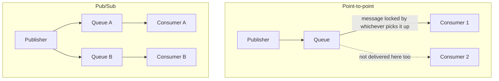
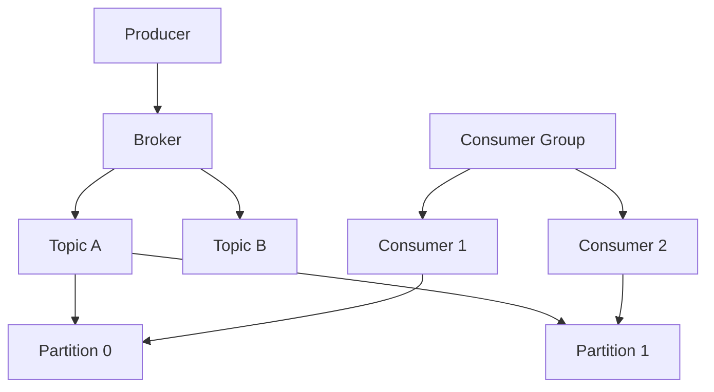
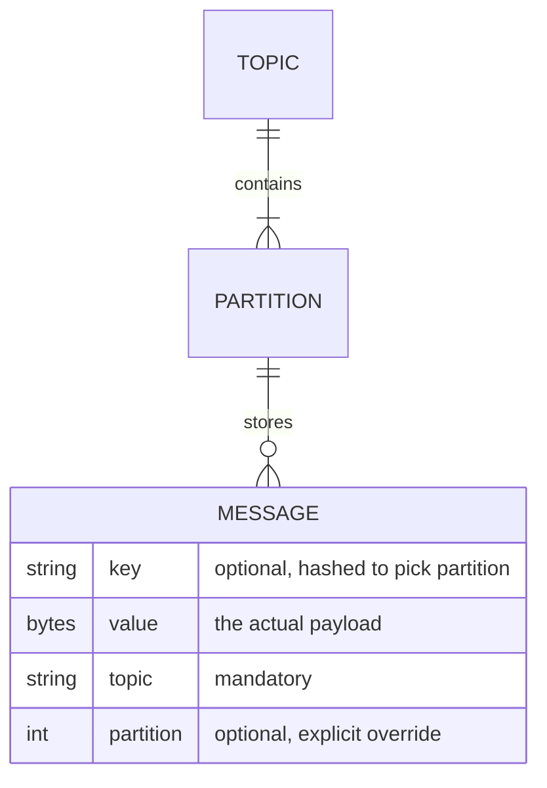
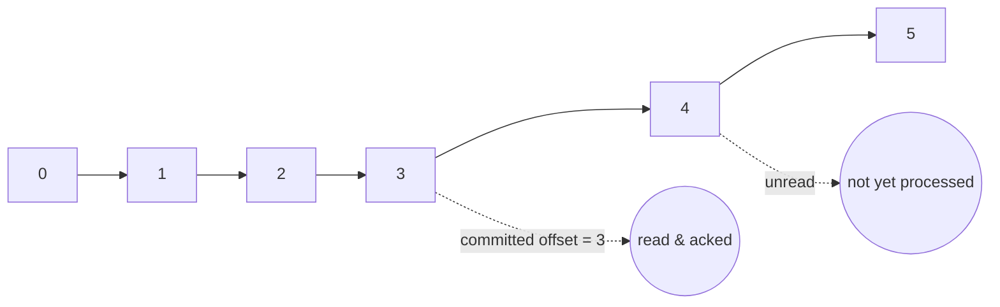
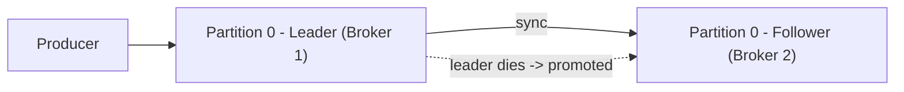
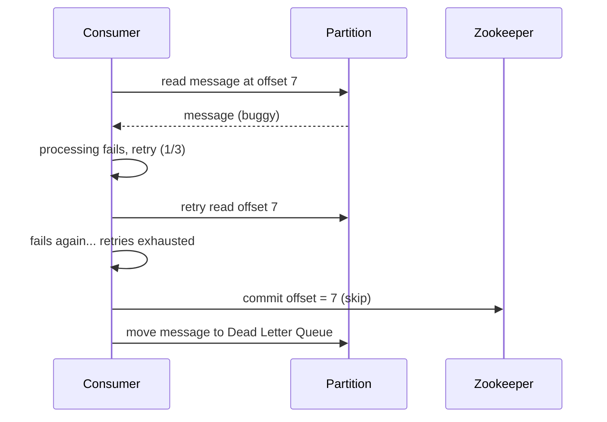
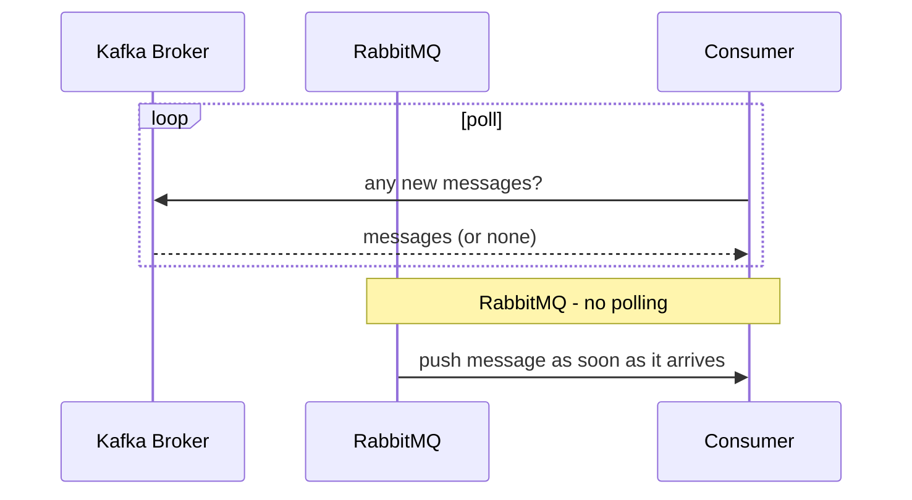
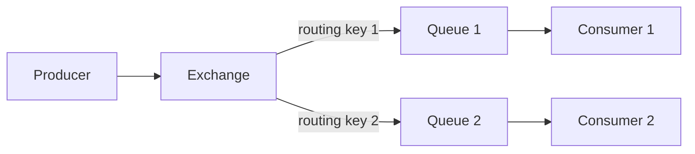
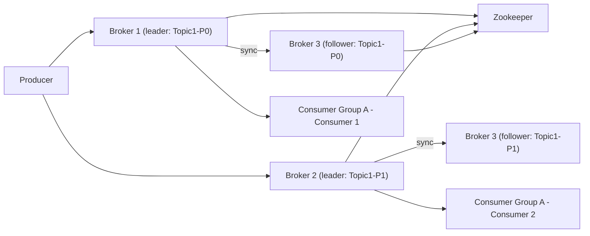

# Distributed Messaging Queue (Kafka, RabbitMQ)

## Overview
- A very common and deep HLD interview topic — how a distributed messaging queue works, using Kafka and RabbitMQ (the two most popular) as concrete references.
- Core components: producer publishes a message → queue stores it → consumer reads and processes it.
- Interviewers dig into failure/edge-case follow-ups: queue size limits, queue/broker going down, consumer going down, retry behavior, and how the queue itself is distributed across machines.

## Key Concepts

### Why messaging queues are needed
- **Async decoupling** — e.g. an e-commerce app doesn't need the user to wait for a "send notification" step; it drops a message on a queue and a separate consumer (notification service) processes it independently, reducing perceived latency.
- **Retry capability** — if the consumer (e.g. notification service) is down, the message stays in the queue and can be retried once the consumer recovers, instead of the request failing outright.
- **Pace matching** — producers can emit messages faster than a consumer can process them (e.g. 10+20+30 msg/sec from three producers vs. 15 msg/sec consumer capacity). The queue absorbs the burst; the consumer drains it at its own sustainable pace.
- Concrete pace-matching example: a fleet of cabs each broadcasting GPS location every 10 seconds — a dashboard consumer can't ingest that volume synchronously, so a queue buffers it.

### Point-to-point vs Pub/Sub
- **Point-to-point** — a message published to the queue is consumed by exactly one consumer, even if multiple consumers are listening; whichever consumer picks it up "locks" it from the others.
- **Pub/Sub** — the same message is broadcast to every subscribed queue (via an exchange/routing logic), so it can be processed independently by multiple consumers.
- Choice depends on the business need: point-to-point when a task should only be done once (e.g. process an order); pub/sub when multiple independent systems all need to react to the same event.

### Kafka architecture
- **Producer/Publisher** — sends messages; talks to a broker.
- **Broker** — a running Kafka server; a broker hosts one or more **topics**.
- **Topic** — a named placeholder/category for messages, made up of one or more **partitions**.
- **Partition** — the actual data store where messages live, structured like a queue; each partition has its own sequence of **offsets** (0, 1, 2, ...) tracking message position.
- **Consumer / Consumer group** — consumers read from partitions; every consumer belongs to a consumer group.
  - Within the **same** consumer group, different consumers read different partitions of a topic — no two consumers in one group read the same partition.
  - **Different** consumer groups are independent — each can read the same partition from its own offset, since groups don't share progress.
- **Cluster** — a group of brokers (Kafka servers), each potentially running on a different machine/node.
- **Zookeeper** — coordinates the brokers: tracks which topic/partition lives on which broker, and helps brokers/consumers discover this metadata for internal communication.

### Message routing to a partition
- A message has 4 fields: `key`, `value` (the actual payload), `partition`, `topic`. Topic is mandatory; key and partition are optional.
- Routing decision, in priority order:
  1. If `key` is set → hash the key, use the hash to deterministically pick a partition (ensures all messages with the same key land on the same partition, e.g. same car ID always to the same partition).
  2. Else if `partition` is explicitly set → send directly to that partition.
  3. Else → round-robin across the topic's partitions.

### Offsets and committed offset
- **Offset** — a per-partition index marking each message's position (0, 1, 2, ...).
- **Committed offset** — a variable (tracked via Zookeeper, per consumer group + topic + partition) recording how far a consumer has successfully processed. E.g. committed offset = 3 means messages 0-3 are done; 4+ are unread.
- Purpose: if a consumer dies, another consumer in the same group takes over that partition and resumes reading from the last committed offset, instead of reprocessing everything or losing messages.

### Replication: leader and follower
- A topic's partitions can be spread across different brokers (e.g. partition 0 on broker 1, partition 1 on broker 2) — this is how Kafka scales beyond a single machine's storage limit.
- Each partition has a **leader** copy (on its home broker) and one or more **replica** copies (called **followers**) on other brokers.
- All reads and writes go through the leader only. Followers continuously sync from the leader by pulling new messages as they arrive.
- If the leader broker goes down, one of its followers is promoted to become the new leader, so the partition keeps serving traffic without message loss.

### Retry and Dead Letter Queue (DLQ)
- If a consumer fails to process a message (e.g. a malformed/"buggy" message), the committed offset is **not** advanced.
- The topic/partition can be configured with a retry limit (e.g. retry 3-4 times); each retry re-reads from the same un-advanced offset.
- Once retries are exhausted, the message is moved to a separate **failure queue / Dead Letter Queue (DLQ)**, and the committed offset advances past it so processing can continue with subsequent messages.
- Messages in the DLQ can later be manually inspected, fixed, and re-injected into the working partition.

### Kafka's pull model vs RabbitMQ's push model
- **Kafka is pull-based** — the consumer polls the broker, asking "any new messages?"
- **RabbitMQ is push-based** — the queue pushes a message to the consumer as soon as it arrives.

### RabbitMQ architecture
- **Producer → Exchange → Queue(s) → Consumer(s)**. The exchange decides which queue(s) a message goes to, based on a **routing key** and a **binding** between exchange and queue.
- **Exchange types**:
  - **Fan-out** — broadcasts every incoming message to *all* queues bound to that exchange (similar to pub/sub broadcast).
  - **Direct** — routes a message to a queue only if the message's routing key exactly matches the queue's binding key.
  - **Topic** — like direct, but binding keys support wildcards (e.g. `*_123` binding matches `india_123`), giving pattern-based routing.

- **No offset concept** — unlike Kafka, RabbitMQ doesn't track a committed offset per consumer.
- **Retry/failure handling** — if a consumer fails to process a message, it's **re-queued** to the back of the queue for another attempt; after a configured number of retries, it's moved to a dead letter queue, same end result as Kafka but via re-queuing instead of offset tracking.

## Trade-offs / Comparisons
| Aspect | Kafka | RabbitMQ |
|---|---|---|
| Delivery model | Pull-based (consumer polls broker) | Push-based (broker pushes to consumer) |
| Progress tracking | Committed offset per consumer group/partition | No offset — failed messages are re-queued |
| Routing | Key hash → partition, explicit partition, or round-robin | Exchange + routing key + binding (fan-out / direct / topic) |
| Scaling unit | Partitions spread across brokers in a cluster | Queues bound to exchanges; brokers can cluster too |
| Failover | Follower replica promoted to leader on broker failure | Re-queue on consumer failure; no leader/follower offset semantics described |
| Retry exhaustion | Message moved to failure/DLQ, offset advances past it | Message moved to dead letter queue after retry limit |

## Example / Walkthrough
- **E-commerce notification**: purchase event → message "send notification to user X" placed on a queue → separate "send notification" consumer app picks it up and sends the mail/message asynchronously, decoupling purchase latency from notification latency.
- **Cab GPS pace matching**: every car sends `{car_id, current_location}` every 10 seconds; a dashboard consumer can't ingest all cars' updates synchronously, so the queue buffers and the consumer drains at its own pace.
- **Kafka partition routing**: topic `A` has 3 partitions. A message with key `1234567` gets hashed to pick a partition deterministically. If no key but partition `P1` is set, it goes straight there. If neither key nor partition is set, messages round-robin across partitions 0, 1, 2, ...
- **Kafka consumer failover**: consumer group A has consumer 1 reading partition 0 with committed offset 3 (100 messages total). Consumer 1 crashes; Kafka reassigns partition 0 to consumer 2 in the same group, which resumes from offset 4 — no reprocessing of 0-3, no message loss.
- **Kafka leader/follower**: topic 1, partition 0 has its leader on broker 1 and a follower (replica) on broker 2. All reads/writes go to broker 1; broker 2 continuously syncs. If broker 1 goes down, broker 2's replica is promoted to leader.
- **Kafka retry/DLQ**: consumer processing message at offset 7 fails (buggy message) while committed offset is still 6. It retries offset 7 up to a configured limit (e.g. 3 times); if all retries fail, message 7 is moved to a dead-letter queue and committed offset advances to 7 so offset 8+ can proceed.
- **RabbitMQ exchange routing**: a fan-out exchange broadcasts message A to every bound queue. A direct exchange routes a message with routing key `1` only to the queue bound with key `1`. A topic exchange with binding `*_123` matches a routing key like `india_123` via wildcard.

## Diagram

## Interview Q&A

Why use a message queue instead of a direct synchronous call between services?

It decouples producer and consumer: the caller doesn't wait on a slow downstream task (reduces latency), failed processing can be retried without failing the original request, and it absorbs pace mismatches when producers emit faster than consumers can process.

What's the difference between point-to-point and pub/sub messaging?

In point-to-point, each message is consumed by exactly one consumer even with multiple listeners. In pub/sub, the same message is broadcast to all subscribed queues/consumers via exchange routing logic, so multiple consumers can independently process it.

How does Kafka decide which partition a message goes to?

If the message has a key, its hash deterministically selects the partition (so same key always maps to the same partition). If no key but a partition is explicitly specified, it goes there directly. If neither is set, Kafka round-robins across the topic's partitions.

What happens when a Kafka consumer goes down mid-processing?

Another consumer in the same consumer group takes over the partition and resumes from the last committed offset — no reprocessing of already-committed messages and no message loss, because progress is tracked via the committed offset stored via Zookeeper.

How does Kafka survive a broker going down?

Each partition has a leader (handles all reads/writes) and one or more follower replicas on other brokers that continuously sync from the leader. If the leader's broker fails, a follower is promoted to leader, so the partition keeps serving without data loss.

How does Kafka handle a message that repeatedly fails to process?

The committed offset isn't advanced past the failing message, so it's retried up to a configured limit. Once retries are exhausted, the message is moved to a dead letter/failure queue and the committed offset advances past it so subsequent messages aren't blocked.

What's the key architectural difference between Kafka and RabbitMQ?

Kafka is pull-based (consumers poll for new messages) and tracks progress via committed offsets per consumer group/partition. RabbitMQ is push-based (the broker pushes messages to consumers as they arrive) and has no offset concept — failed messages are re-queued instead.

What are RabbitMQ's exchange types and how do they route messages?

Fan-out broadcasts a message to every queue bound to the exchange. Direct routes a message to a queue only when the message's routing key exactly matches the queue's binding key. Topic exchange is like direct but binding keys support wildcards for pattern-based routing.

How do you scale a Kafka setup beyond one machine's capacity?

Add more brokers to the cluster and spread a topic's partitions across them (e.g. partition 0 on broker 1, partition 1 on broker 2), since a single broker/machine has a storage and throughput ceiling.

## Related Topics
- [09. Design a Key-Value Store](../examples/09a-key-value-store-dynamodb.md) — leader/replica and gossip-style sync concepts parallel Kafka's leader/follower partition replication
- [15. High Availability & Resilience](15-high-availability-active-passive-active-active.md) — leader/follower failover here is the same active-passive-style pattern applied at the partition level
