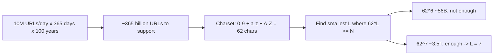
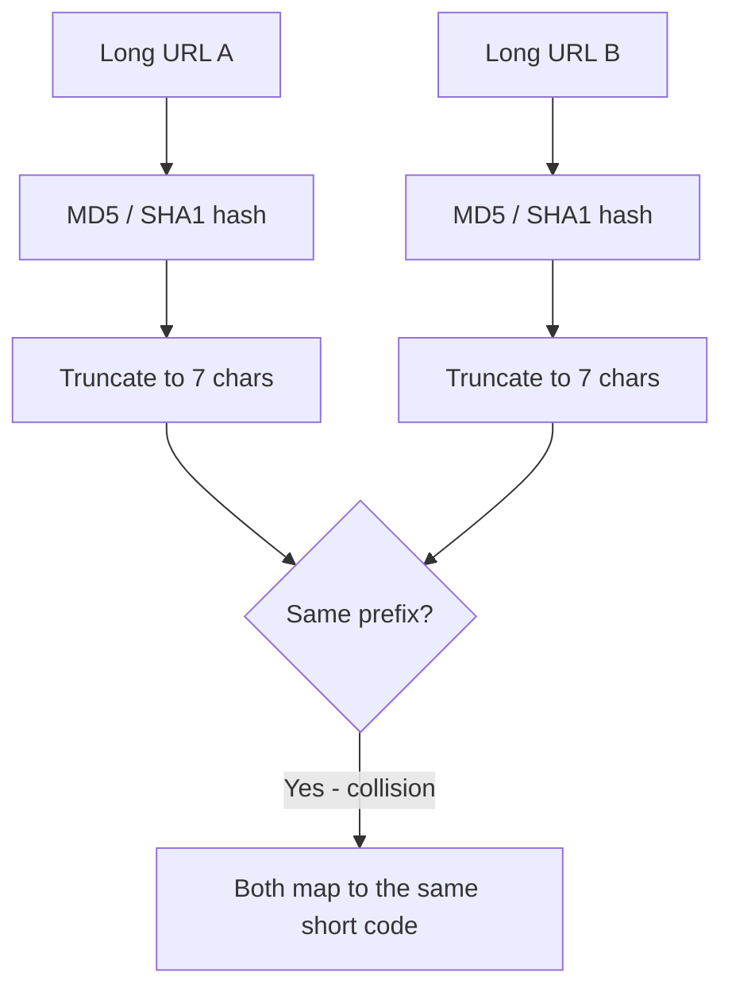
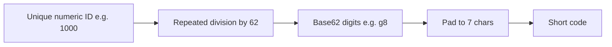
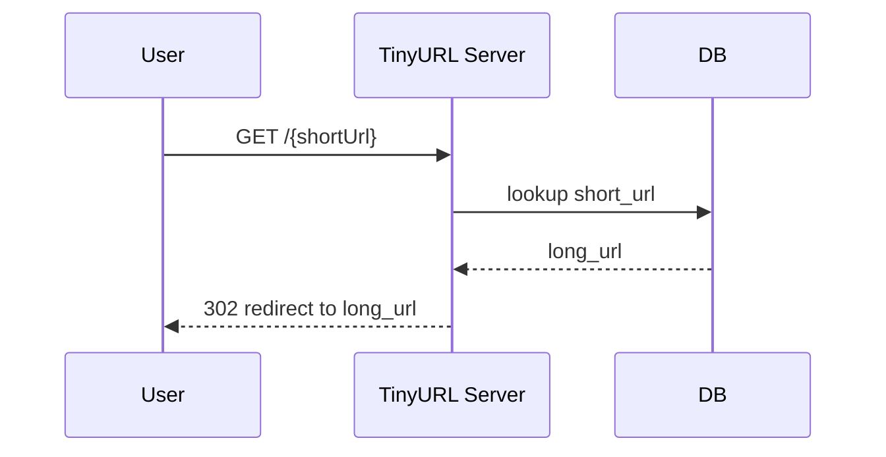
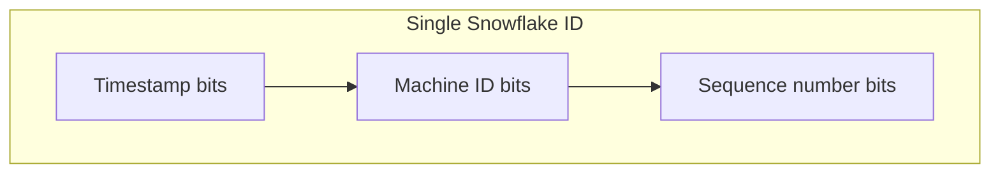
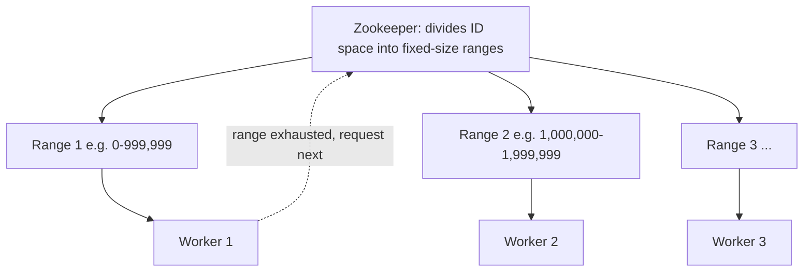
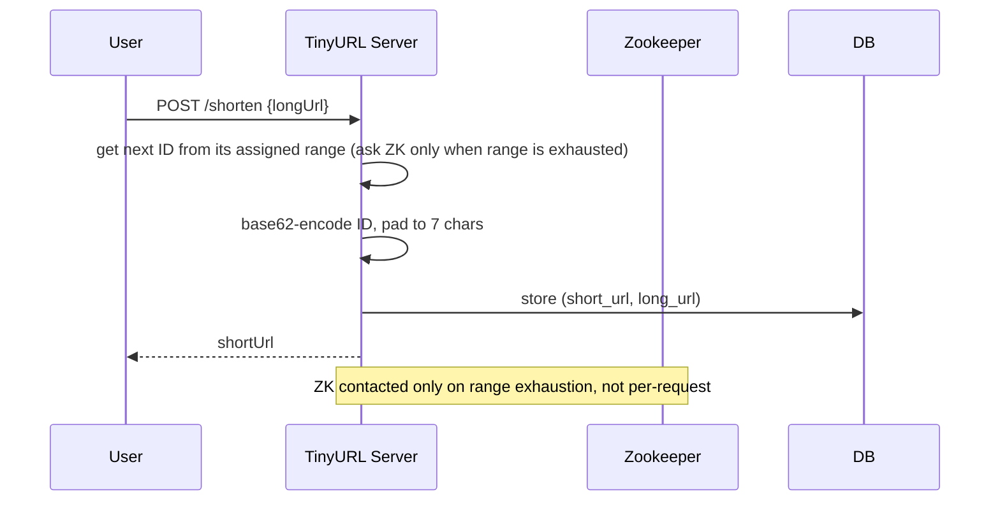
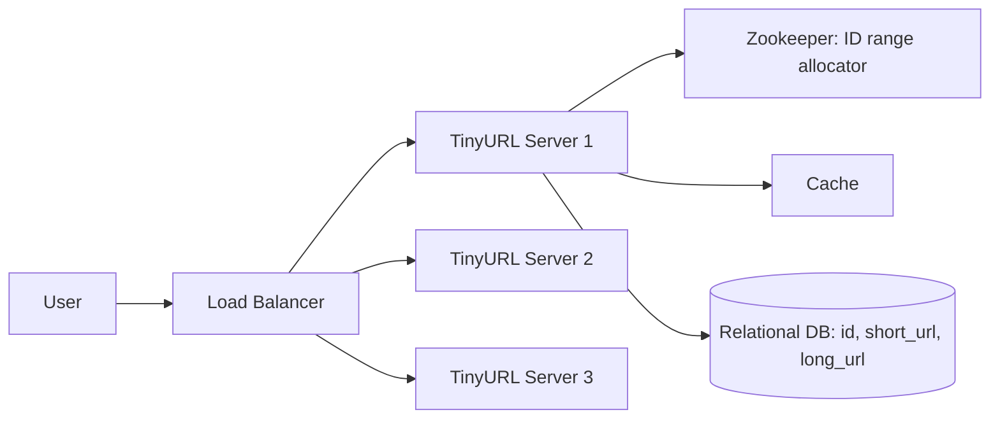

# Design URL Shortener (TinyURL)

## Overview
- Classic HLD interview question: design a service like TinyURL / LinkedIn's link shortener.
- POST a long URL in, get a short URL back; GET the short URL, get redirected to the long URL.
- Core challenges: how short can the code be, how to generate it without collisions, how to generate unique IDs across a distributed system.

## Key Concepts

### Requirements analysis
- First clarifying question: how short should the short code be? Interviewer often says "as short as possible."
- Pin it down via expected traffic: e.g. 10M URLs/day × 365 days × 100 years of support ≈ 365 billion URLs to support.
- Character set: digits 0-9 (10) + lowercase a-z (26) + uppercase A-Z (26) = 62 characters (base62).
- Find minimum code length L such that `62^L` ≥ required capacity:
  - `62^6` ≈ 56 billion — not enough (need 365 billion).
  - `62^7` ≈ 3.5 trillion — enough. So use 7-character codes.

### Why not use a hash function (MD5/SHA1)?
- MD5 = 128-bit hash → 32 hex characters. SHA1 = 160-bit hash → 40 hex characters.
- Both produce far more than the 7 characters needed, so you'd have to truncate.
- Truncating to the first 7 characters causes frequent collisions (different long URLs can share the same prefix) — not usable as-is.

### Base62 encoding
- Any decimal number can be converted to another base (e.g. base 62) via repeated division, same as converting decimal → binary/hex.
- Approach: generate a unique numeric ID first, then encode that ID in base62 to get the short code.
- Two problems to solve: (1) how to generate a unique ID in a distributed system, (2) the base62 output length varies with the ID's size, so short codes may come out shorter than 7 characters.
- Length fix: pad shorter outputs to 7 characters (like `=` padding in Base64). Since capacity was sized to `62^7`, encoded IDs never exceed 7 characters, so padding only ever needs to add characters, not truncate.

- Redirect flow (the base62 code decoded back to a long URL):

### Unique ID generation in a distributed system
- Single DB with auto-increment ID: doesn't scale (10M writes/day is too much for one DB) and is a single point of failure.
- Ticket server: a centralized auto-increment service that multiple app servers call. Solves the multi-DB sync problem but is itself a single point of failure and a scaling bottleneck.
- Snowflake ID (Twitter): timestamp bits + machine ID bits + sequence-number bits packed into one ID. Time-based, no central coordinator needed, scales well since each machine generates its own IDs.

- Zookeeper-based range allocation (preferred for this use case): 
  - Zookeeper divides the full ID space (e.g. 0 to 3.5 trillion) into fixed-size ranges (e.g. 1 million each).
  - Each worker/app server thread is handed one unused range and generates IDs only within it — no coordination needed between servers per-request.
  - When a worker exhausts its range, it asks Zookeeper for the next unused range.
  - Guarantees uniqueness across all distributed servers with no per-request central bottleneck.
  - Trade-off: a range assigned to a worker that never gets used is "wasted," but since total capacity (3.5 trillion) vastly exceeds the requirement (365 billion), this is an acceptable trade-off.
  - Zookeeper itself is not a unique ID generator — it's a general distributed coordination service; the range-allocation logic is built on top of it.

- Shorten (write) flow using the range-allocated ID:

## Trade-offs / Comparisons
| Approach | Verdict |
|---|---|
| Hash function (MD5/SHA1) + truncate | Rejected — output too long, truncation causes collisions |
| Single DB auto-increment | Rejected — doesn't scale, single point of failure |
| Ticket server (centralized auto-increment) | Rejected — still a single point of failure |
| Snowflake ID | Viable — timestamp + machine ID + sequence, decentralized |
| Zookeeper range allocation | Preferred here — divides ID space into ranges per worker, no per-request coordination |

## Example / Walkthrough
- Requirement math: 10M URLs/day × 365 days × 100 years = 365 billion URLs to support.
- Character space: 62 characters (0-9, a-z, A-Z).
- `62^7` ≈ 3.5 trillion > 365 billion → 7-character codes chosen.
- Base62 conversion example: decimal 1000 → base62 → `g8` (via repeated division: 1000 / 62 = 16 remainder 8 → 8; 16 in base62 = "g" → "g8").
- ID 16 in base62 is just "g" (1 character) — padded out to 7 characters to keep short-code length consistent.
- Max 7-character base62 value ("zzzzzzz") decodes to ≈3.5 trillion, confirming 7 characters is always sufficient for the sized ID range.
- End-to-end design: User → Load Balancer → TinyURL app servers (per data center) → each data center has its own cache + relational DB.
- DB table: `id | short_url | long_url`.
- App server calls Zookeeper to get a unique ID from its assigned range, base62-encodes it into the short URL, stores the (short_url, long_url) pair in the DB.
- GET request with a short URL: server looks up the DB row and returns/redirects to the long URL.
- Relational DB is sufficient here — no CDN needed, this design stays simple by interview standards.

## Diagram

## Interview Q&A

How do you decide the length of the short code?

Estimate total URLs to support over the service's lifetime (e.g. daily traffic × days × years), then find the smallest L where `62^L` exceeds that number, using the 62-character (0-9, a-z, A-Z) alphabet.

Why not just use MD5 or SHA1 and truncate it to 7 characters?

MD5 produces 32 hex characters and SHA1 produces 40 — both far longer than needed. Truncating to 7 characters causes frequent collisions since many different long URLs can share the same prefix.

How does base62 encoding generate the short code?

Generate a unique numeric ID first, then convert that ID into base62 (0-9, a-z, A-Z) via repeated division, the same way decimal converts to binary or hex. Pad the result to a fixed length if it comes out shorter.

How do you generate unique IDs across multiple distributed servers?

Options: a single auto-increment DB (doesn't scale, SPOF), a centralized ticket server (still SPOF), Snowflake IDs (timestamp + machine ID + sequence number, decentralized), or Zookeeper-based range allocation (each worker gets an exclusive numeric range to generate IDs from).

How does the Zookeeper range-allocation approach avoid ID collisions?

Zookeeper splits the total ID space into fixed-size ranges and hands each worker server an exclusive range. Each worker only generates IDs within its own range, so no two workers ever produce the same ID, and no per-request coordination is needed.

Is Zookeeper itself a unique ID generator?

No — Zookeeper is a general distributed coordination service. The range-allocation logic (dividing the ID space and assigning ranges to workers) is application logic built on top of it.

Why is padding needed in the base62-encoded short code?

Small numeric IDs encode to fewer than 7 base62 characters (e.g. ID 16 → "g"), so the result is padded to a consistent 7-character length. Since the ID range was sized so `62^7` covers all possible IDs, encoded values never need truncating, only padding.

## Related Topics
- [05. Scale from Zero to a Million Users](../concepts/05-scale-zero-to-million-users.md) — load balancer, DB, caching building blocks reused here
- [06. Consistent Hashing](../concepts/06-consistent-hashing.md) — alternative approach to distributing load/keys across servers
