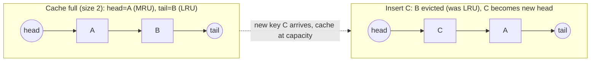
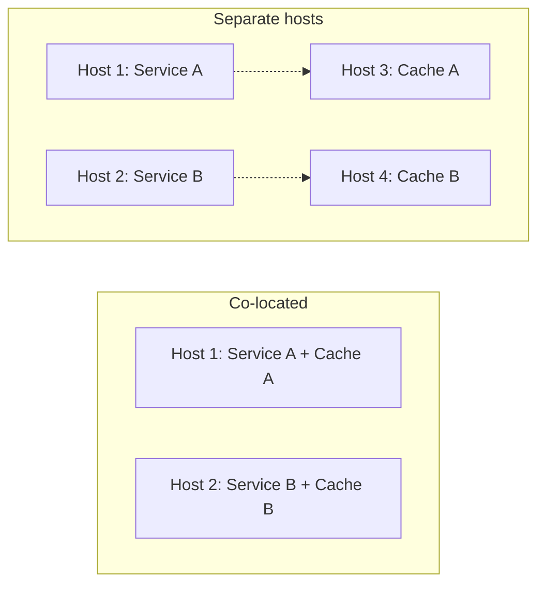
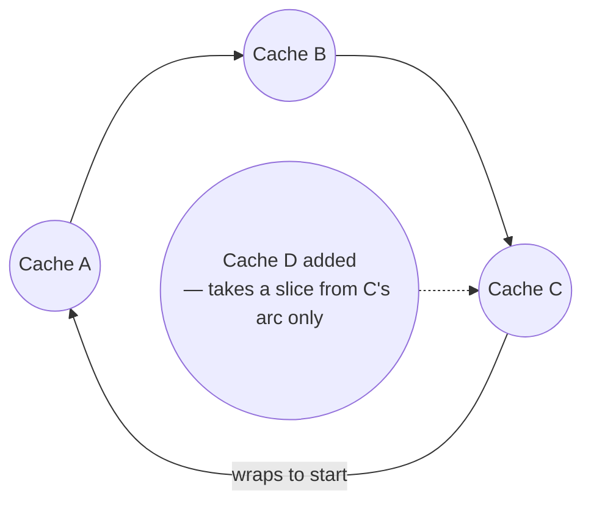
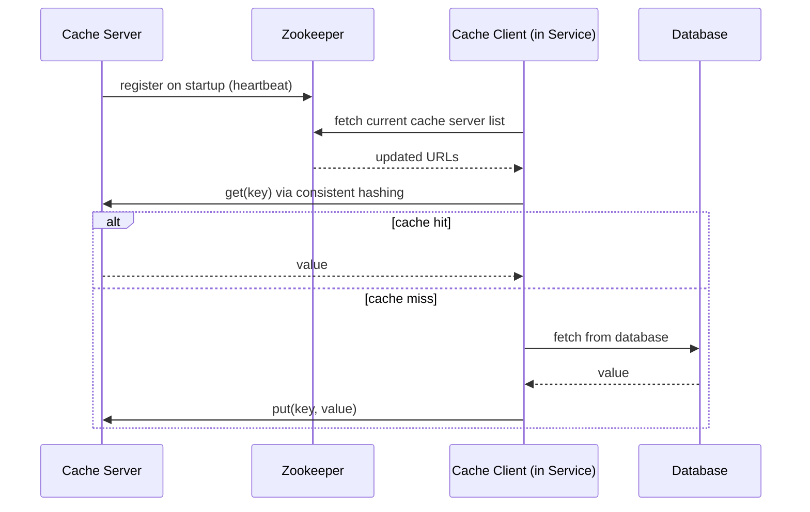
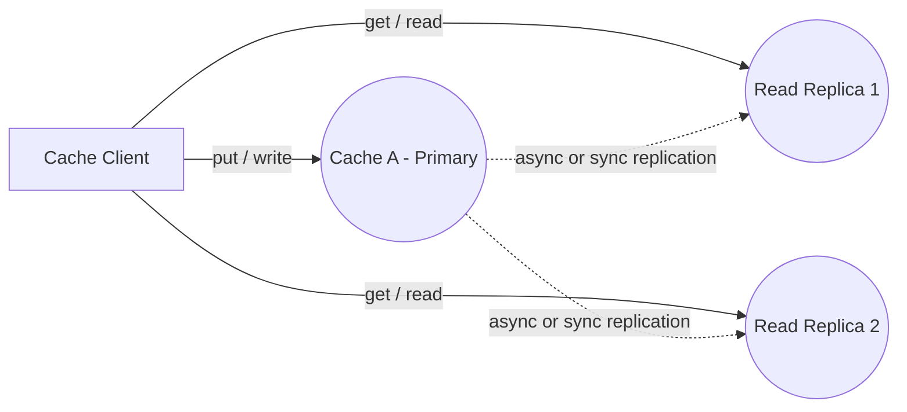
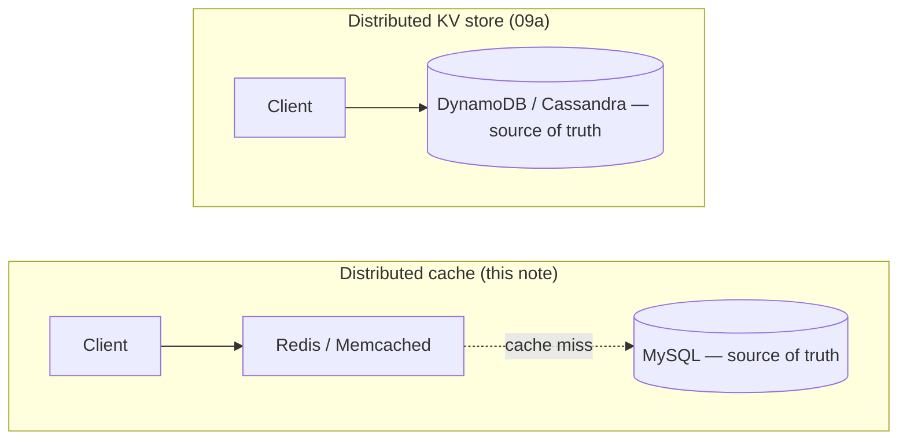
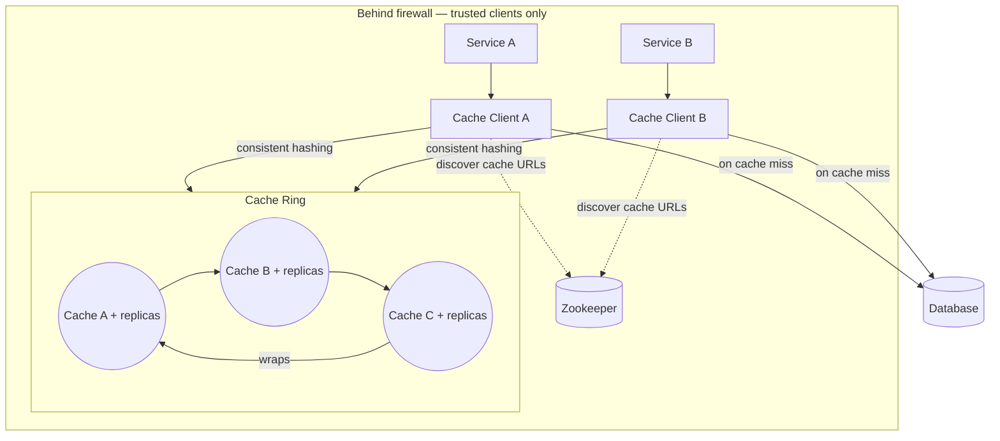

# Design a Key-Value Store (Memcached-style)

## Overview
- Mock interview: design a distributed caching key-value store, like Memcached.
- Core tension: caches run on fast but expensive/limited memory, so the
  design must be efficient in both lookup speed and memory usage.
- Purpose of the system: absorb frequently-repeated reads so the primary
  database doesn't take that load.
- Interview approach used: solve for a single service + single cache first,
  then scale out to multiple services/caches — don't jump straight to the
  distributed version.

## Key Concepts

### Requirements gathering
- Functional: `put(key, value)`, `get(key)` — the only two operations a
  cache needs to support.
- Non-functional: availability (avoid falling back to the DB), scalability
  (add more caches as services/traffic grow), performance (fast get/put).

### Single-node cache: hash table + LRU
- Hash table alone gives O(1) get/put but has no notion of "which entry to
  evict when full" — memory is limited, so eviction policy matters.
- Eviction policy options: LRU (least recently used), LFU (least frequently
  used — good for view-count/recommendation use cases), FIFO (oldest
  inserted evicted first). Chosen here: LRU, a business/use-case call, not
  a universal best.
- LRU implementation: hash table (key → node reference, O(1) lookup) +
  doubly linked list ordered by recency (O(1) move-to-head, O(1) evict from
  tail). Hash table alone can't track access order — the DLL supplies that.
- New/accessed items move to the head; the tail is always the least
  recently used entry, so eviction never requires scanning.

### Deploying caches across multiple services
- Co-located (cache on the same host as its service): less infra to
  maintain, cache auto-scales with the service — but if the host dies, both
  the service *and* its cache go down together.
- Separate hosts (cache on its own dedicated hardware): survives a service
  host failure, and the cache can be scaled independently of the service —
  but more hosts to provision and maintain.
- Choice depends on how important "cache always up" is; higher-availability
  needs push toward separate hosts.

### Picking the right cache server for a key
- Naive approach: `hash(key) % numCacheServers` — simple, but breaks the
  moment a cache server is added or removed, since `numCacheServers`
  changing shifts the modulo result for nearly every key → mass cache
  misses against servers that don't hold that data.
- Fix: consistent hashing — servers and keys hashed onto the same ring;
  each server owns the arc of keys between it and its counter-clockwise
  neighbor. Adding/removing one server only reshuffles that server's slice
  of the ring, not the whole keyspace. Full mechanics in
  [06. Consistent Hashing](../concepts/06-consistent-hashing.md).

### Cache client component
- A dedicated library/module deployed alongside every service (not baked
  into the service's business logic) — its one job is knowing which cache
  node to hit and talking to the DB on a miss.
- Keeps "where is the data" logic out of the services, so services stay
  focused on their own responsibility; a service that doesn't need caching
  simply doesn't include the cache client.
- How it learns the current cache server list:
  - Config file deployed via CI/CD — simple, but stale until the next
    deploy.
  - Periodic pull from a shared store (e.g. S3) — avoids redeploys, but
    can't poll too frequently, so there's a staleness window.
  - Registry/health-check service like Zookeeper — cache servers register
    on startup, cache client gets near-real-time updates. Preferred when
    cache misses (from stale server lists) are costly.

### High availability via read replicas
- Add read replicas to each cache node; route `get` (read) traffic to
  replicas and `put` (write) traffic to the primary.
- If the primary goes down, the cache client already knows the replica
  URLs (via the same discovery mechanism) and can fail over to reads from
  a replica.
- Async replication: fast writes, but a replica can serve stale data if the
  primary crashes before the update propagates.
- Sync replication: guarantees replicas match the primary, at the cost of
  write latency (must wait for replication to complete before ack).
- Choice is a business call: financial data favors sync/consistency; view
  counts or social feeds tolerate async/staleness for speed.

### Security & observability
- Cache servers sit behind the firewall, reachable only by trusted clients
  (services, load balancers) — never exposed directly.
- Log and monitor access patterns: who's hitting the cache, how often,
  hit/miss ratio, disk usage — needed both for capacity planning and to
  spot misuse. "If you can't measure it, you can't improve it."

## Trade-offs / Comparisons
| Decision | Option A | Option B |
|---|---|---|
| Eviction policy | LRU — general recency-based use | LFU (view-count/recommendation use) or FIFO (simplest) |
| Cache placement | Co-located with service — less ops, but shared failure domain | Separate host — independent scaling/isolation, more infra |
| Server selection | Naive `hash % N` — simple, breaks on scale change | Consistent hashing — minimal reshuffle, more setup |
| Cache server discovery | Config file / S3 pull — simple, some staleness | Zookeeper registry — near-real-time, more moving parts |
| Replication | Async — fast, can serve stale data | Sync — consistent, higher write latency |
- Consistent hashing itself has known drawbacks at larger scale: uneven key
  distribution across nodes, and memory overhead that grows with
  (number of cache servers × number of services). Jump hashing is a
  newer approach that improves on both.

### This note vs. a distributed key-value store ([09a](09a-key-value-store-dynamodb.md))
- Easy to conflate the two — both are distributed hash-map-like systems,
  but they solve different problems.

| Aspect | Distributed cache (this note — Redis/Memcached) | Distributed KV store ([09a](09a-key-value-store-dynamodb.md) — DynamoDB/Cassandra) |
|---|---|---|
| Primary goal | Speed | Durable storage |
| Source of truth | The database behind it | The KV store itself |
| Data loss on crash | Usually acceptable | Not acceptable |
| Storage | Mostly memory | Disk + memory |
| Latency | Extremely low (sub-ms to a few ms) | Low, but higher than cache |
| Eviction | LRU/LFU/TTL important | Usually not needed |
| Persistence | Optional | Mandatory |
| Consistency | Often relaxed | Carefully designed |
| Capacity | Limited by RAM | Much larger |
| Interview focus | Hash map, LRU/LFU, TTL, cache invalidation, consistent hashing, replication | Partitioning, consistent hashing, replication, quorum (N/R/W), vector clocks, gossip protocol, Merkle trees, read repair, hinted handoff |

- If the cache dies: rebuild from the database, no major business impact.
- If the KV store dies: the data is gone — a major incident.
- Fastest interview shortcut: interviewer says "this sits in front of
  MySQL" → distributed cache. Interviewer says "this stores the actual
  data" → distributed key-value store.

## Example / Walkthrough
- Start with one service + one cache, backed by hash table + LRU (DLL) —
  prove the single-node design before distributing.
- Scale to multiple services (A, B) each with their own cache (A, B) split
  by key range (e.g. alphabetical) — decide co-located vs separate-host
  deployment per availability needs.
- Naive `hash(key) % numHosts` breaks when a host is added/removed —
  switch to consistent hashing so only the new/removed server's slice of
  keys is affected (worked through with servers on a ring, adding a 4th
  and 5th server).
- Introduce a cache client component per service so services don't own
  "which cache/where" logic — cache client discovers server list via
  config file, S3, or Zookeeper (Zookeeper preferred for critical use
  cases).
- Revisit requirements: get/put ✓ via hash table + DLL; scalability ✓ via
  consistent hashing + cache client; performance ✓ (O(1) operations);
  availability ✗ initially (single instance per cache) — fixed by adding
  read replicas with async or sync replication depending on data
  sensitivity.
- Add security consideration: caches behind a firewall, trusted clients
  only, with logging/monitoring for hit/miss ratio and disk usage.
- Follow-up question: alternatives to consistent hashing → jump hashing,
  which addresses uneven key distribution and memory overhead at scale.

## Diagram

## Interview Q&A

Why choose LRU over LFU or FIFO for this cache?

No universal answer — it's a business/use-case call. LRU fits general
recency-based access; LFU suits view-count/recommendation systems where
"most popular" matters more than "most recent."

Why use a doubly linked list alongside the hash table for LRU?

The hash table gives O(1) key lookup but has no concept of access order.
The DLL tracks recency (move-to-head on access, evict from tail) in O(1),
so the hash table stores node references into the DLL instead of raw
values.

What's the tradeoff between co-locating a cache with its service vs. deploying it on a separate host?

Co-located: less infra to manage, cache scales automatically with the
service — but a host failure takes down the service and its cache
together. Separate host: independent scaling and isolation from service
failures — but more hosts to maintain.

Why does `hash(key) % numCacheServers` break when servers are added or removed?

Changing the server count changes the modulo result for nearly every key,
so lookups land on servers that don't actually hold that data — causing a
spike in cache misses across almost the entire keyspace.

What does the cache client component do, and why is it separate from the service?

It owns "which cache node holds this key" (via consistent hashing) and the
miss-path logic (fetch from DB, populate cache). Keeping it separate lets
services stay focused on their own logic, and lets a service opt out of
caching entirely by not including it.

How does the cache client discover where cache servers are hosted?

Three options: a config file deployed via CI/CD (simple, can go stale),
periodic pulls from a shared store like S3 (avoids redeploys, still has a
staleness window), or a registry/health-check service like Zookeeper
(near-real-time, preferred when stale server lists are costly).

How do you make the cache highly available, and what's the tradeoff?

Add read replicas per cache node; route reads to replicas, writes to the
primary. Async replication is fast but can serve stale data if the primary
crashes before propagating; sync replication avoids that at the cost of
write latency. The right choice depends on how sensitive the data is.

What are the drawbacks of consistent hashing, and what improves on it?

At larger scale it can produce uneven key distribution across servers, and
memory overhead grows with (number of cache servers × number of
services). Jump hashing is a newer approach that addresses both issues.

## Related Topics
- [06. Consistent Hashing](../concepts/06-consistent-hashing.md) — full ring/virtual-node
  mechanics used for cache server selection here
- [19. Distributed Cache & Caching Strategies](../concepts/19-caching-strategies.md) —
  cache-aside/read-through/write-through patterns, complementary to this
  system-design walkthrough
- [15. High Availability & Resilience](../concepts/15-high-availability-active-passive-active-active.md)
  — active-passive/active-active parallels the primary + read-replica
  tradeoff here
