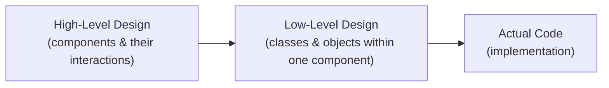
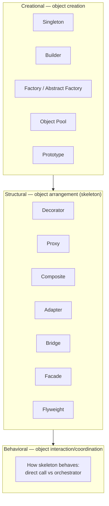
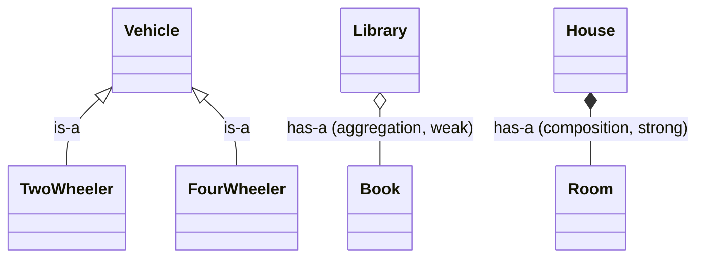
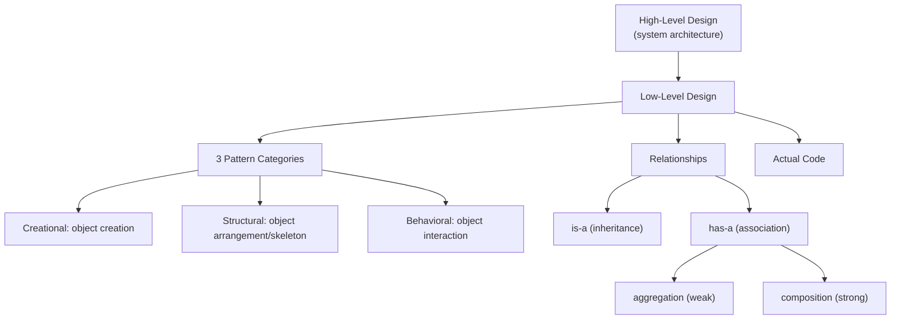

# What is LLD (Low Level Design)

## Overview
- LLD sits between high-level design (HLD) and actual code — HLD is the
  system's component architecture, LLD zooms into one component to define
  its classes/objects and how they interact, which then becomes the code.
- Focuses on classes and objects within a system, not the overall system
  topology.
- Goal: write code that is clean, flexible/maintainable, and easy to test.
- Design (HLD + LLD) matters more than writing the code itself — even AI can
  write code, but someone still has to produce the design.

## Key Concepts
### HLD vs LLD vs Code (where LLD fits)
- HLD — architecture of the whole system: components and how they talk to
  each other.
- LLD — double-click into one component: what classes/objects exist inside
  it, how they interact.
- Code — the actual implementation that LLD gets converted into.

### Three categories of LLD design patterns
- Patterns exist so recurring problems aren't re-solved from scratch each
  time — but knowing a pattern by name isn't mandatory; you can arrive at
  the same structure by reasoning through the problem yourself.
- **Creational** — controls how objects get created.
  - Singleton, Builder, Factory, Abstract Factory, Object Pool, Prototype.
  - E.g. Singleton: no matter how many times callers ask for an object, only
    one instance is ever created and shared.
  - E.g. Builder: constructs a complex object step by step instead of all
    at once.
- **Structural** — controls how classes/objects are arranged together to
  solve a larger problem flexibly; think of it as building the system's
  skeleton.
  - Decorator, Proxy, Composite, Adapter, Bridge, Facade, Flyweight.
  - E.g. a car built from wheel, engine, headlights, steering objects — how
    those objects are arranged is the structural concern.
- **Behavioral** — controls how objects communicate/interact once the
  skeleton exists: coordination, responsibility, interaction style (direct
  call vs. going through an orchestrator).

### is-a vs has-a relationships
- **is-a** = inheritance, parent-child relationship.
  - TwoWheeler is a Vehicle, FourWheeler is a Vehicle.
  - CEO is an Employee, Manager is an Employee.
- **has-a** = association, a link between two independent objects.
  - House has Rooms, Library has Books, School has Students.
  - Association splits into two strengths: aggregation (weak) and
    composition (strong).
- **Aggregation (weak has-a)** — existence of one object doesn't depend on
  the other. Library has Books: if the Library object is destroyed, Books
  still exist independently. Library only *knows about* books — it doesn't
  manage their creation/deletion.
- **Composition (strong has-a)** — existence of one object depends on the
  other. House has Rooms: if House is destroyed, Rooms are gone too. House
  is also responsible for creating/managing Room objects.
- UML convention: hollow diamond + line = aggregation; filled diamond +
  line = composition. Shortcut for interviews: just label the arrow "is a"
  or "has a" instead of memorizing diamond fill style.

### UML usage in interviews
- LLD interview formats: machine coding round (~1-2 hrs, full working code
  expected) vs. a shorter 40-45 min round.
- In the 40-45 min round, code is usually still expected (sometimes not
  fully functional) — so don't over-invest in UML diagramming; ~10-15 min on
  UML, save the rest for coding.
- You can't code without first knowing the classes, their relationships, and
  parent/child structure — so UML thinking is still necessary, just not a
  polished diagram.
- Personal shortcut: skip fancy diamond notation, just draw an arrow and
  label it "is a" or "has a".

## Trade-offs / Comparisons
| Relationship | Type | Existence dependency | UML notation |
|---|---|---|---|
| is-a | Inheritance | Child depends on parent's type, not lifecycle | Arrow labeled "is a" |
| has-a (aggregation) | Association, weak | Independent — one can outlive the other | Hollow diamond + line |
| has-a (composition) | Association, strong | Dependent — one dies when the other does | Filled diamond + line |

## Example / Walkthrough
- Vehicle → TwoWheeler, FourWheeler (is-a / inheritance).
- Employee → CEO, Manager (is-a / inheritance).
- Library has Books (has-a / aggregation — weak, both can exist
  independently, Library doesn't manage book lifecycle).
- House has Rooms (has-a / composition — strong, Room lifecycle depends on
  House, House manages Room creation).
- Car built from Wheel, Engine, Headlights, Steering objects (structural
  pattern example — arranging objects to solve the "build a car" problem).
- Class1 → Class2 → Class3 interaction: either Class2 calls Class3 directly,
  or routes through an orchestrator class (behavioral pattern example).

## Diagram

## Interview Q&A

Where does LLD fit relative to HLD and actual code?

Between them — HLD defines system components and their interactions; LLD
zooms into one component to define its classes/objects and interactions;
that LLD then becomes the actual code.

What's the main purpose of doing LLD before coding?

To produce clean code that's flexible, maintainable, and easy to test —
good design makes writing the code itself easy.

What are the three categories of LLD design patterns, and what does each control?

Creational (how objects are created, e.g. Singleton, Builder, Factory),
Structural (how objects are arranged to form the system's skeleton, e.g.
Decorator, Adapter, Composite), and Behavioral (how objects communicate and
coordinate once the skeleton exists, e.g. via direct calls or an
orchestrator).

Is memorizing every design pattern by name mandatory for LLD interviews?

No — you can independently reason your way to a class structure that solves
the problem; recognizing it matches a known pattern afterward is helpful but
not required.

What's the difference between is-a and has-a relationships?

is-a is inheritance (parent-child, e.g. TwoWheeler is a Vehicle). has-a is
association, a link between two otherwise independent objects (e.g. Library
has Books).

What's the difference between aggregation and composition?

Both are has-a/association, but aggregation is weak (existence of one object
doesn't depend on the other — Library has Books, both survive independently)
while composition is strong (one object's existence depends on the other —
House has Rooms, Rooms die when the House does).

How should you split time between UML diagramming and coding in a 40-45 minute LLD round?

Spend only ~10-15 minutes on UML/relationships, and prioritize leaving
enough time to actually write code — interviewers in this format still
generally expect code, and not producing any hurts your chances more than a
rough UML does.

## Related Topics
- Design patterns (Singleton, Builder, Factory, etc.) — to be added as
  individual notes per the roadmap.
- SOLID principles — prerequisite per [[LLD/00-roadmap]].
