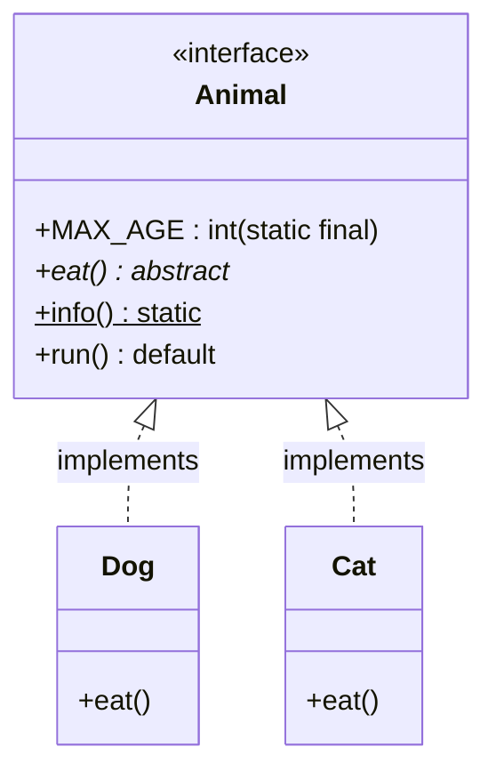
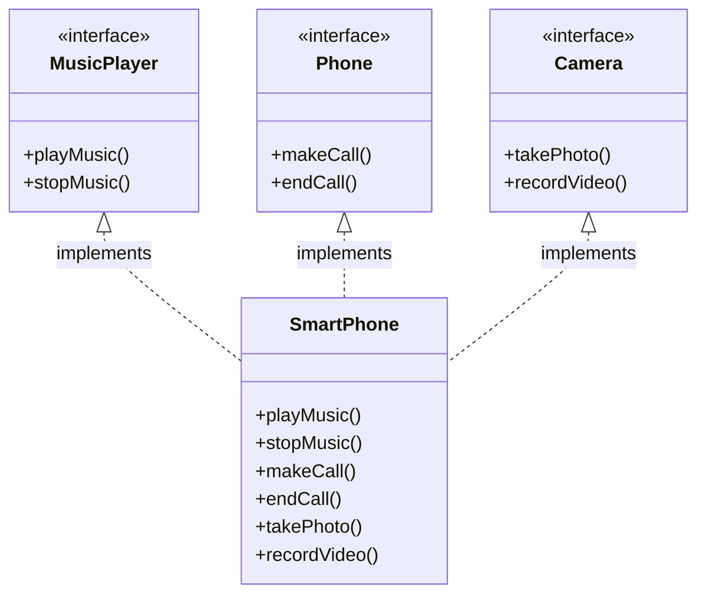
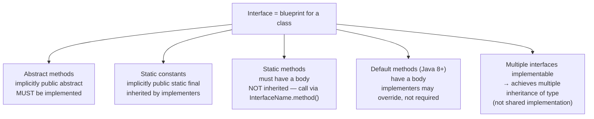

# Mastering Java Interfaces: Static & Default Methods, Multiple Inheritance

## Overview
- Java classes cannot extend more than one class — a `SmartPhone` can't
  directly `extends MusicPlayer, Camera, Phone` at once. Interfaces are
  Java's way around this.
- An interface is a **blueprint for a class**, the same way a class is a
  blueprint for an object.
- Interfaces can contain: abstract methods, static constants, static
  methods, and (since Java 8) default methods.
- Prerequisite context for LLD: interfaces are the mechanism behind ISP and
  DIP in [[LLD/01-solid-principles]], and behind achieving multiple
  inheritance of type in Java.

## Key Concepts
### Interface members and their implicit modifiers
- Abstract methods in an interface are implicitly `public abstract` — the
  IDE flags explicitly writing `public abstract` as redundant.
- A class implementing an interface must either implement every abstract
  method or be declared `abstract` itself — same rule as extending an
  abstract class, except the keyword is `implements`, not `extends`.
- Interfaces can't be instantiated directly and have no constructor — same
  restriction as abstract classes, for the same reason (no full method
  implementation to construct from).
- Static constants declared in an interface (implicitly `public static
  final`) are inherited by every implementing class and accessible either
  through the interface name or the implementing class name — though the
  IDE warns "static member accessed via instance/implementation reference"
  and recommends accessing via the interface name for clarity.



### Static methods in interfaces
- Unlike abstract methods, a static method in an interface must have a body
  when declared.
- Static methods are **not** inherited into implementing classes — you
  can't call `Dog.info()`; you must call it directly via the interface name,
  `Animal.info()`.
- Useful for utility-style methods related to the interface (e.g. an
  `info()` describing what the interface represents) without needing a
  separate `Utils` class.

### Default methods (Java 8+)
- A `default` method provides a method body directly in the interface.
- Implementing classes are **not forced** to override a default method —
  they can, but don't have to (unlike abstract methods, which must be
  implemented or the class must be abstract).
- Accessed through instances of the implementing class, e.g. `dog.run()`,
  `cat.run()` — both resolve to the interface's shared implementation
  unless a class overrides it.
- Benefit: if an interface has many (e.g. hundreds of) implementing
  classes and a new shared behavior needs to be added, a default method
  lets every implementer get it for free without forcing each one to add
  its own implementation.

```java
Dog dog = new Dog();
Cat cat = new Cat();
dog.run(); // not overridden -> runs Animal interface's default run()
cat.run(); // not overridden -> runs Animal interface's default run()
```

### Achieving multiple inheritance via interfaces
- `SmartPhone` implements three interfaces: `MusicPlayer` (`playMusic`,
  `stopMusic`), `Phone` (`makeCall`, `endCall`), `Camera` (`takePhoto`,
  `recordVideo`).
- Java allows implementing multiple interfaces (unlike extending multiple
  classes), so `SmartPhone` gets the combined method signatures of all
  three.
- This is **not pure multiple inheritance** — `SmartPhone` doesn't inherit
  any shared implementation from the interfaces; it must write its own
  implementation for every abstract method from each interface. It's
  effectively/functionally achieving multiple inheritance's coverage, not
  literally inheriting behavior from multiple parents — described as a
  workaround ("jugaad"), not the real thing.



### Interfaces can contain a `main` method
- Confirmed by demonstration: a `public static void main(String[] args)`
  written inside an interface runs fine — the JVM can execute it directly,
  same as it would in a class.

## Trade-offs / Comparisons
| Feature | Abstract class | Interface |
|---|---|---|
| Instance variables | Yes | No — only static constants |
| Method types | Abstract + regular (concrete) methods | Abstract, static, and default methods |
| Inheritance keyword | `extends` (single only) | `implements` (multiple allowed) |
| Instantiable directly | No | No |
| Has a constructor | Yes | No |
| Multiple inheritance | Not possible (single class extension) | Achievable (implement multiple interfaces) |

## Example / Walkthrough
- `Animal` interface: `MAX_AGE` static constant, an abstract `eat()`
  method, a static `info()` method printing "This is an Animal interface",
  and a default `run()` method printing "Animal is running".
- `Dog` and `Cat` implement `Animal`, must implement `eat()` (prints "Dog is
  eating" / "Cat is eating"), inherit `MAX_AGE`, and inherit `run()` without
  overriding it — calling `dog.run()` and `cat.run()` both print "Animal is
  running" via the shared default implementation.
- Accessing `MAX_AGE`: works via `Animal.MAX_AGE`, `Dog.MAX_AGE`, or
  `Cat.MAX_AGE` (IDE prefers the interface-name form for clarity).
- Accessing `info()`: only works via `Animal.info()` — `Dog.info()` is not
  available since static methods aren't inherited.
- `SmartPhone implements MusicPlayer, Phone, Camera` — calling
  `smartPhone.takePhoto()`, `smartPhone.recordVideo()`,
  `smartPhone.makeCall()` etc. all work since `SmartPhone` implements every
  abstract method from all three interfaces itself.

## Diagram


## Interview Q&A
<details>
<summary>Why can't Java classes achieve multiple inheritance the way interfaces can?</summary>

A class can only `extends` one other class, so it can't combine behavior
from multiple parent classes directly. Interfaces get around this because a
class can `implements` multiple interfaces at once — though this only
combines method signatures the implementer must write itself, not shared
implementation, so it's not true multiple inheritance.

</details>

<details>
<summary>Can you instantiate an interface? Why not?</summary>

No — same reason as an abstract class: it has no full method
implementation to construct an object from, so it has no constructor.

</details>

<details>
<summary>What's the difference between a static method and a default method in an interface?</summary>

A static method must be called directly via the interface name (it isn't
inherited into implementing classes), while a default method is inherited
and callable through instances of implementing classes, and implementers
are free to override it or leave it as-is.

</details>

<details>
<summary>Why were default methods added in Java 8 — what problem do they solve?</summary>

If an interface has many implementing classes and a new method needs to be
added, making it abstract would force every implementer to add its own
implementation. A default method instead provides a shared implementation
so existing implementers keep working unchanged, while still allowing
individual classes to override it if they need different behavior.

</details>

<details>
<summary>If a class implements an interface but doesn't implement all its abstract methods, what happens?</summary>

Compile error — the class must either implement every abstract method from
the interface or be declared `abstract` itself, the same rule as extending
an abstract class.

</details>

<details>
<summary>Can an interface contain a main method?</summary>

Yes — a `public static void main(String[] args)` can be written inside an
interface and the JVM runs it directly, same as in a class.

</details>

## Related Topics
- [[LLD/01-solid-principles]] — Interface Segregation and Dependency
  Inversion both rely on interfaces as the abstraction mechanism.
- [[LLD/00a-what-is-lld]] — is-a relationship (inheritance) vs implementing
  an interface.
