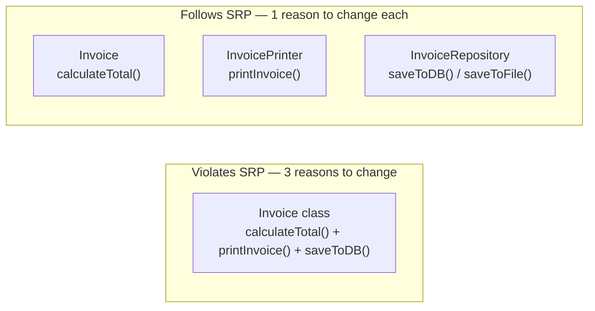
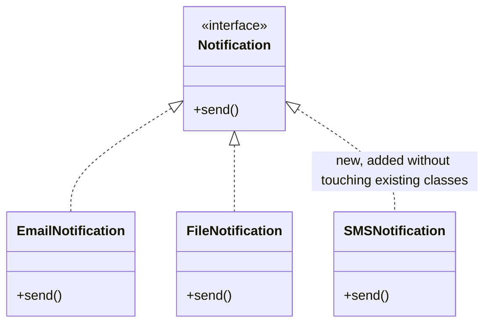
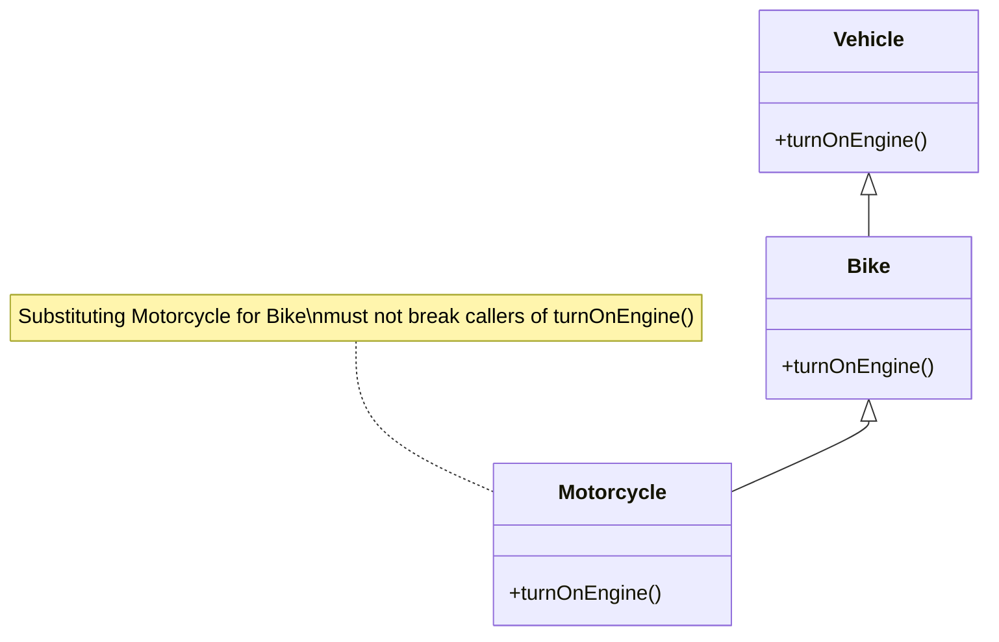
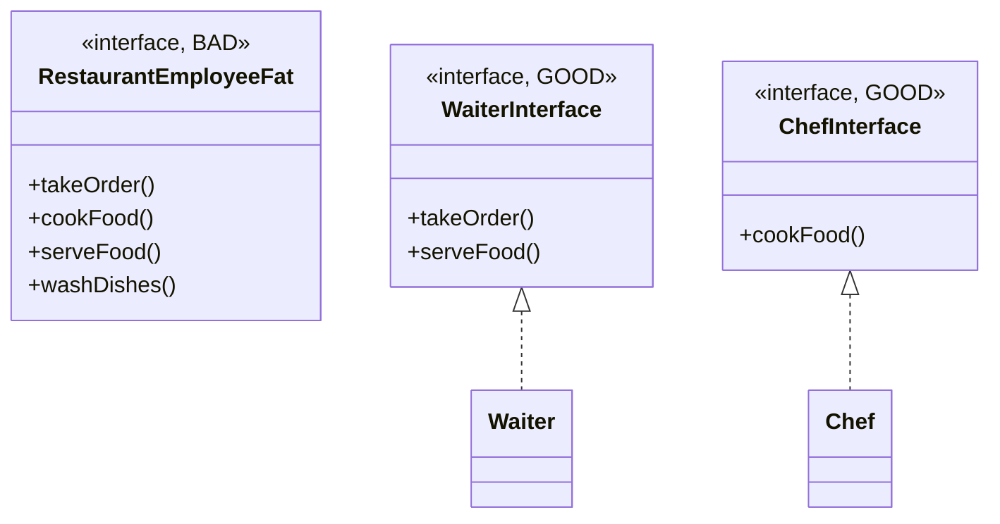
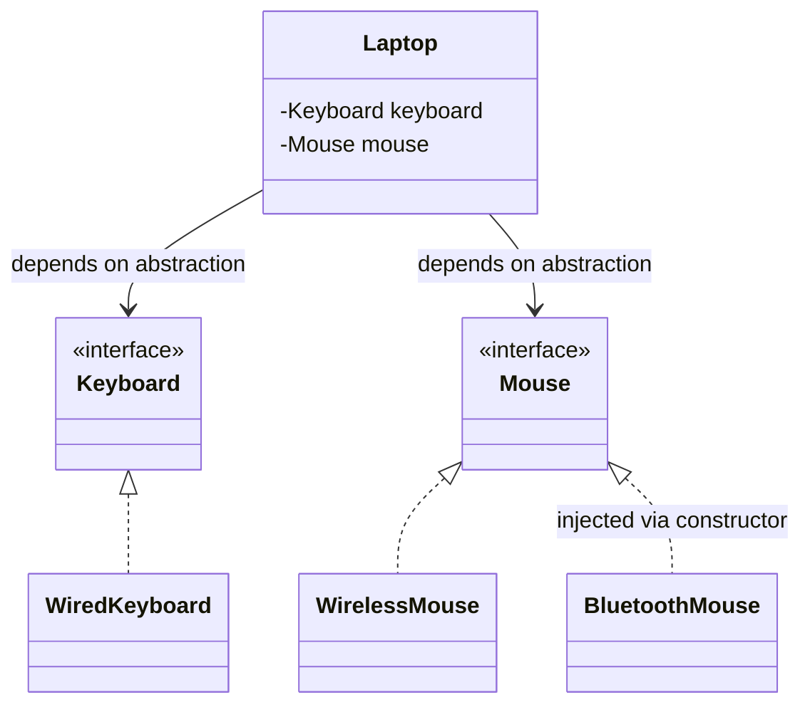
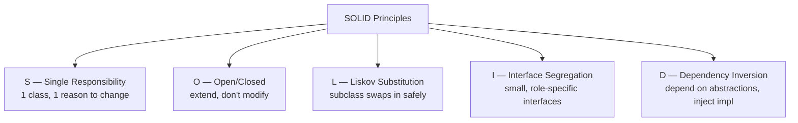

# SOLID Principles with Easy Examples

## Overview
- SOLID = 5 design principles that underlie most of the GoF design patterns
  — knowing SOLID first makes it easier to understand *why* the patterns
  are shaped the way they are.
- Each letter is its own principle with a full name: **S**ingle
  Responsibility, **O**pen/Closed, **L**iskov Substitution, **I**nterface
  Segregation, **D**ependency Inversion.
- Goal across all five: reduce software complexity, make code easier to
  maintain, extend, and test.

## Key Concepts
### Single Responsibility Principle (SRP)
- A class should have only one reason to change.
- Bad example: an `Invoice` class holding a `Product` (name, color,
  manufacturer, price) that also has `calculateTotal()`, `printInvoice()`,
  and `saveToDB()` methods all in one class.
- Problem: this class now has 3 reasons to change — if calculation logic
  changes, if printing logic changes, or if the save/persistence logic
  changes (e.g. DB vs file). Any of those unrelated changes forces edits to
  the same class.
- Fix: split responsibilities into separate classes — `Invoice` keeps only
  `calculateTotal()`; a separate class handles printing; a separate
  persistence/data-access class handles saving (to DB, file, etc).
- Result: easier to maintain and understand — a change to calculation logic
  only touches the calculation class and doesn't risk breaking printing or
  saving.

### Open/Closed Principle (OCP)
- Classes should be open for extension, but closed for modification —
  add new behavior by extending, not by editing existing, already-live code.
- Example: a notification class that only sends via one channel (e.g.
  file/email). If a new notification channel is needed later, don't modify
  the existing class directly — that risks breaking already-working,
  already-deployed behavior.
- Fix: define a common notification interface/abstract base class; each
  channel (email, SMS, push, etc.) is its own class implementing that
  interface. Adding a new channel means adding a new class, not touching
  existing ones.

### Liskov Substitution Principle (LSP)
- Objects of a superclass should be replaceable with objects of a subclass
  without breaking the application's correctness — output can differ, but
  behavior/contract must not break.
- Example: `Vehicle` → `Bike` → `Motorcycle` (Motorcycle extends Bike).
  Both have an engine and a `turnOnEngine()` method. A program holding a
  `Bike` reference should work identically if a `Motorcycle` object is
  substituted in — calling `turnOnEngine()` should still correctly turn on
  the engine either way.
- Violation case: if a subclass reduces or removes a capability the parent
  guarantees (e.g. the child's overridden method doesn't actually turn on
  the engine, or throws/does something unexpected), callers relying on the
  parent's contract break — this is what LSP forbids.

### Interface Segregation Principle (ISP)
- Don't force a class to implement methods it doesn't need — split large
  ("fat") interfaces into smaller, role-specific ones.
- Example: a single `RestaurantEmployee` interface with methods like
  `takeOrder()`, `cookFood()`, `serveFood()`, `washDishes()`. A `Waiter`
  class implementing this interface is forced to implement `cookFood()` and
  `washDishes()` too — which aren't a waiter's job.
- Fix: break the fat interface into smaller ones — e.g. a `Waiter` interface
  (`takeOrder`, `serveFood`) and a `Chef` interface (`cookFood`) — so each
  implementing class only implements the methods relevant to its role.

### Dependency Inversion Principle (DIP)
- High-level modules shouldn't depend on low-level concrete classes —
  both should depend on abstractions (interfaces).
- Example: a `Laptop` class directly instantiating/depending on concrete
  `WiredKeyboard` and `WirelessMouse` classes. This tightly couples
  `Laptop` to those specific implementations — swapping in a
  `BluetoothMouse` later means modifying `Laptop`.
- Fix: `Laptop` depends on `Keyboard` and `Mouse` interfaces instead of
  concrete classes; concrete implementations (`WiredKeyboard`,
  `WirelessMouse`, `BluetoothMouse`) are injected in via the constructor
  (constructor injection). `Laptop` no longer needs to change when the
  concrete device type changes.

## Trade-offs / Comparisons
| Principle | Problem it prevents | Fix pattern |
|---|---|---|
| SRP | One class changing for multiple unrelated reasons | Split into single-purpose classes |
| OCP | Editing tested/live code to add new behavior | Extend via interface/new subclass instead of modifying |
| LSP | Subclass substitution silently breaking caller behavior | Subclass must honor parent's behavioral contract |
| ISP | Classes forced to implement irrelevant methods | Split fat interfaces into small, role-specific ones |
| DIP | High-level class tightly coupled to concrete low-level class | Depend on interfaces; inject concrete impl via constructor |

## Example / Walkthrough
- SRP: `Invoice` (Product: name, color, manufacturer, price) split into
  `Invoice.calculateTotal()`, a printer class, and a persistence class
  (DB/file).
- OCP: notification system — add new channels as new classes implementing a
  shared interface instead of editing the existing notification class.
- LSP: `Vehicle` → `Bike` → `Motorcycle`, both with `turnOnEngine()` —
  substituting `Motorcycle` where `Bike` is expected must not break the
  calling program.
- ISP: restaurant employee interface split into `Waiter` (takeOrder,
  serveFood) and `Chef` (cookFood) instead of one interface forcing waiters
  to implement `washDishes`/`cookFood`.
- DIP: `Laptop` depends on `Keyboard`/`Mouse` interfaces, concrete
  `WiredKeyboard`/`WirelessMouse`/`BluetoothMouse` injected via constructor.

## Diagram

## Interview Q&A

What does the Single Responsibility Principle say, and how do you spot a violation?

A class should have only one reason to change. Spot it by asking: "if I list
every reason this class might need to change, is it more than one?" — e.g.
an Invoice class that changes for calculation logic, printing logic, AND
persistence logic is violating SRP.

How is the Open/Closed Principle different from just "write extensible code"?

OCP specifically forbids modifying already-existing, already-live classes to
add new behavior — you extend via new classes/subclasses implementing a
shared interface instead, so existing tested behavior is never put at risk.

What exactly does Liskov Substitution Principle guarantee?

That any place in code expecting a superclass object can receive a subclass
object instead without breaking correctness — output may differ, but the
subclass must not violate the behavioral contract the superclass promises.

Why is a large "fat" interface a problem, and what does ISP say to do about it?

A fat interface forces every implementing class to implement methods it
doesn't actually need (e.g. a Waiter forced to implement cookFood). ISP says
to split it into smaller, role-specific interfaces so each class only
implements what's relevant to it.

What's the difference between Dependency Inversion and just "using interfaces"?

DIP specifically says high-level modules should not depend on low-level
concrete classes directly — both should depend on abstractions, and the
concrete implementation should be provided from outside (e.g. via
constructor injection), not instantiated inside the high-level class.

Give a concrete LSP violation example.

If Motorcycle extends Bike but overrides turnOnEngine() in a way that
doesn't actually turn on the engine (or breaks the expected behavior),
substituting a Motorcycle object wherever a Bike is expected would break
callers relying on Bike's contract — that's an LSP violation.

## Related Topics
- [[LLD/00a-what-is-lld]] — LLD categories (creational/structural/behavioral)
  that these principles underpin.
- [[LLD/00b-java-interfaces]] — interfaces are the mechanism ISP and DIP
  rely on.
- Design patterns (Factory, Decorator, Strategy, etc.) — many directly
  implement one or more SOLID principles.
