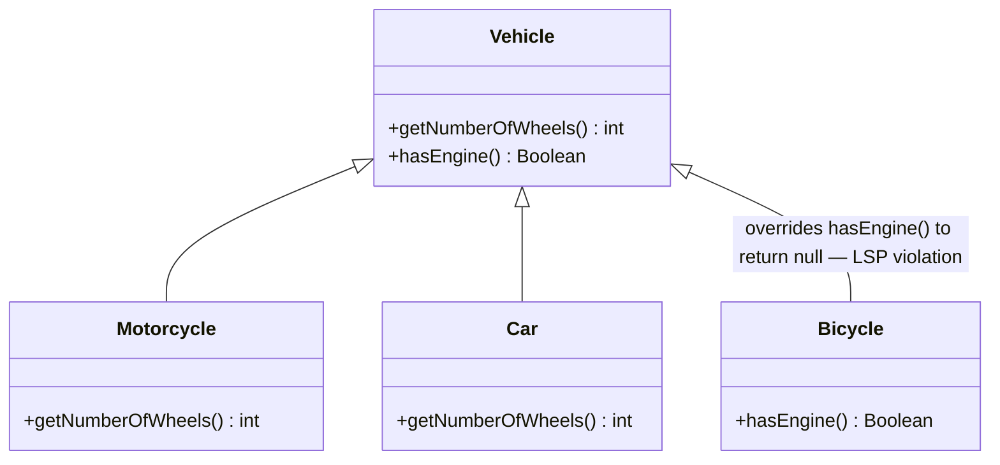
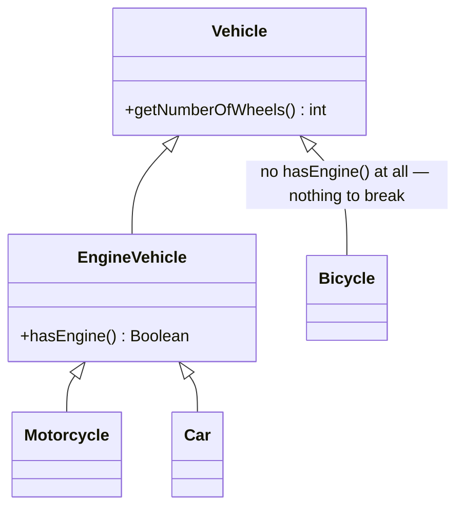
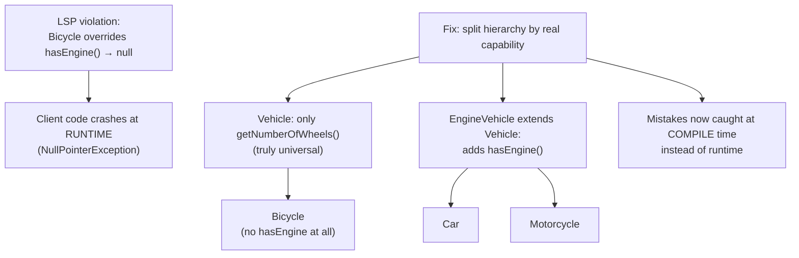

# Liskov Substitution Principle (LSP) with Solution in Java

## Overview
- Follow-up to [[LLD/01-solid-principles]] — that note covers what LSP is
  and what a violation looks like; this one walks through a concrete
  violation and how to actually fix it via inheritance restructuring.
- Core rule restated: given a parent class and its child classes, swapping
  one child object for another (or for the parent) anywhere in client code
  must not break that code.
- The fix is not a new pattern — it's disciplined use of inheritance: keep
  only truly universal behavior in the base class, and pull
  capability-specific behavior into an intermediate class that only the
  children which actually support it extend.

## Key Concepts
### The violation — a capability-reducing subclass
- `Vehicle` (parent): `getNumberOfWheels()` defaults to 2, `hasEngine()`
  defaults to `true` (returns a `Boolean` object, not a primitive).
- `Motorcycle extends Vehicle` — doesn't override either method (2 wheels,
  has engine, both inherited as-is).
- `Car extends Vehicle` — overrides `getNumberOfWheels()` to return 4,
  inherits `hasEngine()` as `true`.
- Client code: builds a `List<Vehicle>` containing a `Motorcycle` and a
  `Car`, iterates it, and calls `vehicle.hasEngine().toString()` on each —
  works fine for both, since both genuinely have an engine.
- Problem introduced: `Bicycle extends Vehicle` overrides `hasEngine()` to
  return `null` (bicycles have no engine, and the return type is the boxed
  `Boolean`, not primitive `boolean`, so `null` is a legal override).
- Adding a `Bicycle` to the same `List<Vehicle>` and running the same
  client code (`vehicle.hasEngine().toString()`) throws a
  `NullPointerException` the moment the loop reaches the bicycle.



```java
class Vehicle {
    int getNumberOfWheels() { return 2; }
    Boolean hasEngine() { return true; }
}
class Motorcycle extends Vehicle {} // 2 wheels, has engine — inherits both as-is
class Car extends Vehicle {
    @Override
    int getNumberOfWheels() { return 4; } // has engine — inherits hasEngine() as-is
}
class Bicycle extends Vehicle {
    @Override
    Boolean hasEngine() { return null; } // no engine — legal override, but breaks the contract
}
```

### Why this is an LSP violation
- `Bicycle` doesn't extend `Vehicle`'s capabilities — it **removes** one
  (`hasEngine`), returning `null` instead of honoring the contract the
  parent established (a real `true`/`false` answer).
- Any client code written against `Vehicle` that trusts `hasEngine()` to
  return a usable value now silently breaks the moment a `Bicycle` is
  substituted in — exactly what LSP forbids.
- At scale this is worse than one crash site: if similar client code exists
  in ~100 places, every one of them now needs a defensive `instanceof
  Bicycle` check before calling `hasEngine()` — a maintenance burden that
  grows with every future "reduced capability" subclass.

```java
List<Vehicle> vehicles = List.of(new Motorcycle(), new Car(), new Bicycle());
for (Vehicle v : vehicles) {
    System.out.println(v.hasEngine().toString());
}
// Motorcycle -> "true"
// Car        -> "true"
// Bicycle    -> hasEngine() returns null -> null.toString() -> NullPointerException
```

### The fix — split the hierarchy by real capability
- Keep only genuinely universal behavior on `Vehicle`: `getNumberOfWheels()`
  stays (every vehicle has wheels).
- Remove `hasEngine()` from `Vehicle` entirely and move it to a new
  intermediate class, `EngineVehicle extends Vehicle`, which adds
  `hasEngine()`.
- `Car` and `Motorcycle` now extend `EngineVehicle` (they genuinely have
  engines, so they legitimately inherit `hasEngine()`).
- `Bicycle` extends `Vehicle` directly — it never sees `hasEngine()` at
  all, so there's no method to override into a broken `null`.



```java
class Vehicle {
    int getNumberOfWheels() { return 2; } // only the truly universal method
}
class EngineVehicle extends Vehicle {
    Boolean hasEngine() { return true; } // capability lives only where it's real
}
class Motorcycle extends EngineVehicle {}
class Car extends EngineVehicle {
    @Override
    int getNumberOfWheels() { return 4; }
}
class Bicycle extends Vehicle {} // extends Vehicle directly — never sees hasEngine()
```

### Why the fix works — errors move from runtime to compile time
- **`List<Vehicle>` containing Motorcycle, Car, Bicycle** — client code can
  only call methods visible on `Vehicle` (i.e. `getNumberOfWheels()`).
  Every element supports it, so this is always safe — no crash possible.
- **Trying to call `hasEngine()` on a `Vehicle`-typed reference** — doesn't
  compile. `Vehicle` was never declared to have that method, so the mistake
  is caught before the program ever runs.
- **`List<EngineVehicle>` containing Car and Motorcycle** — works fine,
  both are legitimate `EngineVehicle`s.
- **Trying to add a `Bicycle` to a `List<EngineVehicle>`** — doesn't
  compile. `Bicycle` isn't an `EngineVehicle`, so the type system itself
  rejects the mistake instead of letting it surface as a runtime NPE.

```java
List<Vehicle> vehicles = List.of(new Motorcycle(), new Car(), new Bicycle());
for (Vehicle v : vehicles) {
    System.out.println(v.getNumberOfWheels()); // safe — every Vehicle has this
}

vehicles.get(0).hasEngine(); // compile error — Vehicle has no hasEngine() method

List<EngineVehicle> engineVehicles = List.of(new Car(), new Motorcycle()); // fine
engineVehicles.add(new Bicycle()); // compile error — Bicycle is not an EngineVehicle
```

## Trade-offs / Comparisons
| | Before fix | After fix |
|---|---|---|
| Where `hasEngine()` lives | `Vehicle` (base), overridden to `null` in `Bicycle` | `EngineVehicle` (intermediate), only where it's real |
| Failure mode | `NullPointerException` at runtime, only when a bicycle happens to flow through | Compile-time error — caught immediately, everywhere |
| Client code safety | Must add defensive `instanceof` checks everywhere `hasEngine()` is called | No checks needed — the type system enforces correctness |

## Example / Walkthrough
- Violation: `Vehicle` → `Motorcycle`, `Car` (fine), `Bicycle` (overrides
  `hasEngine()` to `null`) → `List<Vehicle>` iteration calling
  `hasEngine().toString()` throws NPE when it reaches the bicycle.
- Fix: `Vehicle` (only `getNumberOfWheels()`) → `EngineVehicle` (adds
  `hasEngine()`) → `Car`, `Motorcycle` extend `EngineVehicle`; `Bicycle`
  extends `Vehicle` directly and never gains a broken `hasEngine()`.
- Result confirmed by three client-code scenarios: `List<Vehicle>` (safe,
  runtime), calling `hasEngine()` on `Vehicle` (compile error), and adding
  `Bicycle` to `List<EngineVehicle>` (compile error).

## Diagram


## Interview Q&A
<details>
<summary>Concretely, what made the Bicycle subclass an LSP violation?</summary>

It overrode `hasEngine()` — a method the parent `Vehicle` guaranteed a real
boolean answer for — to return `null` instead, since bicycles have no
engine. That silently breaks any client code that trusted the parent's
contract and called `.toString()` or similar on the result.

</details>

<details>
<summary>What's the general fix strategy for an LSP violation caused by a subclass lacking a capability?</summary>

Don't put that capability on the shared base class at all. Move it into an
intermediate class that only the subclasses which genuinely have that
capability extend from — so the subclass that lacks it simply never has the
method to override or misuse.

</details>

<details>
<summary>Why is turning a runtime NullPointerException into a compile-time error valuable here?</summary>

It catches the mistake immediately and everywhere, rather than only when a
bicycle happens to flow through a code path at runtime — with 100 call
sites, a compile error surfaces at all 100 immediately, while a runtime bug
might only surface in production, one call site at a time.

</details>

<details>
<summary>After the fix, why can't you add a Bicycle to a List&lt;EngineVehicle&gt;?</summary>

Because `Bicycle` extends `Vehicle` directly, not `EngineVehicle` — it was
never given the engine capability in the first place, so the type system
rejects the attempt at compile time.

</details>

## Related Topics
- [[LLD/01-solid-principles]] — LSP definition and the general SOLID set.
- [[LLD/00a-what-is-lld]] — is-a (inheritance) relationships this fix
  relies on.
