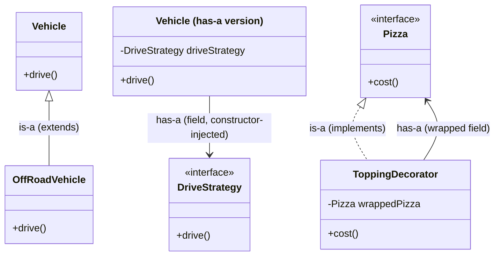

# is-a vs has-a: How Each Looks in Code

## Overview
- Companion to [[LLD/00a-what-is-lld]]'s conceptual definitions — this note
  focuses specifically on how each relationship is actually *written* in
  code, side by side.
- Comes up constantly across LLD patterns: Strategy is pure has-a; Decorator
  and Proxy use both is-a and has-a together in the same class.
- Getting this concrete (not just conceptual) matters because interviewers
  expect you to write the class, not just name the relationship.

## Key Concepts
### is-a in code — inheritance
- Implemented with `extends` (or `implements` against an interface) — the
  subclass gets the behavior because it *is* a more specific version of the
  parent type.
- The only way to vary behavior per subclass is to override a method — the
  behavior lives inside the class hierarchy itself.
- No object reference involved — the relationship is structural, decided at
  compile time by the class declaration.

```java
class Vehicle {
    void drive() { System.out.println("normal drive"); }
}
class OffRoadVehicle extends Vehicle { // OffRoadVehicle IS-A Vehicle
    @Override
    void drive() { System.out.println("special drive"); } // only way to vary: override
}
```

### has-a in code — composition
- Implemented by holding a field whose type is another class/interface —
  usually set via constructor injection.
- Behavior is *delegated* to that held object rather than implemented
  directly — swapping which object is injected changes the behavior, with
  no subclassing needed.
- The two objects are otherwise independent — the containing class just
  holds a reference to the other.

```java
interface DriveStrategy {
    void drive();
}
class Vehicle {
    private final DriveStrategy driveStrategy; // Vehicle HAS-A DriveStrategy
    Vehicle(DriveStrategy driveStrategy) { this.driveStrategy = driveStrategy; }
    void drive() { driveStrategy.drive(); } // delegates — swap the object to vary behavior
}
```

### Both together — is-a and has-a in the same class
- Some patterns need a class to be substitutable as the type it wraps
  (is-a) *and* to hold a reference to the thing it wraps (has-a) — both
  relationships, on the same class, doing different jobs.
- `extends`/`implements` gives it the shared type; a field of that same
  type gives it the wrapped reference.
- Seen in [[LLD/04-decorator-design-pattern]] (`ToppingDecorator extends
  Pizza` + holds a `Pizza` field) and [[LLD/13-proxy-design-pattern]]
  (`Proxy implements Employee` + holds an `Employee` field).

```java
interface Pizza {
    int cost();
}
abstract class ToppingDecorator implements Pizza { // is-a Pizza
    // abstract: doesn't implement cost() itself — that's left to concrete
    // subclasses (e.g. ExtraCheese), so Java requires this class to be abstract
    protected Pizza wrappedPizza; // has-a Pizza — the object it wraps
    ToppingDecorator(Pizza wrappedPizza) { this.wrappedPizza = wrappedPizza; }
}
```

## Trade-offs / Comparisons
| | is-a (inheritance) | has-a (composition) |
|---|---|---|
| Written as | `extends` / `implements` | a field of another type, usually constructor-injected |
| Varies behavior via | overriding a method in a subclass | swapping which object is injected |
| Coupling | tighter — fixed at compile time by the class hierarchy | looser — the held object can change at runtime |
| Typical use | "this really is a more specific kind of that" | "this needs that object's behavior, without being one" |

## Example / Walkthrough
- Plain is-a: `OffRoadVehicle extends Vehicle`, overrides `drive()` — no
  object reference involved.
- Plain has-a: `Vehicle` holds a `DriveStrategy` field, injected via
  constructor, delegates `drive()` to it — see [[LLD/02-strategy-design-pattern]]
  for the full worked version (multiple vehicle subclasses reusing the same
  injected strategy objects instead of duplicating logic).
- Both together: `ToppingDecorator implements Pizza` (is-a) while also
  holding a `Pizza wrappedPizza` field (has-a) — see
  [[LLD/04-decorator-design-pattern]] and [[LLD/13-proxy-design-pattern]]
  for the full worked versions.

## Diagram


## Interview Q&A
<details>
<summary>How do you implement an is-a relationship in Java?</summary>

With `extends` (for classes) or `implements` (for interfaces) — the
subclass inherits the parent's members and can override methods to vary
behavior.

</details>

<details>
<summary>How do you implement a has-a relationship in Java?</summary>

By declaring a field whose type is the other class/interface, typically set
via constructor injection — the containing class delegates to that held
object's methods instead of implementing the behavior itself.

</details>

<details>
<summary>Can a class use both is-a and has-a at the same time?</summary>

Yes — e.g. a Decorator or Proxy class both extends/implements the same
type as the object it wraps (is-a, so it's substitutable in its place) and
holds a field referencing that wrapped object (has-a, so it can delegate to
it).

</details>

<details>
<summary>Why does Strategy use only has-a, while Decorator/Proxy use both?</summary>

Strategy only needs the context class (`Vehicle`) to delegate to an
injected behavior object — there's no need for the strategy to also stand
in as a `Vehicle`. Decorator/Proxy need the wrapper to be substitutable
*as* the type it wraps (so it can be passed anywhere that type is expected,
including as another decorator/proxy's wrapped object) — that's what forces
the extra is-a relationship on top of the has-a.

</details>

<details>
<summary>Which is more tightly coupled, is-a or has-a?</summary>

is-a — the relationship is fixed at compile time by the class declaration
itself. has-a is looser — the held object is just a reference that can be
swapped at runtime (e.g. via a setter, or a different constructor
argument), without changing the containing class's type hierarchy.

</details>

## Related Topics
- [[LLD/00a-what-is-lld]] — conceptual definitions of is-a, has-a,
  aggregation vs composition.
- [[LLD/02-strategy-design-pattern]] — pure has-a example.
- [[LLD/04-decorator-design-pattern]] — both is-a and has-a on one class.
- [[LLD/13-proxy-design-pattern]] — both is-a and has-a on one class.
- [[LLD/18-chess-game-lld]] — a real interview correction: Piece's position
  belongs on Cell (has-a), not on Piece itself, discovered by tracing the
  ownership chain before drawing the UML.
