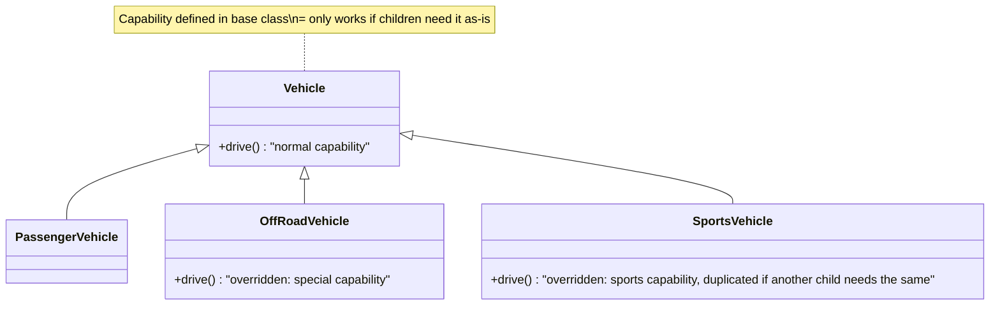
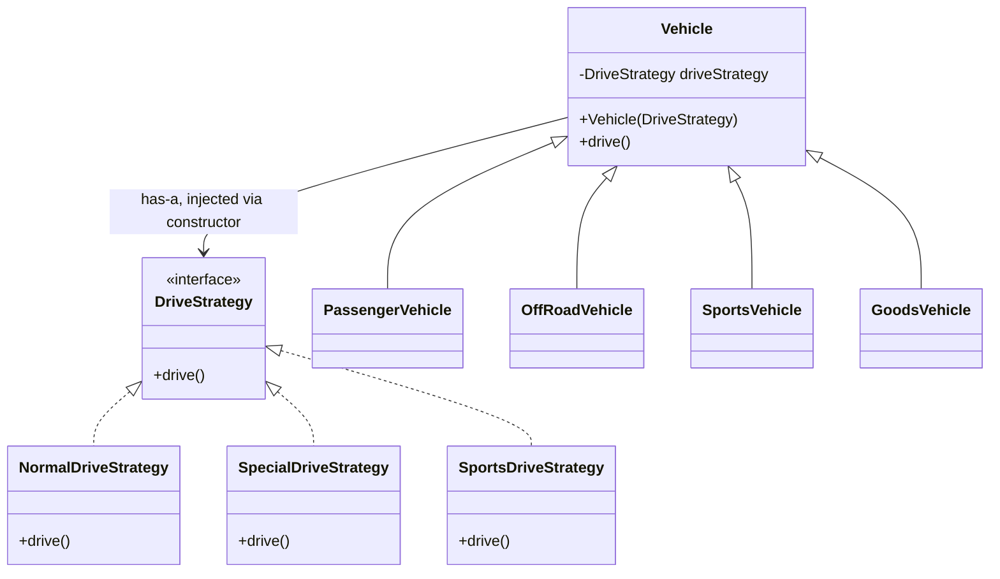
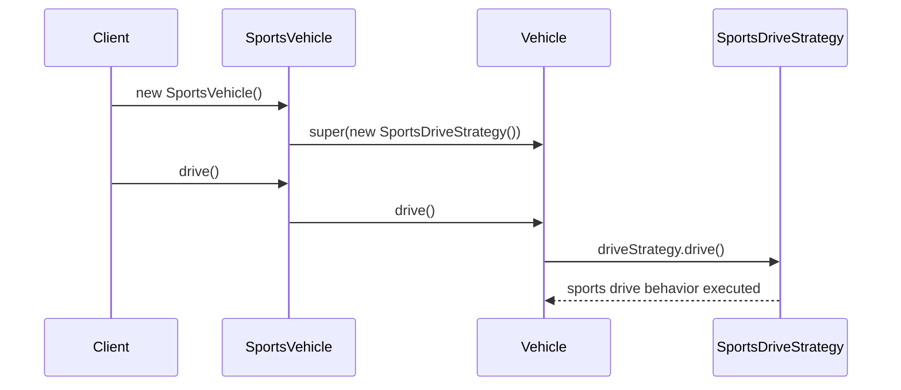

# Strategy Design Pattern

## Overview
- Behavioral design pattern — swaps out an algorithm/capability at runtime
  by composing it in, instead of hard-coding it via inheritance.
- Solves the code-duplication problem that plain inheritance runs into once
  a base class has multiple children with different, overlapping capability
  needs.
- Core idea: favor "has-a" (composition) over "is-a" (inheritance) for
  behavior that varies across subclasses.

## Key Concepts
### The problem with plain inheritance
- Normal inheritance defines a capability (e.g. `drive()`) directly in the
  base class; children either use it as-is or override it.
- Works fine while each child's capability is unique to that child.
- Breaks down when two or more *unrelated* children need the *same*
  capability — that logic gets copy-pasted into each child's override
  instead of shared, since it doesn't belong in the base class (not every
  child wants it).
- Gets worse as the system scales — more children and more features means
  more duplicated overrides, and no scalable way to reuse a capability
  across only some children.



```java
class Vehicle {
    void drive() { System.out.println("normal drive capability"); }
}
class PassengerVehicle extends Vehicle {} // fine with the base capability as-is
class OffRoadVehicle extends Vehicle {
    @Override
    void drive() { System.out.println("special drive capability"); }
}
class SportsVehicle extends Vehicle {
    @Override
    void drive() { System.out.println("sports drive capability"); }
}
// if a future GoodsVehicle also needs "sports drive capability", that logic
// gets copy-pasted into its override too — Vehicle can't hold it (not every
// child wants it), so there's no shared place to put it
```

### The strategy pattern fix
- Pull the varying capability out into its own interface (e.g.
  `DriveStrategy`) with one method (e.g. `drive()`).
- Each variant of the capability becomes its own concrete class
  implementing that interface — e.g. `NormalDriveStrategy`,
  `SpecialDriveStrategy`, `SportsDriveStrategy`.
- The base class (`Vehicle`) no longer defines the capability itself — it
  *has-a* `DriveStrategy` reference instead.
- The strategy object is passed in via constructor injection: each child
  class decides which concrete strategy to hand to the parent's
  constructor.
- The base class's `drive()` method just delegates: calls
  `driveStrategy.drive()` — it doesn't know or care which concrete
  strategy it's holding.
- Result: any child needing the same capability just passes the same
  strategy object — no duplicated logic, no forced base-class capability.



```java
interface DriveStrategy {
    void drive();
}
class NormalDriveStrategy implements DriveStrategy {
    public void drive() { System.out.println("normal drive capability"); }
}
class SpecialDriveStrategy implements DriveStrategy {
    public void drive() { System.out.println("special drive capability"); }
}
class SportsDriveStrategy implements DriveStrategy {
    public void drive() { System.out.println("sports drive capability"); }
}

class Vehicle {
    private final DriveStrategy driveStrategy;
    Vehicle(DriveStrategy driveStrategy) { this.driveStrategy = driveStrategy; } // constructor injection
    void drive() { driveStrategy.drive(); } // delegates, doesn't care which concrete strategy
}

class PassengerVehicle extends Vehicle {
    PassengerVehicle() { super(new NormalDriveStrategy()); }
}
class OffRoadVehicle extends Vehicle {
    OffRoadVehicle() { super(new SpecialDriveStrategy()); }
}
class SportsVehicle extends Vehicle {
    SportsVehicle() { super(new SportsDriveStrategy()); }
}
class GoodsVehicle extends Vehicle {
    GoodsVehicle() { super(new NormalDriveStrategy()); } // reuses existing strategy, no new code
}
```

## Trade-offs / Comparisons
| Approach | Behavior source | Problem |
|---|---|---|
| Plain inheritance (is-a) | Capability defined/overridden in each subclass | Duplicated code when unrelated subclasses need the same capability; doesn't scale |
| Strategy pattern (has-a) | Capability injected as a strategy object via constructor | Each subclass just picks/passes the strategy it needs; no duplication |

## Example / Walkthrough
- `Vehicle` base class, children: `PassengerVehicle`, `OffRoadVehicle`,
  `SportsVehicle`, `GoodsVehicle`.
- Strategies defined: `NormalDriveStrategy`, `SpecialDriveStrategy`,
  `SportsDriveStrategy`.
- `SportsVehicle`'s constructor passes a `SportsDriveStrategy` object up to
  `Vehicle`'s constructor → calling `drive()` on a `SportsVehicle` ends up
  calling `SportsDriveStrategy.drive()`.
- `GoodsVehicle` passes a `NormalDriveStrategy` object instead → same
  `Vehicle.drive()` delegates to `NormalDriveStrategy.drive()` — no new
  code written, the existing normal strategy is reused directly.
- `OffRoadVehicle` passes a `SpecialDriveStrategy` object.
- None of the child classes `new` up a strategy inside their own logic in a
  hardcoded way beyond picking which one to inject — the actual `drive()`
  call site (`Vehicle.drive()`) stays the same for every child.

## Diagram


## Interview Q&A
<details>
<summary>What problem does the Strategy pattern solve that plain inheritance can't?</summary>

Plain inheritance forces a capability to live in the base class or be
overridden per-child. When multiple unrelated children need the exact same
capability, that logic gets duplicated across their overrides. Strategy
pulls the capability into its own interface + concrete classes, so any
child can just inject the strategy it needs — no duplication.

</details>

<details>
<summary>Is Strategy pattern based on "is-a" or "has-a"?</summary>

Has-a. The context class (e.g. `Vehicle`) holds a reference to a strategy
interface rather than inheriting the behavior directly.

</details>

<details>
<summary>How does the context class get its strategy object?</summary>

Via constructor injection — the concrete subclass decides which concrete
strategy implementation to pass up to the parent constructor, and the
parent stores it as an interface-typed field.

</details>

<details>
<summary>Why does the base class's method just call `strategy.drive()` instead of implementing the logic itself?</summary>

Because the base class shouldn't know which concrete capability a given
instance needs — that decision is deferred to whichever object supplies
the strategy. The base class only knows the `DriveStrategy` interface
contract.

</details>

<details>
<summary>How would adding a new capability variant work under Strategy vs plain inheritance?</summary>

Under Strategy: add one new class implementing the strategy interface — no
existing class needs to change (similar spirit to Open/Closed Principle).
Under plain inheritance: every child needing that variant would need its
own override, duplicating logic.

</details>

## Related Topics
- [[LLD/00a-what-is-lld]] — is-a vs has-a relationship background.
- [[LLD/01-solid-principles]] — Strategy pattern is one concrete way OCP and
  DIP get implemented in practice.
