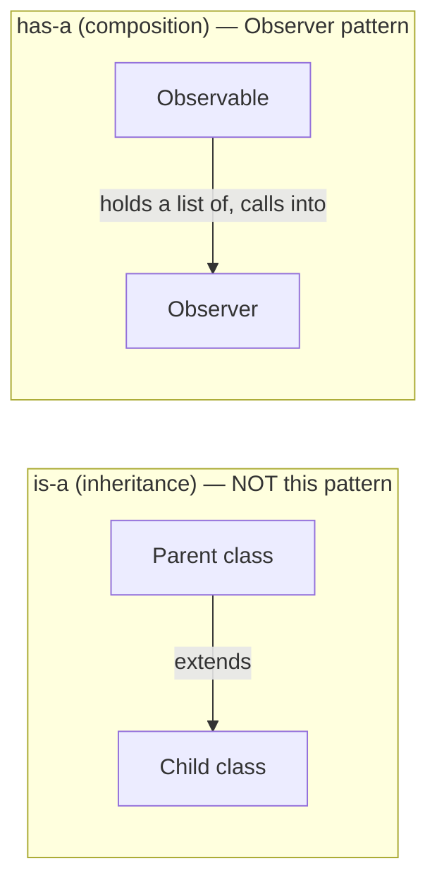
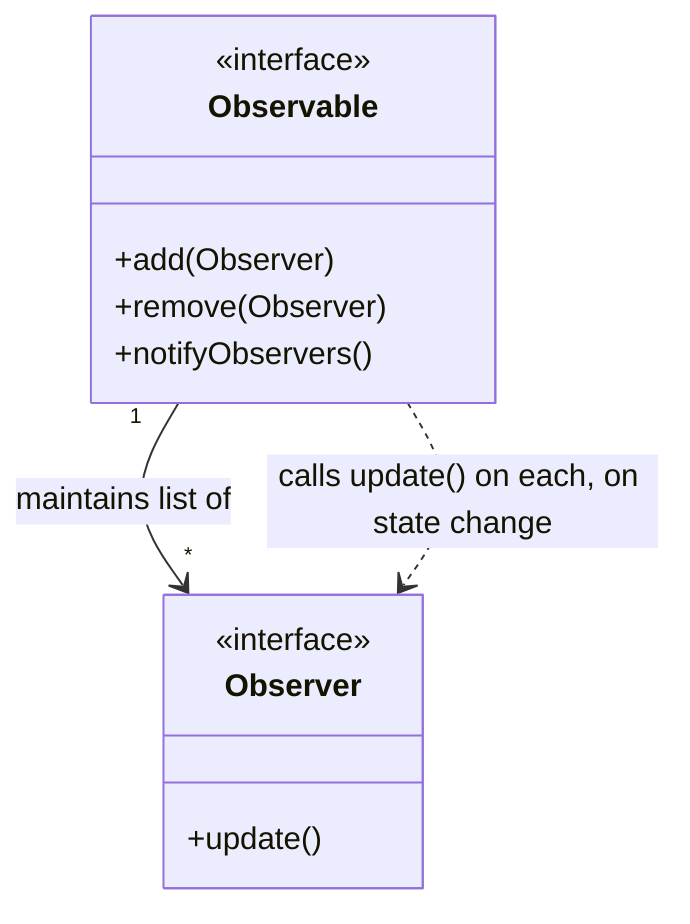
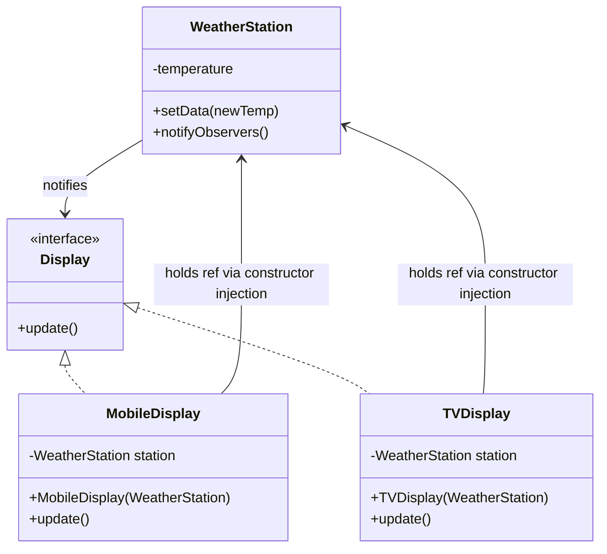
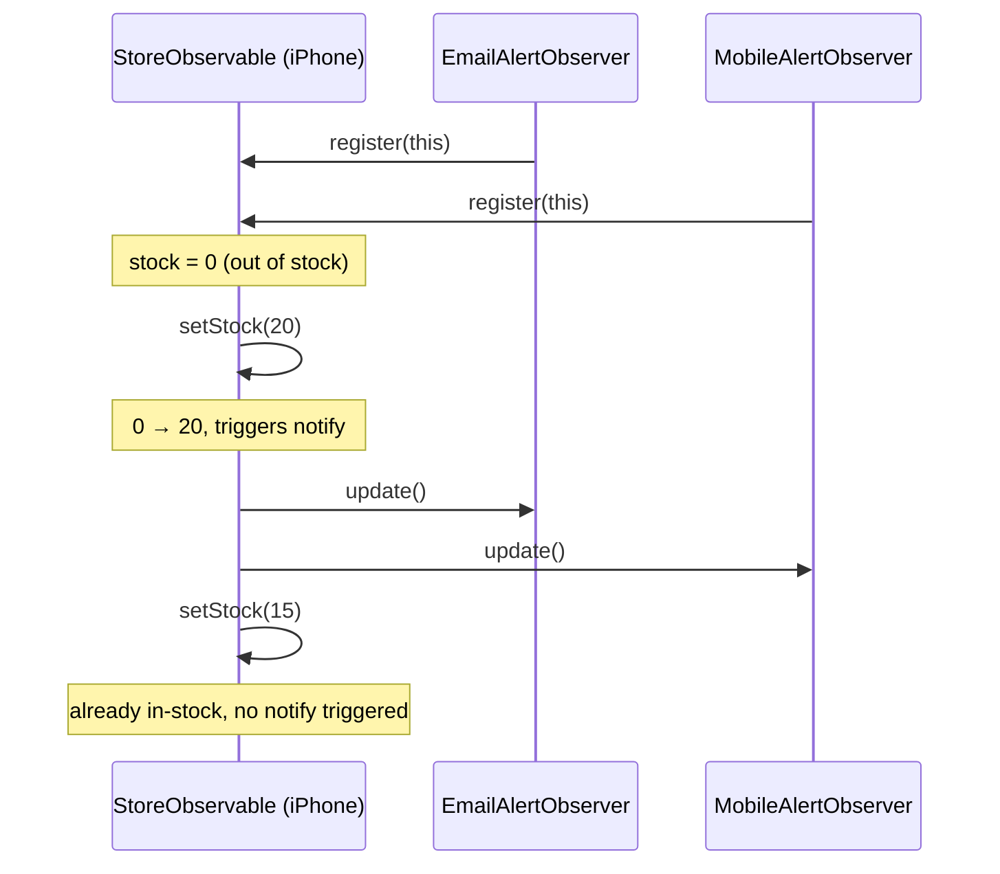
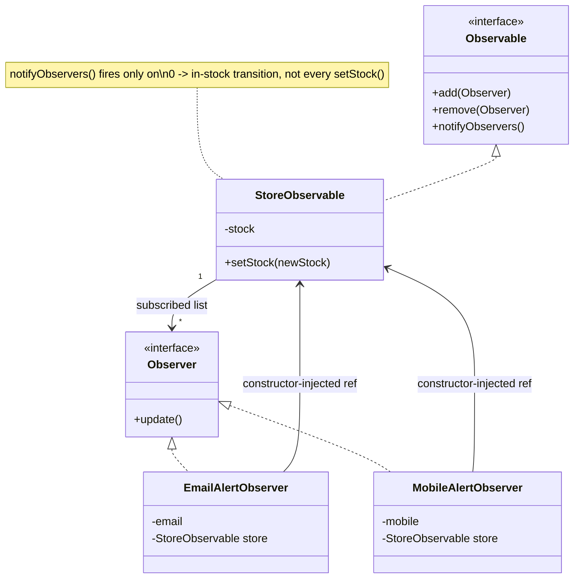

# Observer Design Pattern

## Overview
- Behavioral design pattern — lets one or more objects (observers) get
  auto-notified whenever another object's (observable's) state changes.
- Commonly asked in LLD interviews (e.g. Walmart) as an out-of-stock
  notification system design question.
- Core idea: decouple "who changed" from "who needs to react" — the
  observable doesn't need to know what its observers do, only that they
  need to be told.

## Key Concepts
### The two core roles
- **Observable** (aka Subject) — holds the state that can change; maintains
  a list of subscribed observers internally.
- **Observer** — wants to know when the observable's state changes;
  exposes an `update()` method the observable calls.
- Observable interface methods: `add`/`register` observer, `remove`/
  `unregister` observer, `notifyObservers()` (loops the internal list and
  calls `update()` on each).
- Notification fires on any state change — value going up or down — not
  just one direction.
- Relationship between them is **has-a** (composition), not is-a
  (inheritance) — the observable *has-a* list of observers it holds and
  calls into, it doesn't extend or get extended by them.





```java
interface Observer {
    void update();
}
interface Observable {
    void add(Observer observer);
    void remove(Observer observer);
    void notifyObservers();
}
```

### Design choice: what to pass into update()
- Option A — pass nothing into `update()`: observer just learns "something
  changed" and has to call back into the observable (e.g. `getData()`) to
  fetch the new state.
- Option B — pass the observable/data directly into `update(observable)`:
  saves a callback round-trip, but tempts the observer into `instanceof`
  checks to figure out which concrete observable type it received —
  considered a bad smell.
- Recommended fix — constructor injection: pass the observable object into
  the concrete observer's constructor when it's created, so `update()`
  needs no parameters and no `instanceof` checks; the observer already
  holds a typed reference to the observable it cares about.



```java
class WeatherStation implements Observable {
    private final List<Observer> observers = new ArrayList<>();
    private int temperature;

    public void add(Observer observer) { observers.add(observer); }
    public void remove(Observer observer) { observers.remove(observer); }
    public void notifyObservers() {
        for (Observer o : observers) o.update();
    }
    void setData(int newTemp) {
        this.temperature = newTemp;
        notifyObservers();
    }
    int getData() { return temperature; }
}

interface Display extends Observer {}

class MobileDisplay implements Display {
    private final WeatherStation station;
    MobileDisplay(WeatherStation station) { // constructor injection — no instanceof needed
        this.station = station;
        station.add(this);
    }
    public void update() {
        System.out.println("Mobile display: " + station.getData());
    }
}
class TVDisplay implements Display {
    private final WeatherStation station;
    TVDisplay(WeatherStation station) {
        this.station = station;
        station.add(this);
    }
    public void update() {
        System.out.println("TV display: " + station.getData());
    }
}
```

## Example / Walkthrough
### Example 1 — WeatherStation
- `WeatherStation` is the Observable, holds current temperature data.
- `TVDisplay` and `MobileDisplay` are concrete Observers, both implement a
  `Display` interface with `update()`.
- Each display registers itself with the `WeatherStation`.
- `WeatherStation.setData(newTemperature)` sets the new temperature and
  calls `notifyObservers()`.
- Every registered display's `update()` fires, each pulling the current
  temperature via its constructor-injected `WeatherStation` reference.

### Example 2 — out-of-stock notification (interview-style)
- `StoreObservable` (Observable) maintains the list of subscribed
  observers for a product (e.g. iPhone) — supports add/remove/notify.
- Two concrete Observers: `EmailAlertObserver` (holds an email ID) and
  `MobileAlertObserver` (holds a mobile number) — both built with
  constructor injection of the observable.
- A customer wanting both channels just creates and registers two observer
  objects (one email, one mobile) instead of one combined type.
- Business logic lives in `setStock(newStock)` on the observable — this is
  the part interviewers actually probe:
  - Only calls `notifyObservers()` when stock transitions from 0 → some
    positive value (out-of-stock → back-in-stock).
  - Setting stock again while already in-stock does **not** re-trigger
    notifications — avoids spamming subscribers on every restock update.

```java
class StoreObservable implements Observable {
    private final List<Observer> observers = new ArrayList<>();
    private int stock = 0;

    public void add(Observer observer) { observers.add(observer); }
    public void remove(Observer observer) { observers.remove(observer); }
    public void notifyObservers() {
        for (Observer o : observers) o.update();
    }
    void setStock(int newStock) {
        boolean wasOutOfStock = (stock == 0);
        this.stock = newStock;
        if (wasOutOfStock && newStock > 0) { // only notify on 0 -> in-stock transition
            notifyObservers();
        }
    }
}

class EmailAlertObserver implements Observer {
    private final String email;
    private final StoreObservable store;
    EmailAlertObserver(String email, StoreObservable store) {
        this.email = email;
        this.store = store;
        store.add(this);
    }
    public void update() {
        System.out.println("Email sent to " + email + ": item back in stock");
    }
}
class MobileAlertObserver implements Observer {
    private final String mobile;
    private final StoreObservable store;
    MobileAlertObserver(String mobile, StoreObservable store) {
        this.mobile = mobile;
        this.store = store;
        store.add(this);
    }
    public void update() {
        System.out.println("SMS sent to " + mobile + ": item back in stock");
    }
}

// usage
StoreObservable iPhoneStore = new StoreObservable();
new EmailAlertObserver("a@x.com", iPhoneStore);
new MobileAlertObserver("+1-555-0100", iPhoneStore);
iPhoneStore.setStock(20); // 0 -> 20, notifies both
iPhoneStore.setStock(15); // already in-stock, no notification
```



## Trade-offs / Comparisons
| Approach | `update()` signature | Downside |
|---|---|---|
| Pass nothing | `update()` | Observer must call back into observable (`getData()`) for the new state — extra round-trip |
| Pass observable/data as param | `update(observable)` | Observer often needs `instanceof` checks to know the concrete type — bad smell |
| Constructor injection (recommended) | `update()`, observable stored as a field | Observer already holds a typed reference from construction time — no params, no `instanceof` |

## Diagram


## Interview Q&A
<details>
<summary>What problem does the Observer pattern solve?</summary>

It decouples an object whose state changes (the observable) from the
objects that need to react to that change (observers) — the observable
just maintains a list and notifies it, without knowing what each observer
does with the notification.

</details>

<details>
<summary>What are the two core interfaces in the Observer pattern?</summary>

`Observable` (add/remove/notify observers, holds the observer list) and
`Observer` (exposes `update()`, called by the observable on state change).

</details>

<details>
<summary>Why is passing the observable/data as a parameter into `update()` considered a bad idea?</summary>

Because a generic `update(observable)` parameter often forces the observer
to run `instanceof` checks to figure out which concrete observable type it
received before it can use it — that's fragile and a design smell.

</details>

<details>
<summary>What's the recommended alternative to passing data into `update()`?</summary>

Constructor injection — pass the concrete observable into the observer's
constructor at creation time, so the observer already holds a typed
reference to it, and `update()` can stay parameter-free.

</details>

<details>
<summary>In the out-of-stock interview question, what's the key business-logic detail interviewers look for?</summary>

`notifyObservers()` should only fire when stock transitions from 0 to a
positive value (out-of-stock → back-in-stock) — not on every stock update,
otherwise subscribers get spammed on every restock.

</details>

<details>
<summary>How would you let one customer subscribe via both email and mobile for the same product?</summary>

Create and register two separate observer objects for that customer — one
`EmailAlertObserver` and one `MobileAlertObserver` — both added to the same
observable's subscriber list, rather than building one combined observer
type.

</details>

## Related Topics
- [[LLD/02-strategy-design-pattern]] — both patterns favor composition
  (has-a, constructor-injected collaborators) over inheritance.
- [[LLD/01-solid-principles]] — Observer follows OCP: new observer types can
  be added without touching the observable.
