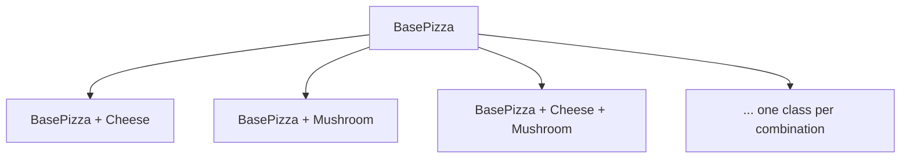
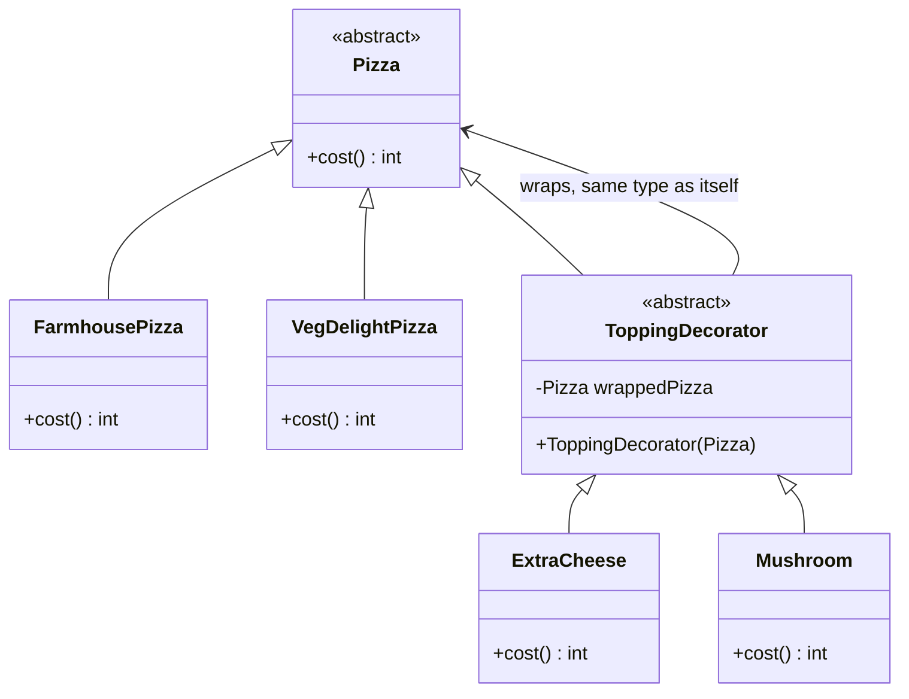
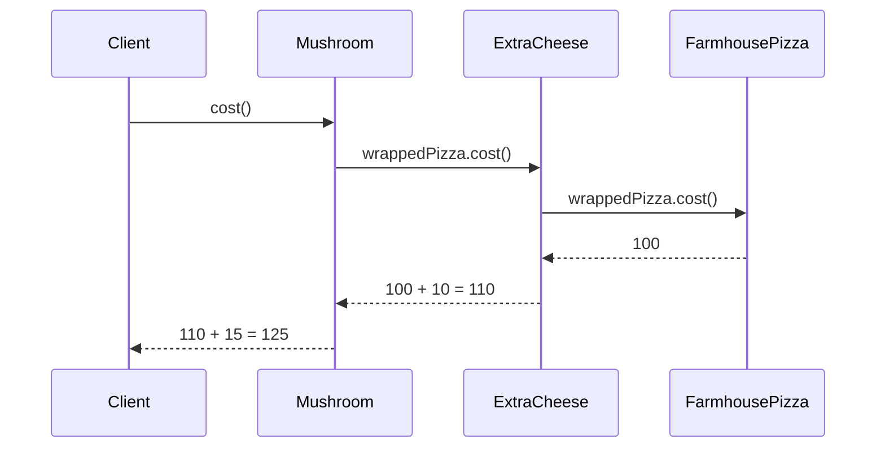
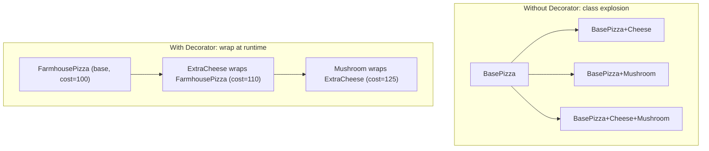

# Decorator Design Pattern

## Overview
- Structural design pattern — adds new behavior/features to an object at
  runtime by wrapping it, instead of subclassing for every combination.
- Widely used in real-world code (e.g. Java I/O streams) and a frequent LLD
  interview topic.
- Core idea: a decorator is the *same type* as the object it wraps, so a
  decorated object can itself be wrapped by another decorator — enabling
  arbitrary nesting.

## Key Concepts
### The problem — class explosion
- Naive fix for "base object + optional add-ons" is a subclass per
  combination: `BasePizza`, `BasePizza+Cheese`, `BasePizza+Mushroom`,
  `BasePizza+Cheese+Mushroom`, etc.
- Number of subclasses grows combinatorially as more toppings/features are
  added — quickly becomes unmanageable to maintain.
- Same shape shows up outside pizza: a base car needing optional add-ons
  like power steering or a music system.



### The decorator fix — wrap instead of subclass
- Abstract base type `Pizza` declares `cost()` — implemented by concrete
  base pizzas (`FarmhousePizza`, `VegDelightPizza`), each returning its own
  base price.
- Abstract `ToppingDecorator` also extends/implements `Pizza` (is-a Pizza,
  same type as what it wraps) — holds a reference to the wrapped `Pizza`
  object, passed in via constructor.
- Concrete decorators (`ExtraCheese`, `Mushroom`) extend `ToppingDecorator`
  — each takes the wrapped pizza via constructor and implements `cost()` as
  wrapped pizza's `cost()` + its own extra cost.
- Because a concrete decorator is itself a `Pizza`, it can wrap any other
  `Pizza` — including another decorator — so toppings nest arbitrarily
  deep: `new Mushroom(new ExtraCheese(new FarmhousePizza()))`.



```java
abstract class Pizza {
    abstract int cost();
}
class FarmhousePizza extends Pizza {
    int cost() { return 100; }
}
class VegDelightPizza extends Pizza {
    int cost() { return 90; }
}

abstract class ToppingDecorator extends Pizza { // is-a Pizza, same type as what it wraps
    protected Pizza wrappedPizza;
    ToppingDecorator(Pizza wrappedPizza) { this.wrappedPizza = wrappedPizza; }
}
class ExtraCheese extends ToppingDecorator {
    ExtraCheese(Pizza wrappedPizza) { super(wrappedPizza); }
    int cost() { return wrappedPizza.cost() + 10; }
}
class Mushroom extends ToppingDecorator {
    Mushroom(Pizza wrappedPizza) { super(wrappedPizza); }
    int cost() { return wrappedPizza.cost() + 15; }
}
```

### Relationship: both is-a and has-a
- `ToppingDecorator` extends the same abstract type (`Pizza`) as the
  concrete pizzas it decorates — that is-a relationship is what lets a
  decorator be handed anywhere a `Pizza` is expected, including as the
  `wrappedPizza` of another decorator.
- Combined with holding a `Pizza` reference internally, this is what makes
  wrapping recursive/composable — plain has-a without the shared supertype
  wouldn't allow nesting decorators inside each other.

## Example / Walkthrough
- `new Mushroom(new ExtraCheese(new FarmhousePizza()))` — Mushroom wraps
  ExtraCheese, which wraps FarmhousePizza.
- Calling `.cost()` on the outermost `Mushroom` recurses inward first:
  Mushroom → ExtraCheese → FarmhousePizza.
- `FarmhousePizza.cost()` returns its base price, `100`.
- Unwinding back out: `ExtraCheese.cost()` = `100 + 10` = `110`.
- `Mushroom.cost()` = `110 + 15` = `125`.
- Final cost = base (100) + extra cheese (10) + mushroom (15) = **125** —
  each decorator only adds its own cost on top of whatever it wraps.



## Diagram


## Interview Q&A
<details>
<summary>What problem does the Decorator pattern solve?</summary>

Class explosion — modeling every combination of a base object plus optional
features as its own subclass grows combinatorially unmanageable. Decorator
adds features by wrapping at runtime instead of subclassing per combination.

</details>

<details>
<summary>Why does the decorator class extend the same base type as the object it wraps, instead of just holding a reference to it?</summary>

So a decorator is itself substitutable anywhere a plain object of that type
is expected — including as the wrapped object inside another decorator.
That is-a relationship is what makes nesting decorators possible.

</details>

<details>
<summary>How does calling a method on a deeply nested decorator chain actually resolve?</summary>

It recurses inward first — each decorator calls the same method on its
wrapped object — until it reaches the innermost base object, then each
layer adds its own contribution as the call stack unwinds back outward.

</details>

<details>
<summary>Is Decorator based on inheritance or composition?</summary>

Both — inheritance (is-a) lets a decorator share the base type with what it
wraps, and composition (has-a, the wrapped object held as a field) is what
lets it forward/extend the wrapped object's behavior at runtime.

</details>

<details>
<summary>Give a real-world example of Decorator outside the pizza analogy.</summary>

A base car getting optional add-ons like power steering or a music system —
same wrap-to-extend shape as pizza toppings.

</details>

## Related Topics
- [[LLD/02-strategy-design-pattern]] — both favor composition over rigid
  inheritance, but Strategy swaps one behavior, Decorator layers many.
- [[LLD/01-solid-principles]] — Decorator follows OCP: new toppings are new
  classes, no existing class is modified.
- [[LLD/13-proxy-design-pattern]] — same both-is-a-and-has-a shape; Proxy
  controls/intercepts access instead of layering behavior.
