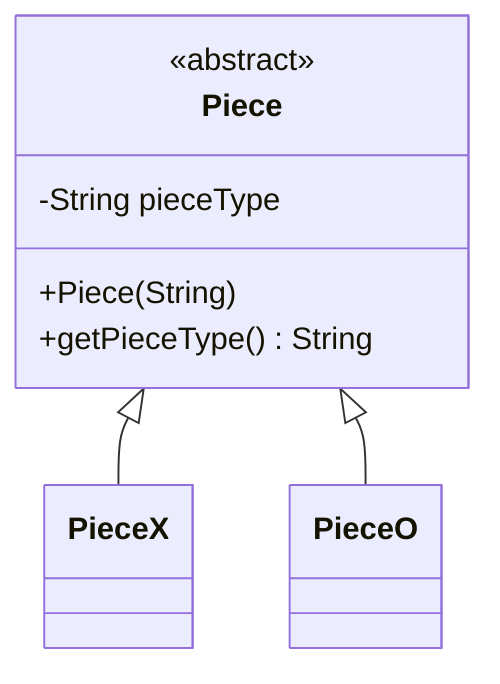
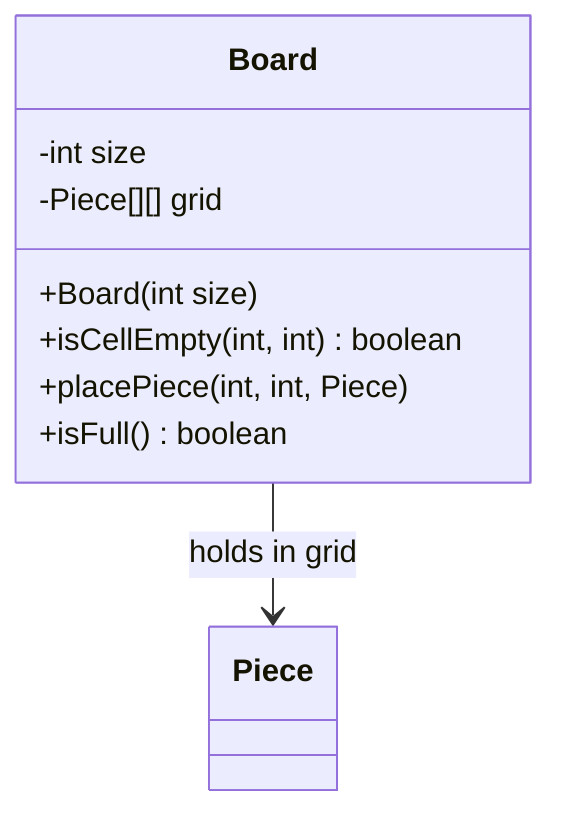
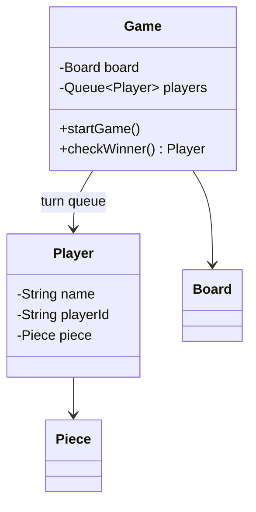
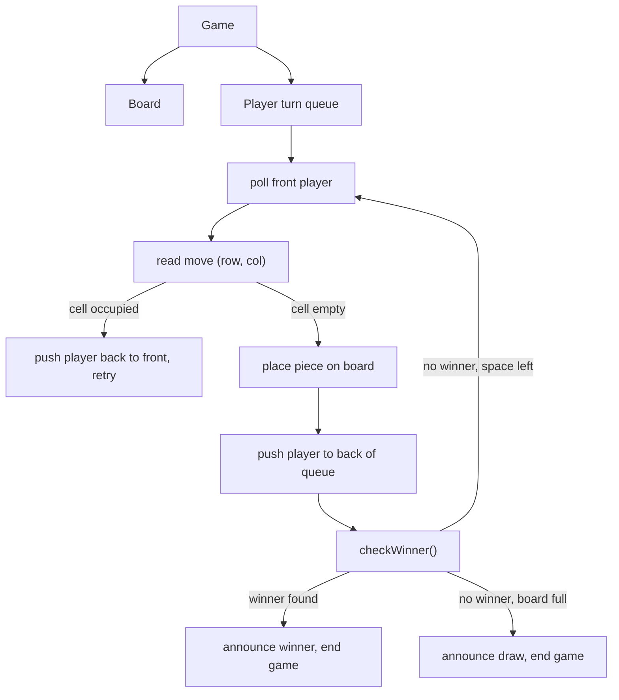

# LLD of Tic-Tac-Toe

## Overview
- Design a Tic-Tac-Toe game — a very popular first LLD interview question,
  for two reasons: the objects involved are easy to spot, and it tests
  whether you write genuinely extensible code (board size, symbols, number
  of players) rather than hardcoding a 3x3, 2-player game.
- Small object set compared to [[LLD/06-parking-lot-lld]] or
  [[LLD/14-bookmyshow-lld]], so the interview focus shifts to turn
  management and win-checking logic rather than a large class graph.

## Key Concepts
### Requirements — keep it extensible
- Board size — defaults to 3x3, but should be configurable to NxN.
- Symbols/pieces — defaults to X and O, but should be extensible to more
  symbols if more players are supported later.
- Number of players — driven by however many `Player` objects are passed
  in, not hardcoded to 2.

### Piece — extensible symbol type
- Abstract `Piece` holds a `pieceType` (the symbol) set via constructor.
- Concrete subclasses (`PieceX`, `PieceO`) each call `super()` with their
  own type — adding a new symbol later is just one more subclass, nothing
  existing changes.



```java
abstract class Piece {
    private String pieceType;
    Piece(String pieceType) { this.pieceType = pieceType; }
    String getPieceType() { return pieceType; }
}
class PieceX extends Piece {
    PieceX() { super("X"); }
}
class PieceO extends Piece {
    PieceO() { super("O"); }
}
// extensible: PieceTriangle, PieceSquare, ... for more than 2 players
```

### Board — NxN grid of pieces
- `Board` holds a `size` (defaults to 3, but configurable) and a
  `Piece[][]` grid of that size — a cell holding `null` means empty.
- `size` drives grid construction, so the same class supports any board
  dimension without code changes elsewhere.



```java
class Board {
    int size;
    Piece[][] grid;

    Board(int size) {
        this.size = size;
        this.grid = new Piece[size][size];
    }
    boolean isCellEmpty(int row, int col) { return grid[row][col] == null; }
    void placePiece(int row, int col, Piece piece) { grid[row][col] = piece; }
    boolean isFull() {
        for (Piece[] row : grid)
            for (Piece cell : row)
                if (cell == null) return false;
        return true;
    }
}
```

### Player & Game — turn queue
- `Player` — name, playerId, and the `Piece` assigned to them at game
  start.
- `Game` holds the `Board` and players in a queue: pop the front player,
  prompt for a position, validate it's empty; invalid → put the player back
  at the front and retry; valid → place the piece, push the player to the
  back of the queue, then check for a winner.
- Loop continues until either a winner is found or the board fills up with
  no winner (draw).



```java
class Player {
    String name;
    String playerId;
    Piece piece;
    Player(String name, String playerId, Piece piece) {
        this.name = name; this.playerId = playerId; this.piece = piece;
    }
}

class Game {
    Board board;
    Queue<Player> players; // turn order

    void startGame() {
        while (!board.isFull()) {
            Player current = players.poll();
            int[] move = current.readMove(); // e.g. row, col from input
            if (!board.isCellEmpty(move[0], move[1])) {
                players.add(current); // invalid move, same player retries
                continue;
            }
            board.placePiece(move[0], move[1], current.piece);
            players.add(current); // turn done, back of the queue

            Player winner = checkWinner();
            if (winner != null) {
                System.out.println(winner.name + " wins!");
                return;
            }
        }
        System.out.println("Game is a draw");
    }

    Player checkWinner() {
        // brute-force scan: rows, columns, both diagonals for same pieceType
        // left as a scan the transcript calls "improvable" — swap in a
        // smarter incremental check (row/col/diagonal counters) if needed
        return null;
    }
}
```

## Trade-offs / Comparisons
| Win-check approach | How it works | Trade-off |
|---|---|---|
| Brute-force scan (used here) | After every move, scan all rows/columns/diagonals for a match | Simple to write, O(size) per check — fine for small boards, wasteful for large NxN |
| Incremental counters | Maintain per-row/column/diagonal counts, updated on each move | O(1) per check, more state to maintain — worth it only if board size or move frequency is large |

## Example / Walkthrough
- Two players created: Player 1 assigned `PieceX`, Player 2 assigned
  `PieceO`.
- Player 1 plays row 0, col 0 — valid (empty), piece placed, turn passes to
  Player 2.
- Player 2 attempts an already-occupied cell — invalid, Player 2 is put
  back at the front of the queue to retry, no turn consumed.
- Play continues; after Player 1 completes a row, `checkWinner()` detects
  three matching `PieceX` symbols in that row and returns Player 1 — game
  ends with "Player 1 wins!".
- If the board fills up with no matching row/column/diagonal, the game
  ends in a draw instead.

## Diagram


## Interview Q&A
<details>
<summary>Why is Tic-Tac-Toe a popular first LLD question?</summary>

The object set is small and easy to spot (Piece, Board, Player, Game), so
the interview can focus on whether the candidate writes genuinely
extensible code — configurable board size, extensible symbols, arbitrary
player count — instead of hardcoding a 3x3, 2-player game.

</details>

<details>
<summary>How does the design stay extensible to more than 2 players/symbols?</summary>

`Piece` is abstract with concrete subclasses per symbol (`PieceX`,
`PieceO`, ...) — adding a symbol is a new subclass, no existing class
changes. Player count is driven by however many `Player` objects are added
to the turn queue, not hardcoded.

</details>

<details>
<summary>How is an invalid move (already-occupied cell) handled?</summary>

The move is rejected before placing anything — the same player is put back
at the front of the turn queue to retry, so no turn is consumed by an
invalid move.

</details>

<details>
<summary>Why use a queue for turn order instead of just alternating between two fixed players?</summary>

A queue generalizes to any number of players — pop the front player for
their turn, push them to the back once done — which a hardcoded two-player
alternation wouldn't support.

</details>

<details>
<summary>What decides the game ends in a draw versus continuing?</summary>

The loop condition — it keeps running until either `checkWinner()` returns
a winner, or the board is full (`isFull()`) with no winner found, at which
point it's a draw.

</details>

<details>
<summary>How would you make win-checking more efficient than a brute-force scan?</summary>

Maintain incremental counters per row, column, and diagonal instead of
re-scanning the whole board after every move — checking the relevant
counter after a move becomes O(1) instead of O(size).

</details>

## Related Topics
- [[LLD/06-parking-lot-lld]] — same requirements-first, extensibility-driven
  approach applied to a larger object graph.
- [[LLD/01-solid-principles]] — `Piece` subclassing follows OCP: new symbols
  are new classes, no existing class is modified.
