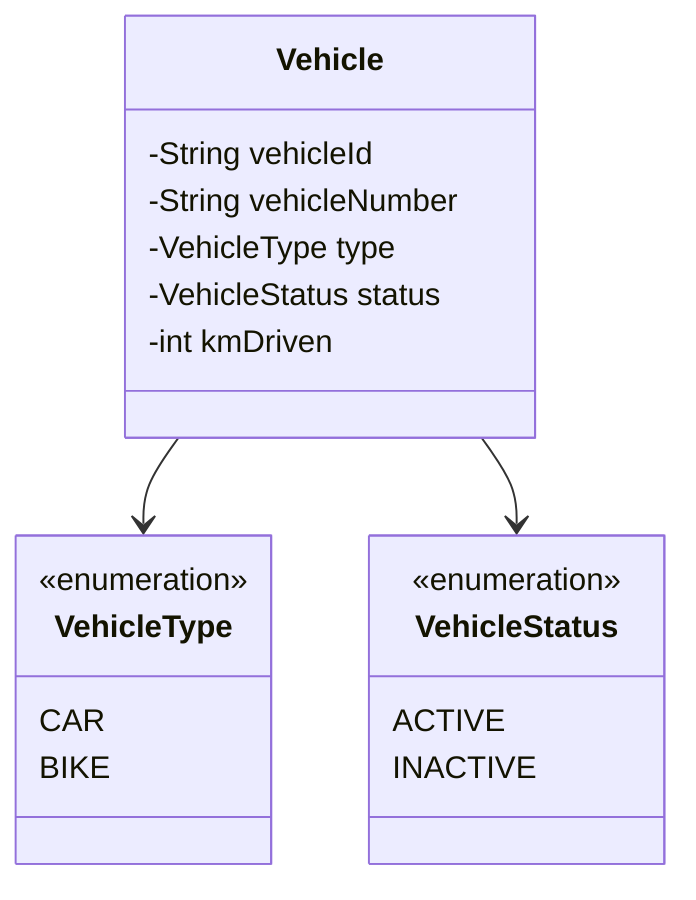
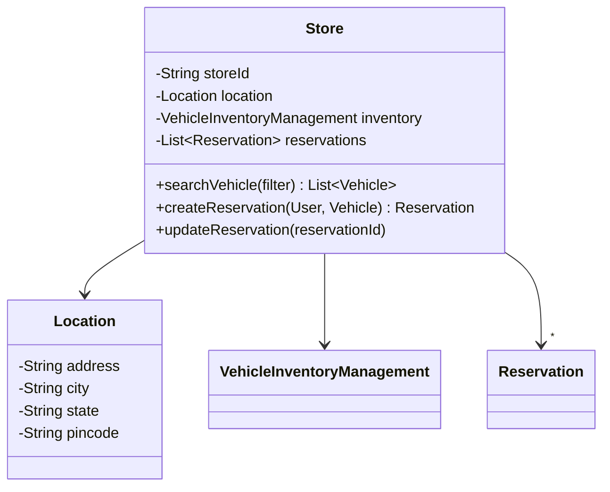
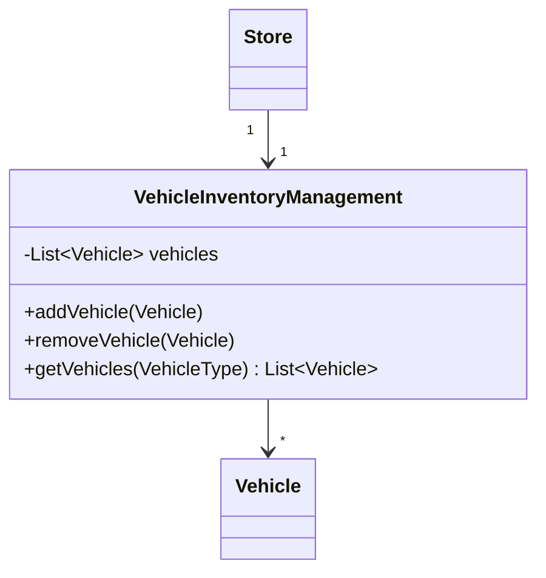
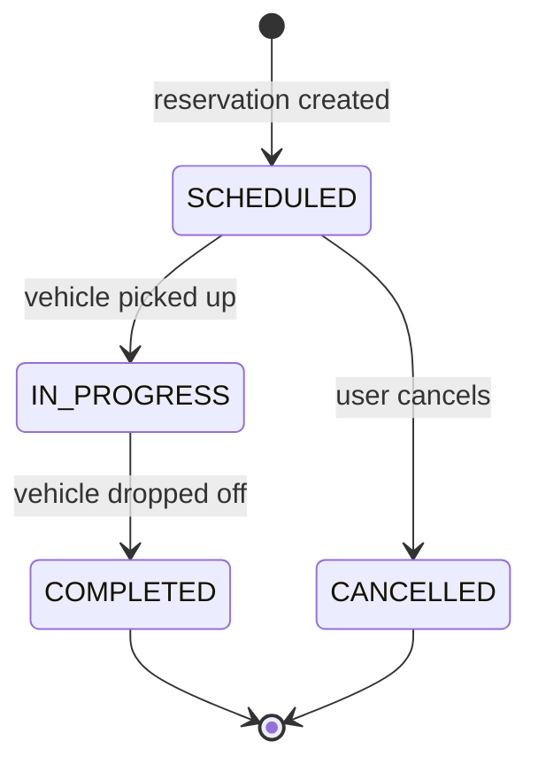
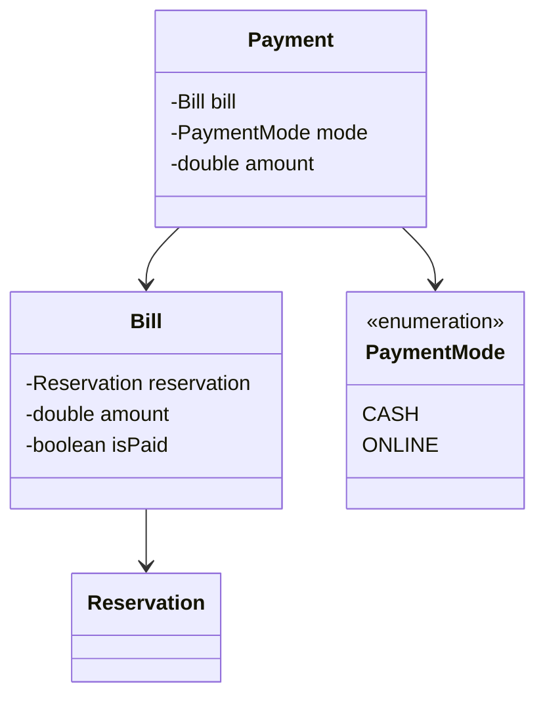
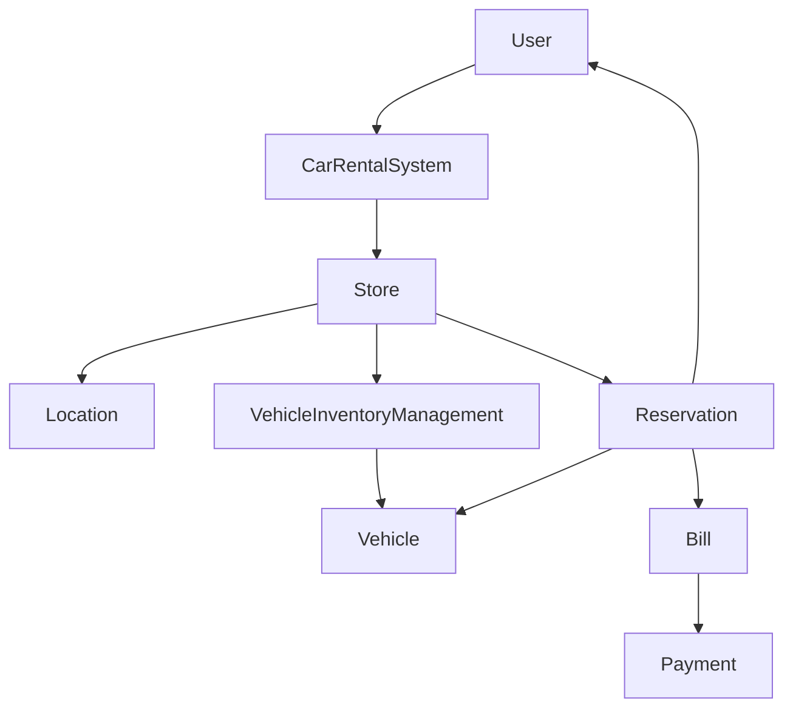

# LLD of Car Rental System

## Overview
- Design a car rental system (ZoomCar-style) — asked at Microsoft, per the
  video's source interview.
- Core lesson: design as simple as possible. Don't offer the interviewer
  extra scope ("should I also design X?") — build only what's asked, note
  extensibility in passing, and let the interviewer request more if they
  want it.
- Scope pinned to cars only; the design leaves room for bikes/other vehicle
  types later without needing rework now.

## Key Concepts
### Requirements clarification
- Search is location-based — user picks a pincode/city, gets back the
  stores in that area, then searches vehicles within a chosen store.
- Vehicle type is scoped to cars only for this pass, but `VehicleType` is
  modeled so a future bike (or other) segment can be added without
  restructuring existing classes.
- Vehicle status matters: a vehicle can be active (rentable) or inactive
  (temporarily not rentable, e.g. under maintenance) — separate from being
  currently booked.
- Billing and payment can happen at different times — a bill can be
  generated without being paid yet, tracked via a paid/unpaid flag.

### Vehicle — base entity
- Holds identity (`vehicleId`, `vehicleNumber`/chassis number), basic specs
  (km driven, etc.), a `VehicleType` enum, and a `VehicleStatus`.
- `VehicleType` enum keeps car vs bike (etc.) as data, not a class hierarchy
  — new types are just new enum values, no new class needed since a car and
  a bike don't behave differently enough here to warrant separate classes.
- `VehicleStatus` — ACTIVE (can be rented) / INACTIVE (cannot be rented right
  now, e.g. maintenance) — independent of whether it's presently reserved.



```java
enum VehicleType { CAR, BIKE } // extensible: add BIKE etc. without touching Vehicle
enum VehicleStatus { ACTIVE, INACTIVE }

class Vehicle {
    String vehicleId;
    String vehicleNumber;
    VehicleType type;
    VehicleStatus status;
    int kmDriven;
}
```

### Store — location + inventory + reservations
- `Store` holds a `Location` (address/city/state/pincode), a
  `VehicleInventoryManagement` object, and the list of reservations made
  against that store.
- A reservation can't exist independently of a vehicle and a store — it's
  scoped to one store, so the store is the natural owner of its reservation
  list (in addition to the user also tracking their own reservations).



```java
class Location {
    String address;
    String city;
    String state;
    String pincode;
}

class Store {
    String storeId;
    Location location;
    VehicleInventoryManagement inventory;
    List<Reservation> reservations = new ArrayList<>();

    List<Vehicle> searchVehicle(VehicleType type) {
        return inventory.getVehicles(type); // delegates filtering to inventory
    }
    Reservation createReservation(User user, Vehicle vehicle, LocalDate from, LocalDate to) {
        Reservation r = new Reservation(user, vehicle, this, from, to);
        reservations.add(r);
        user.reservations.add(r);
        return r;
    }
}
```

### VehicleInventoryManagement — per-store inventory
- One `VehicleInventoryManagement` instance per store — each store's
  filtering/inventory logic stays isolated, so a store-specific rule change
  (e.g. different filter logic per store in future) doesn't ripple into
  `Store` itself.
- Owns the store's `List<Vehicle>`; exposes add/update/remove/get, with
  `getVehicles(filter)` doing the actual filtering.



```java
class VehicleInventoryManagement {
    List<Vehicle> vehicles = new ArrayList<>();

    void addVehicle(Vehicle v) { vehicles.add(v); }
    void removeVehicle(Vehicle v) { vehicles.remove(v); }
    List<Vehicle> getVehicles(VehicleType type) {
        List<Vehicle> result = new ArrayList<>();
        for (Vehicle v : vehicles) {
            if (v.type == type && v.status == VehicleStatus.ACTIVE) result.add(v);
        }
        return result; // store-specific filtering logic lives here, not in Store
    }
}
```

### Reservation — lifecycle
- Holds `reservationId`, the `User`, `Vehicle`, pickup/drop `Location`,
  booking window (`bookFrom`/`bookTo`), and a `ReservationStatus`.
- `ReservationStatus` — SCHEDULED (booked, not yet picked up) → IN_PROGRESS
  (vehicle picked up, not yet dropped) → COMPLETED (dropped off); or
  CANCELLED if the user cancels before pickup.



```java
enum ReservationStatus { SCHEDULED, IN_PROGRESS, COMPLETED, CANCELLED }

class Reservation {
    String reservationId;
    User user;
    Vehicle vehicle;
    Store store;
    Location pickupLocation;
    Location dropLocation;
    LocalDate bookFrom;
    LocalDate bookTo;
    ReservationStatus status = ReservationStatus.SCHEDULED;
}
```

### Bill & Payment
- `Bill` is generated against a `Reservation`; carries the total amount and
  an `isPaid` flag — bill generation and payment don't have to happen at the
  same instant.
- `Payment` is created once the user actually pays; records the mode (cash /
  online) and amount, and flips the bill's `isPaid` flag.



```java
enum PaymentMode { CASH, ONLINE }

class Bill {
    Reservation reservation;
    double amount;
    boolean isPaid = false;
}

class Payment {
    Bill bill;
    PaymentMode mode;
    double amount;

    void pay() {
        bill.isPaid = true; // record recorded via mode-specific table in a fuller design
    }
}
```

### User & CarRentalSystem (top-level)
- `User` — `userId`, name, driving license, and the list of reservations
  they've made.
- `CarRentalSystem` is the entry point — holds the list of `Store`s and
  `User`s, and exposes the top-level operations (add/remove user, search
  stores by location, etc.) that the flow below walks through.

```java
class User {
    String userId;
    String userName;
    String drivingLicense;
    List<Reservation> reservations = new ArrayList<>();
}

class CarRentalSystem {
    List<Store> stores = new ArrayList<>();
    List<User> users = new ArrayList<>();

    List<Store> searchStores(String pincode) {
        List<Store> result = new ArrayList<>();
        for (Store s : stores) if (s.location.pincode.equals(pincode)) result.add(s);
        return result;
    }
}
```

## Example / Walkthrough
- User enters a pincode → `CarRentalSystem.searchStores()` returns matching
  `Store`s.
- User picks a store → `store.searchVehicle(type)` delegates to that
  store's `VehicleInventoryManagement.getVehicles()`, which filters and
  returns available vehicles.
- User picks a vehicle → `store.createReservation(user, vehicle, from, to)`
  creates a `Reservation`, adds it to both the store's and the user's
  reservation lists.
- `Bill` generated against the reservation (amount computed, `isPaid =
  false` initially).
- User pays → `Payment` object created (cash or online), bill's `isPaid`
  flipped to true.
- On drop-off, store marks the reservation COMPLETED via
  `updateReservation(reservationId)`.

## Diagram


## Interview Q&A
<details>
<summary>Why does each Store own its own VehicleInventoryManagement instead of one shared inventory manager?</summary>

So each store's filtering/inventory logic stays isolated — if one store
later needs different filter logic, only its `VehicleInventoryManagement`
changes, `Store` itself stays unaffected.

</details>

<details>
<summary>Why does Store maintain its own list of reservations instead of only the User?</summary>

A reservation can't exist independently — it's tied to a specific vehicle at
a specific store, so the store is a natural owner of its own reservations
alongside the user tracking theirs.

</details>

<details>
<summary>Why is vehicle type modeled as an enum instead of a Car/Bike class hierarchy?</summary>

This design only needs to support cars right now, and a car vs a bike don't
need different behavior in this scope — an enum keeps the type as data so a
future type is just a new enum value, not a new class.

</details>

<details>
<summary>Why can a Bill exist unpaid, tracked separately from Payment?</summary>

Bill generation and payment don't have to happen at the same moment — the
`isPaid` flag lets a bill exist in an unpaid state until a `Payment` object
is created and flips it.

</details>

<details>
<summary>What's the difference between a vehicle being INACTIVE and a vehicle being reserved?</summary>

`VehicleStatus` (ACTIVE/INACTIVE) tracks whether the vehicle is eligible to
be rented at all (e.g. under maintenance); being currently reserved is a
separate concern tracked via `Reservation`/`ReservationStatus`, not the
vehicle's own status field.

</details>

<details>
<summary>Why shouldn't you volunteer extra scope (e.g. "should I also design bike rental?") to the interviewer?</summary>

The interviewer's expectation was a design as simple as possible for what
was asked — offering unrequested scope adds design surface they didn't ask
for; better to note it's extensible and let them request more if they want
it.

</details>

## Related Topics
- [[LLD/06-parking-lot-lld]] — same requirements-first, bottom-up shape;
  also uses a per-type manager pattern similar to
  `VehicleInventoryManagement` here.
- [[LLD/14-bookmyshow-lld]] — another full "design X" walkthrough with a
  reservation → bill → payment flow.
- [[LLD/18-chess-game-lld]] — a mock interview where skipping a scope
  question (chess-engine move generation vs. validation-only) cost time
  that could've been saved by asking upfront.
