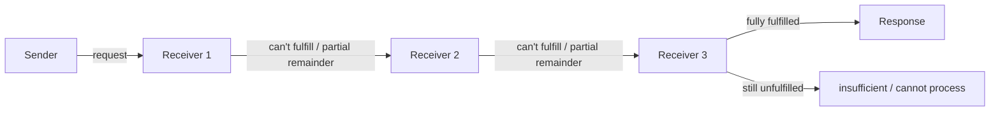
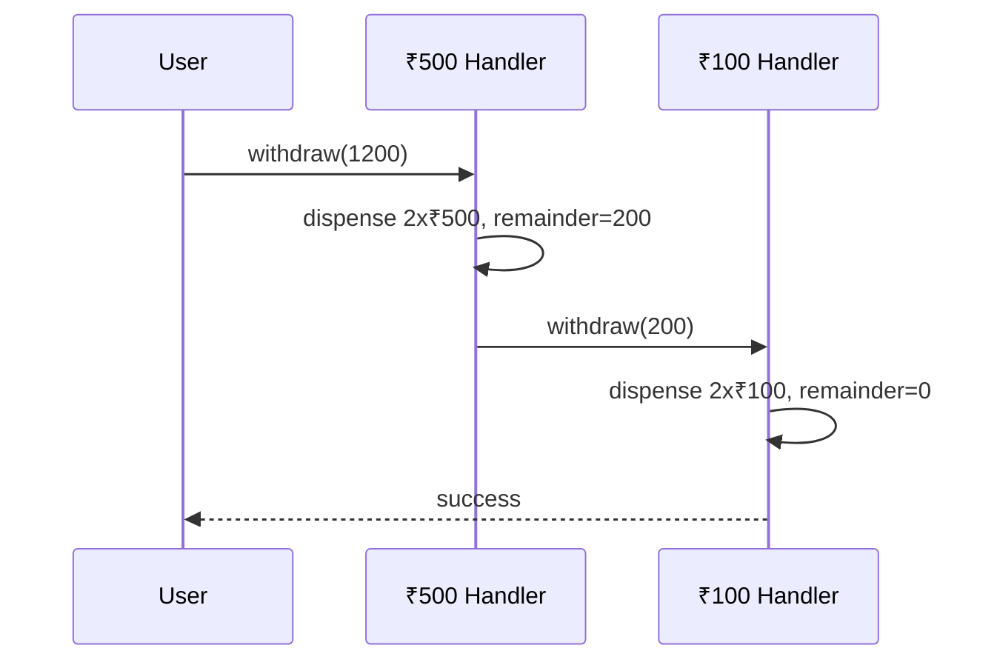
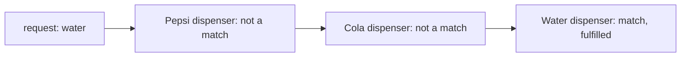
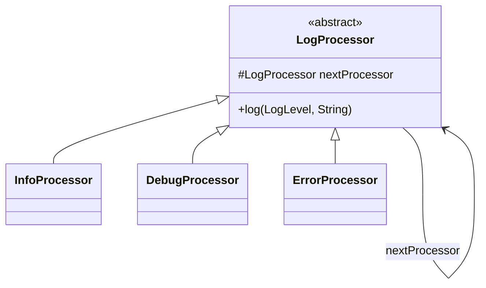
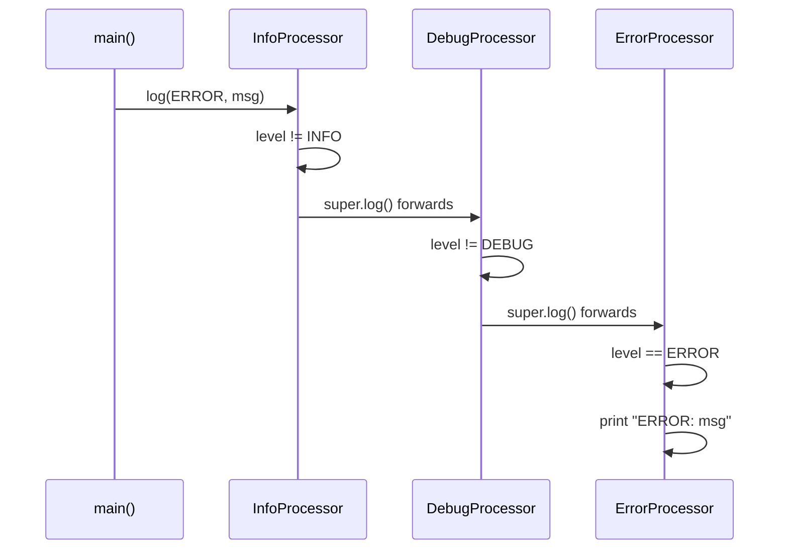

# Chain of Responsibility Design Pattern

## Overview
- Behavioral design pattern — a request travels through a chain of receiver
  objects until one of them handles it; the sender never needs to know which
  receiver will actually fulfill the request.
- Frequently asked in interviews because several classic "design X" questions
  (vending machine, ATM cash withdrawal, logging system) are indirect asks
  for this pattern.
- Core shape: each receiver either handles the request itself, or forwards
  it (unchanged, or partially fulfilled) to the next receiver in the chain.

## Key Concepts
### Core mechanism
- Sender creates a request and sends it into the chain — it doesn't care
  which specific receiver ends up handling it.
- Each receiver in the chain gets a chance to check "can I fulfill this?"
  - if yes, it processes the request (fully or partially) and, if there's
  leftover work, forwards the remainder onward; if no, it forwards the whole
  request unchanged to the next receiver.
- If the request reaches the end of the chain still unfulfilled, the chain
  returns a failure/insufficient result instead of silently dropping it.



### Real-world application: ATM cash withdrawal
- A withdrawal request (e.g. withdraw ₹1200) enters a chain of denomination
  handlers, largest note first — e.g. ₹500 handler → ₹100 handler → ...
- Each handler dispenses as many notes of its own denomination as it can
  from the remaining amount, then forwards the leftover remainder to the
  next handler in the chain.
- If the chain is exhausted and the remaining amount still isn't zero (can't
  be made exactly with the available denominations), the ATM returns
  "insufficient amount" instead of dispensing an inexact amount.



### Real-world application: vending machine
- A requested item (e.g. water) enters a chain of item dispensers — e.g.
  Pepsi dispenser → Cola dispenser → Water dispenser.
- Each dispenser checks if it stocks the requested item; if not, it forwards
  the request unchanged to the next dispenser in the chain, until the one
  that actually holds water fulfills it.



### Worked example: logging system
- Three log levels form the chain, built via constructor injection — each
  processor is handed a reference to the next processor in the chain when
  it's constructed.
- Base abstract `LogProcessor` holds the `nextProcessor` reference and a
  shared "forward to next" method.
- Each concrete processor overrides the log method: if the incoming log's
  level matches its own, it handles (prints) the message; otherwise it calls
  the base class's forwarding method (`super.log(...)`), which passes the
  request to `nextProcessor`.
- Chain assembled bottom-up in `main`, nesting the next processor into each
  constructor call, in order: Info → Debug → Error.



```java
enum LogLevel { INFO, DEBUG, ERROR }

abstract class LogProcessor {
    protected LogProcessor nextProcessor;

    LogProcessor(LogProcessor nextProcessor) {
        this.nextProcessor = nextProcessor;
    }
    void log(LogLevel level, String message) {
        if (nextProcessor != null) nextProcessor.log(level, message); // forward to chain
    }
}

class InfoProcessor extends LogProcessor {
    InfoProcessor(LogProcessor nextProcessor) { super(nextProcessor); }
    @Override
    void log(LogLevel level, String message) {
        if (level == LogLevel.INFO) System.out.println("INFO: " + message);
        else super.log(level, message); // not mine, pass it on
    }
}
class DebugProcessor extends LogProcessor {
    DebugProcessor(LogProcessor nextProcessor) { super(nextProcessor); }
    @Override
    void log(LogLevel level, String message) {
        if (level == LogLevel.DEBUG) System.out.println("DEBUG: " + message);
        else super.log(level, message);
    }
}
class ErrorProcessor extends LogProcessor {
    ErrorProcessor(LogProcessor nextProcessor) { super(nextProcessor); }
    @Override
    void log(LogLevel level, String message) {
        if (level == LogLevel.ERROR) System.out.println("ERROR: " + message);
        else super.log(level, message);
    }
}

class Main {
    public static void main(String[] args) {
        LogProcessor chain = new InfoProcessor(new DebugProcessor(new ErrorProcessor(null)));
        chain.log(LogLevel.ERROR, "something went wrong"); // flows Info -> Debug -> Error
    }
}
```

## Trade-offs / Comparisons
| Approach | How it works | Downside without it |
|---|---|---|
| No chain (single handler with if/else) | One object checks every case itself | Handler class grows with every new case, violates OCP |
| Chain of Responsibility | Each receiver only knows its own case + how to forward | Sender must build the chain correctly (right order matters, e.g. denominations largest-first) |

## Example / Walkthrough
- Logging: `chain.log(ERROR, "msg")` called on the head of the chain
  (`InfoProcessor`) → `InfoProcessor` isn't ERROR, calls `super.log()` →
  forwards to `DebugProcessor` → not DEBUG either, forwards again → reaches
  `ErrorProcessor` → level matches, message printed there.
- ATM: withdraw ₹1200 → ₹500 handler dispenses 2 notes (₹1000), forwards
  remaining ₹200 → ₹100 handler dispenses 2 notes, remainder 0 → success.
- Vending machine: request water → Pepsi dispenser passes → Cola dispenser
  passes → Water dispenser fulfills.

## Diagram


## Interview Q&A
<details>
<summary>What problem does Chain of Responsibility solve?</summary>

It decouples a sender from knowing which specific receiver will fulfill its
request — the request travels through a chain of receivers until one
handles it (or, in the ATM case, until it's fully satisfied across several).

</details>

<details>
<summary>How would you recognize a Chain of Responsibility question in an interview?</summary>

Questions like "design a vending machine", "design ATM cash withdrawal", or
"design a logging system" are indirect asks for this pattern — the giveaway
is a request that needs to be routed through a sequence of candidates until
satisfied.

</details>

<details>
<summary>In the logging example, why does each processor call super.log() instead of nextProcessor.log() directly?</summary>

The forwarding logic (checking `nextProcessor != null` and delegating) lives
once in the base class; each subclass only needs to know its own
match-check, then defer to the shared base behavior via `super.log()`
instead of duplicating the forwarding code in every subclass.

</details>

<details>
<summary>Why does chain order matter in the ATM example but not really in the logging example?</summary>

In the ATM chain, order changes the actual dispensing result (largest
denomination first minimizes notes used); in the logging chain, order
doesn't change which processor ultimately handles a given level, since
each level is only handled by exactly one dedicated processor.

</details>

<details>
<summary>What happens if a request reaches the end of the chain unhandled?</summary>

The chain should return an explicit failure instead of silently dropping
it — e.g. the ATM example returns "insufficient amount" when the requested
amount can't be made exactly from the available denominations.

</details>

<details>
<summary>How is the chain itself constructed?</summary>

Bottom-up, via constructor injection — each processor's constructor takes a
reference to the next processor in the chain, so nesting the constructor
calls (e.g. `new InfoProcessor(new DebugProcessor(new ErrorProcessor(null)))`)
wires the whole chain in one expression.

</details>

## Related Topics
- [[LLD/13-proxy-design-pattern]] — both patterns wrap/forward a call, but
  Proxy intercepts once for a single real object, Chain of Responsibility
  passes along a sequence of candidate handlers.
- [[LLD/01-solid-principles]] — adding a new receiver type means adding a
  new class, not modifying existing processors (Open/Closed Principle).
- [[LLD/17-atm-lld]] — full ATM design using this exact denomination chain
  for cash withdrawal, combined with State pattern for the operation flow.
