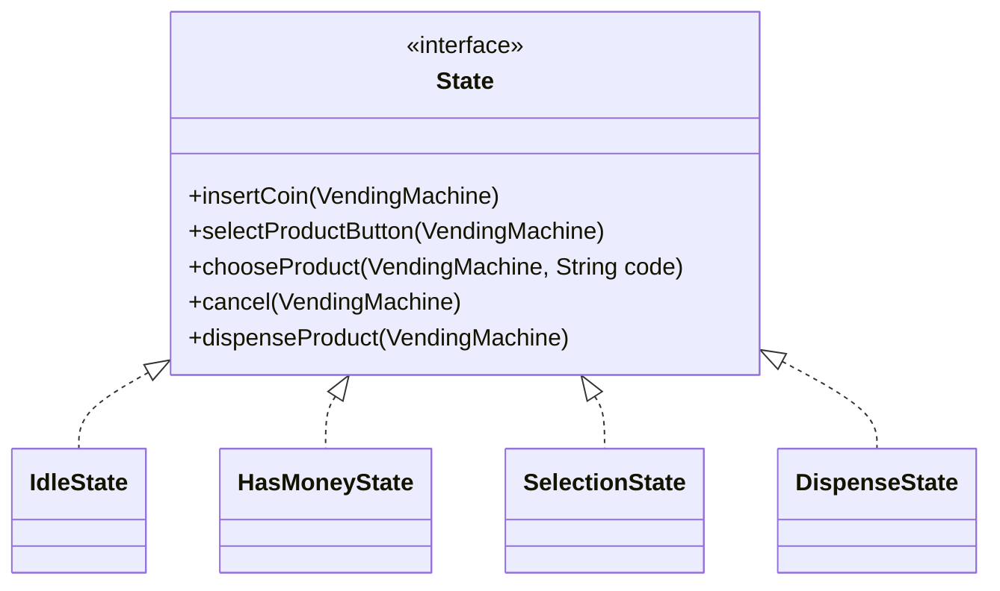
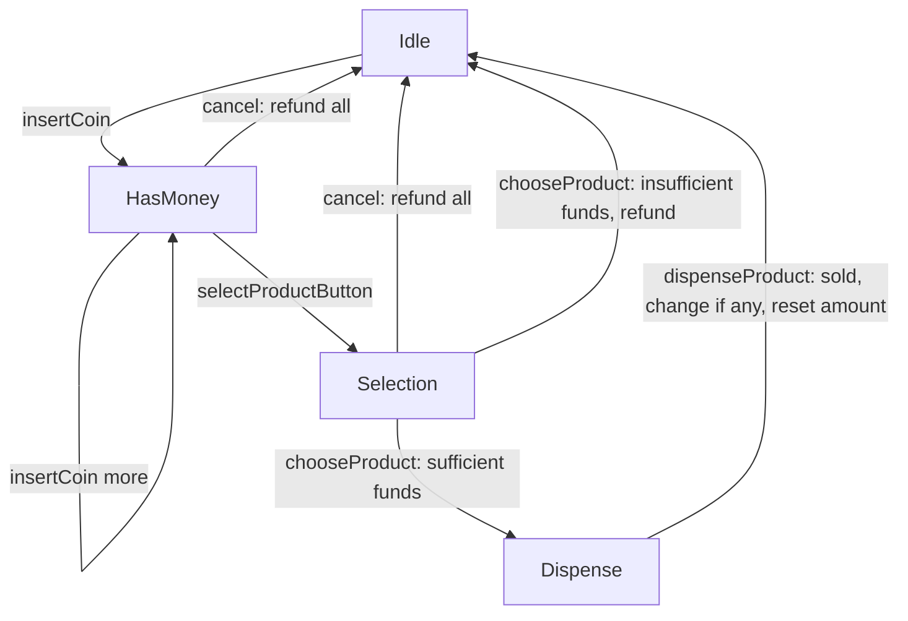
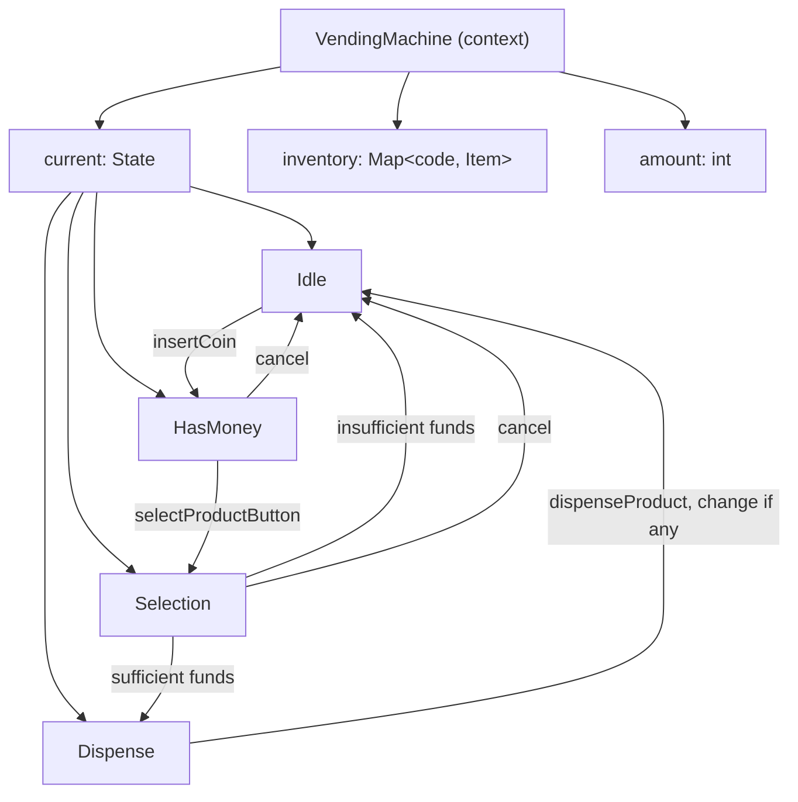

# LLD of Vending Machine

## Overview
- Design a vending machine — one of the most frequently asked LLD interview
  questions, and the canonical example for the **State Design Pattern**.
- Scope: coin-only machine (no notes), multiple products each with a code
  and price, insert-coin/select-product/cancel buttons, and correct change
  or refund handling.
- Core idea: instead of one giant class full of `if machineState == X`
  checks, each state (Idle, HasMoney, Selection, Dispense) is its own class
  implementing a shared interface — the machine just delegates every button
  press to whichever state object it currently holds.

## Key Concepts
### Requirements — clarify before designing
- Products: a fixed set of item codes, each with a type and a price. Any
  item type can sit at any code (soda, water bottle, chips, etc.) — this
  design scopes to coins only, not notes, per the interviewer's framing in
  the video.
- Buttons: **Insert Coin**, **Select Product**, **Cancel/Refund**.
- After coins are inserted and a product code is chosen: if paid amount
  equals the price, dispense; if more was paid, dispense and return the
  change; if less was paid, refund everything and go idle; cancel/refund is
  allowed at any point before dispensing.

### Why State pattern — one class per machine state
- A vending machine's behavior for the *same* button press depends entirely
  on which phase it's in: `insertCoin()` means something in Idle (start
  accepting money) but is a no-op once already in Selection.
- Cramming all of that into one `VendingMachine` class means every method
  starts with a state check — adding a new state means touching every
  method. State pattern flips this: one interface, one implementing class
  per state, and each class only defines what's legal in that state.
- Illustrated in the video with a simpler example first — a TV only has
  On/Off states; "On" allows channel/volume change, "Off" allows only
  power-on. Same shape, fewer states, before scaling up to the vending
  machine's four states.



```java
interface State {
    void insertCoin(VendingMachine machine);
    void selectProductButton(VendingMachine machine);
    void chooseProduct(VendingMachine machine, String code);
    void cancel(VendingMachine machine);
    void dispenseProduct(VendingMachine machine);

    // default: illegal in this state
    default void unsupported() {
        throw new UnsupportedOperationException("Not allowed in this state");
    }
}
```

### The four states and what each allows
- **Idle** — waiting state, nothing inserted yet. Only `insertCoin()` is
  legal; it adds to `machine.amount` and moves the machine to HasMoney.
  Everything else (select, choose, cancel, dispense) is illegal here.
- **HasMoney** — at least one coin inserted. `insertCoin()` keeps
  accumulating (multiple coins allowed); `selectProductButton()` moves to
  Selection; `cancel()` refunds everything collected so far and returns to
  Idle.
- **Selection** — user is choosing a product code. `chooseProduct(code)`
  looks up the item: insufficient funds → refund and go Idle; sufficient
  (equal or more) → move to Dispense. `cancel()` still refunds and returns
  to Idle.
- **Dispense** — terminal step for this cycle. `dispenseProduct()` marks the
  item's inventory down (sold out if it hits zero), returns any change,
  resets `amount` to zero, and moves back to Idle. No cancel/refund here —
  the product is already committed.



```java
class IdleState implements State {
    public void insertCoin(VendingMachine m) {
        m.amount += m.pendingCoin();
        m.setState(m.hasMoneyState);
    }
    public void selectProductButton(VendingMachine m) { unsupported(); }
    public void chooseProduct(VendingMachine m, String code) { unsupported(); }
    public void cancel(VendingMachine m) { unsupported(); }
    public void dispenseProduct(VendingMachine m) { unsupported(); }
}

class HasMoneyState implements State {
    public void insertCoin(VendingMachine m) { m.amount += m.pendingCoin(); }
    public void selectProductButton(VendingMachine m) { m.setState(m.selectionState); }
    public void chooseProduct(VendingMachine m, String code) { unsupported(); }
    public void cancel(VendingMachine m) {
        m.refund(m.amount);
        m.amount = 0;
        m.setState(m.idleState);
    }
    public void dispenseProduct(VendingMachine m) { unsupported(); }
}

class SelectionState implements State {
    public void insertCoin(VendingMachine m) { unsupported(); }
    public void selectProductButton(VendingMachine m) { unsupported(); }
    public void chooseProduct(VendingMachine m, String code) {
        Item item = m.inventory.get(code);
        if (item == null || item.quantity == 0 || m.amount < item.price) {
            m.refund(m.amount);
            m.amount = 0;
            m.setState(m.idleState);
            return;
        }
        m.selectedCode = code;
        m.setState(m.dispenseState);
        m.dispenseProduct();
    }
    public void cancel(VendingMachine m) {
        m.refund(m.amount);
        m.amount = 0;
        m.setState(m.idleState);
    }
    public void dispenseProduct(VendingMachine m) { unsupported(); }
}

class DispenseState implements State {
    public void insertCoin(VendingMachine m) { unsupported(); }
    public void selectProductButton(VendingMachine m) { unsupported(); }
    public void chooseProduct(VendingMachine m, String code) { unsupported(); }
    public void cancel(VendingMachine m) { unsupported(); }
    public void dispenseProduct(VendingMachine m) {
        Item item = m.inventory.get(m.selectedCode);
        int change = m.amount - item.price;
        item.quantity--; // sold out at 0
        if (change > 0) m.refund(change);
        m.amount = 0;
        m.setState(m.idleState);
    }
}
```

### VendingMachine — the context holding current state + inventory
- The machine (context in State pattern terms) holds a reference to its
  *current* `State` object and delegates every button press to it — the
  machine itself never branches on what state it's in.
- Also owns the shared data every state reads/writes: `amount` collected so
  far, the `inventory` (item code → `Item`), and the `selectedCode` for the
  in-progress purchase.
- One instance of each state class is created once and reused (no need to
  `new` a state per transition) — `setState()` just swaps which shared
  instance is "current".

```java
class Item {
    String type;
    int price;
    int quantity;
    Item(String type, int price, int quantity) {
        this.type = type; this.price = price; this.quantity = quantity;
    }
}

class VendingMachine {
    State idleState = new IdleState();
    State hasMoneyState = new HasMoneyState();
    State selectionState = new SelectionState();
    State dispenseState = new DispenseState();

    State current = idleState;
    int amount = 0;
    String selectedCode;
    Map<String, Item> inventory = new HashMap<>();

    void setState(State state) { this.current = state; }
    void refund(int coins) { System.out.println("Refunding " + coins); }
    int pendingCoin() { return 5; } // stubbed: value of the coin just inserted

    void insertCoin() { current.insertCoin(this); }
    void selectProductButton() { current.selectProductButton(this); }
    void chooseProduct(String code) { current.chooseProduct(this, code); }
    void cancel() { current.cancel(this); }
    void dispenseProduct() { current.dispenseProduct(this); }
}
```

## Trade-offs / Comparisons
| Design point | Choice made here | Alternative |
|---|---|---|
| State handling | One class per state (State pattern), machine delegates | Single class with `if (state == X)` branches everywhere — grows unreadable as states/operations multiply |
| Payment | Coins only, accumulated in `amount` | Notes/cards — same flow, just a different `pendingCoin()`-style input source |
| Change | Computed in Dispense state at commit time, refunded alongside the product | Track change earlier — unnecessary, only matters once a product is actually dispensed |

## Example / Walkthrough
- Machine starts in **Idle**. User inserts coins → machine moves to
  **HasMoney**, `amount` accumulates with each coin (e.g. ₹30 total).
- User can `cancel()` here to get a full refund and return to Idle, or press
  **Select Product** to move to **Selection**.
- In Selection, user enters a product code (e.g. `102`). If `amount` is
  less than the price, the machine refunds everything and returns to Idle.
  If sufficient, it moves to **Dispense**.
- In Dispense: the item's quantity is decremented (marked sold out at
  zero), any excess over the price is refunded as change, `amount` resets
  to zero, and the machine returns to **Idle** — ready for the next
  customer.

## Diagram


## Interview Q&A
<details>
<summary>Why use the State design pattern for a vending machine instead of one class with state flags?</summary>

Because the same button press means something different depending on the
current phase (insert-coin is valid in Idle/HasMoney but not in
Selection/Dispense). One class per state keeps each state's legal
operations together and lets the machine just delegate to
"whatever state I'm in" instead of branching on a flag before every
operation.

</details>

<details>
<summary>What are the four states of the vending machine, and what triggers each transition?</summary>

Idle → HasMoney (insert coin), HasMoney → Selection (press select-product),
Selection → Dispense (choose a product with sufficient funds), Dispense →
Idle (product dispensed, change returned, amount reset). Cancel from
HasMoney or Selection refunds everything and returns straight to Idle.

</details>

<details>
<summary>What happens if the user inserts more money than the product's price?</summary>

The product is dispensed and the difference between `amount` and the
item's price is returned as change, computed in the Dispense state right
before `amount` resets to zero.

</details>

<details>
<summary>What happens if the user selects a product without enough money?</summary>

The Selection state refunds the full `amount` collected so far and
transitions the machine back to Idle — no product is dispensed, and no
change is left tracked on the machine.

</details>

<details>
<summary>Why does the machine hold one shared instance of each state class instead of creating a new one on every transition?</summary>

State objects here don't carry any per-transaction data of their own — all
transaction data (`amount`, `selectedCode`, `inventory`) lives on the
`VendingMachine` context. Since a state's behavior is fixed, reusing one
instance per state avoids pointless allocation on every button press.

</details>

<details>
<summary>How would a TV's on/off design relate to this same pattern?</summary>

Same shape at smaller scale: `On` state allows channel-change/volume-change
and power-off; `Off` state allows only power-on and rejects everything
else. It's the same "each state implements only what's legal in it"
structure as the vending machine's four states, just with two states
instead of four.

</details>

## Related Topics
- [[LLD/02-strategy-design-pattern]] — both patterns swap in an interface
  implementation at runtime; Strategy picks *behavior* explicitly from the
  client, State transitions *itself* based on internal triggers.
- [[LLD/11-snake-and-ladder-lld]] — another design driven by explicit
  requirements-gathering before modeling (dice count, snake/ladder count)
  the way this note starts with vending machine requirements.
- [[LLD/17-atm-lld]] — reuses this same State pattern shape for the ATM's
  operation flow, combined with Chain of Responsibility for cash
  withdrawal.
