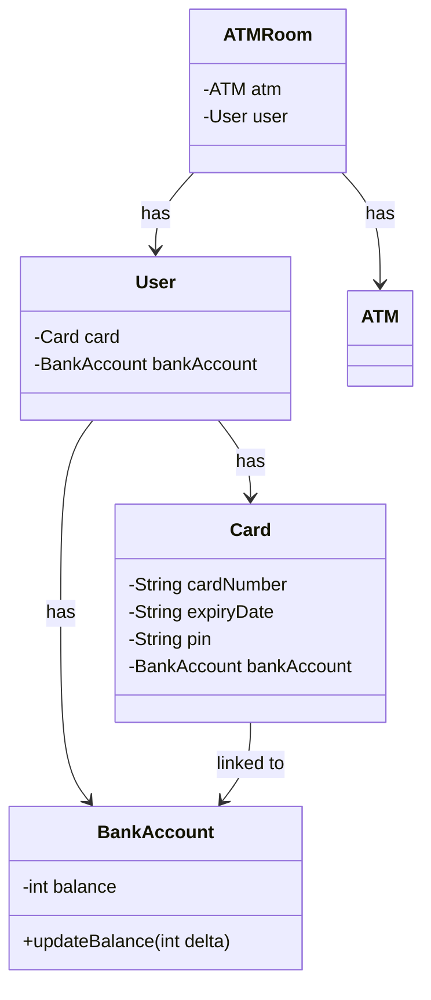
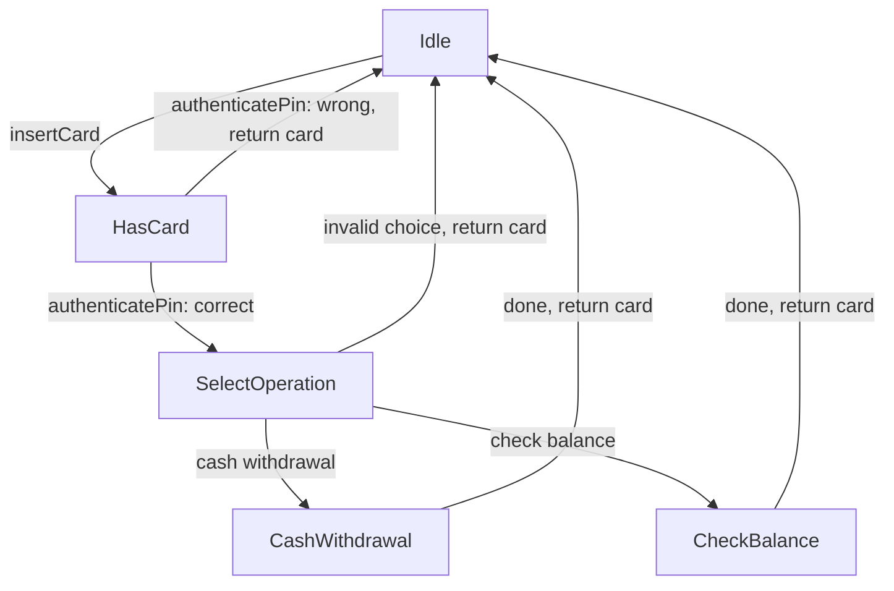
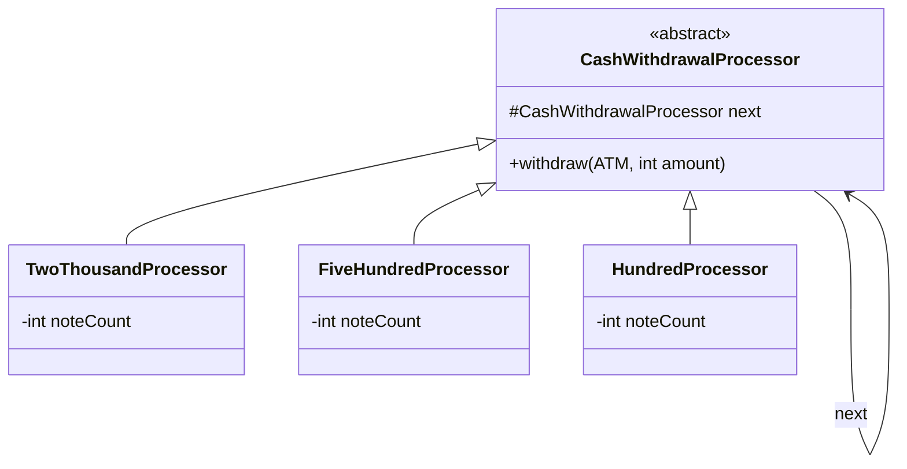
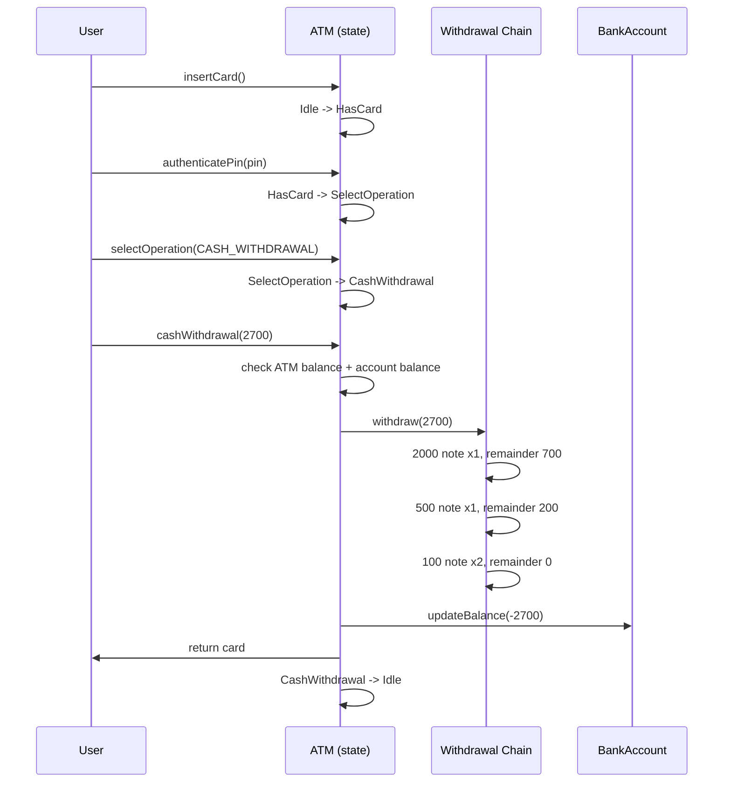

# LLD of ATM

## Overview
- Design an ATM — one of the most frequently asked, and one of the
  simplest once broken down, LLD interview questions.
- Combines two patterns already covered: [[LLD/16-vending-machine-lld]]'s
  **State Design Pattern** for the ATM's own operation flow, and
  [[LLD/10-chain-of-responsibility-pattern]] for cash withdrawal note
  dispensing.
- Whether both patterns are actually needed depends on scope — clarify with
  the interviewer whether cash withdrawal needs real denomination logic or
  can just subtract from a balance; that decision decides whether Chain of
  Responsibility is even in scope.

## Key Concepts
### Requirements — clarify before designing
- Flow: user inserts card → ATM authenticates PIN → user selects one
  operation (cash withdrawal, check balance, etc.) → operation is performed
  → ATM returns to idle for the next user.
- Card carries a PIN and is linked to a `BankAccount`; the same card can't
  authenticate with the wrong PIN.
- Cash withdrawal must respect two independent balances: the ATM's own note
  supply and the user's bank account balance — either being insufficient
  blocks the withdrawal.
- Scope question for the interviewer: does the ATM need to compute actual
  note denominations (2k/500/100) for a withdrawal, or is subtracting from
  a running total acceptable? The former needs Chain of Responsibility, the
  latter doesn't.

### Object model — User, Card, BankAccount, ATM, ATMRoom
- `User` **has** a `Card` and **has** a `BankAccount` — both held as fields
  on the user, not derived.
- `Card` holds its own details (number, expiry, PIN) and **has** a
  reference to the linked `BankAccount`, so withdrawal/deposit logic can
  reach the account straight from the card being used.
- `BankAccount` holds `balance` and an `updateBalance()` method — every
  withdrawal or deposit goes through this one method rather than fields
  being mutated directly from multiple places.
- `ATMRoom` **has** an `ATM` and **has** a `User` — the point where a user
  and a physical machine come together to actually perform an operation.



### ATM states — State pattern drives the operation flow
- `ATM` **has** a current `ATMState`; every action the machine takes is
  delegated to whichever state object is current — same shape as the
  vending machine's [[LLD/16-vending-machine-lld]] `State` interface.
- **Idle** — only `insertCard()` is legal; moves to HasCard.
- **HasCard** — only `authenticatePin()` is legal (plus exit/return-card at
  any point). Correct PIN → SelectOperation; wrong PIN → return the card
  and go back to Idle.
- **SelectOperation** — user picks one operation (cash withdrawal, check
  balance, ...). A valid pick moves to that operation's own state; an
  invalid pick exits back to Idle.
- **Per-operation states** (`CashWithdrawalState`, `CheckBalanceState`,
  ...) — each implements just its own operation method plus exit/return-
  card. Adding a new operation later means adding one new state class, not
  touching existing ones.
- Every path ends the same way: once an operation completes (or the user
  exits early), the card is returned and the ATM goes back to Idle.



```java
interface ATMState {
    default void insertCard(ATM atm) { throw new UnsupportedOperationException(); }
    default void authenticatePin(ATM atm, String pin) { throw new UnsupportedOperationException(); }
    default void selectOperation(ATM atm, String operation) { throw new UnsupportedOperationException(); }
    default void cashWithdrawal(ATM atm, int amount) { throw new UnsupportedOperationException(); }
    default void checkBalance(ATM atm) { throw new UnsupportedOperationException(); }
}

class IdleState implements ATMState {
    public void insertCard(ATM atm) {
        System.out.println("Card inserted");
        atm.setState(atm.hasCardState);
    }
}

class HasCardState implements ATMState {
    public void authenticatePin(ATM atm, String pin) {
        if (!atm.currentCard.pin.equals(pin)) {
            atm.returnCard(); // wrong pin -> back to idle
            return;
        }
        atm.setState(atm.selectOperationState);
    }
}

class SelectOperationState implements ATMState {
    public void selectOperation(ATM atm, String operation) {
        switch (operation) {
            case "CASH_WITHDRAWAL" -> atm.setState(atm.cashWithdrawalState);
            case "CHECK_BALANCE" -> atm.setState(atm.checkBalanceState);
            default -> atm.returnCard(); // invalid choice -> back to idle
        }
    }
}

class CashWithdrawalState implements ATMState {
    public void cashWithdrawal(ATM atm, int amount) {
        BankAccount account = atm.currentCard.bankAccount;
        if (amount > atm.totalCash() || amount > account.balance) {
            System.out.println("Insufficient funds");
            atm.returnCard();
            return;
        }
        atm.withdrawalChain.withdraw(atm, amount); // chain of responsibility
        account.updateBalance(-amount);
        atm.returnCard();
    }
}

class CheckBalanceState implements ATMState {
    public void checkBalance(ATM atm) {
        System.out.println("Balance: " + atm.currentCard.bankAccount.balance);
        atm.returnCard();
    }
}
```

### Cash withdrawal — Chain of Responsibility for denomination dispensing
- Only needed if the scope requires real note dispensing. Chain order is
  ₹2000 → ₹500 → ₹100, largest denomination first, same shape as the ATM
  example already worked through in [[LLD/10-chain-of-responsibility-pattern]].
- Each processor dispenses as many of its own notes as it can from the
  remaining amount (bounded by both the amount and its own note count),
  decrements its note count, and forwards whatever's left to the next
  processor in the chain via the shared base method.
- If the chain runs out with a nonzero remainder (amount can't be made
  exactly from available notes), that's a failure the ATM should report
  rather than silently dispensing an inexact amount.



```java
abstract class CashWithdrawalProcessor {
    protected CashWithdrawalProcessor next;
    CashWithdrawalProcessor(CashWithdrawalProcessor next) { this.next = next; }

    void withdraw(ATM atm, int amount) {
        if (amount == 0) return;
        if (next == null) { System.out.println("Cannot dispense exact amount"); return; }
        next.withdraw(atm, amount); // forward remainder
    }
}

class TwoThousandProcessor extends CashWithdrawalProcessor {
    int noteCount;
    TwoThousandProcessor(int noteCount, CashWithdrawalProcessor next) {
        super(next); this.noteCount = noteCount;
    }
    @Override
    void withdraw(ATM atm, int amount) {
        int notesUsed = Math.min(noteCount, amount / 2000);
        noteCount -= notesUsed;
        super.withdraw(atm, amount - notesUsed * 2000); // remainder to next
    }
}

class FiveHundredProcessor extends CashWithdrawalProcessor {
    int noteCount;
    FiveHundredProcessor(int noteCount, CashWithdrawalProcessor next) {
        super(next); this.noteCount = noteCount;
    }
    @Override
    void withdraw(ATM atm, int amount) {
        int notesUsed = Math.min(noteCount, amount / 500);
        noteCount -= notesUsed;
        super.withdraw(atm, amount - notesUsed * 500);
    }
}

class HundredProcessor extends CashWithdrawalProcessor {
    int noteCount;
    HundredProcessor(int noteCount, CashWithdrawalProcessor next) {
        super(next); this.noteCount = noteCount;
    }
    @Override
    void withdraw(ATM atm, int amount) {
        int notesUsed = Math.min(noteCount, amount / 100);
        noteCount -= notesUsed;
        super.withdraw(atm, amount - notesUsed * 100); // next is null here -> reports failure if nonzero
    }
}

// chain built bottom-up, same as the logging example
CashWithdrawalProcessor chain =
    new TwoThousandProcessor(1, new FiveHundredProcessor(2, new HundredProcessor(5, null)));
```

## Trade-offs / Comparisons
| Design point | Choice made here | Alternative |
|---|---|---|
| ATM operation flow | State pattern — one class per state | `if (state == X)` branching in one `ATM` class — same downside as the vending machine |
| Cash withdrawal | Chain of Responsibility across denominations, largest-first | Simple `balance -= amount` subtraction — valid if the interviewer confirms note-level dispensing is out of scope |
| Adding a new operation (e.g. deposit, PIN change) | Add one new state class implementing the shared interface | Adding a branch to a monolithic operation handler |

## Example / Walkthrough
- Setup: ATM has ₹3500 total (one ₹2000 note, two ₹500 notes, five ₹100
  notes), starts in Idle. A user's bank account holds ₹3000.
- User inserts card → HasCard. Enters PIN `112211`, matches the card's
  stored PIN → SelectOperation.
- User picks Cash Withdrawal, requests ₹2700 → CashWithdrawalState checks
  both balances (ATM has ₹3500 ≥ 2700, account has ₹3000 ≥ 2700) → passes.
- Chain runs: ₹2000 processor uses its one note, remainder ₹700 → ₹500
  processor uses one note, remainder ₹200 → ₹100 processor uses two notes,
  remainder ₹0.
- Result: ATM note counts become 0×₹2000, 1×₹500, 3×₹100 (₹800 left in the
  machine); user's account balance drops to ₹300. Card is returned, ATM
  goes back to Idle.

## Diagram


## Interview Q&A
<details>
<summary>Why does the ATM use two design patterns instead of one?</summary>

They solve different problems: State pattern models the machine's own
lifecycle (idle → has-card → select-operation → per-operation state, each
allowing only certain calls), while Chain of Responsibility models how a
single operation — cash withdrawal — is fulfilled across multiple note
denominations. They're independent concerns that happen to compose.

</details>

<details>
<summary>Is Chain of Responsibility always required for an ATM design?</summary>

No — only if the interviewer wants real denomination-level dispensing
logic. If subtracting the withdrawal amount from a running balance is
acceptable scope, Chain of Responsibility isn't needed at all; this is a
scope question to raise before designing, not something to assume either
way.

</details>

<details>
<summary>What two balances does a cash withdrawal have to check, and why both?</summary>

The ATM's own total cash (can it physically dispense that much) and the
user's bank account balance (do they actually have that much money) —
either being insufficient blocks the withdrawal, since they're
independent constraints.

</details>

<details>
<summary>Why does each denomination processor go largest-to-smallest in the chain?</summary>

To minimize the number of notes dispensed for a given amount — the same
reasoning as normal cash withdrawal in real ATMs. Chain order is a
correctness/behavior decision here, not just an implementation detail (see
[[LLD/10-chain-of-responsibility-pattern]]'s note on why chain order
matters for ATM withdrawal but not for logging).

</details>

<details>
<summary>What happens if the requested amount can't be made exactly from the ATM's available notes?</summary>

The chain reaches its last processor with a nonzero remainder and no
further `next` to forward to — that's reported as a failure ("cannot
dispense exact amount") rather than dispensing an inexact amount.

</details>

<details>
<summary>How would adding a "deposit cash" operation change this design?</summary>

Add one new state class (e.g. `DepositCashState`) implementing the shared
`ATMState` interface, and one new case in `SelectOperationState`'s
dispatch. No existing state class needs to change — the same Open/Closed
benefit the state pattern gives the vending machine.

</details>

## Related Topics
- [[LLD/16-vending-machine-lld]] — same State pattern shape (context holds
  current state, delegates every call); ATM's Idle/HasCard/SelectOperation
  states mirror the vending machine's Idle/HasMoney/Selection states.
- [[LLD/10-chain-of-responsibility-pattern]] — the ATM cash-withdrawal
  chain used here is the worked example that pattern's note already covers
  in detail.
