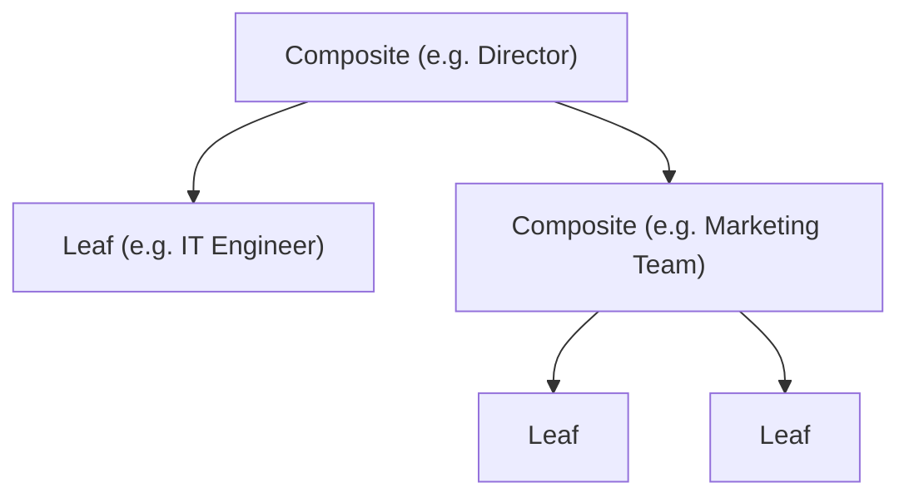
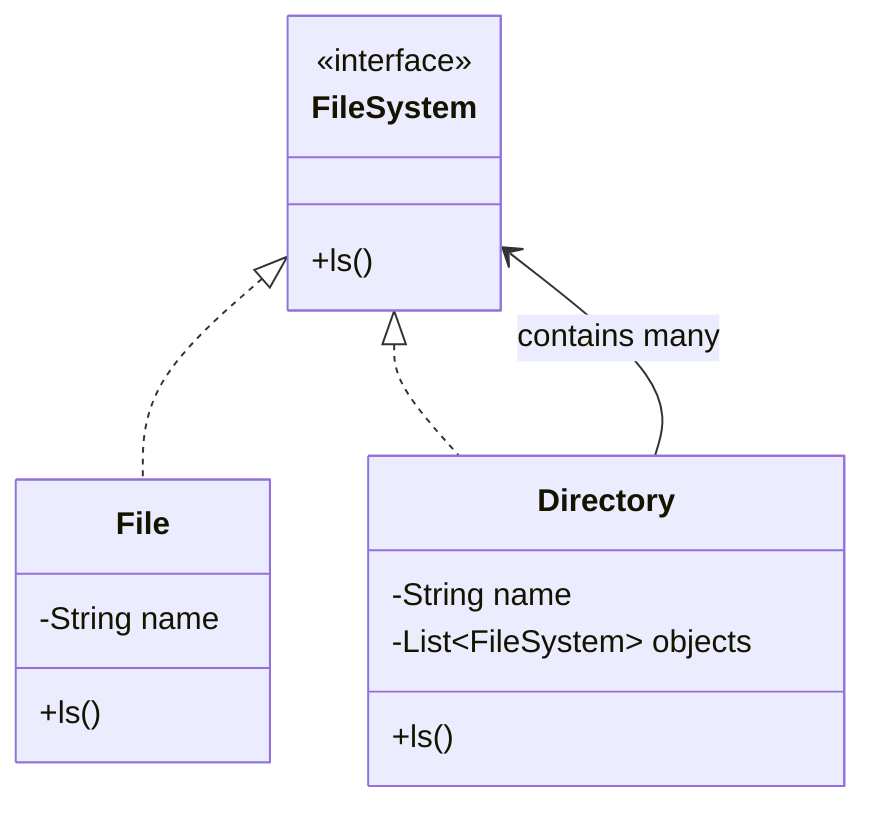
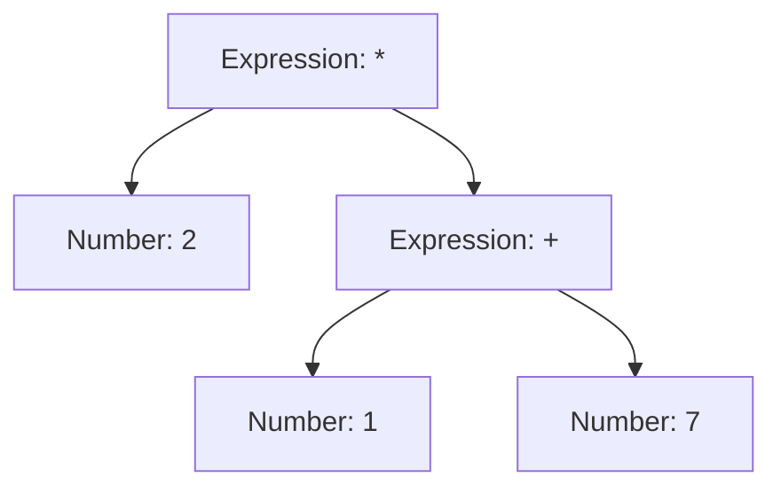
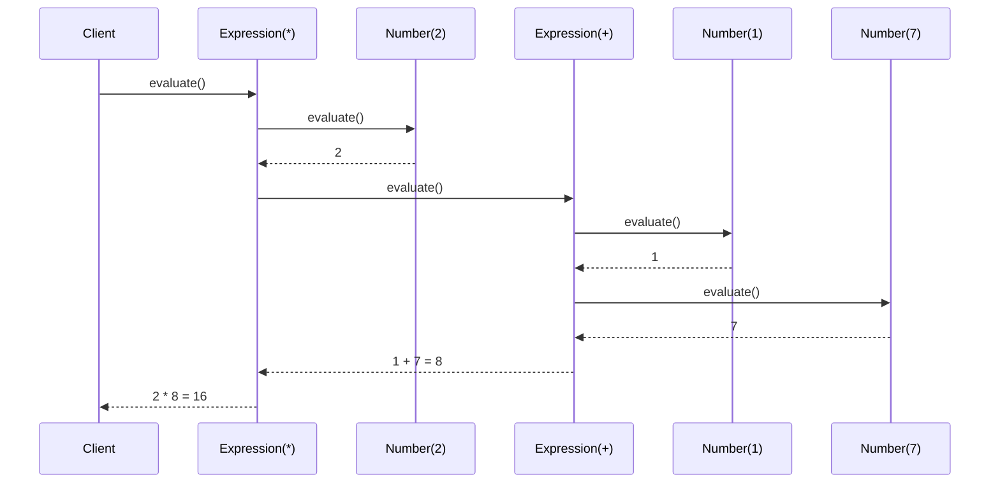
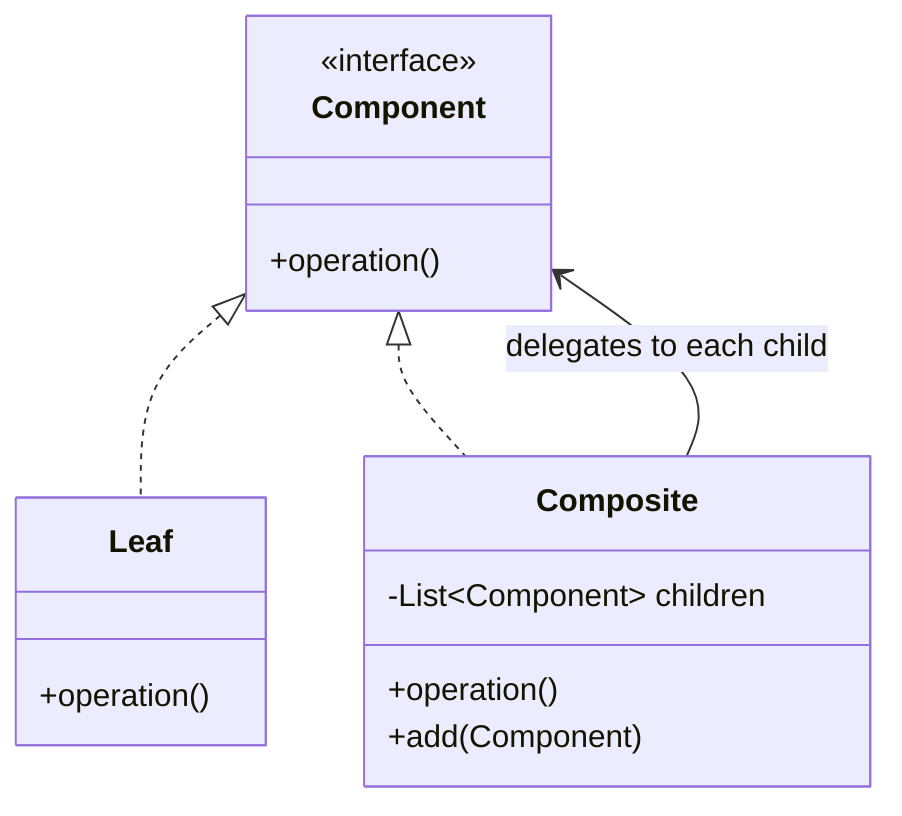

# Composite Design Pattern

## Overview
- Structural pattern for "object inside object" — used whenever a problem
  can be modeled as a tree (a node can itself contain more nodes of the
  same conceptual type).
- Lets client code treat a single leaf object and a whole subtree
  uniformly, through one shared interface — no `instanceof`/type-check
  branching to decide how to handle a node.
- Recognize it from the problem shape, not the name: file/directory
  systems, org charts, nested delivery boxes, arithmetic expression trees
  all fit — if you can sketch the problem as a tree, Composite likely
  applies.

## Key Concepts
### Object-inside-object shape
- A "component" type has two kinds of implementers: **leaf** (no
  children, does real work directly) and **composite** (holds a list of
  other components — leaves or composites — and delegates to them).
- Examples: CEO → Director → Manager → (IT engineer | marketing team);
  delivery box → (product | smaller box, recursively).



### The problem without Composite
- Naive design keeps leaf and composite as unrelated classes, so a
  container's iteration method must type-check every child
  (`instanceof File`, `instanceof Directory`) and cast before calling the
  right method.
- Every new leaf/composite type added means another `if`/`instanceof`
  branch everywhere children are processed — violates OCP.

```java
class File {
    String name;
    File(String name) { this.name = name; }
    void ls() { System.out.println(name); }
}
class Directory {
    String name;
    List<Object> objects; // no shared type, so raw Object
    Directory(String name) { this.name = name; objects = new ArrayList<>(); }
    void ls() {
        for (Object obj : objects) {
            if (obj instanceof File) {
                ((File) obj).ls();
            } else if (obj instanceof Directory) { // one branch per type, grows unboundedly
                ((Directory) obj).ls();
            }
        }
    }
}
```

### The Composite fix — shared component interface
- Define one interface (`FileSystem`) that both the leaf (`File`) and the
  composite (`Directory`) implement.
- Composite holds a list typed as the **interface**, not a concrete
  class or raw `Object` — so iterating and calling the method needs no
  type checks; polymorphism picks the right `ls()` automatically.



```java
interface FileSystem {
    void ls();
}
class File implements FileSystem { // leaf
    String name;
    File(String name) { this.name = name; }
    public void ls() { System.out.println(name); }
}
class Directory implements FileSystem { // composite
    String name;
    List<FileSystem> objects; // typed as the interface, not File/Directory/Object
    Directory(String name) { this.name = name; objects = new ArrayList<>(); }
    public void ls() {
        System.out.println(name);
        for (FileSystem fs : objects) {
            fs.ls(); // no instanceof — polymorphism dispatches to File.ls() or Directory.ls()
        }
    }
}
```

### Second example — arithmetic expression tree
- Same shape applied to a calculator: an expression like `2 * (1 + 7)` is
  a tree where leaves are numbers and internal nodes are operations.
- Shared interface `ArithmeticExpression` with one method `evaluate()`.
- Leaf = `Number` (holds a value, `evaluate()` just returns it).
- Composite = `Expression` (holds a left `ArithmeticExpression`, a right
  `ArithmeticExpression`, and an operation enum; `evaluate()` recurses
  into both sides then applies the operation).



```java
interface ArithmeticExpression {
    int evaluate();
}
class Number implements ArithmeticExpression { // leaf
    int value;
    Number(int value) { this.value = value; }
    public int evaluate() { return value; }
}
enum Operation { ADD, SUBTRACT, MULTIPLY, DIVIDE }
class Expression implements ArithmeticExpression { // composite
    ArithmeticExpression left, right;
    Operation operation;
    Expression(ArithmeticExpression left, ArithmeticExpression right, Operation operation) {
        this.left = left; this.right = right; this.operation = operation;
    }
    public int evaluate() {
        int l = left.evaluate(), r = right.evaluate(); // recurses into children first
        switch (operation) {
            case ADD: return l + r;
            case SUBTRACT: return l - r;
            case MULTIPLY: return l * r;
            case DIVIDE: return l / r;
        }
        throw new IllegalStateException();
    }
}
```

- Building `2 * (1 + 7)`:
  `new Expression(new Number(2), new Expression(new Number(1), new Number(7), ADD), MULTIPLY)`.



## Trade-offs / Comparisons
- Without Composite: leaf/composite types unrelated, client code branches
  on type, adding a new node type touches every branch site.
- With Composite: leaf/composite share one interface, client code calls
  one method polymorphically, adding a new node type means writing one
  new class that implements the interface — no existing code changes.

## Example / Walkthrough
- File system: `movies/` directory contains file `border` and
  subdirectory `comedy_movies/`, which contains file `hulchul`.
- Calling `ls()` on the root directory prints its own name, then calls
  `ls()` on each child — `border` prints directly (leaf), `comedy_movies`
  recurses into its own children before returning.
- Calculator: `evaluate()` on the outer `Expression` recurses into left
  and right children first (post-order), then combines with its own
  operation — same recursion shape as the file system's `ls()`.

## Diagram


## Interview Q&A
<details>
<summary>When should you reach for the Composite pattern?</summary>

Whenever the problem can be modeled as a tree — a node that may itself
contain more nodes of the same conceptual type (file system, org chart,
nested boxes, expression trees).

</details>

<details>
<summary>What problem does Composite solve that a naive tree design has?</summary>

Without it, the composite class must type-check (`instanceof`) each child
to know how to handle it, and cast before calling the right method — a new
node type means touching every such branch.

</details>

<details>
<summary>What are the two roles in a Composite hierarchy?</summary>

Leaf (no children, does the real work directly) and Composite (holds a
list of the shared component type — leaves or other composites — and
delegates to each).

</details>

<details>
<summary>Why does the composite's child list get typed as the shared interface instead of a concrete class or Object?</summary>

So iterating and calling the method needs no type checks — polymorphism
dispatches to the correct leaf or composite implementation automatically.

</details>

<details>
<summary>How does a Composite method call like ls() or evaluate() actually execute across a deep tree?</summary>

It recurses: a composite's method loops over its children and calls the
same method on each; when a child is itself a composite, that call
recurses further, and leaves are where the recursion bottoms out.

</details>

<details>
<summary>Give two examples of problems solvable with Composite.</summary>

File system (files and directories, directories nest files or
subdirectories) and arithmetic expression evaluation (numbers as leaves,
operations as composite nodes holding left/right sub-expressions).

</details>

## Related Topics
- [[LLD/04-decorator-design-pattern]] — both wrap/nest objects of a shared
  type recursively, but Decorator nests to *add behavior* to one object,
  Composite nests to represent a *whole tree* of many objects.
- [[LLD/01-solid-principles]] — Composite follows OCP: new leaf/composite
  types are new classes implementing the shared interface, no existing
  code is modified.
