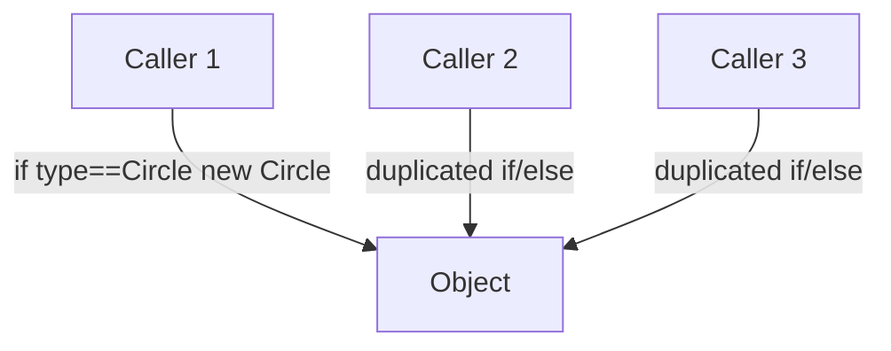
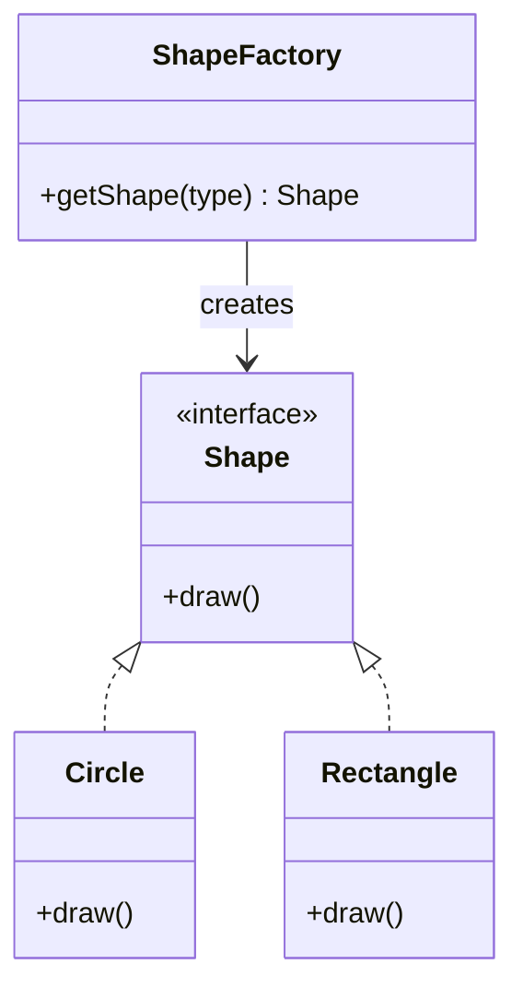
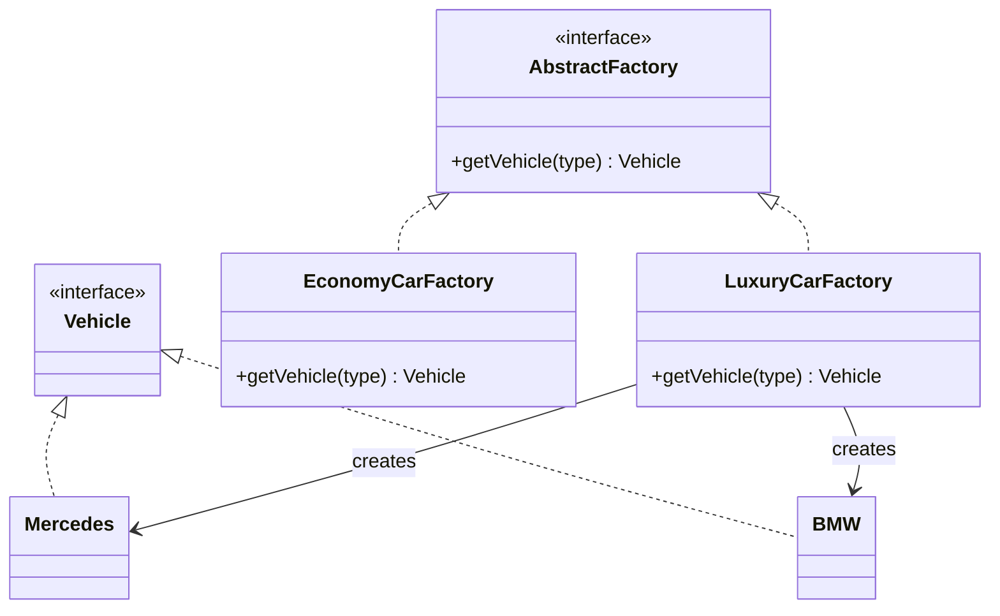
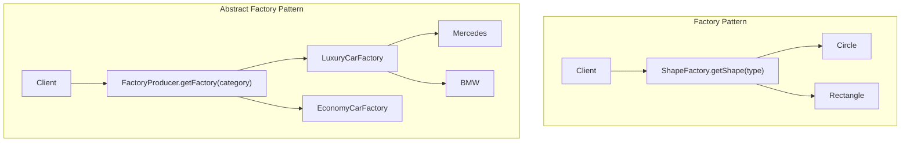

# Factory Pattern vs Abstract Factory Pattern

## Overview
- Creational design patterns — both are about centralizing *object creation*
  logic instead of scattering `new X()` / condition-based instantiation
  across the codebase.
- Factory Pattern: one factory that creates one family of related objects,
  picking the concrete type based on an input parameter.
- Abstract Factory Pattern: a "factory of factories" — used when there is
  more than one factory needed, each one grouping a related set of objects.

## Key Concepts
### The problem — duplicated conditional object creation
- Without a factory: every place that needs an object runs the same
  if/else or switch to decide which concrete class to `new` up, based on
  some condition/type.
- If that decision logic is needed in multiple places, it gets copy-pasted
  — any change to the creation logic now has to be updated everywhere.
- Factory pattern fixes this by pulling that decision logic into one place.



### Factory Pattern
- A `Shape` interface declares the common contract (e.g. `draw()`).
- Concrete classes (`Circle`, `Rectangle`, `Square`) implement `Shape`.
- A single `ShapeFactory` exposes `getShape(type)` — internally
  switches/branches on `type` and returns `new Circle()`, `new Rectangle()`,
  etc.
- Caller only depends on the factory + the interface, never on concrete
  classes directly.



```java
interface Shape {
    void draw();
}
class Circle implements Shape {
    public void draw() { /* draw circle */ }
}
class Rectangle implements Shape {
    public void draw() { /* draw rectangle */ }
}

class ShapeFactory {
    Shape getShape(String type) {
        if (type.equals("CIRCLE")) return new Circle();
        if (type.equals("RECTANGLE")) return new Rectangle();
        return null;
    }
}
```

### Abstract Factory Pattern
- Needed when there's more than one factory, and each factory's outputs
  form their own logical group (e.g. luxury cars vs economy cars) — the
  factories themselves need to be grouped/selected the same way products
  are.
- An `AbstractFactory` interface declares how to get a vehicle; concrete
  factories (`LuxuryCarFactory`, `EconomyCarFactory`) each implement it and
  internally create their own group of products (Mercedes/BMW vs
  budget-car equivalents).
- A top-level factory-of-factories returns the right concrete factory based
  on a condition, and the caller then asks *that* factory for the product —
  two levels of indirection instead of one.



```java
interface Vehicle {}
class Mercedes implements Vehicle {}
class BMW implements Vehicle {}

interface AbstractFactory {
    Vehicle getVehicle(String type);
}
class LuxuryCarFactory implements AbstractFactory {
    public Vehicle getVehicle(String type) {
        if (type.equals("MERCEDES")) return new Mercedes();
        if (type.equals("BMW")) return new BMW();
        return null;
    }
}

class FactoryProducer {
    AbstractFactory getFactory(String category) {
        if (category.equals("LUXURY")) return new LuxuryCarFactory();
        // e.g. return new EconomyCarFactory() for "ECONOMY"
        return null;
    }
}
```

## Trade-offs / Comparisons
| | Factory Pattern | Abstract Factory Pattern |
|---|---|---|
| Creates | One product, one concrete class picked by condition | A family/group of related products |
| Number of factories | One | More than one, grouped under a factory-of-factories |
| Indirection | Caller → Factory → Product | Caller → Factory-of-factories → Factory → Product |
| When to use | Single condition-based object creation, same logic reused | Multiple factories exist, each returning a logically grouped set of objects |

## Example / Walkthrough
- Factory: `ShapeFactory.getShape("CIRCLE")` returns a `Circle` — same
  branching logic that would otherwise be duplicated at every call site.
- Abstract Factory: `FactoryProducer.getFactory("LUXURY")` returns a
  `LuxuryCarFactory`, then `.getVehicle("MERCEDES")` on that factory
  returns a `Mercedes` — the extra level exists because luxury vs economy
  cars are two different logical product groups, each needing its own
  factory.

## Diagram


## Interview Q&A
<details>
<summary>What problem does the Factory pattern solve?</summary>

Duplicated condition-based object creation logic — instead of every caller
running its own if/else to decide which concrete class to instantiate, one
factory centralizes that decision.

</details>

<details>
<summary>When would you reach for Abstract Factory instead of a plain Factory?</summary>

When there's more than one factory needed, and each factory's products form
their own logically grouped family — Abstract Factory adds a layer that
picks the right *factory*, not just the right product.

</details>

<details>
<summary>How many levels of indirection does Abstract Factory add compared to Factory?</summary>

One extra level — Factory is caller → factory → product; Abstract Factory
is caller → factory-of-factories → concrete factory → product.

</details>

<details>
<summary>In the car example, what determines whether a class belongs to LuxuryCarFactory or EconomyCarFactory?</summary>

Which logical product group it belongs to — Mercedes/BMW are grouped as
luxury, so they're created by LuxuryCarFactory; a separate EconomyCarFactory
would group budget-car equivalents the same way.

</details>

<details>
<summary>Does the client ever depend on concrete product classes directly, in either pattern?</summary>

No — in both patterns the client only depends on the factory (or
factory-of-factories) and the product interface; concrete classes like
Circle or Mercedes are never referenced directly by the caller.

</details>

## Related Topics
- [02. Strategy Design Pattern](02-strategy-design-pattern.md) — Strategy also picks a concrete
  implementation via an interface, but for *behavior* selection, not object
  creation.
- [01. SOLID Principles](01-solid-principles.md) — both factory patterns support DIP: callers
  depend on abstractions (interfaces), not concrete classes.
