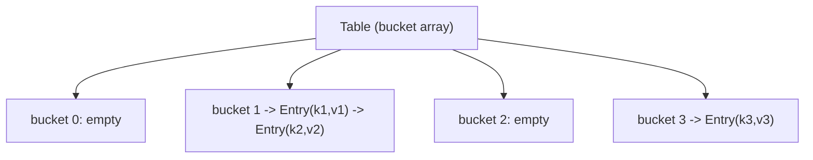
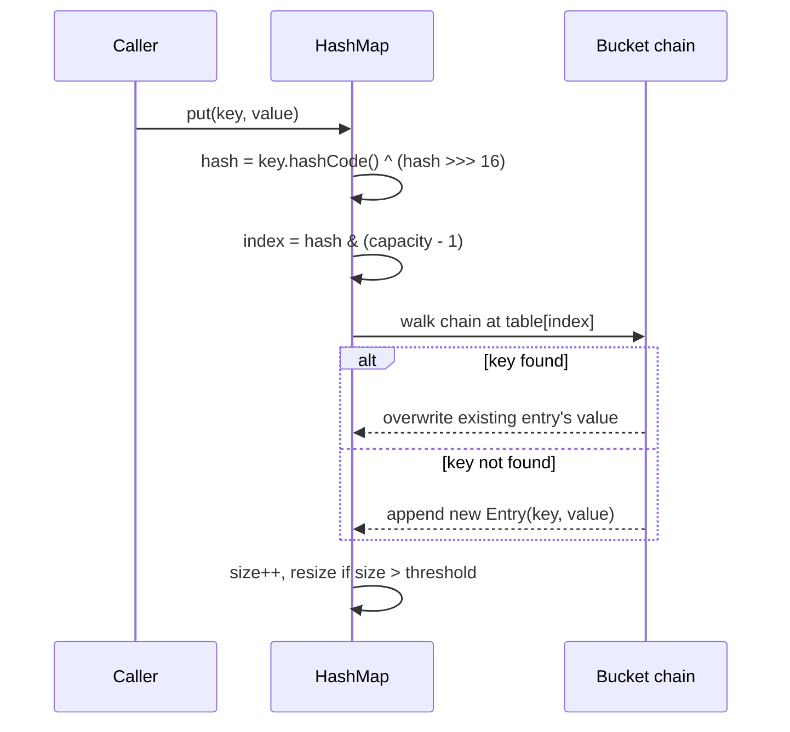
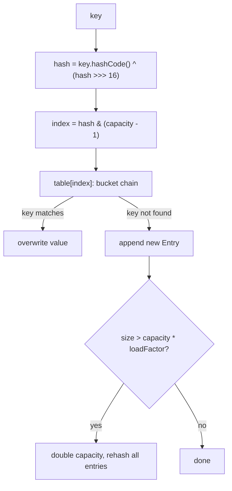

# HashMap Internal Implementation in Java

## Overview
- Walks through implementing a custom `HashMap` from scratch — the classic
  "how does `put`/`get` actually work internally" interview question.
- Covers table sizing, collision handling, the `hashCode`/`equals`
  contract, index computation, and resizing — the pieces interviewers
  probe one at a time.
- Understanding this also explains *why* Java's real `HashMap` behaves the
  way it does (default capacity 16, load factor 0.75, power-of-2 sizing).

## Key Concepts
### Backing storage: bucket array + chaining
- The map is backed by an array (the "table"); each slot is called a
  bucket.
- Each bucket holds a linked list of `Entry` nodes — `Entry { key, value,
  next }` — so multiple keys that land on the same bucket (a collision)
  just chain off each other.
- If a bucket's chain grows long (Java's real `HashMap` treeifies past a
  threshold), it's converted to a balanced tree instead of a linked list,
  turning O(n) worst-case bucket lookup into O(log n).



### Default capacity and why it's always a power of 2
- No-arg constructor sets the initial table size to 16.
- A constructor given a custom capacity doesn't use that number directly —
  it rounds up to the next power of 2 (e.g. given 7 → table size 8; given
  a capacity that's already a power of 2, like 8, stays 8, it does not
  jump to 16).
- The rounding is done with the classic bit trick: subtract 1 first (so an
  exact power of 2 isn't bumped to the next one), then repeatedly OR the
  number with itself right-shifted, which floods every bit below the
  highest set bit to 1, then add 1 back to land exactly on the next power
  of 2.
- Power-of-2 capacity matters because it lets index computation use a fast
  bitwise AND instead of the slower modulo operator (see below).

```java
static int tableSizeFor(int capacity) {
    int n = capacity - 1;      // avoid bumping an exact power of 2
    n |= n >>> 1;
    n |= n >>> 2;
    n |= n >>> 4;
    n |= n >>> 8;
    n |= n >>> 16;
    return n + 1;              // next power of 2
}
```

### hashCode/equals contract
- Calling `hashCode()` on the same object multiple times must return the
  same value.
- If two objects are equal (`equals()` returns true), they must return the
  same `hashCode()`.
- The reverse is not required: two unequal objects are allowed to share a
  `hashCode()` — that's exactly a collision, not a contract violation.

### Spreading the hash before indexing
- A raw `hashCode()` can have most of its entropy in the high bits, which
  a small table (e.g. size 16) would never use if the hash is applied
  directly.
- Java's `HashMap` XORs the hash with itself right-shifted 16 bits
  (`h ^ (h >>> 16)`) before using it, mixing high-bit information into the
  low bits so more of the hash actually affects which bucket is chosen.
- This reduces collisions especially for small table sizes.

### Index computation: AND instead of modulo
- Bucket index = `hash & (capacity - 1)`, not `hash % capacity`.
- The two are equivalent only because capacity is a power of 2 — bitwise
  AND is cheaper than modulo, which is the whole reason capacity is kept a
  power of 2.

### put / get flow
- `put(key, value)`: compute the spread hash, compute bucket index via
  `hash & (n - 1)`, walk that bucket's chain comparing keys with
  `equals()` — if found, overwrite the value; if not found after reaching
  the end, append a new `Entry`. Increment size, then check against the
  resize threshold.
- `get(key)`: compute the same hash and index, walk the bucket's chain
  comparing keys with `equals()`, return the matching value or `null` if
  the chain is exhausted without a match.



```java
class Entry<K, V> {
    K key;
    V value;
    Entry<K, V> next;
    Entry(K key, V value) { this.key = key; this.value = value; }
}

class MyHashMap<K, V> {
    Entry<K, V>[] table;
    int size = 0;
    float loadFactor = 0.75f;

    MyHashMap() { table = new Entry[16]; }
    MyHashMap(int capacity) { table = new Entry[tableSizeFor(capacity)]; }

    private int indexFor(K key) {
        int h = key.hashCode();
        h = h ^ (h >>> 16);
        return h & (table.length - 1);
    }

    void put(K key, V value) {
        int index = indexFor(key);
        Entry<K, V> curr = table[index];
        while (curr != null) {
            if (curr.key.equals(key)) { curr.value = value; return; }
            curr = curr.next;
        }
        Entry<K, V> entry = new Entry<>(key, value);
        entry.next = table[index];
        table[index] = entry;
        size++;
        if (size > table.length * loadFactor) resize();
    }

    V get(K key) {
        int index = indexFor(key);
        Entry<K, V> curr = table[index];
        while (curr != null) {
            if (curr.key.equals(key)) return curr.value;
            curr = curr.next;
        }
        return null;
    }

    void resize() { /* double table.length, rehash every entry into the new table */ }
}
```

### Resizing on load factor
- Default load factor is 0.75 — resize is triggered once `size` exceeds
  `capacity * loadFactor` (e.g. capacity 16 → threshold 12).
- Resizing doubles the capacity (stays a power of 2) and rehashes existing
  entries into the new, larger table.
- Load factor is a size/speed trade-off: too low wastes memory (frequent
  resizes, mostly-empty table); too high causes long chains per bucket
  (slower lookups).

## Trade-offs / Comparisons
| Choice | Why | Cost if skipped |
|---|---|---|
| Power-of-2 capacity | Enables `hash & (n-1)` instead of `hash % n` | Slower modulo-based indexing |
| Hash spreading (`h ^ (h >>> 16)`) | Uses high bits of hashCode too | More collisions on small tables |
| Load factor 0.75 | Balances memory use vs. chain length | Too high = long chains, slow lookups; too low = wasted space, frequent resizes |
| Treeify long chains | O(log n) worst case per bucket | O(n) worst case if a bucket collects many entries |

## Example / Walkthrough
- Default map: no capacity given → table size 16.
- Custom capacity 7 given → rounds up to 8 via `tableSizeFor`.
- Custom capacity 8 given → stays 8 (the `-1` before the OR-shifts prevents
  an exact power of 2 from being bumped to 16).
- Insert enough entries that `size` crosses `16 * 0.75 = 12` → table
  resizes to 32 and every entry gets rehashed into the new table.

## Diagram


## Interview Q&A
<details>
<summary>Why does HashMap's default capacity have to be a power of 2?</summary>

So the bucket index can be computed with `hash & (capacity - 1)` instead
of `hash % capacity` — bitwise AND is cheaper, and it's only mathematically
equivalent to modulo when capacity is a power of 2.

</details>

<details>
<summary>If you pass a custom capacity that isn't a power of 2, what happens?</summary>

It's rounded up to the next power of 2 using the `tableSizeFor` bit trick:
subtract 1, OR-shift the bits down repeatedly to flood all lower bits to 1,
then add 1 back.

</details>

<details>
<summary>Why subtract 1 before doing the OR-shifts in tableSizeFor?</summary>

So that an input that's already an exact power of 2 (e.g. 8) stays 8
instead of being bumped up to the next power of 2 (16).

</details>

<details>
<summary>What's the contract between hashCode() and equals()?</summary>

Equal objects must produce equal hashCodes. The converse isn't required —
two unequal objects can share a hashCode; that's simply a collision, not a
contract violation.

</details>

<details>
<summary>Why does HashMap XOR the hashCode with itself shifted right by 16 bits?</summary>

To mix the high bits of the hashCode into the low bits before indexing,
since a small table only uses the low bits directly — without this, hashes
that only differ in their high bits would collide more often.

</details>

<details>
<summary>What triggers a resize, and what happens during one?</summary>

Once `size` exceeds `capacity * loadFactor` (default load factor 0.75),
the table doubles in size and every existing entry is rehashed into the
new, larger table.

</details>

<details>
<summary>How are collisions handled inside a single bucket?</summary>

Entries chain off each other via a `next` pointer (linked list); `put` and
`get` walk that chain comparing keys with `equals()` until they find a
match or reach the end.

</details>

## Related Topics
- [01. SOLID Principles](01-solid-principles.md)
