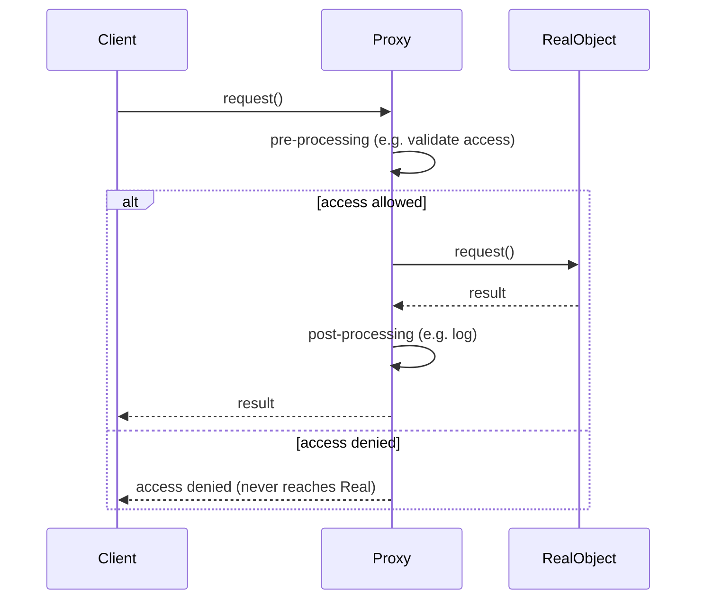
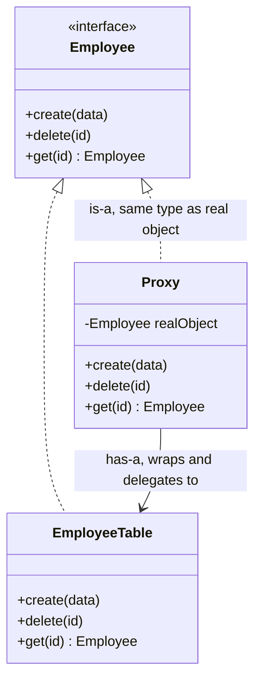
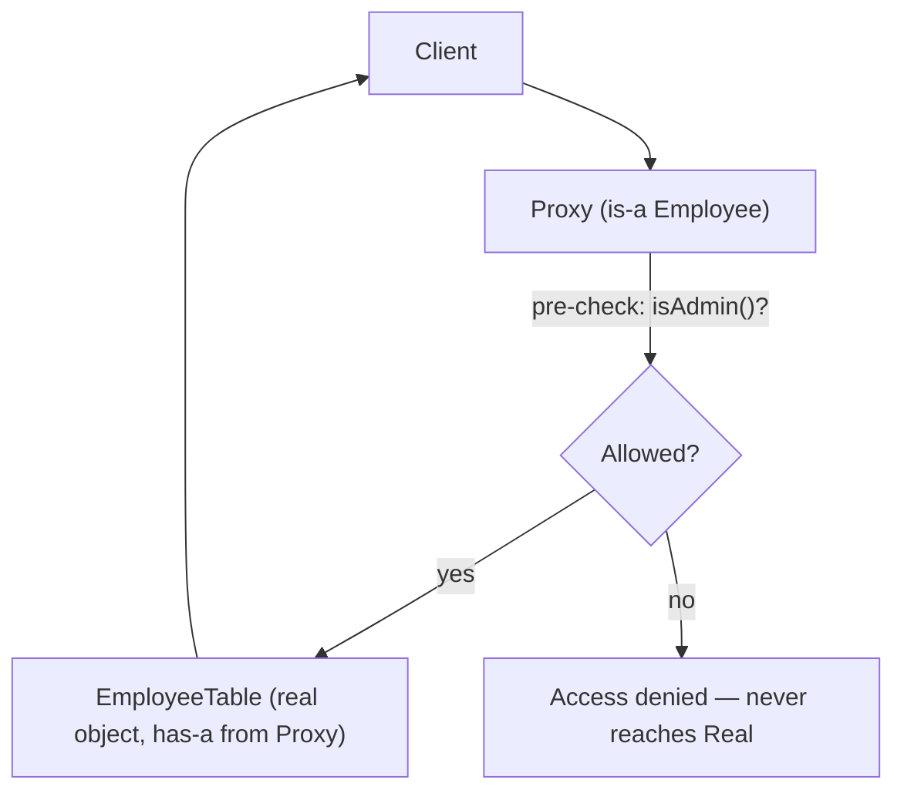

# Proxy Design Pattern

## Overview
- Structural design pattern — introduces an intermediary object (the proxy)
  that sits between the client and the real object; every request goes to
  the proxy first instead of directly to the real object.
- One of the most practically-used design patterns in real-world code —
  e.g. Spring Boot wraps beans in a proxy to add behavior like transactions/
  AOP around them.
- Core idea: centralize cross-cutting logic (access validation, logging,
  monitoring) in one place — the proxy — instead of duplicating it inside
  every method of the real object or at every call site.

## Key Concepts
### What the proxy does
- Pre-processing before forwarding a call to the real object — e.g. access/
  permission validation.
- Post-processing after the real object's call completes — e.g. logging,
  monitoring.
- Can deny a request outright without ever forwarding it to the real
  object, if validation fails.
- Real-world analogy: a proxy server sitting between a user and the
  internet — every request passes through the proxy first.
- Client only ever talks to the proxy — it doesn't need to know (or care)
  that it's a proxy, since it implements the same interface as the real
  object.



### Structure — both is-a and has-a
- `Employee` interface declares the operations: `create`, `delete`, `get`.
- Concrete real class (`EmployeeTable`) implements `Employee` against an
  actual table/DB — `create` inserts a record, `delete` removes a row by
  id, `get` fetches a record by id.
- `Proxy` also implements `Employee` — **is-a** `Employee`, the same type
  as the real object, so it's substitutable anywhere an `Employee` is
  expected.
- `Proxy` also holds a reference to the real `Employee` object internally —
  **has-a** the real object it wraps and delegates to.
- Both relationships matter equally, same shape as [04. Decorator Design Pattern](04-decorator-design-pattern.md):
  is-a lets the proxy stand in for the real object from the client's point
  of view; has-a is what lets it actually forward the call once it decides
  to.



```java
interface Employee {
    void create(EmployeeData data);
    void delete(String id);
    Employee get(String id);
}

class EmployeeTable implements Employee { // the real object
    public void create(EmployeeData data) { /* insert into table */ }
    public void delete(String id) { /* remove row by id */ }
    public Employee get(String id) { /* fetch row by id */ return null; }
}

class Proxy implements Employee { // is-a Employee
    private final Employee realObject; // has-a Employee, the wrapped real object
    private final Client client;

    Proxy(Employee realObject, Client client) {
        this.realObject = realObject;
        this.client = client;
    }

    public void create(EmployeeData data) {
        if (!client.isAdmin()) throw new AccessDeniedException(); // centralized validation
        realObject.create(data);
    }
    public void delete(String id) {
        if (!client.isAdmin()) throw new AccessDeniedException();
        realObject.delete(id);
    }
    public Employee get(String id) {
        return realObject.get(id); // no admin check needed for reads
    }
}
```

### Centralizing validation vs. duplicating it
- Without a proxy, the same `if (!client.isAdmin())` check would need to be
  repeated inside every method of `EmployeeTable`, or at every call site
  that calls `create`/`delete` — duplicated logic scattered across the
  codebase.
- With a proxy, that check lives in exactly one place — the proxy's
  methods — and the real object (`EmployeeTable`) stays focused purely on
  its own job (talking to the table/DB), with no validation logic mixed in.

## Trade-offs / Comparisons
| Approach | Where validation lives | Downside |
|---|---|---|
| No proxy | Duplicated inside every method of the real object, or at every call site | Same check repeated everywhere; easy to miss a spot |
| Proxy | Centralized in the proxy's methods | One place to update; real object stays focused on its own job |

## Example / Walkthrough
- `Employee` interface with `create`, `delete`, `get`.
- `EmployeeTable` is the real/concrete implementation, backed by an actual
  table.
- `Proxy` implements `Employee`, wraps an `EmployeeTable` instance.
- Client calls `proxy.create(data)` → proxy checks if the client is an
  admin → if yes, forwards to `realObject.create(data)`; if no, denies
  access and never reaches the real object.
- Same admin check applies to `delete`.
- `get` is forwarded through the proxy to the real object without an admin
  check in this example.
- Other proxy use cases beyond access validation: logging and monitoring —
  same "intercept, do something extra, then forward" shape.

## Diagram


## Interview Q&A
<details>
<summary>What problem does the Proxy pattern solve?</summary>

It centralizes cross-cutting logic (access validation, logging, monitoring)
in one place — the proxy — instead of duplicating that logic inside every
method of the real object or at every call site.

</details>

<details>
<summary>How does the client interact with a proxied object?</summary>

The client only ever calls methods on the proxy, which implements the same
interface as the real object — the client doesn't need to know or care that
it's talking to a proxy instead of the real object directly.

</details>

<details>
<summary>Does Proxy use inheritance, composition, or both?</summary>

Both — is-a (the proxy implements the same interface as the real object,
so it's substitutable wherever the real object's type is expected) and
has-a (the proxy holds a reference to the actual real object it wraps and
delegates to).

</details>

<details>
<summary>Give a real framework example that uses the Proxy pattern.</summary>

Spring Boot wraps beans in a proxy when it needs to add behavior around
them, like transaction management or AOP — the proxy intercepts calls to
the bean to apply that extra behavior.

</details>

<details>
<summary>What's a strong interview signal that a Proxy pattern fits the design?</summary>

If the question mentions needing something "centralized" — e.g. centralized
access control or permission checks across multiple operations — that's a
strong hint a Proxy sitting in front of the real object is the right fit.

</details>

<details>
<summary>Can a proxy deny a request without the real object ever knowing?</summary>

Yes — if the proxy's pre-processing check fails (e.g. the client isn't an
admin), it can reject the request outright and never forward the call to
the real object at all.

</details>

## Related Topics
- [01.2. is-a vs has-a: How Each Looks in Code](01.2-is-a-vs-has-a.md) — generic code comparison of is-a and has-a,
  including this pattern's both-at-once shape.
- [04. Decorator Design Pattern](04-decorator-design-pattern.md) — same both-is-a-and-has-a shape;
  Decorator adds/layers behavior, Proxy controls/intercepts access.
- [01. SOLID Principles](01-solid-principles.md) — Proxy follows OCP: cross-cutting behavior
  (validation, logging) is added without modifying the real object's class.
