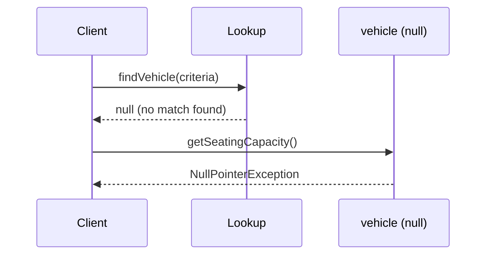
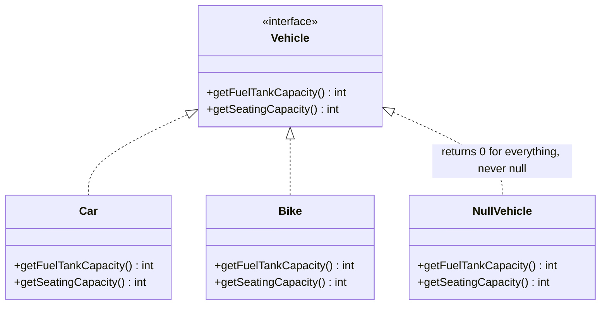
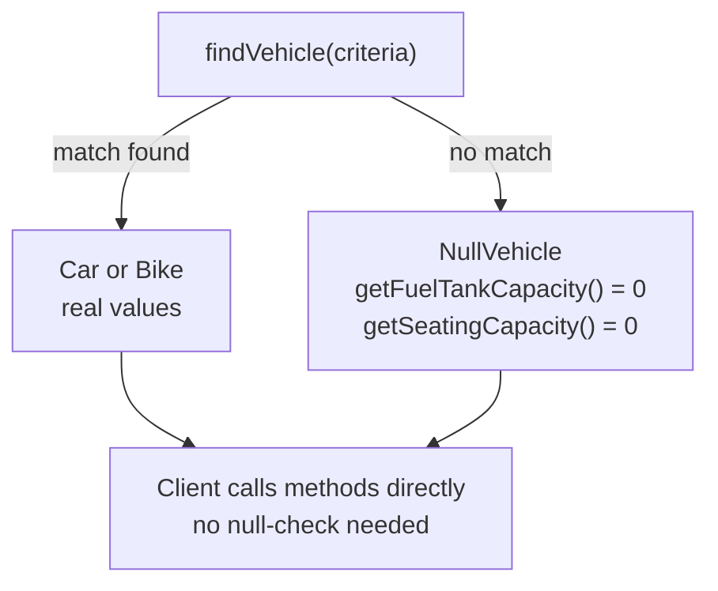

# Null Object Pattern

## Overview
- Behavioral design pattern — replaces `null` with a dedicated object that
  implements the same interface but returns safe defaults, instead of
  scattering null-checks across every call site.
- Small, simple pattern, but a real reported interview question — worth
  knowing cold.
- Core idea: a lookup/factory method should never return `null`; it returns
  a "do-nothing" object of the same type instead.

## Key Concepts
### The problem — scattered null-checks
- A `Vehicle` interface exposes `getFuelTankCapacity()` and
  `getSeatingCapacity()`; a lookup method is meant to return a `Car` or
  `Bike` matching some criteria.
- If the lookup finds nothing and returns `null`, calling
  `vehicle.getSeatingCapacity()` throws a `NullPointerException`.
- Naive fix: add `if (vehicle != null) { ... }` before every call site that
  might touch the object — this duplicates the same guard everywhere the
  object is used, and grows worse as the codebase and call-site count grow.



```java
interface Vehicle {
    int getFuelTankCapacity();
    int getSeatingCapacity();
}
class Car implements Vehicle {
    public int getFuelTankCapacity() { return 45; }
    public int getSeatingCapacity() { return 5; }
}
class Bike implements Vehicle {
    public int getFuelTankCapacity() { return 15; }
    public int getSeatingCapacity() { return 2; }
}

// naive client code — null-check required at every call site
Vehicle vehicle = findVehicle(criteria); // may return null if nothing matched
if (vehicle != null) {
    System.out.println(vehicle.getSeatingCapacity());
} else {
    System.out.println("Could not get seating capacity");
}
```

### The fix — a Null Object instead of null
- Add `NullVehicle implements Vehicle` — implements both methods, but
  returns a safe default (`0`) instead of doing anything meaningful.
- The lookup method now returns a `NullVehicle` instance instead of `null`
  whenever nothing matches — callers always get a real object of type
  `Vehicle`.
- Client code drops the null-check entirely: it just calls
  `vehicle.getSeatingCapacity()` directly — a real match returns the real
  value, no match returns `0` from `NullVehicle`, and nothing ever throws a
  `NullPointerException`.



```java
class NullVehicle implements Vehicle {
    public int getFuelTankCapacity() { return 0; }
    public int getSeatingCapacity() { return 0; }
}

Vehicle findVehicle(String criteria) {
    // ... search logic ...
    if (noMatchFound) {
        return new NullVehicle(); // never return null
    }
    return matchedVehicle;
}

// client code — no null-check needed
Vehicle vehicle = findVehicle(criteria);
System.out.println(vehicle.getSeatingCapacity()); // 5, 2, or 0 — never throws
```

## Trade-offs / Comparisons
| Approach | Call site | Failure mode |
|---|---|---|
| Return `null` on no match | Every call site needs `if (vehicle != null)` | `NullPointerException` if a check is ever missed |
| Return a Null Object on no match | No check needed anywhere | Never throws — returns a safe default (`0`) instead |

## Example / Walkthrough
- `Car` returns real values: fuel tank capacity 45, seating capacity 5.
- `Bike` returns real values: fuel tank capacity 15, seating capacity 2.
- `NullVehicle` returns `0` for both, regardless of which method is called.
- Demonstrated side by side: changing the lookup to return actual `null`
  instead of a `NullVehicle` and calling `getSeatingCapacity()` on the
  result throws a `NullPointerException` — exactly the failure the pattern
  is built to avoid.

## Diagram


## Interview Q&A
<details>
<summary>What problem does the Null Object pattern solve?</summary>

It removes the need for repeated `if (obj != null)` checks scattered across
every call site by ensuring a lookup/factory method never returns `null` —
it returns a default-behavior object of the same type instead.

</details>

<details>
<summary>How does a Null Object avoid a NullPointerException?</summary>

It implements the same interface as the real objects, so any method call on
it is always valid — it just returns a safe default value (e.g. `0`)
instead of doing real work, rather than the reference being `null`.

</details>

<details>
<summary>What would happen if the lookup method returned actual `null` instead of a NullVehicle?</summary>

Calling any method on the result (e.g. `getSeatingCapacity()`) would throw
a `NullPointerException` — this is the exact failure case the pattern is
designed to eliminate.

</details>

<details>
<summary>Does the Null Object pattern remove null-checks from the entire codebase, or just from client call sites?</summary>

From client call sites specifically — the null-vs-no-match decision is made
once, inside the lookup/factory method, which chooses to return either a
real object or the Null Object. Every downstream caller is then freed from
needing to check.

</details>

<details>
<summary>Why is this pattern worth knowing even though it's simple?</summary>

It's a small pattern, but interviewers ask it directly as a real reported
question — knowing the "never return null, return a default-behavior object
implementing the same interface" idea cold is low effort, high payoff.

</details>

## Related Topics
- [01. SOLID Principles](01-solid-principles.md) — Null Object relies on the same interface
  substitutability that Liskov Substitution Principle requires.
- [02. Strategy Design Pattern](02-strategy-design-pattern.md) — both patterns rely on multiple
  classes implementing one shared interface, selected/injected at runtime.
